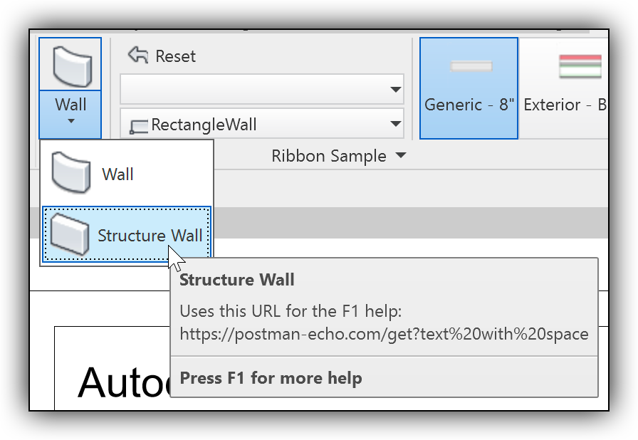
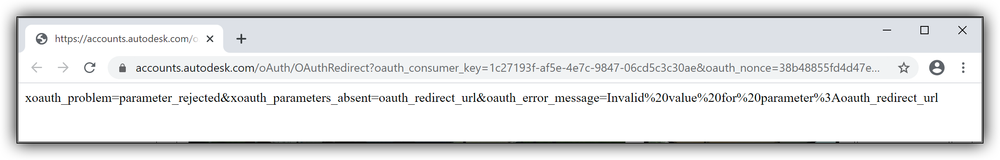

<head>
<meta http-equiv="Content-Type" content="text/html; charset=utf-8">
<link rel="stylesheet" type="text/css" href="bc.css">

</head>

<!---

- rename shared param:
  https://autodesk.slack.com/archives/C0SR6NAP8/p1600103203033700

twitter:

Today, let's highlight a couple of items not discussed the Revit API forum: building a minimal neural network from scratch, ContextualHelp with space and renaming a shared parameter with the #RevitAPI @AutodeskForge @AutodeskRevit #bim #DynamoBim #ForgeDevCon http://bit.ly/helpwithspaces

http://bit.ly/helpwithspaces

I am busy as ever in the Revit API discussion forum.
Today, let's highlight a couple of items that were not discussed there
&ndash; ContextualHelp with space
&ndash; On renaming a shared parameter
&ndash; Build a minimal neural network from scratch...

linkedin:

Today, let's highlight a couple of items not discussed the Revit API forum: building a minimal neural network from scratch, ContextualHelp with space and renaming a shared parameter with the #RevitAPI

http://bit.ly/helpwithspaces

I am busy as ever in the Revit API discussion forum.
Today, let's highlight a couple of items that were not discussed there:

- ContextualHelp with space
- On renaming a shared parameter
- Build a minimal neural network from scratch...

#bim #DynamoBim #ForgeDevCon #Revit #API #IFC #SDK #AI #VisualStudio #Autodesk #AEC #adsk

the [Revit API discussion forum](http://forums.autodesk.com/t5/revit-api-forum/bd-p/160) thread

-->

### On Spaces in Help and Renaming a Parameter

I am busy as ever in
the [Revit API discussion forum](http://forums.autodesk.com/t5/revit-api-forum/bd-p/160).
Today, let's highlight a couple fo items that were not discussed there:

- [ContextualHelp with space](#2)
- [On renaming a shared parameter](#3)
- [Build a minimal neural network from scratch](#4)

#### ContextualHelp With Space

A colleague looked into an issue with `ContextualHelp` and wrote the following based on own tests and the info in the development ticket:

Using `ContextualHelp` you can provide a URL for any button that should be shown when the user clicks `F1` while a ribbon button tooltip is displayed.

If the URL has a space character in the path, you usually encode it either as `%20` or `+`.

That may cause an issue for `ContextualHelp`.

Let’s use this URL as an example:

- `postman-echo.com/get?text%20with%20space`

 <!-- 896 -->

First problem: if you use `https`, then *https://accounts.autodesk.com/oAuth/OAuthRedirect* will be called with a redirect to the actual URL you specified for `F1` using the `ContextualHelp` object.

This will confuse and stall users.

Secondly: if, on top of that, the URL also contains a space (`%20` or `+`), then you’ll get stuck on that webpage:

<pre>https://accounts.autodesk.com/oAuth/OAuthRedirect?oauth_consumer_key=1c27193f-af5e-4e7c-9847-06cd5c3c30ae&oauth_nonce=cd819e65f0ac476099e9c795a22c05a7&oauth_redirect_url=https%3A%2F%2Fpostman-echo.com%2Fget%3Ftext%2520with%2520space&oauth_signature=xl7aBEcj5lI%2FX28ozkvQ%2Ba163qg%3D&oauth_signature_method=HMAC-SHA1&oauth_timestamp=1600289858&oauth_token=bskZ8nJbcvBt%2FTyQvS%2FeImjP6pc%3D&oauth_version=1.0</pre>

It displays the following error message:

<pre>xoauth_problem=parameter_rejected&xoauth_parameters_absent=oauth_redirect_url&oauth_error_message=Invalid%20value%20for%20parameter%3Aoauth_redirect_url</pre>

 <!-- 2424 -->

You can reproduce this issue with any sample using the following code:

<pre class="code">
&nbsp;&nbsp;ContextualHelp&nbsp;contextualHelp&nbsp;=&nbsp;new&nbsp;ContextualHelp(
&nbsp;&nbsp;&nbsp;&nbsp;ContextualHelpType.Url,
&nbsp;&nbsp;&nbsp;&nbsp;&quot;https://postman-echo.com/get?text%20with%20space&quot;&nbsp;);
 
&nbsp;&nbsp;pushButton.SetContextualHelp(contextualHelp);
</pre>

Both of the above-mentioned problems can be avoided by passing the link as `http` instead of `https`.

If the given website redirects from `http` to `https`, that won’t cause a problem:

<pre class="code">
  ContextualHelp&nbsp;contextualHelp&nbsp;=&nbsp;new&nbsp;ContextualHelp(
  &nbsp;&nbsp;ContextualHelpType.Url,
  &nbsp;&nbsp;&quot;http://postman-echo.com/get?text%20with%20space&quot;&nbsp;);
   
  pushButton.SetContextualHelp(contextualHelp);
</pre>

I hope you find this useful as well.

#### On Renaming a Shared Parameter

Jay Merlan very kindly shared some insights on renaming shared parameters in his recent article
on [True or False: Shared Parameters Can Be Renamed](https://opendefinery.com/blog/revit-shared-parameters-can-be-renamed).

As I pointed out in [my comment](https://opendefinery.com/blog/revit-shared-parameters-can-be-renamed/#comment-5072357426) on that post, the Revit development team discussed Jay's suggestions internally and say:

My perception is that we don't support renaming a shared parameter after loading into a project or a family.

We are discussing support for such a feature of 'unified parameters' in a future release of Revit.

Jay's article above explains very well why Revit customers want to rename them, and that is really helpful.

The steps above work well to generate a new family with the new name, and the references, like formulas within the family, are updated to the new name. But, when I try to load it to an existing project with old name parameters, it will be renamed back. That makes sense and that is how this workaround works. So, it only works for the projects and models without using the old parameters.

The fundamental problem with the current Revit implementation of shared params is the fundamental question: what does it mean to 'rename' a parameter?

Once the parameter definition `.txt` file has been consumed by Revit, you can rename a parameter in the `.txt` file all you like, regardless of what Revit considers correct. But, all docs where this file has already been consumed will have no idea of the new name. Which will clearly result in a mess, as the same parameter will appear under different names spread all over various projects and families.

In cases when two incarnations of the same parameter need to be merged (because it is the same parameter, after all), one incarnation will magically change its name &ndash; like in the Load Family case.

As far as we can tell, a problem like this can only be solved via some 'central source of truth', like a cloud-something.

#### Build a Minimal Neural Network from Scratch

I browsed through this tutorial
on [how to build a neural network from scratch with PyTorch](https://www.freecodecamp.org/news/how-to-build-a-neural-network-with-pytorch) and
found it quite illuminating and inspiring.
I wish I had more time to dabble with this kind of stuff!

> Going under the hood of neural networks to learn how to build one from the ground up...
The MNIST data set contains handwritten digits from zero to nine with their corresponding labels...
Simply feed the neural network the images of the digits and their corresponding labels which tell the neural network that this is a three or seven...
We just write the code to index out only the images with a label of three or seven. Thus, we get a data set of threes and sevens...

> - [Code on GitHub](https://github.com/bipinKrishnan/ML_from_scratch/blob/master/neural_network_pytorch.ipynb)
- [Play with it on Colab](https://colab.research.google.com/github/bipinKrishnan/ML_from_scratch/blob/master/neural_network_pytorch.ipynb)

