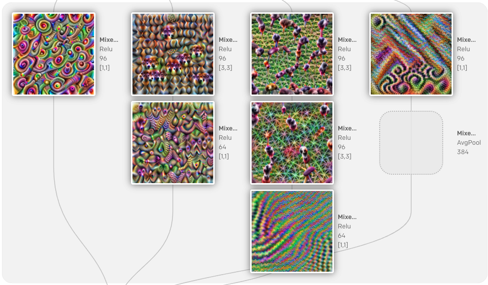

<head>
<meta http-equiv="Content-Type" content="text/html; charset=utf-8">
<link rel="stylesheet" type="text/css" href="bc.css">

</head>

<!---

- da4r getting started
  https://autodesk.slack.com/archives/DQXLFPB3R/p1601206939001000
  Tommy Li 

twitter:

Vonnegut on technology, AI vision model images, Forge Design Automation for Revit and DesignScript with the #RevitAPI @AutodeskForge @AutodeskRevit #bim #DynamoBim #ForgeDevCon http://bit.ly/designscript

Today, I'll mainly pick up some non-desktop issues
&ndash; DesignScript with Dynamo and Revit
&ndash; Forge getting started material
&ndash; Getting started with DA4R
&ndash; DA4R local debug tool
&ndash; AI vision model images
&ndash; Vonnegut on technology...

linkedin:

Vonnegut on technology, AI vision model images, Forge Design Automation for Revit and DesignScript with the #RevitAPI

http://bit.ly/designscript

Today, I'll mainly pick up some non-desktop issues:

- DesignScript with Dynamo and Revit
- Forge getting started material
- Getting started with DA4R
- DA4R local debug tool
- AI vision model images
- Vonnegut on technology...

#bim #DynamoBim #ForgeDevCon #Revit #API #IFC #SDK #AI #VisualStudio #Autodesk #AEC #adsk

the [Revit API discussion forum](http://forums.autodesk.com/t5/revit-api-forum/bd-p/160) thread

-->

### Forge Design Automation and DesignScript

Today, I'll mainly pick up some non-desktop issues:

- [DesignScript with Dynamo and Revit](#2)
- [Forge getting started material](#3)
- [Getting started with DA4R](#4)
- [DA4R local debug tool](#5)
- [AI vision model images](#6)
- [Vonnegut on technology](#7)

#### DesignScript with Dynamo and Revit

A question in 
the [Revit API discussion forum](http://forums.autodesk.com/t5/revit-api-forum/bd-p/160) thread
on [DesignScript](https://forums.autodesk.com/t5/revit-api-forum/design-script/m-p/9741288) led
to an interesting conversation and clarification with the Revit development team:

**Question:** Is it correct to assume that you can access Design Script in the Revit API environment by using Dynamo?
Is it also correct to assume that we have no plans to make Design Script accessible in the Revit API environment without Dynamo?

**Answer:** To clarify some terms, the Dynamo geometry library and DesignScript are distinct things.
DesignScript is specific to Dynamo; there is no DesignScript without Dynamo.
The geometry library, however, is a set of normal C#/C++ wrappers around Autodesk geometry kernels.
It doesn't have to be consumed via DesignScript, and in fact many popular Dynamo packages are written in C# and call the geometry library functions directly from their C# implementations, as users are attempting to do here.

It sounds like what the users in that thread are asking for is to use the Dynamo geometry library from Revit API add-ins.
The obstacle that they are running into is (just guessing) that these libraries depend on ASM DLLs which are shipped only with the host apps, not with Dynamo, and part of the job of the host-Dynamo link is to establish which specific version of ASM should be consumed by Dynamo geometry library.

If all they're doing is referencing the assemblies, this connection is probably not correctly established, since normally the Dynamo-Revit addin is involved in setting everything up.

If we wanted to support and document this use case, we probably could.
There may be business and licensing questions we'd have to explore around expanding the sets of scenarios that users can access ASM from &ndash; Revit would still be required in this scenario, so it's likely fine, but we'd need to make sure there aren't any loopholes.

So far on the technical background.

We currently do not actively support this behaviour; as discussed it’s possible, but only if you spin up Dynamo too.

We get requests for access to Dynamo on the Cloud or access to a Geometry kernel via licensing to be used externally all the time; this is the first real request to use DesignScript inside of an entirely separate add-in inside of Revit.

Licensing might be akin to the way we provide ASM to Dynamo customers today &ndash; via their subscription to other ADSK software, in this case, Revit.

As with everything, if the need is there, and high enough, we can investigate, but it would need to be stacked up against all other development effort (i.e., Cost/Benefit analysis). Our current efforts are focused around Lowering the Barrier to Entry inside of Dynamo and an Ecosystem play where you can get Dynamo in more places and/or access it more easily.
Adding DesignScript support to Revit sans Dynamo is not currently in our sights.

#### Forge Getting Started Material

Here is an updated overview of some important things to read or watch to prepare for one of
the [Forge Accelerators](https://forge.autodesk.com/accelerator-program):

- [Tutorial](https://learnforge.autodesk.io) to get more familiar with the Forge API
- [The Forge Blog](https://forge.autodesk.com/blog)
- [Documentation](https://forge.autodesk.com/developer/documentation)
- [Postman Collection of API calls](https://gist.github.com/petrbroz/5d28d996738bb0da4f7838ca43d53765)
- [Design Automation Postman Tutorial](https://github.com/Autodesk-Forge/forge-tutorial-postman)
- [Sample repositories](https://github.com/Autodesk-Forge?tabs=repositories)
- StackOverflow for existing Q&amp;A &ndash;
  [General](https://stackoverflow.com/questions/tagged/autodesk-forge) /
  [Viewer](https://stackoverflow.com/questions/tagged/autodesk-viewer) /
  [Data Management](https://stackoverflow.com/questions/tagged/autodesk-data-management) /
  [Model Derivative](https://stackoverflow.com/questions/tagged/autodesk-model-derivative) /
  [Design Automation](https://stackoverflow.com/questions/tagged/autodesk-designautomation) /
  [BIM360](https://stackoverflow.com/questions/tagged/autodesk-bim360) /
  [Reality Capture](https://stackoverflow.com/questions/tagged/autodesk-realitycapture) /
  [Webhooks](https://stackoverflow.com/questions/tagged/autodesk-webhooks)

Tools:

- [VS Code Plugin](https://forge.autodesk.com/blog/beginners-guide-design-automation-visual-studio-code)
- [OSS Manager](https://oss-manager.autodesk.io)
- [DA Manager](https://da-manager.autodesk.io)
- [Node-Red](https://forge.autodesk.com/blog/forge-node-red-visual-programming-forge)

#### Getting Started with DA4R

From an internal conversation with a colleague on how to get started with DA4R,
or [Design Automation for Revit](https://forge.autodesk.com/api/design-automation-cover-page/):

**Question:** I am currently developing a pipeline to extract features from Revit models.
I am new to Revit and its API; I have followed the Forge Design Automation for Revit tutorial, successfully created an add-in and run it in the cloud.
What I want to do is to have the features extracted from Revit model and write out to a JSON file upon add-inn completion.
Do you have any sample code to share that serves a similar purpose?
Right now, I am in the process of learning the Revit API by reading
the [developer guide](http://help.autodesk.com/view/RVT/2021/ENU/?guid=Revit_API_Revit_API_Developers_Guide_html).

**Answer:** You might begin by checking out the pointers
to [further advice and Revit API getting started material](https://thebuildingcoder.typepad.com/blog/about-the-author.html#2).

To implement your extraction, I would suggest installing Revit desktop and using that as a basis for research and implementation.

First, implement your functionality as an external command.
Once it does everything you need and completely fulfils all requirements, you
can [easily migrate it to DA4R](https://thebuildingcoder.typepad.com/blog/about-the-author.html#5.55).

**Response:** Thanks for the information.

Can you provide a  quick pointer in DA4R how to write a json output as the OSS output file of the workitem? 

**Answer:** Maybe the discussion
of [DA4R Input and Output Files](https://thebuildingcoder.typepad.com/blog/2020/04/da4r-io-logging-updater-and-custom-properties.html#5) will
help?

#### DA4R Local Debug Tool

Once you have implemented your DA4R application, you can test it before live deployment using
the [Design Automation for Revit local debug tool](https://github.com/Autodesk-Forge/design.automation-csharp-revit.local.debug.tool).

#### AI Vision Model Images

Moving from DA4R and Forge to AI, 
the [OpenAI Microscope](https://microscope.openai.com/models) provides 
an extensive collection of fascinating and beautiful images generated by AI vision models, including 

> visualizations of every significant layer and neuron of important vision models.

 <!-- 991 -->

#### Vonnegut on Technology

In the anecdote on [technology and me](http://www.logicalpoetry.com/tech/vonnegut.html), slightly abbreviated,
[Kurt Vonnegut](https://en.wikipedia.org/wiki/Kurt_Vonnegut) tells his wife he's going out to buy an envelope:

<blockquote>
“Oh, she says, well, you're not a poor man. You know, why don't you go online and buy a hundred envelopes and put them in the closet?"
So, I pretend not to hear her.
And go out to get an envelope because I'm going to have a hell of a good time in the process of buying one envelope.
I meet a lot of people.
And see some great looking babies.
And a fire engine goes by. And I give them the thumbs up.
And I'll ask a woman what kind of dog that is.
And, and I don't know.
The moral of the story is &ndash; we're here on Earth to fart around.
And, of course, the computers will do us out of that.
And what the computer people don't realize, or they don't care, is we're dancing animals.
You know, we love to move around.
And it's like we're not supposed to dance at all anymore."
Let's all get up and move around a bit right now... or at least dance.
</blockquote>

In a similar vein, as [Thoreau](https://en.wikipedia.org/wiki/Henry_David_Thoreau) said: *Men have become the tools of their tools.*

