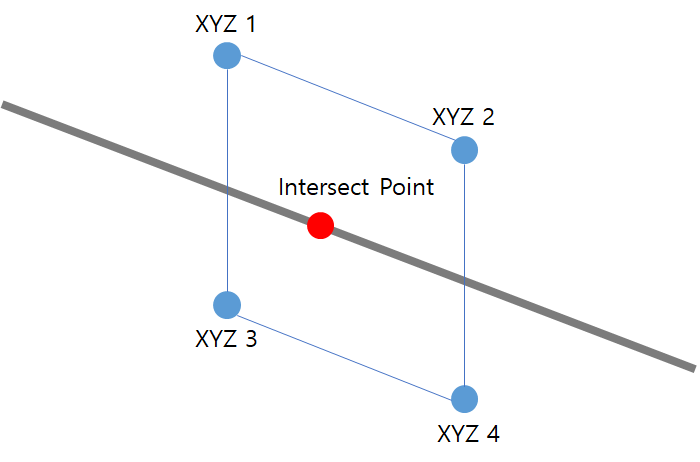
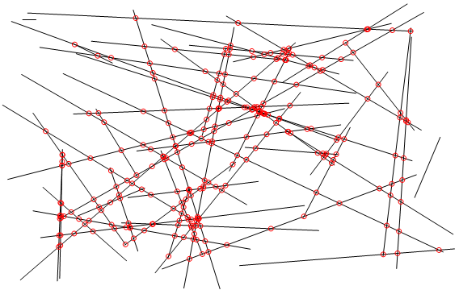

<head>
<meta http-equiv="Content-Type" content="text/html; charset=utf-8">
<link rel="stylesheet" type="text/css" href="bc.css">

</head>

<!---

- high-performance optimisation using Revit API for outline for many elements (>100'000 items)
  e.g., for 54000 walls (after filtering) and 18000 pipes, leading to 972'000'000 operation.
  How can I get bounding box for several elements?
  https://stackoverflow.com/questions/63083938/revit-api-how-can-i-get-bounding-box-for-several-elements
  how to get element nearby specific element using bounding box if it is just outside(some distance apart) bounding box?
  https://forums.autodesk.com/t5/revit-api-forum/how-to-get-element-nearby-specific-element-using-bounding-box-if/m-p/9741883

- set the clipped/unclipped state of the base and survey points in 2021.1
  https://autodesk.slack.com/archives/C0SR6NAP8/p1600379512087800
  Jacob Small:mega-thinking: 17 Sep at 23:51
  Can anyone in Dev confirm this statement is still true?
  The clipped/unclipped state of the base and survey points cannot be set via the API. You can pin them using the Element.Pinned property.
  https://thebuildingcoder.typepad.com/blog/2012/11/survey-and-project-base-point.html
  Jennifer (Xue) Li  5 days ago
  We exposed a new property Clipped for Base Point in R2021.1. So starting from this version, you will have the ability to get/set clipped state for Survey Point. And for Project Base Point, the property is readonly and will always return false because we’ve removed the clipped state fro PBP.
  :celebrate:
  Jacob Small:mega-thinking:  5 days ago
  Yay!!!!! Huge help thanks!

- BIM360 apps from German university startups now live
  [15 New Integrations with Autodesk Construction Cloud ](https://constructionblog.autodesk.com/15-integrations-autodesk-construction)
  two Startups from the Forge developer Universities:
  Gamma AR &ndash; RWTH Aachen 
  4d planner &ndash; TU Berlin 
  https://twitter.com/ADSK_Construct/status/1311699100312666113

- [Inventing Virtual Meetings of Tomorrow with NVIDIA AI Research](https://youtu.be/NqmMnjJ6GEg)
  [Nvidia Maxine Cloud-AI Video-Streaming Platform](https://developer.nvidia.com/maxine)
  New AI breakthroughs in NVIDIA Maxine, cloud-native video streaming AI SDK, slash bandwidth use while make it possible to re-animate faces, correct gaze and animate characters for immersive and engaging meetings. Learn more: https://nvda.ws/3l9foIn
  AI-based face recognition and reconstruction is used, enabling bandwidth reduction by transmitting only animated face keypoint data instead of the entire video keyframe information.

twitter:

AI-based face keypoint streaming hits mainstream, German university BIM360 construction cloud startups, clipped and unclipped base and survey points, line-plane intersection and high-performance outline calculation and optimisation for a huge model with the #RevitAPI @AutodeskForge @AutodeskRevit #bim #DynamoBim #ForgeDevCon http://bit.ly/highperfoutline

Today let's talk mainly about geometric analysis and performance
&ndash; High-performance outline optimisation
&ndash; Simple line-plane intersection
&ndash; Set base and survey clipped and unclipped
&ndash; Two German uni BIM360 construction cloud startups
&ndash; AI-based face streaming hits mainstream...

linkedin:

AI-based face keypoint streaming hits mainstream, German university BIM360 construction cloud startups, clipped and unclipped base and survey points, line-plane intersection and high-performance outline calculation and optimisation for a huge model with the #RevitAPI

http://bit.ly/highperfoutline

Today let's talk mainly about geometric analysis and performance:

- High-performance outline optimisation
- Simple line-plane intersection
- Set base and survey clipped and unclipped
- Two German uni BIM360 construction cloud startups
- AI-based face streaming hits mainstream...

#bim #DynamoBim #ForgeDevCon #Revit #API #IFC #SDK #AI #VisualStudio #Autodesk #AEC #adsk

the [Revit API discussion forum](http://forums.autodesk.com/t5/revit-api-forum/bd-p/160) thread

-->

### High Performance Outline, Line-Plane Intersection

Today let's talk mainly about geometric analysis and performance:

- [High-performance outline optimisation](#2)
    - [Solution](#2.1)
- [Simple line-plane intersection](#3)
- [Set base and survey clipped and unclipped](#4)
- [Two German uni BIM360 construction cloud startups](#5)
- [AI-based face streaming hits mainstream](#6)

#### High-Performance Outline Optimisation

If you are interested in high-performance use of the Revit API, you may be able to learn a trick or two from the StackOverflow discussion
on [how to get the bounding box for several elements](https://stackoverflow.com/questions/63083938/revit-api-how-can-i-get-bounding-box-for-several-elements).

**Question:** I need to find an outline for many elements (>100'000 items).
Target elements come from a `FilteredElementCollector`.
As usual, I'm looking for the fastest possible way. 

For now, I tried to iterate over all elements to get its `BoudingBox.Min` and `BoudingBox.Max` and find out `minX`, `minY`, `minZ`, `maxX`, `maxY`, `maxZ`.
It works pretty accurately but takes too much time.

The problem described above is a part of a bigger one:

I need to find all the intersections of ducts, pipes and other curve-based elements from a linked model with walls, ceilings, columns, etc. in the general model and then place openings in the intersections.

I tried to use a combination of `ElementIntersectElement` filter and ` IntersectSolidAndCurve` method to find a part of curve inside element.

First, with an `ElementIntersectElement`, I tried to reduce a collection for further use of `IntersectSolidAndCurve`.

`IntersectSolidAndCurve` takes two arguments, solid and curve, and has to work in two nested one in the other loops.
So, it takes for 54000 walls (after filtering) and 18000 pipes, in my case, 972'000'000 operations.

With the number of operations 10 ^ 5, the algorithm shows an acceptable time.

I decided to reduce the number of elements by dividing the search areas by levels.
This works well for high-rise buildings, but is still bad for extended low structures.
I decided to divide the building by length, but I did not find a method that finds boundaries for several elements (the whole building).

I seem to be going in a wrong direction.
Is there are right way to achieve this with the Revit API?

**Answer:** In principle, what you describe is the proper approach and the only way to do it.

However, there may be many possibilities to optimise your code.
The Building Coder provides various utility functions that may help.
For instance, to [determine the bounding box of an entire family](https://thebuildingcoder.typepad.com/blog/2017/03/family-bounding-box-and-aec-hackathon-munich.html#3).
Many more in [The Building Coder samples `Util` module](https://github.com/jeremytammik/the_building_coder_samples/blob/master/BuildingCoder/BuildingCoder/Util.cs).
Search there for "bounding box".
I am sure they can be further optimised as well for your case.
For instance, you may be able to extract all the `X` coordinates from all the individual elements' bounding box `Max` values and use a generic `Max` function to determine their maximum in one single call instead of comparing them one by one.
[Benchmark your code](https://thebuildingcoder.typepad.com/blog/2012/01/timer-code-for-benchmarking.html) to discover optimisation possibilities and analyse their effect on the performance. 

**Response:** Thanks to Jeremy for advice and input on this issue.
I published my final result below and did some research on performance and accuracy.
The code in my answer processed in 3-5 seconds / 100'000 elements and works accurate in most cases.
However, there are cases where the `BoundingBoxIntersectsFilter` filters the item when it does not cross the `Outline`.
This happens if there is invisible geometry in the family.
There are other possible reasons that I have not yet found. More tests need to be done anyway.

**Answer:** Thank you very much for your appreciation and sharing your interesting code.
Using the built-in Revit filtering mechanisms will definitely be a lot faster than anything you can achieve in .NET, outside Revit memory.
However, I do not yet understand how you can use this to achieve the goal you describe above.
I thought you needed the collective bounding box of all elements.
You, however, seem to have an input variable of 500 meters and o be checking whether that contains all the elements.
Can you please explain the exact use of this algorithm, and the exact input and output data?

**Response:** Jeremy, you're absolutely right.
The minimum and maximum points in 3d-space are fed to the input to the method, so that all the elements are inside the outline built on that points, then we find the extreme points along `x` `y` `z`.
The output is 2 outline points. 

#### Solution

To find boundaries, we can take advantage of the binary search idea. 

The difference from the classic binary search algorithm is there is not an array, and we should find two numbers instead of one.

Elements in Geometry space could be presented as a 3-dimensional sorted array of `XYZ` points. 

The Revit API provides an excellent `Quick Filter`, the `BoundingBoxIntersectsFilter`, that takes an instance of an `Outline`.

So, let’s define an area that includes all the elements for which we want to find the boundaries.
For my case, for example 500 meters, and create `min` and `max` point for the initial outline:

<pre class="code">
&nbsp;&nbsp;double&nbsp;b&nbsp;=&nbsp;500000&nbsp;/&nbsp;304.8;
&nbsp;&nbsp;XYZ&nbsp;min&nbsp;=&nbsp;new&nbsp;XYZ(&nbsp;-b,&nbsp;-b,&nbsp;-b&nbsp;);
&nbsp;&nbsp;XYZ&nbsp;max&nbsp;=&nbsp;new&nbsp;XYZ(&nbsp;b,&nbsp;b,&nbsp;b&nbsp;);
</pre>

Below is an implementation for one direction; you can easily use it for three directions by calling and feeding the result of the previous iteration to the input:

<pre class="code">
&nbsp;&nbsp;double&nbsp;precision&nbsp;=&nbsp;10e-6&nbsp;/&nbsp;304.8;
&nbsp;&nbsp;var&nbsp;bb&nbsp;=&nbsp;new&nbsp;BinaryUpperLowerBoundsSearch(&nbsp;
&nbsp;&nbsp;&nbsp;&nbsp;doc,&nbsp;precision&nbsp;);
 
&nbsp;&nbsp;XYZ[]&nbsp;rx&nbsp;=&nbsp;bb.GetBoundaries(&nbsp;min,&nbsp;max,&nbsp;elems,&nbsp;
&nbsp;&nbsp;&nbsp;&nbsp;BinaryUpperLowerBoundsSearch.Direction.X&nbsp;);
&nbsp;&nbsp;rx&nbsp;=&nbsp;bb.GetBoundaries(&nbsp;rx[&nbsp;0&nbsp;],&nbsp;rx[&nbsp;1&nbsp;],&nbsp;elems,&nbsp;
&nbsp;&nbsp;&nbsp;&nbsp;BinaryUpperLowerBoundsSearch.Direction.Y&nbsp;);
&nbsp;&nbsp;rx&nbsp;=&nbsp;bb.GetBoundaries(&nbsp;rx[&nbsp;0&nbsp;],&nbsp;rx[&nbsp;1&nbsp;],&nbsp;elems,&nbsp;
&nbsp;&nbsp;&nbsp;&nbsp;BinaryUpperLowerBoundsSearch.Direction.Z&nbsp;);
</pre>

The `GetBoundaries` method returns two `XYZ` points: lower and upper, which change only in the target direction; the other two dimensions remain unchanged:

<pre class="code">
public&nbsp;class&nbsp;BinaryUpperLowerBoundsSearch
{
&nbsp;&nbsp;private&nbsp;Document&nbsp;doc;
 
&nbsp;&nbsp;private&nbsp;double&nbsp;tolerance;
&nbsp;&nbsp;private&nbsp;XYZ&nbsp;min;
&nbsp;&nbsp;private&nbsp;XYZ&nbsp;max;
&nbsp;&nbsp;private&nbsp;XYZ&nbsp;direction;
 
&nbsp;&nbsp;public&nbsp;BinaryUpperLowerBoundsSearch(&nbsp;
&nbsp;&nbsp;&nbsp;&nbsp;Document&nbsp;document,&nbsp;double&nbsp;precision&nbsp;)
&nbsp;&nbsp;{
&nbsp;&nbsp;&nbsp;&nbsp;doc&nbsp;=&nbsp;document;
&nbsp;&nbsp;&nbsp;&nbsp;this.tolerance&nbsp;=&nbsp;precision;
&nbsp;&nbsp;}
 
&nbsp;&nbsp;public&nbsp;enum&nbsp;Direction
&nbsp;&nbsp;{
&nbsp;&nbsp;&nbsp;&nbsp;X,
&nbsp;&nbsp;&nbsp;&nbsp;Y,
&nbsp;&nbsp;&nbsp;&nbsp;Z
&nbsp;&nbsp;}
 
&nbsp;&nbsp;///&nbsp;&lt;summary&gt;
&nbsp;&nbsp;///&nbsp;Searches&nbsp;for&nbsp;an&nbsp;area&nbsp;that&nbsp;completely&nbsp;includes&nbsp;
&nbsp;&nbsp;///&nbsp;all&nbsp;elements&nbsp;within&nbsp;a&nbsp;given&nbsp;precision.
&nbsp;&nbsp;///&nbsp;The&nbsp;minimum&nbsp;and&nbsp;maximum&nbsp;points&nbsp;are&nbsp;used&nbsp;for&nbsp;the&nbsp;
&nbsp;&nbsp;///&nbsp;initial&nbsp;assessment.&nbsp;
&nbsp;&nbsp;///&nbsp;The&nbsp;outline&nbsp;must&nbsp;contain&nbsp;all&nbsp;elements.
&nbsp;&nbsp;///&nbsp;&lt;/summary&gt;
&nbsp;&nbsp;///&nbsp;&lt;param&nbsp;name=&quot;minPoint&quot;&gt;The&nbsp;minimum&nbsp;point&nbsp;of&nbsp;the&nbsp;
&nbsp;&nbsp;///&nbsp;BoundBox&nbsp;used&nbsp;for&nbsp;the&nbsp;first&nbsp;approximation.&lt;/param&gt;
&nbsp;&nbsp;///&nbsp;&lt;param&nbsp;name=&quot;maxPoint&quot;&gt;The&nbsp;maximum&nbsp;point&nbsp;of&nbsp;the
&nbsp;&nbsp;///&nbsp;BoundBox&nbsp;used&nbsp;for&nbsp;the&nbsp;first&nbsp;approximation.&lt;/param&gt;
&nbsp;&nbsp;///&nbsp;&lt;param&nbsp;name=&quot;elements&quot;&gt;Set&nbsp;of&nbsp;elements&lt;/param&gt;
&nbsp;&nbsp;///&nbsp;&lt;param&nbsp;name=&quot;axe&quot;&gt;The&nbsp;direction&nbsp;along&nbsp;which&nbsp;the&nbsp;
&nbsp;&nbsp;///&nbsp;boundaries&nbsp;will&nbsp;be&nbsp;searched&lt;/param&gt;
&nbsp;&nbsp;///&nbsp;&lt;returns&gt;Returns&nbsp;two&nbsp;points:&nbsp;first&nbsp;is&nbsp;the&nbsp;lower&nbsp;bound,&nbsp;
&nbsp;&nbsp;///&nbsp;second&nbsp;is&nbsp;the&nbsp;upper&nbsp;bound&lt;/returns&gt;
&nbsp;&nbsp;public&nbsp;XYZ[]&nbsp;GetBoundaries(&nbsp;XYZ&nbsp;minPoint,&nbsp;XYZ&nbsp;maxPoint,
&nbsp;&nbsp;&nbsp;&nbsp;ICollection&lt;ElementId&gt;&nbsp;elements,&nbsp;Direction&nbsp;axe&nbsp;)
&nbsp;&nbsp;{
&nbsp;&nbsp;&nbsp;&nbsp;//&nbsp;Since&nbsp;Outline&nbsp;is&nbsp;not&nbsp;derived&nbsp;from&nbsp;an&nbsp;Element&nbsp;class&nbsp;there&nbsp;
&nbsp;&nbsp;&nbsp;&nbsp;//&nbsp;is&nbsp;no&nbsp;possibility&nbsp;to&nbsp;apply&nbsp;transformation,&nbsp;so
&nbsp;&nbsp;&nbsp;&nbsp;//&nbsp;we&nbsp;have&nbsp;use&nbsp;as&nbsp;a&nbsp;possible&nbsp;directions&nbsp;only&nbsp;three&nbsp;vectors&nbsp;of&nbsp;basis
 
&nbsp;&nbsp;&nbsp;&nbsp;switch(&nbsp;axe&nbsp;)
&nbsp;&nbsp;&nbsp;&nbsp;{
&nbsp;&nbsp;&nbsp;&nbsp;&nbsp;&nbsp;case&nbsp;Direction.X:
&nbsp;&nbsp;&nbsp;&nbsp;&nbsp;&nbsp;&nbsp;&nbsp;direction&nbsp;=&nbsp;XYZ.BasisX;
&nbsp;&nbsp;&nbsp;&nbsp;&nbsp;&nbsp;&nbsp;&nbsp;break;
&nbsp;&nbsp;&nbsp;&nbsp;&nbsp;&nbsp;case&nbsp;Direction.Y:
&nbsp;&nbsp;&nbsp;&nbsp;&nbsp;&nbsp;&nbsp;&nbsp;direction&nbsp;=&nbsp;XYZ.BasisY;
&nbsp;&nbsp;&nbsp;&nbsp;&nbsp;&nbsp;&nbsp;&nbsp;break;
&nbsp;&nbsp;&nbsp;&nbsp;&nbsp;&nbsp;case&nbsp;Direction.Z:
&nbsp;&nbsp;&nbsp;&nbsp;&nbsp;&nbsp;&nbsp;&nbsp;direction&nbsp;=&nbsp;XYZ.BasisZ;
&nbsp;&nbsp;&nbsp;&nbsp;&nbsp;&nbsp;&nbsp;&nbsp;break;
&nbsp;&nbsp;&nbsp;&nbsp;&nbsp;&nbsp;default:
&nbsp;&nbsp;&nbsp;&nbsp;&nbsp;&nbsp;&nbsp;&nbsp;break;
&nbsp;&nbsp;&nbsp;&nbsp;}
 
&nbsp;&nbsp;&nbsp;&nbsp;//&nbsp;Get&nbsp;the&nbsp;lower&nbsp;and&nbsp;upper&nbsp;bounds&nbsp;as&nbsp;a&nbsp;projection&nbsp;
&nbsp;&nbsp;&nbsp;&nbsp;//&nbsp;on&nbsp;a&nbsp;direction&nbsp;vector
&nbsp;&nbsp;&nbsp;&nbsp;//&nbsp;Projection&nbsp;is&nbsp;an&nbsp;extention&nbsp;method
 
&nbsp;&nbsp;&nbsp;&nbsp;double&nbsp;lowerBound&nbsp;=&nbsp;minPoint.Projection(&nbsp;direction&nbsp;);
&nbsp;&nbsp;&nbsp;&nbsp;double&nbsp;upperBound&nbsp;=&nbsp;maxPoint.Projection(&nbsp;direction&nbsp;);
 
&nbsp;&nbsp;&nbsp;&nbsp;//&nbsp;Set&nbsp;the&nbsp;boundary&nbsp;points&nbsp;in&nbsp;the&nbsp;plane&nbsp;perpendicular&nbsp;
&nbsp;&nbsp;&nbsp;&nbsp;//&nbsp;to&nbsp;the&nbsp;direction&nbsp;vector.&nbsp;
&nbsp;&nbsp;&nbsp;&nbsp;//&nbsp;These&nbsp;points&nbsp;are&nbsp;needed&nbsp;to&nbsp;create&nbsp;BoundingBoxIntersectsFilter&nbsp;
&nbsp;&nbsp;&nbsp;&nbsp;//&nbsp;when&nbsp;IsContainsElements&nbsp;calls.
 
&nbsp;&nbsp;&nbsp;&nbsp;min&nbsp;=&nbsp;minPoint&nbsp;-&nbsp;lowerBound&nbsp;*&nbsp;direction;
&nbsp;&nbsp;&nbsp;&nbsp;max&nbsp;=&nbsp;maxPoint&nbsp;-&nbsp;upperBound&nbsp;*&nbsp;direction;
 
&nbsp;&nbsp;&nbsp;&nbsp;double[]&nbsp;res&nbsp;=&nbsp;UpperLower(&nbsp;lowerBound,&nbsp;upperBound,&nbsp;elements&nbsp;);
&nbsp;&nbsp;&nbsp;&nbsp;return&nbsp;new&nbsp;XYZ[&nbsp;2&nbsp;]
&nbsp;&nbsp;&nbsp;&nbsp;{
&nbsp;&nbsp;&nbsp;&nbsp;res[0]&nbsp;*&nbsp;direction&nbsp;+&nbsp;min,
&nbsp;&nbsp;&nbsp;&nbsp;res[1]&nbsp;*&nbsp;direction&nbsp;+&nbsp;max,
&nbsp;&nbsp;&nbsp;&nbsp;};
&nbsp;&nbsp;}
 
&nbsp;&nbsp;///&nbsp;&lt;summary&gt;
&nbsp;&nbsp;///&nbsp;Check&nbsp;if&nbsp;there&nbsp;are&nbsp;any&nbsp;elements&nbsp;contains&nbsp;in&nbsp;
&nbsp;&nbsp;///&nbsp;the&nbsp;segment&nbsp;[lower,&nbsp;upper]
&nbsp;&nbsp;///&nbsp;&lt;/summary&gt;
&nbsp;&nbsp;///&nbsp;&lt;returns&gt;True&nbsp;if&nbsp;any&nbsp;elements&nbsp;are&nbsp;in&nbsp;the&nbsp;segment&lt;/returns&gt;
&nbsp;&nbsp;private&nbsp;ICollection&lt;ElementId&gt;&nbsp;IsContainsElements(&nbsp;double&nbsp;lower,
&nbsp;&nbsp;&nbsp;&nbsp;double&nbsp;upper,&nbsp;ICollection&lt;ElementId&gt;&nbsp;ids&nbsp;)
&nbsp;&nbsp;{
&nbsp;&nbsp;&nbsp;&nbsp;var&nbsp;outline&nbsp;=&nbsp;new&nbsp;Outline(&nbsp;min&nbsp;+&nbsp;direction&nbsp;*&nbsp;lower,&nbsp;
&nbsp;&nbsp;&nbsp;&nbsp;&nbsp;&nbsp;max&nbsp;+&nbsp;direction&nbsp;*&nbsp;upper&nbsp;);
&nbsp;&nbsp;&nbsp;&nbsp;return&nbsp;new&nbsp;FilteredElementCollector(&nbsp;doc,&nbsp;ids&nbsp;)
&nbsp;&nbsp;&nbsp;&nbsp;&nbsp;&nbsp;.WhereElementIsNotElementType()
&nbsp;&nbsp;&nbsp;&nbsp;&nbsp;&nbsp;.WherePasses(&nbsp;new&nbsp;BoundingBoxIntersectsFilter(&nbsp;outline&nbsp;)&nbsp;)
&nbsp;&nbsp;&nbsp;&nbsp;&nbsp;&nbsp;.ToElementIds();
&nbsp;&nbsp;}
 
&nbsp;&nbsp;private&nbsp;double[]&nbsp;UpperLower(&nbsp;double&nbsp;lower,
&nbsp;&nbsp;&nbsp;&nbsp;double&nbsp;upper,&nbsp;ICollection&lt;ElementId&gt;&nbsp;ids&nbsp;)
&nbsp;&nbsp;{
&nbsp;&nbsp;&nbsp;&nbsp;//&nbsp;Get&nbsp;the&nbsp;Midpoint&nbsp;for&nbsp;segment&nbsp;mid&nbsp;=&nbsp;lower&nbsp;+&nbsp;0.5&nbsp;*&nbsp;(upper&nbsp;-&nbsp;lower)
 
&nbsp;&nbsp;&nbsp;&nbsp;var&nbsp;mid&nbsp;=&nbsp;Midpoint(&nbsp;lower,&nbsp;upper&nbsp;);
 
&nbsp;&nbsp;&nbsp;&nbsp;//&nbsp;Сheck&nbsp;if&nbsp;the&nbsp;first&nbsp;segment&nbsp;contains&nbsp;elements
 
&nbsp;&nbsp;&nbsp;&nbsp;ICollection&lt;ElementId&gt;&nbsp;idsFirst&nbsp;=&nbsp;IsContainsElements(&nbsp;
&nbsp;&nbsp;&nbsp;&nbsp;&nbsp;&nbsp;lower,&nbsp;mid,&nbsp;ids&nbsp;);
&nbsp;&nbsp;&nbsp;&nbsp;bool&nbsp;first&nbsp;=&nbsp;idsFirst.Any();
 
&nbsp;&nbsp;&nbsp;&nbsp;//&nbsp;Сheck&nbsp;if&nbsp;the&nbsp;second&nbsp;segment&nbsp;contains&nbsp;elements
 
&nbsp;&nbsp;&nbsp;&nbsp;ICollection&lt;ElementId&gt;&nbsp;idsSecond&nbsp;=&nbsp;IsContainsElements(
&nbsp;&nbsp;&nbsp;&nbsp;&nbsp;&nbsp;mid,&nbsp;upper,&nbsp;ids&nbsp;);
&nbsp;&nbsp;&nbsp;&nbsp;bool&nbsp;second&nbsp;=&nbsp;idsSecond.Any();
 
&nbsp;&nbsp;&nbsp;&nbsp;//&nbsp;If&nbsp;elements&nbsp;are&nbsp;in&nbsp;both&nbsp;segments&nbsp;
&nbsp;&nbsp;&nbsp;&nbsp;//&nbsp;then&nbsp;the&nbsp;first&nbsp;segment&nbsp;contains&nbsp;the&nbsp;lower&nbsp;border&nbsp;
&nbsp;&nbsp;&nbsp;&nbsp;//&nbsp;and&nbsp;the&nbsp;second&nbsp;contains&nbsp;the&nbsp;upper
&nbsp;&nbsp;&nbsp;&nbsp;//&nbsp;---------**|***--------
 
&nbsp;&nbsp;&nbsp;&nbsp;if(&nbsp;first&nbsp;&amp;&amp;&nbsp;second&nbsp;)
&nbsp;&nbsp;&nbsp;&nbsp;{
&nbsp;&nbsp;&nbsp;&nbsp;&nbsp;&nbsp;return&nbsp;new&nbsp;double[&nbsp;2&nbsp;]
&nbsp;&nbsp;&nbsp;&nbsp;&nbsp;&nbsp;{
&nbsp;&nbsp;&nbsp;&nbsp;&nbsp;&nbsp;Lower(lower,&nbsp;mid,&nbsp;idsFirst),
&nbsp;&nbsp;&nbsp;&nbsp;&nbsp;&nbsp;Upper(mid,&nbsp;upper,&nbsp;idsSecond),
&nbsp;&nbsp;&nbsp;&nbsp;&nbsp;&nbsp;};
&nbsp;&nbsp;&nbsp;&nbsp;}
 
&nbsp;&nbsp;&nbsp;&nbsp;//&nbsp;If&nbsp;elements&nbsp;are&nbsp;only&nbsp;in&nbsp;the&nbsp;first&nbsp;segment&nbsp;it&nbsp;contains&nbsp;both&nbsp;borders.&nbsp;
&nbsp;&nbsp;&nbsp;&nbsp;//&nbsp;We&nbsp;recursively&nbsp;call&nbsp;the&nbsp;method&nbsp;UpperLower&nbsp;until&nbsp;
&nbsp;&nbsp;&nbsp;&nbsp;//&nbsp;the&nbsp;lower&nbsp;border&nbsp;turn&nbsp;out&nbsp;in&nbsp;the&nbsp;first&nbsp;segment&nbsp;and&nbsp;
&nbsp;&nbsp;&nbsp;&nbsp;//&nbsp;the&nbsp;upper&nbsp;border&nbsp;is&nbsp;in&nbsp;the&nbsp;second
&nbsp;&nbsp;&nbsp;&nbsp;//&nbsp;---*****---|-----------
 
&nbsp;&nbsp;&nbsp;&nbsp;else&nbsp;if(&nbsp;first&nbsp;&amp;&amp;&nbsp;!second&nbsp;)
&nbsp;&nbsp;&nbsp;&nbsp;&nbsp;&nbsp;return&nbsp;UpperLower(&nbsp;lower,&nbsp;mid,&nbsp;idsFirst&nbsp;);
 
&nbsp;&nbsp;&nbsp;&nbsp;//&nbsp;Do&nbsp;the&nbsp;same&nbsp;with&nbsp;the&nbsp;second&nbsp;segment
&nbsp;&nbsp;&nbsp;&nbsp;//&nbsp;-----------|---*****---
 
&nbsp;&nbsp;&nbsp;&nbsp;else&nbsp;if(&nbsp;!first&nbsp;&amp;&amp;&nbsp;second&nbsp;)
&nbsp;&nbsp;&nbsp;&nbsp;&nbsp;&nbsp;return&nbsp;UpperLower(&nbsp;mid,&nbsp;upper,&nbsp;idsSecond&nbsp;);
 
&nbsp;&nbsp;&nbsp;&nbsp;//&nbsp;Elements&nbsp;are&nbsp;out&nbsp;of&nbsp;the&nbsp;segment
&nbsp;&nbsp;&nbsp;&nbsp;//&nbsp;**&nbsp;-----------|-----------&nbsp;**
 
&nbsp;&nbsp;&nbsp;&nbsp;else
&nbsp;&nbsp;&nbsp;&nbsp;&nbsp;&nbsp;throw&nbsp;new&nbsp;ArgumentException(
&nbsp;&nbsp;&nbsp;&nbsp;&nbsp;&nbsp;&nbsp;&nbsp;&quot;Segment&nbsp;does&nbsp;not&nbsp;contains&nbsp;elements.&nbsp;Try&nbsp;to&nbsp;make&nbsp;initial&nbsp;boundaries&nbsp;wider&quot;,
&nbsp;&nbsp;&nbsp;&nbsp;&nbsp;&nbsp;&nbsp;&nbsp;&quot;lower,&nbsp;upper&quot;&nbsp;);
&nbsp;&nbsp;}
 
&nbsp;&nbsp;///&nbsp;&lt;summary&gt;
&nbsp;&nbsp;///&nbsp;Search&nbsp;the&nbsp;lower&nbsp;boundary&nbsp;of&nbsp;a&nbsp;segment&nbsp;containing&nbsp;elements
&nbsp;&nbsp;///&nbsp;&lt;/summary&gt;
&nbsp;&nbsp;///&nbsp;&lt;returns&gt;Lower&nbsp;boundary&lt;/returns&gt;
&nbsp;&nbsp;private&nbsp;double&nbsp;Lower(&nbsp;double&nbsp;lower,&nbsp;double&nbsp;upper,
&nbsp;&nbsp;&nbsp;&nbsp;ICollection&lt;ElementId&gt;&nbsp;ids&nbsp;)
&nbsp;&nbsp;{
&nbsp;&nbsp;&nbsp;&nbsp;//&nbsp;If&nbsp;the&nbsp;boundaries&nbsp;are&nbsp;within&nbsp;tolerance&nbsp;return&nbsp;lower&nbsp;bound
 
&nbsp;&nbsp;&nbsp;&nbsp;if(&nbsp;IsInTolerance(&nbsp;lower,&nbsp;upper&nbsp;)&nbsp;)
&nbsp;&nbsp;&nbsp;&nbsp;&nbsp;&nbsp;return&nbsp;lower;
 
&nbsp;&nbsp;&nbsp;&nbsp;//&nbsp;Get&nbsp;the&nbsp;Midpoint&nbsp;for&nbsp;segment&nbsp;mid&nbsp;=&nbsp;lower&nbsp;+&nbsp;0.5&nbsp;*&nbsp;(upper&nbsp;-&nbsp;lower)
 
&nbsp;&nbsp;&nbsp;&nbsp;var&nbsp;mid&nbsp;=&nbsp;Midpoint(&nbsp;lower,&nbsp;upper&nbsp;);
 
&nbsp;&nbsp;&nbsp;&nbsp;//&nbsp;Сheck&nbsp;if&nbsp;the&nbsp;segment&nbsp;contains&nbsp;elements
 
&nbsp;&nbsp;&nbsp;&nbsp;ICollection&lt;ElementId&gt;&nbsp;idsFirst&nbsp;=&nbsp;IsContainsElements(&nbsp;
&nbsp;&nbsp;&nbsp;&nbsp;&nbsp;&nbsp;lower,&nbsp;mid,&nbsp;ids&nbsp;);
&nbsp;&nbsp;&nbsp;&nbsp;bool&nbsp;first&nbsp;=&nbsp;idsFirst.Any();
 
&nbsp;&nbsp;&nbsp;&nbsp;//&nbsp;---*****---|-----------
 
&nbsp;&nbsp;&nbsp;&nbsp;if(&nbsp;first&nbsp;)
&nbsp;&nbsp;&nbsp;&nbsp;&nbsp;&nbsp;return&nbsp;Lower(&nbsp;lower,&nbsp;mid,&nbsp;idsFirst&nbsp;);
 
&nbsp;&nbsp;&nbsp;&nbsp;//&nbsp;-----------|-----***---
 
&nbsp;&nbsp;&nbsp;&nbsp;else
&nbsp;&nbsp;&nbsp;&nbsp;&nbsp;&nbsp;return&nbsp;Lower(&nbsp;mid,&nbsp;upper,&nbsp;ids&nbsp;);
&nbsp;&nbsp;}
 
&nbsp;&nbsp;///&nbsp;&lt;summary&gt;
&nbsp;&nbsp;///&nbsp;Search&nbsp;the&nbsp;upper&nbsp;boundary&nbsp;of&nbsp;a&nbsp;segment&nbsp;containing&nbsp;elements
&nbsp;&nbsp;///&nbsp;&lt;/summary&gt;
&nbsp;&nbsp;///&nbsp;&lt;returns&gt;Upper&nbsp;boundary&lt;/returns&gt;
&nbsp;&nbsp;private&nbsp;double&nbsp;Upper(&nbsp;double&nbsp;lower,&nbsp;double&nbsp;upper,
&nbsp;&nbsp;&nbsp;&nbsp;ICollection&lt;ElementId&gt;&nbsp;ids&nbsp;)
&nbsp;&nbsp;{
&nbsp;&nbsp;&nbsp;&nbsp;//&nbsp;If&nbsp;the&nbsp;boundaries&nbsp;are&nbsp;within&nbsp;tolerance&nbsp;return&nbsp;upper&nbsp;bound
 
&nbsp;&nbsp;&nbsp;&nbsp;if(&nbsp;IsInTolerance(&nbsp;lower,&nbsp;upper&nbsp;)&nbsp;)
&nbsp;&nbsp;&nbsp;&nbsp;&nbsp;&nbsp;return&nbsp;upper;
 
&nbsp;&nbsp;&nbsp;&nbsp;//&nbsp;Get&nbsp;the&nbsp;Midpoint&nbsp;for&nbsp;segment&nbsp;mid&nbsp;=&nbsp;lower&nbsp;+&nbsp;0.5&nbsp;*&nbsp;(upper&nbsp;-&nbsp;lower)
 
&nbsp;&nbsp;&nbsp;&nbsp;var&nbsp;mid&nbsp;=&nbsp;Midpoint(&nbsp;lower,&nbsp;upper&nbsp;);
 
&nbsp;&nbsp;&nbsp;&nbsp;//&nbsp;Сheck&nbsp;if&nbsp;the&nbsp;segment&nbsp;contains&nbsp;elements
 
&nbsp;&nbsp;&nbsp;&nbsp;ICollection&lt;ElementId&gt;&nbsp;idsSecond&nbsp;=&nbsp;IsContainsElements(&nbsp;
&nbsp;&nbsp;&nbsp;&nbsp;&nbsp;&nbsp;mid,&nbsp;upper,&nbsp;ids&nbsp;);
&nbsp;&nbsp;&nbsp;&nbsp;bool&nbsp;second&nbsp;=&nbsp;idsSecond.Any();
 
&nbsp;&nbsp;&nbsp;&nbsp;//&nbsp;-----------|----*****--
 
&nbsp;&nbsp;&nbsp;&nbsp;if(&nbsp;second&nbsp;)
&nbsp;&nbsp;&nbsp;&nbsp;&nbsp;&nbsp;return&nbsp;Upper(&nbsp;mid,&nbsp;upper,&nbsp;idsSecond&nbsp;);
 
&nbsp;&nbsp;&nbsp;&nbsp;//&nbsp;---*****---|-----------
 
&nbsp;&nbsp;&nbsp;&nbsp;else
&nbsp;&nbsp;&nbsp;&nbsp;&nbsp;&nbsp;return&nbsp;Upper(&nbsp;lower,&nbsp;mid,&nbsp;ids&nbsp;);
&nbsp;&nbsp;}
 
&nbsp;&nbsp;private&nbsp;double&nbsp;Midpoint(&nbsp;double&nbsp;lower,&nbsp;double&nbsp;upper&nbsp;)
&nbsp;&nbsp;&nbsp;&nbsp;=&gt;&nbsp;lower&nbsp;+&nbsp;0.5&nbsp;*&nbsp;(upper&nbsp;-&nbsp;lower);
 
&nbsp;&nbsp;private&nbsp;bool&nbsp;IsInTolerance(&nbsp;double&nbsp;lower,&nbsp;double&nbsp;upper&nbsp;)
&nbsp;&nbsp;&nbsp;&nbsp;=&gt;&nbsp;upper&nbsp;-&nbsp;lower&nbsp;&lt;=&nbsp;tolerance;
}
</pre>

`Projection` is an extension method for the vector class to determine the length of projection of one vector onto another:

<pre class="code">
  public&nbsp;static&nbsp;class&nbsp;PointExt
  {
  &nbsp;&nbsp;public&nbsp;static&nbsp;double&nbsp;Projection(
  &nbsp;&nbsp;&nbsp;&nbsp;this&nbsp;XYZ&nbsp;vector,&nbsp;XYZ&nbsp;other&nbsp;)&nbsp;
  &nbsp;&nbsp;&nbsp;&nbsp;&nbsp;&nbsp;=&gt;&nbsp;vector.DotProduct(&nbsp;other&nbsp;)&nbsp;
  &nbsp;&nbsp;&nbsp;&nbsp;&nbsp;&nbsp;&nbsp;&nbsp;/&nbsp;other.GetLength();
  }
</pre>

Many thanks to [Alexey Ovchinnikov](https://stackoverflow.com/users/9958255/alexey-ovchinnikov) for his impressive analysis and research and sharing this powerful and useful result.

#### Simple Line-Plane Intersection

Talking about geometric calculations and performance, I just took a quick look at a simple line-plane intersection algorithm this morning to answer 
the [Revit API discussion forum](http://forums.autodesk.com/t5/revit-api-forum/bd-p/160) thread
on [how to calculate the intersection between a plane and a penetrating line](https://forums.autodesk.com/t5/revit-api-forum/how-can-we-calculate-the-intersection-between-the-plane-and-the/m-p/9785834):

**Question:** I have a question about the way to calculate intersection point.
We have four points and their coordinates.
Let's assume we can create plane with these points.
When there is a line penetrating the plane, I guess there is an intersection point which the plane and the line meet:

 <!-- 700 -->

How can we calculate the coordinates of the intersection point?

**Answer:** You will only need three points to uniquely define the face, so the fourth point can actually be used to verify that all four are coplanar.

Calculating the intersection between a straight line and a plane is pretty easy, so the most efficient method to achieve this may possibly be to do it yourself:

- [Search the Internet for 'line plane intersect'](https://duckduckgo.com/?q=line+plane+intersect)
- [Read about line-plane intersection on Wikipedia](https://en.wikipedia.org/wiki/Line%E2%80%93plane_intersection)
- [Watch a YouTube video explaining the concepts](https://youtu.be/_W3aVWsMp14)
- Many algorithms in different languages to [find the intersection of a line with a plane](https://rosettacode.org/wiki/Find_the_intersection_of_a_line_with_a_plane)
- A StackOverflow discussion on [3D line-plane intersection](https://stackoverflow.com/questions/5666222/3d-line-plane-intersection)

If you prefer to use the official Revit API, you can refer to
the [`Face` `Intersect` method taking a `Curve` argument](https://www.revitapidocs.com/2020/3513f5e2-a274-4f60-4d8f-78145930a9e3.htm).

I do not understand why you prefer to ask this question here instead of searching for these results yourself.

It took me much longer to write them down than to find them.

I even went ahead and implemented a [line-plane intersection method `LinePlaneIntersection`](https://github.com/jeremytammik/the_building_coder_samples/blob/master/BuildingCoder/BuildingCoder/Util.cs#L638-L681) for
you in The Building Coder samples.

Here is the code:

<pre class="code">
///&nbsp;&lt;summary&gt;
///&nbsp;Return&nbsp;the&nbsp;3D&nbsp;intersection&nbsp;point&nbsp;between
///&nbsp;a&nbsp;line&nbsp;and&nbsp;a&nbsp;plane.
///&nbsp;https://forums.autodesk.com/t5/revit-api-forum/how-can-we-calculate-the-intersection-between-the-plane-and-the/m-p/9785834
///&nbsp;https://stackoverflow.com/questions/5666222/3d-line-plane-intersection
///&nbsp;Determine&nbsp;the&nbsp;point&nbsp;of&nbsp;intersection&nbsp;between&nbsp;
///&nbsp;a&nbsp;plane&nbsp;defined&nbsp;by&nbsp;a&nbsp;point&nbsp;and&nbsp;a&nbsp;normal&nbsp;vector&nbsp;
///&nbsp;and&nbsp;a&nbsp;line&nbsp;defined&nbsp;by&nbsp;a&nbsp;point&nbsp;and&nbsp;a&nbsp;direction&nbsp;vector.
///&nbsp;planePoint&nbsp;-&nbsp;A&nbsp;point&nbsp;on&nbsp;the&nbsp;plane.
///&nbsp;planeNormal&nbsp;-&nbsp;The&nbsp;normal&nbsp;vector&nbsp;of&nbsp;the&nbsp;plane.
///&nbsp;linePoint&nbsp;-&nbsp;A&nbsp;point&nbsp;on&nbsp;the&nbsp;line.
///&nbsp;lineDirection&nbsp;-&nbsp;The&nbsp;direction&nbsp;vector&nbsp;of&nbsp;the&nbsp;line.
///&nbsp;lineParameter&nbsp;-&nbsp;The&nbsp;intersection&nbsp;distance&nbsp;along&nbsp;the&nbsp;line.
///&nbsp;Return&nbsp;-&nbsp;The&nbsp;point&nbsp;of&nbsp;intersection&nbsp;between&nbsp;the&nbsp;
///&nbsp;line&nbsp;and&nbsp;the&nbsp;plane,&nbsp;null&nbsp;if&nbsp;the&nbsp;line&nbsp;is&nbsp;parallel&nbsp;
///&nbsp;to&nbsp;the&nbsp;plane.
///&nbsp;&lt;/summary&gt;
public&nbsp;static&nbsp;XYZ&nbsp;LinePlaneIntersection(
&nbsp;&nbsp;Line&nbsp;line,
&nbsp;&nbsp;Plane&nbsp;plane,
&nbsp;&nbsp;out&nbsp;double&nbsp;lineParameter&nbsp;)
{
&nbsp;&nbsp;XYZ&nbsp;planePoint&nbsp;=&nbsp;plane.Origin;
&nbsp;&nbsp;XYZ&nbsp;planeNormal&nbsp;=&nbsp;plane.Normal;
&nbsp;&nbsp;XYZ&nbsp;linePoint&nbsp;=&nbsp;line.GetEndPoint(&nbsp;0&nbsp;);
 
&nbsp;&nbsp;XYZ&nbsp;lineDirection&nbsp;=&nbsp;(line.GetEndPoint(&nbsp;1&nbsp;)&nbsp;
&nbsp;&nbsp;&nbsp;&nbsp;-&nbsp;linePoint).Normalize();
 
&nbsp;&nbsp;//&nbsp;Is&nbsp;the&nbsp;line&nbsp;parallel&nbsp;to&nbsp;the&nbsp;plane,&nbsp;i.e.,
&nbsp;&nbsp;//&nbsp;perpendicular&nbsp;to&nbsp;the&nbsp;plane&nbsp;normal?
 
&nbsp;&nbsp;if(&nbsp;IsZero(&nbsp;planeNormal.DotProduct(&nbsp;lineDirection&nbsp;)&nbsp;)&nbsp;)
&nbsp;&nbsp;{
&nbsp;&nbsp;&nbsp;&nbsp;lineParameter&nbsp;=&nbsp;double.NaN;
&nbsp;&nbsp;&nbsp;&nbsp;return&nbsp;null;
&nbsp;&nbsp;}
 
&nbsp;&nbsp;lineParameter&nbsp;=&nbsp;(planeNormal.DotProduct(&nbsp;planePoint&nbsp;)&nbsp;
&nbsp;&nbsp;&nbsp;&nbsp;-&nbsp;planeNormal.DotProduct(&nbsp;linePoint&nbsp;))&nbsp;
&nbsp;&nbsp;&nbsp;&nbsp;&nbsp;&nbsp;/&nbsp;planeNormal.DotProduct(&nbsp;lineDirection&nbsp;);
 
&nbsp;&nbsp;return&nbsp;linePoint&nbsp;+&nbsp;lineParameter&nbsp;*&nbsp;lineDirection;
}
</pre>

**Response:** Thank you for offering sample code. Actually, I intended to find the solution only with Revit Official API.

Ah well.

By the way, for many other high performance intersection and clipping algorithms, you may want to check
out [Wykobi](https://www.wykobi.com), an

> extremely efficient, robust and simple to use C++ 2D/3D oriented computational geometry library.

 <!-- 568 -->

#### Set Base and Survey Clipped and Unclipped

As we pointed out in the discussion on [survey and project base points](https://thebuildingcoder.typepad.com/blog/2012/11/survey-and-project-base-point.html) in 2012, *the clipped/unclipped state of the base and survey points could not be set via the API. You could pin them using the Element.Pinned property*... back then.

Happily and finally, Revit 2021.1 exposed a new property `Clipped` for the base point,
cf. [Clipped state of BasePoint](https://thebuildingcoder.typepad.com/blog/2020/08/revit-20211-sdk-and-whats-new.html#6.3.2)
in [What's New in the Revit 2021.1 API](https://thebuildingcoder.typepad.com/blog/2020/08/revit-20211-sdk-and-whats-new.html).

So, starting from this version, you have the ability to get and set the clipped state for the Survey Point.
For Project Base Point, the property is read-only and will always return false, since the PBP clipped state has been removed.

#### Two German Uni BIM360 Construction Cloud Startups

Moving away from the Revit API to other AEC topics, two innovative BIM360 apps from German Forge developer university startups
are now live, [says](https://twitter.com/ADSK_Construct/status/1311699100312666113)
Phil [@contech101](https://twitter.com/contech101) Mueller, cf.
the [15 new integrations with Autodesk construction cloud](https://constructionblog.autodesk.com/15-integrations-autodesk-construction):

- [Gamma AR](https://construction.autodesk.com/integrations/gamma-ar) &ndash; RWTH Aachen 
- [4D-Planner](https://construction.autodesk.com/integrations/4d-planner) &ndash; TU Berlin

#### AI-Based Face Streaming hits Mainstream

Moving further away from pure AEC related topics, 
AI-based face recognition and reconstruction is entering the mainstream through
the [Nvidia Maxine Cloud-AI Video-Streaming Platform](https://developer.nvidia.com/maxine).

It aims to drastically reduce video conferencing bandwidth requirements by transmitting only animated face keypoint data instead of the entire video keyframe information, and reconstructing the animated current presenters face based on some initial video data and the face keypoint data.

Check out the two-and-a-half-minute video on [inventing virtual meetings of tomorrow with Nvidia AI research](https://youtu.be/NqmMnjJ6GEg):

<iframe width="480" height="270" src="https://www.youtube.com/embed/NqmMnjJ6GEg" frameborder="0" allow="accelerometer; autoplay; clipboard-write; encrypted-media; gyroscope; picture-in-picture" allowfullscreen></iframe>

> New AI breakthroughs in NVIDIA Maxine, cloud-native video streaming AI SDK, slash bandwidth use while making it possible to re-animate faces, correct gaze and animate characters for immersive and engaging meetings.

