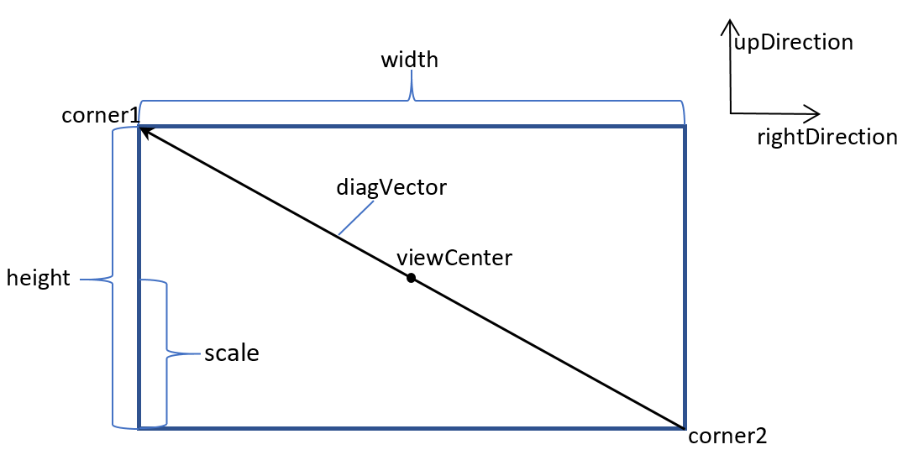
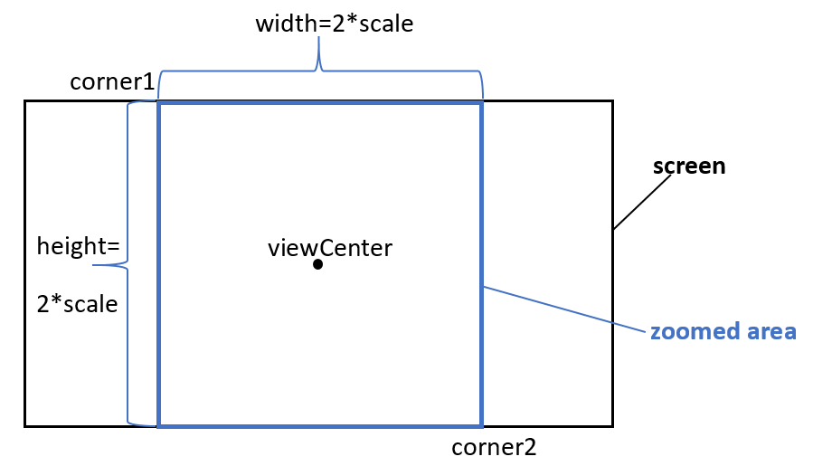

<head>
<meta http-equiv="Content-Type" content="text/html; charset=utf-8">
<link rel="stylesheet" type="text/css" href="bc.css">

</head>

<!---

- restore 3D view camera orientation
  https://thebuildingcoder.typepad.com/blog/2020/04/revit-camera-fov-forge-partner-talks-and-jobs.html#comment-5106250525

- Ehsan [@eirannejad](https://github.com/eirannejad) Iran-Nejad's [Revit cheatsheets](https://github.com/eirannejad/revit-cheatsheets)
  eirannejad_cheatsheet_keynote_file.png
  > Here is all the Revit cheat sheets I made in the past years to make life easier working with Revit. Want to add yours as well?!
  https://twitter.com/eirannejad/status/1313890807368228864

twitter:

Revit cheat sheets, saving and restoring 3D view camera settings in the #RevitAPI @AutodeskForge @AutodeskRevit #bim #DynamoBim #ForgeDevCon http://bit.ly/3dviewcamera

Valerii Nozdrenkov shares a powerful solution to save and restore the complete 3D view camera settings and Ehsan Iran-Nejad publishes his set of Revit cheat sheets
&ndash; Serialising 3D view camera settings
&ndash; Revit cheat sheets...

linkedin:

Revit cheat sheets, saving and restoring 3D view camera settings in the #RevitAPI 

http://bit.ly/3dviewcamera

Valerii Nozdrenkov shares a powerful solution to save and restore the complete 3D view camera settings and Ehsan Iran-Nejad publishes his set of Revit cheat sheets:

- Serialising 3D view camera settings
- Revit cheat sheets...

#bim #DynamoBim #ForgeDevCon #Revit #API #IFC #SDK #AI #VisualStudio #Autodesk #AEC #adsk

the [Revit API discussion forum](http://forums.autodesk.com/t5/revit-api-forum/bd-p/160) thread

-->

### Save and Restore 3D View Camera Settings

Today, Valerii Nozdrenkov shares a powerful solution to save and restore the complete 3D view camera settings, and Ehsan Iran-Nejad publishes his set of Revit cheat sheets:

- [Serialising 3D view camera settings](#2)
- [Revit cheat sheets](#3)

#### Serialising 3D View Camera Settings

Valerii Nozdrenkov shared a powerful solution for serialising the 3D view camera settings
[in](https://thebuildingcoder.typepad.com/blog/2020/04/revit-camera-fov-forge-partner-talks-and-jobs.html#comment-4929308181)
[a](https://thebuildingcoder.typepad.com/blog/2020/04/revit-camera-fov-forge-partner-talks-and-jobs.html#comment-5106250525)
[series](https://thebuildingcoder.typepad.com/blog/2020/04/revit-camera-fov-forge-partner-talks-and-jobs.html#comment-5107042312)
[of](https://thebuildingcoder.typepad.com/blog/2020/04/revit-camera-fov-forge-partner-talks-and-jobs.html#comment-5107053457)
[comments](https://thebuildingcoder.typepad.com/blog/2020/04/revit-camera-fov-forge-partner-talks-and-jobs.html#comment-5107690269), 
nicely complementing previous explorations on:

- [Setting up your `ViewOrientation3D`](http://thebuildingcoder.typepad.com/blog/2013/04/setting-up-your-vieworientation3d.html)
- [Exporting image and setting a default 3D view orientation](http://thebuildingcoder.typepad.com/blog/2013/08/setting-a-default-3d-view-orientation.html)
- [Mapping Forge viewer camera settings back to Revit](https://thebuildingcoder.typepad.com/blog/2019/06/revit-camera-settings-project-plasma-da4r-and-ai.html#2)

**Question:** I have a question about `View3D` camera settings.
I want to serialize view 3D camera orientation.
It works fine if a projection mode is perspective.
When I zoom in or out, the method `GetOrientation` gives correct values for perspective camera (the position of the camera is changed), but in orthographic projection mode, `GetOrientation` always returns the same value regardless of zoom in/out (position of the camera is changed), so I can't recreate saved camera orientation in orthographic mode. There must be another transformation to apply, but I don't know where to take it from.

Currently, I need to change position manually in order to apply changes made by zooming in or out.

I found, there is a method `GetZoomCorners` of class `UIView`; this is a bounding box.
Its values change after zooming in/out, but how can I move the `EyePosition` accordingly?

Any suggestions?

**Answer:** I investigated the problem of saving and restoring the current Revit View 3D.
For a perspective projection mode, it was very simple: just save camera parameters and then restore them.
But for orthographic projection mode, I found that the camera parameters are not changed after zooming or panning the model; compare the following two figures.

Before:

 <!-- 1468 -->

Camera parameters before zooming and panning

After:

 <!-- 1478 -->

Camera parameters after zooming and panning

After desperate Googling, I found the solution of this task in GitHub, in the 
[RevitView.cs module](https://github.com/teocomi/BCFier/blob/master/Bcfier.Revit/Data/RevitView.cs) of
the [BCFier project](https://github.com/teocomi/BCFier)
by [@mgrzelak](https://github.com/mgrzelak).

The idea is:

Saving:

1. Get corners of the active UI view Corner1 {x1,y1,z1} and Corner2 {x2,y2,z2}

    <pre class="code">
    IList<uiview> views = uidoc.GetOpenUIViews();
    UIView currentView = views.Where(t => t.ViewId == view3D.Id).FirstOrDefault();
    //Corners of the active UI view
    IList<xyz> corners = currentView.GetZoomCorners();
    XYZ corner1 = corners[0];
    XYZ corner2 = corners[1];
    </pre>

2. Calculate center point {0.5(x1+x2),0.5(y1+y2),0.5(z1+z2)}

    <pre class="code">
    double x = (corner1.X + corner2.X) / 2;
    double y = (corner1.Y + corner2.Y) / 2;
    double z = (corner1.Z + corner2.Z) / 2;
    //center of the UI view
    XYZ viewCenter = new XYZ(x, y, z);
    </pre>

3. Calculate diagonal vector

    <pre class="code">
    diagVector = Corner1-Corner2={x1-x2,y1-y2,z1-z2}
    XYZ diagVector = corner1 - corner2;
    </pre>

4. Get up and right vectors

    <pre class="code">
    ViewOrientation3D viewOrientation3D = view3D.GetOrientation();
    XYZ upDirection = viewOrientation3D.UpDirection;
    XYZ rightDirection = forwardDirection.CrossProduct(upDirection);
    </pre>

5. Calculate height=abs(diagVector*upVector);

    <pre class="code">
    double height = Math.Abs(diagVector.DotProduct(upDirection));
    </pre>

6. Find scale = 0.5 * height

    But, the provided solution doesn’t work correctly if the height &gt; width.

    So, we need to take into account both height and width:

    <pre class="code">
    double height = Math.Abs(diagVector.DotProduct(upDirection));
    double width = Math.Abs(diagVector.DotProduct(rightDirection));
    </pre>

    Then we have to find the minimal minside = min(height,width)

    <pre class="code">
    double minside = Math.Min(height, width);
    </pre>

7. scale = 0.5 * minside

8. Save center point (eyePosition=viewCenter), upDirection, forwardDirection and scale.

Restoring is the same as in provided above link to GitHub project:

1. Get prevously saved eyePosition, upDirection, forwardDirection and scale.
2. Move the camera to preciously saved eyePosition

    <pre class="code">
    var orientation = new ViewOrientation3D(eyePosition, upDirection, forwardDirection);
    view3D.SetOrientation(orientation);
    </pre>

3. Calculate corners of square

    Upper left:

    <pre class="code">
    Corner1 = eyePosition+scale*upVector-scale*rightVector
    </pre>

    Lower right:

    <pre class="code">
    Corner2 = eyePosition-scale*upVector+scale*rightVector
  
    XYZ Corner1 = position + upDirection* scale - uidoc.ActiveView.RightDirection * scale;
    XYZ Corner2 = position - upDirection* scale + uidoc.ActiveView.RightDirection * scale;
    </pre>

4. ZoomCorners

    <pre class="code">
    ZoomAndCenterRectangle(Corner1, Corner2);
    uidoc.GetOpenUIViews().FirstOrDefault(t => t.ViewId == view3D.Id).ZoomAndCenterRectangle(Corner1, Corner2);
    </pre>

Here are two more figures illustrating the scale calculation and zooming corners:

 <!-- 1081 -->

Scale calculation
 
 <!-- 899 -->

Zooming corners

I prepared a sample project fully implementing this task to share in
the [RevitOrthoCamera GitHub repository](https://github.com/Valerii-Nozdrenkov/RevitOrthoCamera).

Very many thanks indeed to Valerii for all his valuable work researching and documenting this!

#### Revit Cheat Sheets

Ehsan [@eirannejad](https://github.com/eirannejad) Iran-Nejad [shares](https://twitter.com/eirannejad/status/1313890807368228864)
his [Revit cheat sheets](https://github.com/eirannejad/revit-cheatsheets) for
all to enjoy:

> Here are all the Revit cheat sheets I made in the past years to make life easier working with Revit.
Want to add yours as well?!

 <!-- 1539 -->

