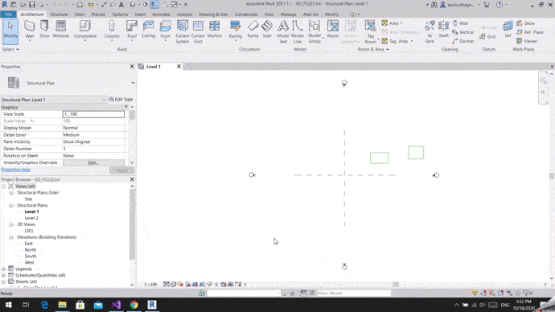
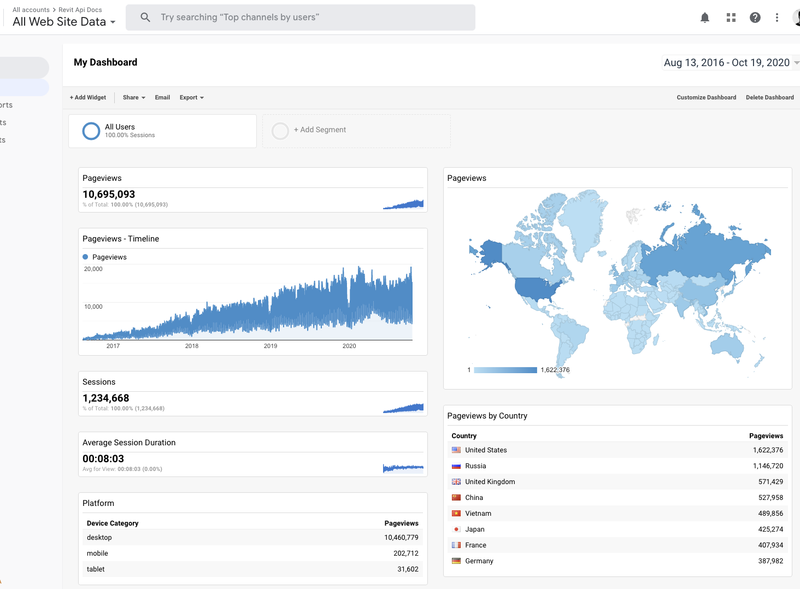

<head>
<meta http-equiv="Content-Type" content="text/html; charset=utf-8">
<link rel="stylesheet" type="text/css" href="bc.css">

</head>

<!---

- Onbox Framework
  Introducing a Revit API Framework!
  https://forums.autodesk.com/t5/revit-api-forum/introducing-a-revit-api-framework/m-p/9816804#M50608

- https://thebuildingcoder.typepad.com/blog/2012/06/uiview-and-windows-device-coordinates.html#comment-5115824205
  /a/doc/revit/tbc/git/a/img/plan_view_rectangle_jig.gif
  /a/doc/revit/tbc/git/a/zip/RevitJigSample.zip
  https://forums.autodesk.com/t5/revit-api-forum/draw-render-over-the-activeview/m-p/7074503
  https://thebuildingcoder.typepad.com/blog/2017/05/revit-2017-and-2018-sdk-samples.html
  https://thebuildingcoder.typepad.com/blog/2017/05/revit-2017-and-2018-sdk-samples.html#4.2

- Create Reports from AutoCAD and Revit
  https://autodesk.slack.com/archives/C0KBT3859/p1603315073123000
  Q: I am searching a product to create reports and insights from data generated by AutoCAD and Revit to bridge between construction engineering and business divisions. Where can I look?
  A: [Construction.Autodesk.com](http://construction.autodesk.com) has information about the entire Autodesk portfolio of products for the construction space. Specifically, you can take a look at [Assemblesystems.com](http://assemblesystems.com). Assemble is capable of aggregating data from AutoCAD, Revit and Navisworks. After that, you can use Power BI integration to create a Dashboard to share results with Stakeholders.

twitter:

The Onbox cross-platform #RevitAPI framework, a DirectContext rectangle jig, reports from AutoCAD and Revit, RevitApiDocs statistics and deprecating JavaScript CDN with @AutodeskForge @AutodeskRevit #bim #DynamoBim #ForgeDevCon http://bit.ly/directcontextjig

Autumnal topics for this week
&ndash; The Onbox cross-platform Revit API framework
&ndash; DirectContext rectangle jig
&ndash; Creating reports from AutoCAD and Revit
&ndash; RevitApiDocs statistics
&ndash; Stop using JavaScript CDN...

linkedin:

The Onbox cross-platform #RevitAPI framework, a DirectContext rectangle jig, reports from AutoCAD and Revit, RevitApiDocs statistics and deprecating JavaScript CDN:

http://bit.ly/directcontextjig

Autumnal topics for this week:

- The Onbox cross-platform Revit API framework
- DirectContext rectangle jig
- Creating reports from AutoCAD and Revit
- RevitApiDocs statistics
- Stop using JavaScript CDN...

#bim #DynamoBim #ForgeDevCon #Revit #API #IFC #SDK #AI #VisualStudio #Autodesk #AEC #adsk

the [Revit API discussion forum](http://forums.autodesk.com/t5/revit-api-forum/bd-p/160) thread

-->

### Onbox, DirectContext Jig and No CDN

Today is rainy, grey and dreary... autumn is here for real. 
Here are some autumnal topics for this week to cheer us all up:

- [The Onbox cross-platform Revit API framework](#2)
- [DirectContext rectangle jig](#3)
- [Creating reports from AutoCAD and Revit](#4)
- [RevitApiDocs statistics](#5)
- [Stop using JavaScript CDN](#6)

#### The Onbox Cross-Platform Revit API Framework

Thiago Almeida of [Blackbird Industries](https://blackbirdindustries.com.au) shares some exciting news in 
his [Revit API discussion forum](http://forums.autodesk.com/t5/revit-api-forum/bd-p/160) thread
[introducing a Revit API framework](https://forums.autodesk.com/t5/revit-api-forum/introducing-a-revit-api-framework/m-p/9816804), saying:

I have been programming Revit API for at least 8 years now and always tried to find ways to make my work easier.
I have always wanted to have data-rich apps that communicate with the cloud.
With the introduction of Autodesk Forge a few years back, I had the need to share even more code between various projects and assemblies.

Today, I'm thrilled to introduce the [Onbox Framework](https://github.com/engthiago/Onboxframework),
a free and open-source (MIT) to help us build cross-platform Revit Apps in a similar fashion
to [Angular](https://angular.io) and [ASP.Net Core](https://dotnet.microsoft.com/learn/aspnet/what-is-aspnet-core).
It is designed to make it easier to create a jump between these environments without workflow disruptions.
It introduces several features out-of-the-box, like dependency injection (IOC Container), state management, asynchronous Revit calls, a component-based MVC library made on top of WPF, and much more!

Here is the reference of the libraries that compose the framework and their NuGet packages, notice that most of the libraries are targeting .Net Standard to be used both on .Net Framework and .Net Core:

- Onbox.Abstractions &ndash; Interfaces of all generic usage on the framework
- Onbox.Core &ndash; Core implementations for all generic services
- Onbox.Di &ndash; IOC container system
- Onbox.Mvc.Abstractions &ndash; Interfaces for interacting with Views
- Onbox.Mvc &ndash; Implementation of WPF MVC Views and Components
- Onbox.Mvc.Revit.Abstractions &ndash; Interfaces for interacting with Revit and Views
- Onbox.Mvc.Revit &ndash; Implementation of WPF MVC specific to Revit
- Onbox.Revit.Abstractions &ndash; Interfaces for interacting with Revit
- Onbox.Revit &ndash; Revit External Applications and Commands
- Onbox.Store &ndash; State management for Revit MVC / WPF

We have built parts of several applications using some of these libraries.
Our current working project, [Shedmate app](https://construction.autodesk.com/integrations/shedmate), is the one that relies on it the most.
I would say parts of it because only some libraries existed when we started coding the app.
Shedmate is a web-based 3d configurator that needs to process the same data models in different places: Revit, our ASPNet Cloud server, and our front end Angular app.
The cool thing here is that we can share services between the Revit and ASP and even run a script to generate our data models in typescript for Angular!

<u><b>Simplicity:</b></u>
None of the features that Onbox provides out of the box are really trying to be the best ones in the industry. The framework is made with simplicity in mind, we tried to simplify the implementations as much as we could, even when we wanted to provide more functionality, we tried to make it easy to consume simpler versions of the APIs.

<u><b>Modularity:</b></u>
The framework aims for modularity, so the idea here is that you can introduce new functionality by yourself. Our libraries, e.g. Container, Mapper, State Management, Async are tiny and are not trying to solve every single problem or implement every single feature, also they can always be replaced by more mature ones out there.

<u><b>Flexible:</b></u>
The framework also aims to be flexible, if you have an existing Revit plugin and want to give Onbox a try, you would just swap the implementation for your external application and then for the external command implementations you want the container to be injected on. You are good to go!

<u><b>Testability:</b></u>
With the loosely coupled architecture that the framework helps you to build, you can then use any unit testing frameworks
like [Dynamo's Revit Tester Framework](https://github.com/DynamoDS/RevitTestFramework)
or [Geberit's Revit Test Runner](https://github.com/geberit/Revit.TestRunner).
We are even using Design Automation on Forge to unit test our Revit Apps.
That way, everything can be integrated into a CI/CD pipeline.

<u><b>Documentation:</b></u>
Documentation is in its early stages, (yeah I know.. documentation is important).
We have a simple Getting Started Guide here and the complete API documentation here.
The written tutorials explaining the main concepts are still of the libraries are still in the works, and we will be doing constant updates on it from now on (now that AU recordings are finally over).

<u><b>Usage and Collaboration:</b></u>
Everyone is welcome to use it and collaborate!
Being MIT licensed, you can take any parts of the framework and modify it to your usage, this is simple, because the libraries are tiny.
The same thing for eventual bugs, you can step in and fix them yourself or log an issue on GitHub.
We would appreciate any code pull requests, contributions to the documentation, and publications you make for it.
The idea is to have a mature Framework so everyone can collect the benefits.

<u><b>AU 2020:</b></u>
I'm teaching two classes on AU this year.
One is an industry talk (Lessons Learned in Three Years of Forge Dev &ndash; SD468705) that talks about our 3 years of Experience using Forge, the issues and problems we faced, and some tips and tricks for you do not waste so much time as we did try to solve them.
During the class we explain the benefits of using a loosely coupled architecture for building Revit applications.
The other one is a lab (The Cross-Platform Revit &ndash; SD468797-L).
This one goes through an overview process of building multi-platform Revit apps, we show how to share base code for Revit plugins, Dynamo (Zero touch) nodes, and Design Automation for Revit, and we use the framework do help us to do so.
If you are interested in the framework, please attend these classes next month on AU.

 <!-- 1919 -->

Many thanks to Thiago for sharing and documenting this powerful framework!

#### DirectContext Rectangle Jig

The [DuplicateGraphics SDK sample](https://thebuildingcoder.typepad.com/blog/2017/05/revit-2017-and-2018-sdk-samples.html#4.2) demonstrates
basic usage of
the [`IDirectContext3DServer` interface](https://www.revitapidocs.com/2020/7709521d-9954-ef80-1f13-3bc6ee660d5d.htm) for
displaying arbitrary 3D graphics in Revit [introduced in Revit 2018](https://thebuildingcoder.typepad.com/blog/2017/04/whats-new-in-the-revit-2018-api.html#3.26), also discussed in
the [Revit API discussion forum](http://forums.autodesk.com/t5/revit-api-forum/bd-p/160) thread
on how to [draw or render over the active view](https://forums.autodesk.com/t5/revit-api-forum/draw-render-over-the-activeview/m-p/7074503).

So far, I have not seen any other examples making use of this, so I was very glad to see Kailas Dhage's sample to
implement a plan view rectangle input jig in
his recent [comment](https://thebuildingcoder.typepad.com/blog/2012/06/uiview-and-windows-device-coordinates.html#comment-5115824205), saying:

I am working with a feature in which user would like to pick two corner points of rectangle and would like to see jig of rectangle while picking points. 
It works correctly in structural plan views like Level 1 and Level 2, but does not work correctly in a 3D view.

 <!-- 1919 -->

Can you please suggest changes to the following function, so that it returns correct mouse position in Revit model coordinates in a 3D view?

<pre class="code">
&nbsp;&nbsp;XYZ&nbsp;GetMousePoint()
&nbsp;&nbsp;{
&nbsp;&nbsp;&nbsp;&nbsp;var&nbsp;view&nbsp;=&nbsp;this.HostApplication.ActiveUIDocument.ActiveView;
&nbsp;&nbsp;&nbsp;&nbsp;var&nbsp;uiView&nbsp;=&nbsp;GetActiveUiView(&nbsp;this.HostApplication.ActiveUIDocument&nbsp;);
&nbsp;&nbsp;&nbsp;&nbsp;var&nbsp;corners&nbsp;=&nbsp;uiView.GetZoomCorners();
&nbsp;&nbsp;&nbsp;&nbsp;var&nbsp;rect&nbsp;=&nbsp;uiView.GetWindowRectangle();
&nbsp;&nbsp;&nbsp;&nbsp;var&nbsp;p&nbsp;=&nbsp;Cursor.Position;
&nbsp;&nbsp;&nbsp;&nbsp;var&nbsp;dx&nbsp;=&nbsp;(double)&nbsp;(p.X&nbsp;-&nbsp;rect.Left)&nbsp;/&nbsp;(rect.Right&nbsp;-&nbsp;rect.Left);
&nbsp;&nbsp;&nbsp;&nbsp;var&nbsp;dy&nbsp;=&nbsp;(double)&nbsp;(p.Y&nbsp;-&nbsp;rect.Bottom)&nbsp;/&nbsp;(rect.Top&nbsp;-&nbsp;rect.Bottom);
&nbsp;&nbsp;&nbsp;&nbsp;var&nbsp;a&nbsp;=&nbsp;corners[&nbsp;0&nbsp;];
&nbsp;&nbsp;&nbsp;&nbsp;var&nbsp;b&nbsp;=&nbsp;corners[&nbsp;1&nbsp;];
&nbsp;&nbsp;&nbsp;&nbsp;var&nbsp;v&nbsp;=&nbsp;b&nbsp;-&nbsp;a;
&nbsp;&nbsp;&nbsp;&nbsp;var&nbsp;q&nbsp;=&nbsp;a
&nbsp;&nbsp;&nbsp;&nbsp;&nbsp;&nbsp;+&nbsp;dx&nbsp;*&nbsp;v.X&nbsp;*&nbsp;XYZ.BasisX
&nbsp;&nbsp;&nbsp;&nbsp;&nbsp;&nbsp;+&nbsp;dy&nbsp;*&nbsp;v.Y&nbsp;*&nbsp;XYZ.BasisY;
&nbsp;&nbsp;&nbsp;&nbsp;return&nbsp;q;
&nbsp;&nbsp;}
</pre>

**Answer:**
To handle the 3D view projection, you will have to apply the appropriate 3D view orientation transform to the mouse input coordinates.
That is not completely trivial...

In any case, here is [RevitJigSample.zip](zip/kd_RevitJigSample.zip) with the 2D sample code for your reference. 

The code is based on the `IDirectContext3DServer`, in which we push graphics to the Revit graphics pipeline and remove when done.

Many thanks to Kailas for sharing this useful demo!

#### Creating Reports from AutoCAD and Revit

Quick end user oriented Q &amp; A on AEC reports and dashboards:

**Question:** I am searching a product to create reports and insights from data generated by AutoCAD and Revit to bridge between construction engineering and business divisions. Where can I look?

**Answer:** [Construction.Autodesk.com](http://construction.autodesk.com) has information about the entire Autodesk portfolio of products for the construction space.
Specifically, you can take a look at [Assemblesystems.com](http://assemblesystems.com).
Assemble is capable of aggregating data from AutoCAD, Revit and Navisworks.
After that, you can use Power BI integration to create a Dashboard to share results with stakeholders.

#### RevitApiDocs Statistics

Gui Talarico has put in a lot of work in recent years providing and maintaining the Revit API documentation online:

<!-- 1484 1586 1747 1779 -->

- [Online Revit API Documentation](https://thebuildingcoder.typepad.com/blog/2016/08/online-revit-api-docs-and-convex-hull.html#2)
- [Updated Online Revit API Docs](http://thebuildingcoder.typepad.com/blog/2016/10/token-expiry-and-online-revit-api-docs.html#2)
- [Revit 2018.1 API Documentation Online](http://thebuildingcoder.typepad.com/blog/2017/09/revit-201811-fixes-cropbox-setting.html#5)
- [RevitApiDocs Updated with the Revit 2020 API](https://thebuildingcoder.typepad.com/blog/2019/05/ai-boundaries-loops-and-revitapidocs-2020.html#2)
- [RevitApiDocs versus ApiDocs](https://thebuildingcoder.typepad.com/blog/2019/09/pyrevit-relocation-and-apidocs-code-sample-collection.html)

I just asked him about support for the Revit 2021 API and future releases, and it seems like Gui is happy to help with that.

In the process, he shared some usage statistics from the [revitapidocs web site](https://www.revitapidocs.com) that may be of interest to others as well:

 <!-- 1464 -->

Many thanks to Gui for all his work providing us with these invaluable online API docs!

#### Stop Using JavaScript CDN

[Terence Eden](https://edent.tel) presents some very valid reasons against using
a third party [Content Delivery Network](https://en.wikipedia.org/wiki/Content_delivery_network) in
his encouragement
to [please stop using CDNs for external JavaScript libraries](https://shkspr.mobi/blog/2020/10/please-stop-using-cdns-for-external-javascript-libraries).
