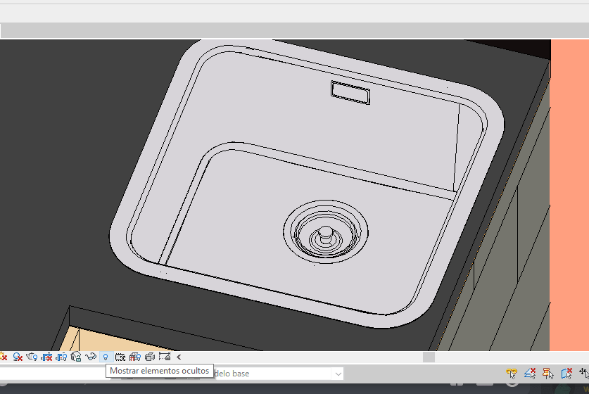
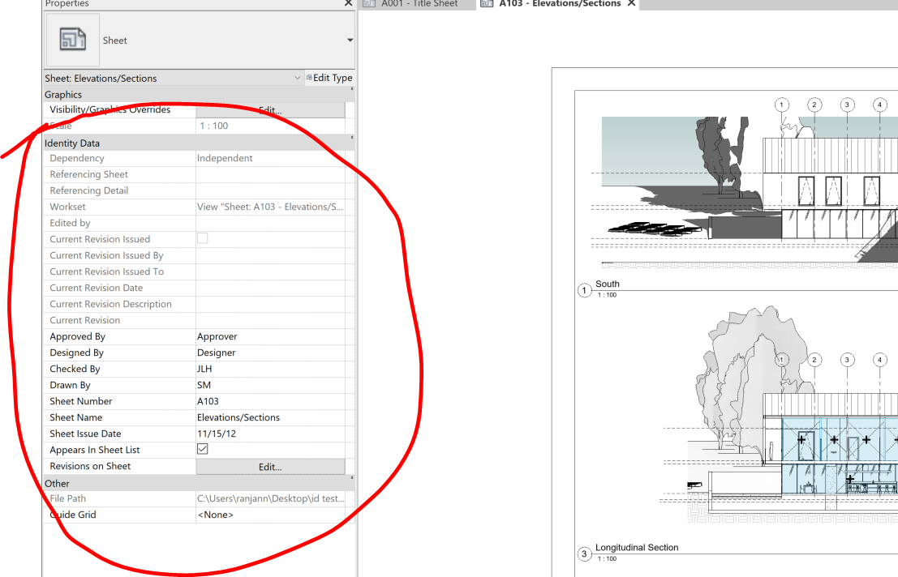

<head>
<meta http-equiv="Content-Type" content="text/html; charset=utf-8">
<link rel="stylesheet" type="text/css" href="bc.css">

</head>

<!---

- retrieve the BIM 360 Document Management Project Id of the active Revit model
  BIM 360 Document Management Project Id of Revit cloud model
  https://forums.autodesk.com/t5/revit-api-forum/bim-360-document-management-project-id-of-revit-cloud-model/m-p/9830419

- custom export precision
  CustomExporter Export Very Jagged Mesh for Curved Surfaces?
  https://forums.autodesk.com/t5/revit-api-forum/customexporter-export-very-jagged-mesh-for-curved-surfaces/td-p/9820131

- JtClicker to dismiss a dialogue:
  Q: Here in this below link
  https://thebuildingcoder.typepad.com/blog/2009/10/dismiss-dialogue-using-windows-api.html
  you mentioned how to use the native window API hook.
  But what the customer wants is a complete sample project/solution to understand the native windows API hook to dismiss the dialogue box in Revit.
  Do we have any sample project/solution to understand how the windows hook function is used in Revit?
  A: Whenever searching for such information, on of the first places to go are The Building Coder topic groups:
  https://thebuildingcoder.typepad.com/blog/about-the-author.html#5
  In this case, Detecting and Handling Dialogues and Failures:
  https://thebuildingcoder.typepad.com/blog/about-the-author.html#5.32
  The Windows hook functionality is not really used "in Revit", as far as I can remember.
  It is independent functionality that can possibly interact with a Revit add-in.
  Here is the complete project on GitHub:
  https://github.com/jeremytammik/JtClicker

- AU is coming up. Are you possibly thinking about recording a video?
  Check our Descript before you do.
  [Descript](https://www.descript.com) is a collaborative audio and video editor that works like a doc.
  It includes transcription, a screen recorder, publishing, full multitrack editing, and some mind-bendingly useful AI tools.
  https://youtu.be/Bl9wqNe5J8U
  [blog post](https://medium.com/descript/introducing-descript-fa37eb193819)

- AU classes for construction customers
  https://forge.autodesk.com/blog/forge-au-classes-construction

- retrieve identity data in Forge Viewer
  https://autodesk.slack.com/archives/C0LP63082/p1602524162022900
  Namit Ranjan Yesterday at 19:36
  Hi team, a customer is trying to retrieve the "Identity Data" of a sheet in a Revit model using Model Derivative but is unsuccessful. I tried as well but could not find this info anywhere in the properties. Can someone confirm if it's possible or should we recommend them to use Design Automation for this? Thanks!
  image.png 
  image.png
  /a/doc/revit/tbc/git/a/img/sheet_identity_data.png 1107
  Traian Stanev  13 hours ago
  It should be possible to get sheet properties by navigating the hierarchy of the object tree. The root node (id=1) is the document, and the sheets will be listed as children of that root. One would need to iterate through the children of the root to get the properties of the sheets and views.
  Namit Ranjan  12 hours ago
  Hi @Traian Stanev: Thanks. I do see the model as id=1 but I can't find sheets as children of that root. I also do not see "Sheet" in model browser in the Forge viewer in any example (which certainly contain Revit models having sheets). Am I overlooking something?
  Traian Stanev  12 hours ago
  The model browser will not show sheets because they do not have physical geometry associated with them. However, there will be sheet objects as children of the root.
  Traian Stanev  12 hours ago
  I don't know whether it's true for 100% of RVTs that sheets will appear in the property database though and it probably depends on which API you use to get properties. I'm referring to the full property database available to the Forge viewer. (edited) 
  Namit Ranjan  12 hours ago
  This is an export of the tree for my Revit model
  Untitled 
  {
      "data": {
          "type": "objects",
          "objects": [
              {
  Click to expand in-line (2,059 lines)
  Namit Ranjan  12 hours ago
  ^ this is /metadata
  Namit Ranjan  12 hours ago
  ..and this is /properties
  Untitled 
  {
      "data": {
          "type": "properties",
          "collection": [
              {
  Click to expand in-line (20,859 lines)
  Namit Ranjan  12 hours ago
  @Traian Stanev: and just FYI with the above snippets from /metadata and /properties, the sheet I'm looking is called "A102 - Plans". Thanks for the help btw :slightly_smiling_face: (edited) 
  Traian Stanev  12 hours ago
  I can't really comment about what subset of element properties are returned by the Forge properties API.
  Traian Stanev  12 hours ago
  I just know that the Forge viewer will show sheet properties in some cases, like in BIM360 Docs when you open the sheet.
  Namit Ranjan  12 hours ago
  @Traian Stanev: I don't think BIM 360 Docs shows properties of sheets. It does show properties of elements in that sheet, but since there's no way to "select" a sheet, we do not get the properties of the sheet. Let me do a quick check and confirm (edited) 
  Namit Ranjan  12 hours ago
  @Traian Stanev: nope, I stand corrected. BIM 360 does show those properties. I am just wondering now how does it get those properties. :open_mouth:
  Traian Stanev  12 hours ago
  It does it like I said -- it loops through the children of the root node and find the sheet element with the matching name.
  Traian Stanev  12 hours ago
  However, it's not using the Forge properties API.
  Traian Stanev  12 hours ago
  It uses the raw property data, available to the Forge Viewer, and it does it like this: https://git.autodesk.com/A360/firefly.js/blob/develop/src/gui/ViewerPropertyPanel.js#L377
  Namit Ranjan  12 hours ago
  @Traian Stanev: I perhaps do not have the entitlement to access the above but I kind of understand what you're trying to say. I understand that the properties are being retrieved by the raw property data. However, to first select the element id, the hierarchy (from /metadata endpoint) should retrieve sheets, right? I don't see sheets in that response; or is it that there's also another raw data which is different than Forge metadata  API?
  Traian Stanev  12 hours ago
  The forge metadata endpoint is not raw, it's processed data. From the above, it looks like it's missing the child properties that will let you easily find the sheets from the root element.
  Namit Ranjan  11 hours ago
  @Traian Stanev: Thanks, this is very helpful. Final question is - can this raw data be accessed by a customer?
  Traian Stanev  11 hours ago
  Yes, using Forge Viewer.
  Traian Stanev  11 hours ago
  I think you could ask #forge-modelderivative for more details though. It's possible there is a way to get this information via metadata that I am not aware of.
  Namit Ranjan  11 hours ago
  okay, the customer probably wants to query and fetch attribute values (maybe plug those values in a DB, just thinking) and that won't be possible using Forge viewer, right?
  Jim Quanci  20 days ago
  The MD service does let you perform queries to get the metadata you want... with two choices of data format... yes the MD slack channel or @Augusto Goncalves can help.  Some small chance you will run into data MD doesnt collect and Revit Design Automation would be your fallback.
  Namit Ranjan  20 days ago
  Thanks @Jim Quanci, I'll put this up shortly on the MD channel. Also, @Augusto Goncalves, would be great if you could provide your input. Thanks :slightly_smiling_face:
  Augusto Goncalves  20 days ago
  sure, with Design Automation you can definitely extract additional data, see this sample: https://github.com/augustogoncalves/forge-customproperty-revit
  augustogoncalves/forge-customproperty-revit
  Extract Compound Structure Layer for RVT files using Design Automation for Revit
  <https://github.com/augustogoncalves/forge-customproperty-revit|augustogoncalves/forge-customproperty-revit>augustogoncalves/forge-customproperty-revit | 27 Mar | Added by GitHub
  Namit Ranjan  20 days ago
  @Augusto Goncalves: Thanks a lot. I'll share this useful example with the customer. Thanks
  Augusto Goncalves  20 days ago
  this will also be useful: https://forge.autodesk.com/blog/forge-au-2020-pre-event-online-bootcamp

twitter:

#RevitAPI, @AutodeskForge, BIM360 and AI topics: custom export precision, dismissing Windows dialogues, sheet metadata in Forge, determining the BIM 360 project id, AI solving PDEs and enhancing video editing... @AutodeskRevit #bim #DynamoBim #ForgeDevCon http://bit.ly/customexportprecision

Many interesting topics on pure Revit API, Forge, BIM360 and AI
&ndash; Custom export precision
&ndash; Dismissing a Windows dialogue with JtClicker
&ndash; AU classes for construction customers
&ndash; Retrieve sheet metadata in Forge viewer
&ndash; Determining the BIM 360 project id
&ndash; AI solves partial differential equations
&ndash; AI-enhanced video editing...

linkedin:

#RevitAPI, Forge, BIM360 and AI topics: custom export precision, dismissing Windows dialogues, sheet metadata in Forge, determining the BIM 360 project id, AI solving PDEs and enhancing video editing...

http://bit.ly/customexportprecision

- Custom export precision
- Dismissing a Windows dialogue with JtClicker
- AU classes for construction customers
- Retrieve sheet metadata in Forge viewer
- Determining the BIM 360 project id
- AI solves partial differential equations
- AI-enhanced video editing...

#bim #DynamoBim #ForgeDevCon #Revit #API #IFC #SDK #AI #VisualStudio #Autodesk #AEC #adsk

the [Revit API discussion forum](http://forums.autodesk.com/t5/revit-api-forum/bd-p/160) thread

-->

### Custom Export Precision, Sheet Metadata, Project Id

I lit upon many interesting topics in the past few days, on pure Revit API, Forge, BIM360 and AI:

- [Custom export precision](#2)
- [Dismissing a Windows dialogue with JtClicker](#3)
- [AU classes for construction customers](#4)
- [Retrieve sheet metadata in Forge viewer](#5)
- [Determining the BIM 360 project id](#6)
- [AI solves partial differential equations](#7)
- [AI-enhanced video editing](#8)

#### Custom Export Precision

[Sunsflower](https://forums.autodesk.com/t5/user/viewprofilepage/user-id/3074901) took
another look at improving the precision of a custom exporter in
the [Revit API discussion forum](http://forums.autodesk.com/t5/revit-api-forum/bd-p/160) thread
on [CustomExporter Export Very Jagged Mesh for Curved Surfaces](https://forums.autodesk.com/t5/revit-api-forum/customexporter-export-very-jagged-mesh-for-curved-surfaces/td-p/9820131):

**Question:** As shown in the screenshots below, when I tried to export a curved surface, the `OnPolyMesh` method in `IExportContext` produces very jagged edges:

 <!-- 837 -->
 <!-- 605 -->

Is there a way to improve this?

**Answer:** Check out The Building Coder topic group on
the [custom exporter](https://thebuildingcoder.typepad.com/blog/about-the-author.html#5.1).

Especially, please read these two posts:

- [Revit export precision and tolerance](https://thebuildingcoder.typepad.com/blog/2015/06/angelhack-athens-sustainability-and-export-precision.html#4)
- [Controlling the quality of the geometry on custom export](https://thebuildingcoder.typepad.com/blog/2016/02/reorg-fomt-devcon-ted-qr-custom-exporter-quality.html#8)
 
I all else fails, you will have to access the real element geometry instead of using the custom exporter.

That is normally a lot more work, though.

**Response:** My solution is to triangulate the face in the `OnFace` method.
This way, I can input a `LevelOfDetail` parameter.
However, I lose all `UV` data at the same time.
Currently, I use `Face.Project` to approximate a set of `UV`, which is quite unstable.

I also tried to set the `LevelOfDetail` property on `ViewNode`, and it also works.

#### Dismissing a Windows Dialogue with JtClicker

Another topic group is dedicated
to [detecting and handling dialogues and failures](https://thebuildingcoder.typepad.com/blog/about-the-author.html#5.32).

It started out before the [DialogBoxShowing event](https://www.revitapidocs.com/2020/cb46ea4c-2b80-0ec2-063f-dda6f662948a.htm) and
[Failure handling APIs](https://www.revitapidocs.com/2020/c03bb2e5-f679-bf24-4e87-08b3c3a08385.htm) were implemented, using a Windows hook to determine that a dialogue was being shown:

**Question:** You explained how to use the native Windows API hook
to [dismiss a dialogue](https://thebuildingcoder.typepad.com/blog/2009/10/dismiss-dialogue-using-windows-api.html).
Is there a complete sample project and solution available to understand how to use it to dismiss the dialogue box in Revit?

**Answer:** Whenever searching for such information, one of the first places to go
are [The Building Coder topic groups](https://thebuildingcoder.typepad.com/blog/about-the-author.html#5).
In this case, you can look at [detecting and handling dialogues and failures](https://thebuildingcoder.typepad.com/blog/about-the-author.html#5.32).
The Windows hook functionality is not really used 'in Revit', as far as I can remember.
It is independent functionality that can interact with a Revit add-in, if you like.
The complete project is available in
the [JtClicker repository on GitHub](https://github.com/jeremytammik/JtClicker).

#### AU Classes for Construction Customers

Are you specifically interested in construction?
Check out the overview
of [AU classes for construction customers](https://forge.autodesk.com/blog/forge-au-classes-construction).

#### Retrieve Sheet Metadata in Forge Viewer

Now, let's turn to Forge.
Here is a pretty illuminating exploration on accessing Revit sheet metadata in that environment:

<!-- https://autodesk.slack.com/archives/C0LP63082/p1602524162022900 -->

**Question:** I am trying to retrieve the 'Identity Data' of a sheet in a Revit model using the Model Derivative API:

 <!-- 1107 -->

Unfortunately, I was unable to find this info anywhere in the properties.
Is it possible, or do I have to use Design Automation for this?
Thanks!

**Answer:**  It should be possible to get sheet properties by navigating the hierarchy of the object tree.
The root node (`id` = `1`) is the document, and the sheets will be listed as children of that root.
One would need to iterate through the children of the root to get the properties of the sheets and views.

**Response:** I do see the model as `id` = `1`, but I can't find sheets as children of that root.
I also do not see `Sheet` in the model browser in the Forge viewer in any example (which certainly contain Revit models having sheets).
Am I overlooking something?

**Answer:** The model browser will not show sheets, because they do not have physical geometry associated with them.
However, there will be sheet objects as children of the root.

Maybe, in some RVTs, sheets do not appear in the property database, though.
It probably depends on which API you use to get properties.
I'm referring to the full property database available to the Forge viewer.

**Response:** This is an export of the tree of `/metadata` for my Revit model:

<pre class="code">
Untitled 
{
"data": {
  "type": "objects",
  "objects": [
      {
      // ... (2,059 lines)
</pre>

Here are the `/properties`:

<pre class="code">
Untitled 
{
"data": {
  "type": "properties",
  "collection": [
      {
      // ... (20,859 lines)
</pre>

These come from a sheet called "A102 - Plans".

**Answer:** I don't know what subset of element properties are returned by the Forge properties API.
I do know that the Forge viewer will show sheet properties in some cases, e.g., in BIM360 Docs when you open the sheet.

**Response:** Yes indeed, BIM 360 Docs does show properties of sheets.
I checked and confirmed.
Now I wonder how it gets those properties.

**Answer:** Just like I said &ndash; it loops through the children of the root node and finds the sheet element with the matching name.
However, it's not using the Forge properties API.
It uses the raw property data, available to the Forge Viewer

**Response:** I kind of understand what you say.
I understand that the properties are being retrieved by the raw property data.
However, to first select the element id, the hierarchy (from the `/metadata` endpoint) should retrieve sheets, right?
I don't see sheets in that response; or is it that there's also other raw data which is different from the Forge metadata API?

**Answer:** The Forge metadata endpoint is not raw, it's processed data.
From the above, it looks like it's missing the child properties that will let you easily find the sheets from the root element.

**Response:** Thanks, this is very helpful.
Final question: can this raw data be accessed by a customer?

**Answer:** Yes, using Forge Viewer.
It may be possible to get this information via metadata somehow that I am not aware of.

**Response:** Hmm... so, if I want to query and fetch attribute values, that won't be possible using Forge viewer, right?

**Answer:** The MD service does let you perform queries to get the metadata you want, with two choices of data format.
If you run into data that MD does not collect, and Revit Design Automation would be your fallback.

Here is an example accessing additional metadata,
to [extract compound structure layer from RVT files using Design Automation for Revit](https://github.com/augustogoncalves/forge-customproperty-revit).

The resources listed for the [Forge at AU 2020 pre-event online bootcamp](https://forge.autodesk.com/blog/forge-au-2020-pre-event-online-bootcamp) will probably also be useful for you.

#### Determining the BIM 360 Project Id

Kevin Augustino very kindly shared his current approach
to [retrieve the BIM 360 Document Management Project Id of the active Revit cloud model](https://forums.autodesk.com/t5/revit-api-forum/bim-360-document-management-project-id-of-revit-cloud-model/m-p/9830419):

**Question:** How can I retrieve the BIM 360 Document Management Project Id of the active Revit model?
I'm aware of *Document.GetCloudModelPath().GetProjectGUID()*, but this seems to be a C4R Project Id.
I need the Document Management Id to interface with
the [Forge BIM 360 and Data Management APIs](https://forge.autodesk.com/en/docs/bim360/v1/reference/http/).

So far, I've found that the Document Management file has an attribute that matches the C4R Project Guid: *attributes.extension.data.projectGuid*.

So, I need to find the Docs project that contains a file such that:

<pre>
  attributes.extension.data.projectGuid
    = &lt;ActiveRevitDocument&gt;.GetCloudModelPath().GetProjectGUID().
</pre>

But surely there's a better approach than doing a [folder search](https://forge.autodesk.com/en/docs/data/v2/reference/http/projects-project_id-folders-folder_id-search-GET/) using a filter matching *filter[attributes.extension.data.projectGuid]* with `ValueFromCloudModelPath` on every Docs Project that my Forge App has access to?

**Answer:** I asked the development team for you whether they can suggest a better way.
They are currently discussing the implementation of a direct method to retrieve the BIM 360 project id of the document via a property such as `Document.ProjectId`, now as we speak. It will hopefully be available in a future release of Revit.

Meanwhile, the convoluted approach you describe sounds significantly better than nothing at all to me, so well done finding a way through the maze.

 **Response:** For anyone else who runs into this same need, here are some of my other findings:

`Document.PathName` seems to be a string in this form when opening a cloud model:

<pre>
  BIM 360://&lt;DocsProjectName&gt;/&lt;ModelName&gt;.rvt
</pre>

So, another option is to try parsing `Document.PathName` to get the Document Management Project name:

<pre class="code">
  string regexPattern =
    @"^BIM 360:\/\/(?&lt;ProjectName&gt;.*)\/(?&lt;ModelName&gt;.*)$";

  if (Regex.IsMatch(doc.PathName, regexPattern))
  {
    Match match = Regex.Match( doc.PathName, regexPattern );
    string projectName = match.Groups["ProjectName"].Value;
  }
</pre>

Then look for a project with that name by iterating each hub returned
from *https://forge.autodesk.com/en/docs/data/v2/reference/http/hubs-GET/*,
and, on each one, try
to [get a project using a name filter](https://forge.autodesk.com/en/docs/data/v2/reference/http/hubs-hub_id-projects-GET/), 
using a filter such as

<pre>
  string.format( "?filter[attributes.name]={0}",
    HttpUtility.UrlEncode(projectName))
</pre> 

If this project name isn't unique, then this approach might not get the correct one.
But additional processing can be applied to use a folder search looking for

<pre>
  attributes.extension.data.projectGuid
    = &lt;ActiveRevitDocument&gt;.GetCloudModelPath().GetProjectGUID()
</pre>

So at least this way, the folder search is only done on potential matches, rather than every single project.

If the Document Management project name changes, then `Document.PathName` won't refresh to the new project name until you re-save the model.
So, as a fallback, if I still haven't found the project Id, I resort to the folder search on every project regardless of name.

Not ideal, but hopefully a direct method will be added to the Revit API in the future!

Many thanks to Kevin for all his research and documentation work on this!

#### AI Solves Partial Differential Equations

[AI has cracked a key mathematical puzzle for understanding our world](https://www.technologyreview.com/2020/10/30/1011435/ai-fourier-neural-network-cracks-navier-stokes-and-partial-differential-equations):

> Partial differential equations can describe everything from planetary motion to plate tectonics, but they’re notoriously hard to solve...

> They can be used to model everything from planetary orbits to plate tectonics to the air turbulence that disturbs a flight, which in turn allows us to do practical things like predict seismic activity and design safe planes...

> PDEs are notoriously hard to solve...

> Researchers at Caltech have introduced a new deep-learning technique for solving PDEs,
a [Fourier Neural Operator for Parametric
Partial Differential Equations](https://arxiv.org/pdf/2010.08895.pdf)
... dramatically more accurate... much more generalizable ... 1'000 times faster ...

#### AI-Enhanced Video Editing 

Here is another example of AI usage that may come in handier to you right away than solving differential equations:

AU is coming up. Are you possibly thinking about recording a video?
Check out [Descript](https://www.descript.com) before you do.
It is a collaborative audio and video editor that includes transcription, a screen recorder, publishing, full multitrack editing, and some mind-bendingly useful AI tools:

- [Blog post](https://medium.com/descript/introducing-descript-fa37eb193819)
- [Video](https://youtu.be/Bl9wqNe5J8U):

<iframe width="480" height="270" src="https://www.youtube.com/embed/Bl9wqNe5J8U" frameborder="0" allow="accelerometer; autoplay; clipboard-write; encrypted-media; gyroscope; picture-in-picture" allowfullscreen></iframe>

