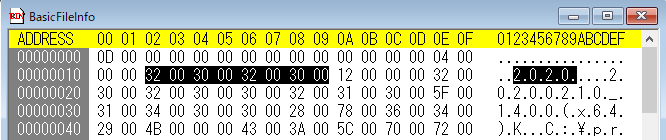

<head>
<meta http-equiv="Content-Type" content="text/html; charset=utf-8">
<link rel="stylesheet" type="text/css" href="bc.css">

</head>

<!---

- Jailbreak Revit: GraphQL & ServiceBus
  https://youtu.be/7LnbP4n4RYM

Taught by Gregor Vilkner, Microdesk at the AEC Tech Hackathon 2020

Gregor Vilkner, Ph.D.  12:24 AM
ðŸ‘
ðŸ‘
👎
😊
😞
Got a shout out for you... 🎃
19:30min mark...

- Document Session ID
  https://forums.autodesk.com/t5/revit-api-forum/document-session-id/m-p/9844775#M50895

- vendor id
  Where do I register a Vendor ID for use in Revit .addin files?
  Q: For what seems like a looong time ago (> 15 years) I registered a Vendor ID for my previous employer Cad Quality AB in Sweden. Now I am trying to do the same for my new employer Tribia AB, but I cannot find any page on ADN or Autodesk websites for doing so.
  Are the Vendor ID:s still in use, and if so – where can I register a new ID?
  A: This vendor id is no longer in use.
  The recommended vendor id to use in a Revit add-in manifest file is your reversed internet url, afaik.
  For example, i use:
  <VendorId>com.typepad.thebuildingcoder</VendorId>
  <VendorDescription>The Building Coder, http://thebuildingcoder.typepad.com</VendorDescription>
  https://thebuildingcoder.typepad.com/blog/2018/06/add-in-registration-vendorid-and-signature.html#2

- 7848 [How to detect Revit File Version before DA4R]

- Parable of the Polygons -- https://ncase.me/polygons/

twitter:

#RevitAPI @AutodeskForge @AutodeskRevit #bim #DynamoBim #ForgeDevCon

&ndash; 
...

linkedin:

#bim #DynamoBim #ForgeDevCon #Revit #API #IFC #SDK #AI #VisualStudio #Autodesk #AEC #adsk

the [Revit API discussion forum](http://forums.autodesk.com/t5/revit-api-forum/bd-p/160) thread

-->

###

#### Document Session Id

An interesting question that I have dabbled with in the past came up in
the [Revit API discussion forum](http://forums.autodesk.com/t5/revit-api-forum/bd-p/160) thread
on [document session id](https://forums.autodesk.com/t5/revit-api-forum/document-session-id/m-p/9844775).

My dabbling has to do with a permanent document identifier;
Tobias asking the question and Richard providing a more satisfying and useful answer for this specific case highlight the use of `Document.GetHashCode` to identify document instances in the current session only:

**Question:** Is there something like a session id for open documents?

I would like to uniquely identify a Autodesk.Revit.DB.Document object, for example in the ViewActivated Event. This is needed while more than one document can be open at the same time in Revit. Because I hold some stuff in memory, I need to know to which document it belongs.

The DocumentPath as Id is not an option, because newly created documents have a zero string (could be occur more than one as well in a session)

**Answer 1:** As we all know, there are no stupid questions.

Sometimes people would be better served searching for an answer themselves before asking others. It seems to me you have already searched, with no fruitful results. Thank you for that. However, there is some information on this already out there, waiting to be found:

Every Revit project includes a singleton ProjectInformation database element. Every database element has a unique identifier. So, theoretically, you could use that to uniquely identify a project.

Unfortunately, if I create a project A, and then copy it for reuse in project B, the two ProjectInformation elements will have the same unique id, so this solution only works if you can guarantee that no such copy will ever be created:

https://thebuildingcoder.typepad.com/blog/2017/12/project-identifier-and-fuzzy-comparison.html#2

Here is a some further analysis of this situation:

https://the3dwebcoder.typepad.com/blog/2015/07/implementing-mongo-database-relationships.html#2

To address this, I suggested a different and safer solution using an extensible storage schema and a named GUID storage for project identification instead:

https://thebuildingcoder.typepad.com/blog/2016/04/named-guid-storage-for-project-identification.html

**Response:** Indeed, I searched before without a satisfying result.

I came to the same conclusion as your solutions.
I was hoping there was something else &nbsp; :-)

Possibly use the combination of unique identifier and the file path, but this is not very elegant.
I think I will end up using the extensible storage solution.
Maybe a second schema, not the same as my plugin uses for storing its data.

**Answer 2:** Some documents don't contain a path (yet to be saved ones).

[Document.GetHashCode](https://www.revitapidocs.com/2020/006a71c2-4393-e036-9987-14467342a7d3.htm) has
served me well over the years:

> The hash code is the same for document instances that represent the same document currently opened in the Revit session.
The hash code is generated when a Revit file is opened or created in session.
If the same Revit file is opened later (in the same session or a different session), the hash code will not be the same.

Mainly, I use this in a static variable to see if the current document has switched via the `ViewActivatedEvent`.

**Response:** Ah, very nice. Thank you for that.

<!--
#### Vendor Id

  Where do I register a Vendor ID for use in Revit .addin files?
Q: For what seems like a looong time ago (> 15 years) I registered a Vendor ID for my previous employer Cad Quality AB in Sweden. Now I am trying to do the same for my new employer Tribia AB, but I cannot find any page on ADN or Autodesk websites for doing so.
Are the Vendor ID:s still in use, and if so – where can I register a new ID?
A: This vendor id is no longer in use.
The recommended vendor id to use in a Revit add-in manifest file is your reversed internet url, afaik.
For example, i use:
    <VendorId>com.typepad.thebuildingcoder</VendorId>
    <VendorDescription>The Building Coder, http://thebuildingcoder.typepad.com</VendorDescription>

already discussed in full here:

https://thebuildingcoder.typepad.com/blog/2018/06/add-in-registration-vendorid-and-signature.html#2
-->

#### Valid Revit API Context and External Events

Developers keep attempting to acccess the Revit API from outside of Revit itself, e.g., in the questions
on [how to open different version revit files](https://forums.autodesk.com/t5/revit-api-forum/how-to-open-different-version-revit-files/m-p/9861186)
and [how to raise an external event from a WPF app](https://stackoverflow.com/questions/64683308/how-do-i-raise-an-external-event-in-the-revit-api-from-a-wpf-app):

The Revit API cannot be used outside a valid Revit API context:

- [Use of the Revit API Requires a Valid Context](http://thebuildingcoder.typepad.com/blog/2015/12/external-event-and-10-year-forum-anniversary.html#2)
- [Revit API Context Summary](http://thebuildingcoder.typepad.com/blog/2015/08/revit-api-context-and-form-creation-errors.html#2)

You can work around this limitation, though:
the Revit API enables you to define an external event that can be triggered from outside a valid Revit API context.

The implementation and definition of the external event happens within a Revit add-in and requires a valid Revit API context.

Once defined, though, the external event can be raised from outside.

The event handler, again, must reside and execute within.

#### Determining RVT File Version for DA4R Workitem

That said, some operations can be performed on an RVT BIM from outside Revit, without use of the Revit API or such a context.

Another question that came up repeatedly in the past few weeks is how to detect the Revit file version before passing it to a DA4R or Forge Design Automation for Revit workflow. In DA4R, you can specify what version of the Revit engine to launch. Picking the appropriate one for the given RVT file avoids the time-consuming upgrade process:

**Question:** When I specify `Autodesk.Revit+2021` for the design automation AppBundle and Activity engine, the Revit 2020 version RVT file that I pass in is upgraded to 2021.

I would like to avoid the RVT file version upgrading.

Is it necessary to prepare a separate AppBundle and Activity for each Revit version, detect the Revit file version up front, and select which Activity to use?

If so, how can I determine the Revit file version?

I saw the article on how
to [check the version of a Revit file hosted on the cloud](https://forge.autodesk.com/blog/check-version-revit-file-hosted-cloud).

I would like to know more detailed info for the accurate detection.

It says that the RVT file contains the file `BasicFileInfo` with the following data snippets:

- 0-14 bytes = Unknown.
- 15-18 bytes = the length(int32) of the subsequent field value.
- 19-(19+length*2) bytes = the Revit File Version (UTF16LE)

Is it true?
Can I use this data to determine the Revit file version before passing it to DA?

 <!-- 666 -->

**Answer:** This question is answered in full in the following blog posts:

- [Check the version of a Revit file hosted on the cloud](https://forge.autodesk.com/blog/check-version-revit-file-hosted-cloud)
- [Basic File Info and RVT File Version](https://thebuildingcoder.typepad.com/blog/2013/01/basic-file-info-and-rvt-file-version.html)
- [Automatically Open Correct RVT File Version](https://thebuildingcoder.typepad.com/blog/2020/05/automatically-open-correct-rvt-file-version.html)

Furthermore, this recent discussion on StackOverflow addresses your exact requirements more precicely still:

- [Reliably Determine Revit Version of BIM 360 Project](https://stackoverflow.com/questions/63135095/reliably-determine-revit-version-of-bim-360-project)

**Response:** I found the implementation of Python in the blog article that you introduced really helpful.

Thank you so much!

#### Revit API via HTTP

The implementation and use of external events can be perfected and simplified, as proven by Igor Serdyukov, aka Игорь Сердюков or WhiteSharq, and Kennan Chen:

- [External Communication and Async Await Event](https://thebuildingcoder.typepad.com/blog/2020/02/external-communication-and-async-await-event-wrapper.html)
- [Revit.Async](https://thebuildingcoder.typepad.com/blog/2020/03/another-async-await-rex-and-structural-analysis-sdk.html#3)

Gregor Vilkner of [Microdesk](https://www.microdesk.com) makes use of that in his exciting class at
the [AEC Tech Hackathon 2020](https://www.aectech.us) in October:

- [Jailbreak Revit: GraphQL & ServiceBus](https://youtu.be/7LnbP4n4RYM)

<iframe width="480" height="270" src="https://www.youtube.com/embed/7LnbP4n4RYM" frameborder="0" allow="accelerometer; autoplay; clipboard-write; encrypted-media; gyroscope; picture-in-picture" allowfullscreen></iframe>

#### Parable of the Polygons

For a nice little demonstration of the subtle influence various individual preferences and prejudice can have on collective behaviour, check out
the [Parable of the Polygons](https://ncase.me/polygons), a segregation simulation that clearly proves certain points:

1. Small individual bias &rarr; Large collective bias.
 When someone says a culture is shapist, they're not saying the individuals in it are shapist. They're not attacking you personally.
2. The past haunts the present.
 Your bedroom floor doesn't stop being dirty just coz you stopped dropping food all over the carpet. Creating equality is like staying clean: it takes work. And it's always a work in progress.
3. Demand diversity near you.
 If small biases created the mess we're in, small anti-biases might fix it. Look around you. Your friends, your colleagues, that conference you're attending. If you're all triangles, you're missing out on some amazing squares in your life - that's unfair to everyone. Reach out, beyond your immediate neighbors.

<pre class="code">
</pre>

**Question:** 

 <!-- 837 -->

**Answer:** 

**Response:** 
