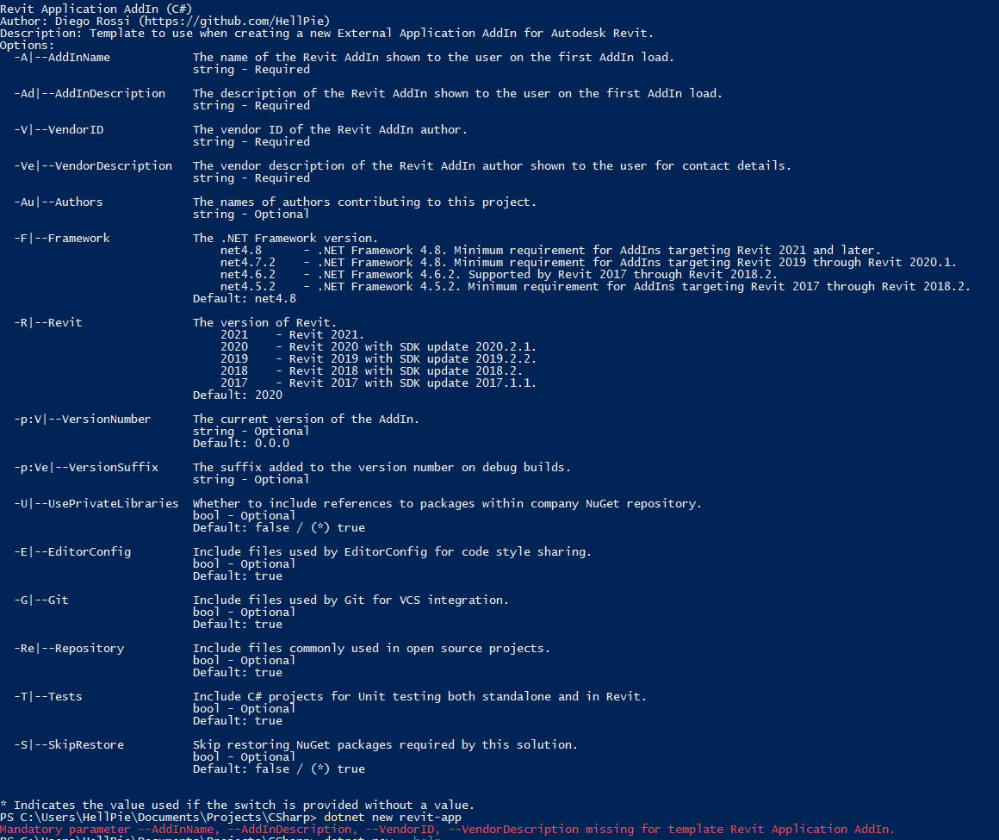

<head>
<meta http-equiv="Content-Type" content="text/html; charset=utf-8">
<link rel="stylesheet" type="text/css" href="bc.css">

</head>

<!---

- bim360 user management
  https://autodesk.slack.com/archives/C0PLC20PP/p1605039372138100
  Philipp Mueller  21:16
  TU Munich´s @Deian Stoitchkov has extended @Oliver Scharpf  User Management Script which allows to batch create Folders, assign Permission to Folders, creation of Companies, batch assign Users to a Project, assign Roles to a User and finally upload Files to BIM 360 using a single excel Spreadsheet. The Use case for the Solution was the handling of large amount of Students and setting up an Account from Scratch.
  Kudos to @Heiko Meyerdirks and @Sebastian Esser for your support in making this collaboration between TUM and Autodesk possible
  Thanks to @Peter Schlipf @Mikako Harada and @Zhong Wu for your  great help and Guidance.
  Step 0 - Introduction - BIM 360 Open Source User Management Script

twitter:

@BIM360 user management scripts, external application with @prismlib goodies and add-in @dotnet template for the #RevitAPI @AutodeskForge @AutodeskRevit #bim #DynamoBim #ForgeDevCon https://bit.ly/dotnettemplate

Philipp Mueller highlights a set of BIM360 user management scripts and Diego Rossi shares two useful GitHub repositories
&ndash; BIM360 user management scripts
&ndash; External application with Prism goodies
&ndash; Revit add-in dotnet template...

linkedin:

@BIM360 user management scripts, external application with @prismlib goodies and add-in @dotnet template for the #RevitAPI

https://bit.ly/dotnettemplate

Philipp Mueller highlights a set of BIM360 user management scripts and Diego Rossi shares two useful GitHub repositories:

- BIM360 user management scripts
- External application with Prism goodies
- Revit add-in dotnet template...

#bim #DynamoBim #ForgeDevCon #Revit #API #IFC #SDK #AI #VisualStudio #Autodesk #AEC #adsk

the [Revit API discussion forum](http://forums.autodesk.com/t5/revit-api-forum/bd-p/160) thread

-->

### BIM360 Management, Dotnet Template and Prism Goodies

Today, Philipp Mueller highlights a set of BIM360 user management scripts and Diego Rossi shares two useful GitHub repositories with us:

- [BIM360 user management scripts](#2)
- [External application with Prism goodies](#3)
- [Revit add-in dotnet template](#4)

#### BIM360 User Management Scripts

Autodesk Consulting implemented a set of BIM360 user management scripts.

[TU Munich](https://www.tum.de) extended them to support batch create folders, assign permissions to folders, create companies, assign users to a project, assign roles to a user and upload files to BIM 360 using a single Excel spreadsheet.

Their use case is the handling of a large number of students and setting up an account for each from scratch.

Here is a quick two-minute tutorial,
[Step 0 &ndash; Introduction &ndash; BIM 360 Open Source User Management Script](https://youtu.be/46DBcyQ7PJY),
introducing a series that walks through all the steps.

Thanks to Philipp for sharing this!

#### External Application with Prism Goodies

Diego says:

In my spare time, I do R &amp; D projects for Revit-related things when the company I work for doesn't have me push through new features or just during weekends without pending hobby projects.

Recently I really had to rely on [Prism](https://prismlibrary.com),
a common library among WPF developers which aids in the development of modular XAML/WPF apps following the MVVM paradigm to modularize C# ViewModels and XAML Views.

Since Revit does not rely on the concept of an always-running application instance for an add-in, but rather on the custom-made `IExternalApplication` interface, it does not allow Prism to work without porting its features over.

I open sourced a project I worked on,
[HellPie.Revit.PrismDemo](https://github.com/HellPie/HellPie.Revit.PrismDemo),
to showcase how to include Prism in a Revit external application add-in that allows access to the full range of goodies and features that come with using Prism, MVVM and the Inversion of Control paradigms.

#### Revit Add-In Dotnet Template

Today, I further delved into how to make my job easier; after having to develop sort of per-project new add-ins for the past 2 years, I got around to
trying [DotNet Templates](https://docs.microsoft.com/en-us/dotnet/core/tools/custom-templates),
a new feature introduced in the dotnet tooling released with .NET Core and now available also with .NET 5.0.

The [HellPie.RevitTemplates GitHub repository](https://github.com/HellPie/HellPie.RevitTemplates) showcases
a Template Package which gets compiled to a NuGet package via `dotnet pack` and then installed as a Template Package using `dotnet new --install path/to/package.nuget`.
There is a prebuilt NuGet package in the Releases of the repository.

This one took me quite some time, but I got it to work making use of the very powerful templating system which allows optional and mandatory parameters to be collected upon running `dotnet new`.
Help is available through `dotnet new <template name> --help`.
It allows to configure a Visual Studio Solution with and without NUnit test projects (I did not get around to implementing deeper integration as I do not have experience automating Geberit's Revit Runner).

This project also uses the latest SDK-style Project files, which were also introduced with .NET Core but do allow specifying any kind of valid Target Framework, including any old (and new) version of .NET Framework.
The template even shows some documentation for which .NET Framework version should be used based on the desired target Revit version (defaults to Revit 2021 and .NET Framework 4.8, can be customized with the flags shown in `dotnet new revit-api --help`).

Here is a screenshot showing the PowerShell help command output and a couple of example commands to run below:

 <!-- 1160 -->

- Create a new Solution with namespace Demo.Namespace targeting Revit 2019 and .NET Framework 4.8, without Unit Tests, without EditorConfig and without README and LICENSE files:
<pre>
dotnet new revit-api --name "Demo.Namespace" --AddInName "Demo AddIn" --AddInDescription "AddIn Description for .addin File" --VendorDescription "Vendor (vendor@email)" --VendorID "example.vendor" --Framework net4.8 --Revit 2019 --Tests=false --Repository=false --EditorConfig=false
</pre>
- Create a new Solution with default settings and only mandatory fields are defined:
<pre>
dotnet new revit-api --name Custom.Namespace --AddInName "Demo AddIn" --AddInDescription "AddIn Description for .addin File" --VendorDescription "Vendor (vendor@email)" --VendorID "example.vendor"
</pre>
- The same but using short flags:
<pre>
dotnet new revit-api -n Custom.Namespace -A "Demo AddIn" -Ad "AddIn Description for .addin File" -Ve "Vendor (vendor@email)" -V "example.vendor"
</pre>

Please mention these two projects in one of your blog posts, not for the clout, but first and foremost to let people know about them, so that they can hopefully contribute improvements and changes (more templates and maybe better templates too).

Many thanks to Diego for sharing his work, and good luck to all of us making use of and contributing to it!

Have a nice day and a relaxing healthy weekend!
