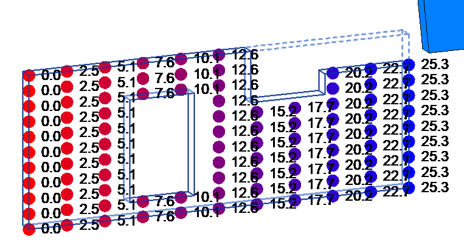
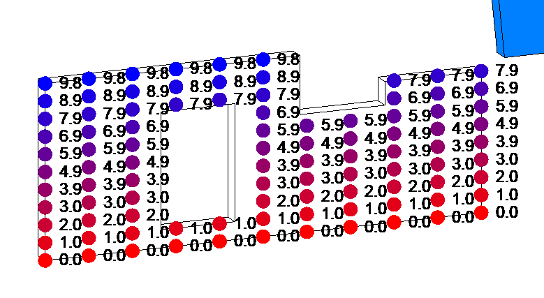
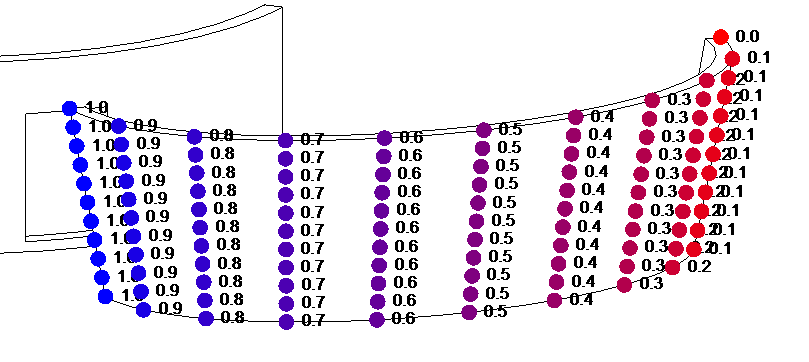
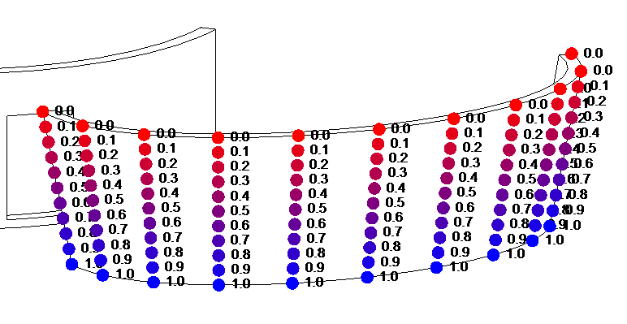
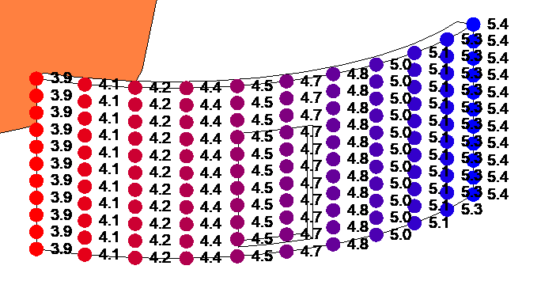
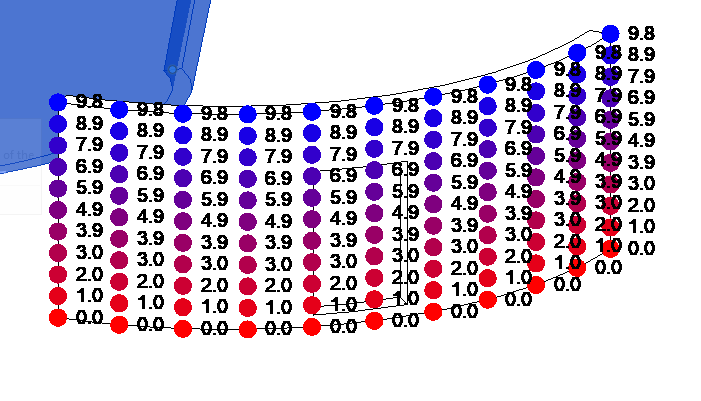
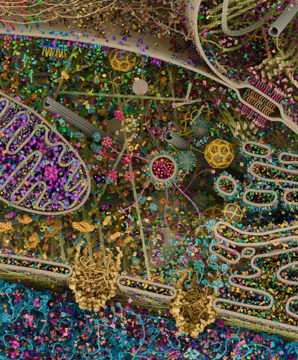

<head>
<meta http-equiv="Content-Type" content="text/html; charset=utf-8">
<link rel="stylesheet" type="text/css" href="bc.css">

</head>

<!---

- UV coords
  https://forums.autodesk.com/t5/revit-api-forum/revit-api-iexportcontext-converting-uv-to-the-range-0-1/m-p/9908386
  https://autodesk.slack.com/archives/C0SR6NAP8/p1606892274165300

- A detailed 3D model of human cell
  https://gaelmcgill.artstation.com/projects/Pm0JL1

twitter:

A Spanish-language Dynamo book, detailed 3D model of a human cell and explaining texture UV mapping using AVF in the #RevitAPI @AutodeskForge @AutodeskRevit #bim #DynamoBim #ForgeDevCon https://bit.ly/textureuv

The week is coming to an end all too quickly... here are some compelling topics before we enter the weekend
&ndash; Explaining texture <code>UV</code> mapping using AVF
&ndash; Más Allá de Dynamo Spanish-language book
&ndash; A detailed 3D model of a human cell...

linkedin:

A Spanish-language Dynamo book, detailed 3D model of a human cell and explaining texture UV mapping using AVF in the #RevitAPI

https://bit.ly/textureuv

- Explaining texture <code>UV</code> mapping using AVF
- Más Allá de Dynamo Spanish-language book
- A detailed 3D model of a human cell...

#bim #DynamoBim #ForgeDevCon #Revit #API #IFC #SDK #AI #VisualStudio #Autodesk #AEC #adsk 

the [Revit API discussion forum](http://forums.autodesk.com/t5/revit-api-forum/bd-p/160) thread

-->

### Dynamo Book and Texture Bitmap UV Coordinates

The week is coming to an end all too quickly... here are some compelling topics before we enter the weekend:

- [Explaining texture `UV` mapping using AVF](#2)
- [Más Allá de Dynamo &ndash; Spanish-language book](#3)
- [A detailed 3D model of a human cell](#4)

#### Explaining Texture UV Mapping Using AVF

A question was raised and partially discussed a while ago in
the [Revit API discussion forum](http://forums.autodesk.com/t5/revit-api-forum/bd-p/160) thread
on [`IExportContext` converting `UV` to the range (0,1)](https://forums.autodesk.com/t5/revit-api-forum/revit-api-iexportcontext-converting-uv-to-the-range-0-1/m-p/9908386).

Back then, I summarised and preserved the initial part of this discussion in the blog post discussion
on [normalising UVs in custom exporter](https://thebuildingcoder.typepad.com/blog/2020/07/revit-20211-update-and-normalising-custom-export-uv.html#3).

Now Jason expanded on the question, the Revit development team admitted to the dearth of information in this area,
provided some hints, and, above all,
Richard [RPThomas108](https://forums.autodesk.com/t5/user/viewprofilepage/user-id/1035859) Thomas once again
jumped in with a crucial and powerful solution to both answer the question and show how you can use the Analysis Visualisation Framework or AVF functionality for `UV` debugging to research and resolve this question yourself.

**Question:**  I'm writing an exporter for Revit and encountered with a problem when exporting `UV`.
When I call `PolymeshTopology.GetUV`, the coordinates given are often larger than 1.
My questions are:

1. How can I convert them to the desired range (0,1)? Or how should I understand these UV values?
2. Are they coordinates on the image? If so, how can I access the size of the image in IExportContext?

To give a concrete example: say I have a texture of size 4096x4096, the corresponding UV data I read in IExportContext is around 25, and the RealWorldScale from the UnifiedBitmapAsset is about 141.
I cannot seem to be able to discern a formula or something...

The Building Coder article on [Faces](https://thebuildingcoder.typepad.com/blog/2010/01/faces.html) helps somewhat.

However, it explains UV as two variables that parameterize a face, but they are related to the structure of the face in 3D space, not how each vertex of the face is mapped to the bitmap.
I'd appreciate it very much if you can elaborate on this, that is, how can I convert the `UV` coordinates returned by `PolymeshTopology.GetUV` to pixel coordinate on the image or in the range (0,1).

The article on [PolymeshTopology UVs](https://forums.autodesk.com/t5/revit-api-forum/polymeshtopology-uvs/td-p/8641007) is relevant;
however, the answer given is not detailed enough to actually solve the problem.

**Answer:** Here is my current approach:

The PolymeshTopology.GetUV method returns a UV coordinate that represents the parameters of a face.
Therefore, I guess they are related to the dimension of the face that they parameterize.
These UV coordinates can be converted to display units via UnitUtils.ConvertFromInternalUnits (deprecated, but anyway...), and, in my add-in, centimeters are used.
So, we have the UV in centimeters.

The next step is to obtain the size of the bitmap.
That is given by the properties with name UnifiedBitmap.TextureRealWorldScaleX/Y.
These values are actually given in inches, so you can call `UnitUtils.Convert` to convert them from `DisplayUnitType.DUT_DECIMAL_INCHES` to  `DisplayUnitType.DUT_CENTIMETERS`.
In fact, I found DisplayUnitType.DUT_FRACTIONAL_INCHES gives the same result; I don't know what's the difference.
The AssetPropertyDistance class actually has a DisplayUnitType property, which should be used instead of DUT_DECIMAL_INCHES.

After that, the UV coordinates can be scaled to the range [0,1] or whatever.

This approach was preserved by The Building Coder in the note  on [normalising UVs in custom exporter](https://thebuildingcoder.typepad.com/blog/2020/07/revit-20211-update-and-normalising-custom-export-uv.html#3).

**Question:** Jason's follow-up request for more details that Richard helps resolve:

This is all a bit confusing, because UVs are generally a relative spatial coordinate system.
"Relative" is the key word as they do not correspond to measurable distances.
So, why would there be a need to convert TextureRealWorldScaleX/Y to another unit, if normalization is ultimately x/y or y/x?
How is Revit calculating its UVs?

It seems crazy that the UVs provided are not usable UVs (unless the texture dimensions are 1:1) &ndash; the whole purpose of UVs is to allow us to ignore texture dimensions. All I understand is that it may make the Revit developers' lives easier, as it allows for interesting tiling dynamics when interchanging textures.

In any case, I attempted what I thought was a way to normalize given texture dimensions:

<pre class="code">
  normalize_multiplier = scaleX / (scaleY + ((scaleX - scaleY) / 2))
</pre>
  
If `scaleX` is 14 and `scaleY` 10 (inch, cm, it shouldn't really matter), then I see UVs that go from (0, 0) to (1.167, 0.833) and `normalize_multiplier` comes out to be 1.167.
So, (/, *) results in (1, 1).

But, unfortunately, that doesn't always work, and I see erroneous UVs elsewhere.

So, I need more information:

1. What are the UVs we are getting from Revit &ndash; they are not classic UVs so what do they really represent?
2. What is the appropriate algorithm to convert or normalize the UVs based on texture dimensions?
3. Is there a function that already does this conversion?
4. How does TextureRealWorldOffsetX/Y affect the UVs?
5. How does TextureWAngle affect the UVs?

**Answer:** I think this depends on the type of face; I find they are not always normalised from 0 to 1.

You can plot the `UV` coords on the surface using AVF; I believe the `UV` tends to follow the parameter of the curves around the edges of the face.

So, I believe, last time I checked, in a cylindrical face, the straight edges have ord related to raw parameter of curve (line), and the curved edges have normalised parameter of the arc, i.e., for the face on a vertical curved wall, the `V` was raw and the U was normalised (or the other way around). Sometimes, especially with cylindrical faces, the system is not oriented with `V` increasing in the same direction as `Basis.Z` (depends on face orientation). If you have a complete circle with two cylindrical faces, one will have `V` pointing downwards and the other pointing up to maintain face normal outwards.

Anyway, my suggestion is to use AVF to understand how `UV` is applied to different types of faces.

Actually, I recalled wrong, results as below:

Generally, the `UV` is based on raw parameter of curved edges, but, for some faces, i.e., ruled face, it is normalised.
Below are some examples (note the direction of increase in all cases).
The below is based on difference between Face `BoundingBoxUV` `Max`/`Min`, dividing into 10 segments and adding the UV values to the `ValueAtPoint` collection.
Many of the walls below are 9.8 feet high with base at 0.

 <!-- 763 -->

Planar face U

 <!-- 779 -->

Planar face V

 <!-- 809 -->

Ruled face U

 <!-- 772 -->

Ruled face V

 <!-- 684 -->

Cylinder face U

 <!-- 701 -->

Cylinder face V

This seems logical to me, in that a Ruled face has to transition from one curve to another (opposite edges), so it makes sense for those two opposite curves to be normalised, so the points along it can be mapped to one another.
Imagine, otherwise you would have an arc at one edge opposing a line at the other (both with different lengths); you would have to normalise at some stage.

At the same time, other types of faces, such as cylindrical or planar, may be constructed with a curve projected in a given direction by a length, so raw parameters also seem more appropriate for that form of construction.
Regarding cylindrical face, you can also see the U-Value are related to the parameter of the curve, i.e., that curved wall is obviously longer that 1.5ft if it is 9.8ft high (so, needs to be multiplied by its radius).

I always prefer normalised curve parameters; they inherently tell you more and tell you everything when combined with a length and start point. I know what my preference would be, but I think we just get the leftovers of the internal geometry system.

The development team comments:

Richard provides a great explanation by using AVF.
When the UVs are in real world units, normalizing them can be accomplished on a per-object basis (if the wall is 9.8 feet high, divide by 9.8).
However, ruled surface is already normalized.
It seems to me that the two cases can only be reconciled by taking into account vertex position.
I wonder if normalization is the right approach here, since it would scale any texture to the size of the object, when in Revit the intention is to keep the detail in the texture (e.g., bricks) at a realistic scale relative to the object.

So, for general texturing, the AVF illustration provides all the answers, which is that most of the coordinates are in real units. The rest depends on what kind of texture mapping is needed.
It is possible to use the UVs of most Revit objects directly by normalizing them if needed (and paying attention to the special case of ruled surfaces).
More complex texturing may be possible for some imported objects.
If this is not enough, then the answer is to compute `UV` coordinates from vertex positions.

For what it's worth, the `PolymeshTopology` code and the internal code it uses have no description whatsoever of what the UVs are, never mind how they're supposed to be used.
It seems that anything related to texture mapping is sorely lacking in documentation.

Very many thanks to Richard for his great `UV` debugging idea using AVF and the obvious conclusions he so clearly draws from that.

#### Más Allá de Dynamo &ndash; Spanish-Language Book

Kevin Himmelreich published a Spanish-language book *Beyond Dynamo*,
the first Python manual focused on Dynamo and the Revit API, and currently the only publication in Spanish on this subject.

> Ya se encuentra disponible mi manual *Más allá de Dynamo*.

> Adjunto el link de Amazon España:
[Más allá de Dynamo: Manual de Python para Revit](https://www.amazon.es/dp/B08P1FCBZY/ref=cm_sw_r_cp_api_fabc_JwrYFbTE394ZR)

> También, en LinkedIn, os dejo el índice de contenidos por si queréis saber el alcance de este manual.

Kevin's [post on LinkedIn](https://www.linkedin.com/posts/kevinhimmelreich_%C3%ADndice-m%C3%A1s-all%C3%A1-de-dynamo-activity-6738089981346160640-kjoj) includes
the table of contents to show the scope of his manual.

<!-- 
<li class="carousel-slide carousel-slide-active" data-ssplayer-slide-index="3" style="width: 549px; height: 714px;">

</li>
--> 

#### A Detailed 3D Model of a Human Cell

Moving on from the Revit API, Python and Dynamo to science and modelling in general, here is a very impressive example of the latter in a non-architectural and even non-technological context, [a detailed 3D model of a human cell](https://gaelmcgill.artstation.com/projects/Pm0JL1):

> ... inspired by the stunning art of David Goodsell, this 3D rendering of a eukaryotic cell is modelled using X-ray, nuclear magnetic resonance (NMR), and cryo-electron microscopy datasets for all of its molecular actors. It is an attempt to recapitulate the myriad pathways involved in signal transduction, protein synthesis, endocytosis, vesicular transport, cell-cell adhesion, apoptosis, and other processes. Although dilute in its concentration relative to a real cell, this rendering is also an attempt to visualize the great complexity and beauty of the cell’s molecular choreography. Interactive versions of parts of this landscape can be explored at [www.digizyme.com/cst_landscapes.html](http://www.digizyme.com/cst_landscapes.html).

Cellular landscape cross-section through a eukaryotic cell, by Evan Ingersoll & Gael McGill &ndash; Digizyme’s Molecular Maya custom software, Autodesk Maya, and Foundry Modo used to import, model, rig, populate, and render all structural datasets

