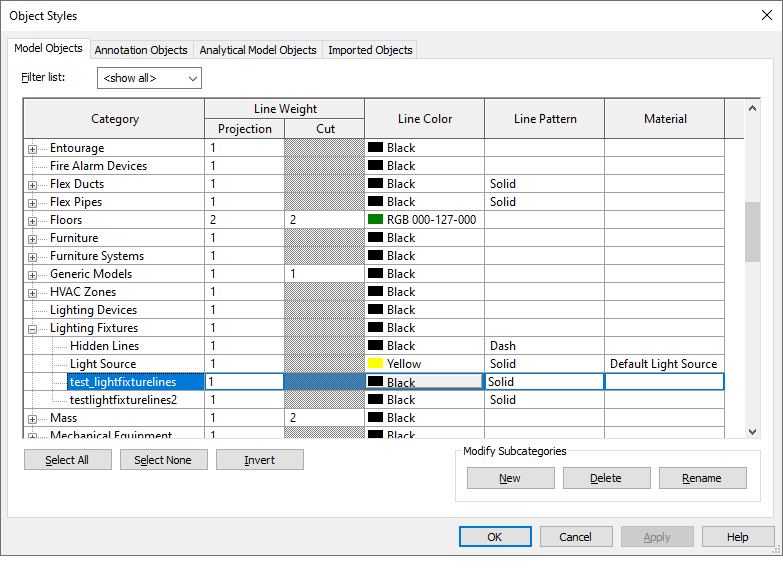

<head>
<meta http-equiv="Content-Type" content="text/html; charset=utf-8">
<link rel="stylesheet" type="text/css" href="bc.css">

</head>

<!---

- week of rest until ther twelfth night
  https://en.wikipedia.org/wiki/Twelfth_Night_(holiday)

- filter for detail lines
  Collect All Detail Lines of a Particular SubCategory
  https://forums.autodesk.com/t5/revit-api-forum/collect-all-detail-lines-of-a-particular-subcategory/td-p/9956260
  
- modification tracking
  https://data-shapes.io/2016/12/31/modification-tracking-with-dynamo-and-data-shapes
  Modification Tracking with Dynamo

- 17292711 [Most optimized way of getting a complete set of property categories and properties in a model.]
  
- new
  Node.js Best Practices
  https://github.com/goldbergyoni/nodebestpractices

-  old
  The early history of programming and the C language
  https://arstechnica.com/features/2020/12/a-damn-stupid-thing-to-do-the-origins-of-c/

twitter:

 the #RevitAPI @AutodeskForge @AutodeskRevit #bim #DynamoBim #ForgeDevCon 

&ndash; 
...

linkedin:

#bim #DynamoBim #ForgeDevCon #Revit #API #IFC #SDK #AI #VisualStudio #Autodesk #AEC #adsk 

the [Revit API discussion forum](http://forums.autodesk.com/t5/revit-api-forum/bd-p/160) thread

-->

### Happy New Year, NavisWorks and Modification Tracking

Happy New Year!

As always, there is lots going on in
the [Revit API discussion forum](http://forums.autodesk.com/t5/revit-api-forum/bd-p/160),
where Richard [RPThomas108](https://forums.autodesk.com/t5/user/viewprofilepage/user-id/1035859) Thomas
is providing tremendous help on all the really hard questions requiring both Revit API understanding and
in-depth product usage experience.

I played around a bit with the NavisWorks API in the week of rest and the peaceful time until 
the [twelfth night](https://en.wikipedia.org/wiki/Twelfth_Night_(holiday)),
and discovered a very nice Revit project modification tracking tool in Dynamo:

- [Filter for Detail Lines Subcategory](#2)
- [Revit Project Modification Tracking](#3)
- [Retrieving all NavisWorks Model Properties](#4)
- [Node.js Best Practices](#5)
- [Early History of Programming and C](#6)

#### Filter for Detail Lines Subcategory

One of the threads addressed by Richard is on filtering for detail lines,
to [collect all detail lines of a particular subcategory](https://forums.autodesk.com/t5/revit-api-forum/collect-all-detail-lines-of-a-particular-subcategory/td-p/9956260):

**Question:** From reading The Building Coder's post 
on [retrieving all available line styles](https://thebuildingcoder.typepad.com/blog/2013/08/retrieving-all-available-line-styles.html),
it is my understanding that detail line elements can be collected via FilteredElementCollector once a subcategory is selected.

I have a line style subcategory and would like to collect all the detail lines of that style.

How do I do that?

For context, I quote from the link above:

> While the Revit API does not provide a true 'Line style' element, the line styles are actually subcategories of the Lines category. Therefore, the FilteredElementCollector cannot easily be used for this in a single statement, like in your examples above. 

> It should be possible to retrieve the line styles without a line instance, though.

> Here’s a macro that lists all subcategories of the Lines category:

<pre class="code">
public&nbsp;void&nbsp;GetListOfLinestyles(&nbsp;Document&nbsp;doc&nbsp;)
{
&nbsp;&nbsp;Category&nbsp;c&nbsp;=&nbsp;doc.Settings.Categories.get_Item(
&nbsp;&nbsp;&nbsp;&nbsp;BuiltInCategory.OST_Lines&nbsp;);
 
&nbsp;&nbsp;CategoryNameMap&nbsp;subcats&nbsp;=&nbsp;c.SubCategories;
 
&nbsp;&nbsp;foreach(&nbsp;Category&nbsp;lineStyle&nbsp;in&nbsp;subcats&nbsp;)
&nbsp;&nbsp;{
&nbsp;&nbsp;&nbsp;&nbsp;TaskDialog.Show(&nbsp;&quot;Line&nbsp;style&quot;,&nbsp;string.Format(
&nbsp;&nbsp;&nbsp;&nbsp;&nbsp;&nbsp;&quot;Linestyle&nbsp;{0}&nbsp;id&nbsp;{1}&quot;,&nbsp;lineStyle.Name,
&nbsp;&nbsp;&nbsp;&nbsp;&nbsp;&nbsp;lineStyle.Id.ToString()&nbsp;)&nbsp;);
&nbsp;&nbsp;}
}
</pre>

> Note that some line styles like 'Room Boundary' cannot actually be assigned to arbitrary lines in the UI, but this should be good enough to find a usable one.

> Once you have a collection of the line style subcategories of interest, you can create a filtered element collector retrieving all ElementType elements belonging to any one of them.

**Answer:** For example, changing `OST_Lines` to `OST_LightFixtures` will find all the line subcategories of the light fixtures.

As you type in `BuiltInCategory`, you should get a list of all the subcategories you can use.

For instance, given the following object styles:

 <!-- 783 -->

Using `OST_LightFixtures` will return "Hidden Lines", "light Source", "test_lightfixturelines", and "testlightfixturelines2".

**Response:** Thanks for your reply. I don't quite understand your meaning.

I should clarify; I'm looking for the right way to use a Line Style subcategory in a FilteredElementCollector to grab all the detail lines in the project that are of that style. I don't actually use C#, that code is just from The Building Coder website, but I have gotten to the point in my code that I have the Line Style I want to filter with and now I would like to create a filtered element collector retrieving all ElementType elements belonging to that Line Style, using the Revit API.

**Answer:** If you aren't using C#, then what are you using?  Python?  Dynamo?  

**Response:** I can translate from anything to anything. Maybe what I'm asking to do isn't possible, I'm not sure.

Actually, I may have found something.

I looked up this older forum post
on [FilteredElementCollector -> get all instances except of category X](https://forums.autodesk.com/t5/revit-api-forum/filteredelementcollector-gt-get-all-instances-except-of-category/m-p/8571199):

<pre class="code">
&nbsp;&nbsp;FilteredElementCollector&nbsp;collector&nbsp;
&nbsp;&nbsp;&nbsp;&nbsp;=&nbsp;new&nbsp;FilteredElementCollector(&nbsp;doc&nbsp;);
 
&nbsp;&nbsp;ElementCategoryFilter&nbsp;fi&nbsp;
&nbsp;&nbsp;&nbsp;&nbsp;=&nbsp;new&nbsp;ElementCategoryFilter(&nbsp;
&nbsp;&nbsp;&nbsp;&nbsp;&nbsp;&nbsp;BuiltInCategory.OST_TitleBlocks,&nbsp;true&nbsp;);
 
&nbsp;&nbsp;ICollection&lt;Element&gt;&nbsp;collection
&nbsp;&nbsp;&nbsp;&nbsp;=&nbsp;collector.OfClass(&nbsp;typeof(&nbsp;FamilyInstance&nbsp;)&nbsp;)
&nbsp;&nbsp;&nbsp;&nbsp;&nbsp;&nbsp;.WherePasses(&nbsp;fi&nbsp;)
&nbsp;&nbsp;&nbsp;&nbsp;&nbsp;&nbsp;.ToElements();
</pre>

I used the ElementCategoryFilter but replaced the built-in category with my category (not built-in) and removed the .OfClass filter... although, it is collecting 23,000+ lines which doesn't seem right either, so maybe I need to apply another filter...

**Answer:** I believe it's a 3 step process.
You find all lines, then narrow those down to the Detail Lines, and then narrow those down to get the line style you want.

Add a new line style called "MyNewLineStyle" (match the caps exactly) and try something like this:

<pre class="code">
&nbsp;&nbsp;&nbsp;&nbsp;&nbsp;&nbsp;FilteredElementCollector&nbsp;collector
&nbsp;&nbsp;&nbsp;&nbsp;=&nbsp;new&nbsp;FilteredElementCollector(&nbsp;doc&nbsp;);
 
&nbsp;&nbsp;ElementCategoryFilter&nbsp;fi&nbsp;
&nbsp;&nbsp;&nbsp;&nbsp;=&nbsp;new&nbsp;ElementCategoryFilter(&nbsp;
&nbsp;&nbsp;&nbsp;&nbsp;&nbsp;&nbsp;BuiltInCategory.OST_GenericLines,&nbsp;true&nbsp;);
 
&nbsp;&nbsp;ICollection&lt;Element&gt;&nbsp;collection&nbsp;
&nbsp;&nbsp;&nbsp;&nbsp;=&nbsp;collector.OfClass(&nbsp;typeof(&nbsp;CurveElement&nbsp;)&nbsp;)
&nbsp;&nbsp;&nbsp;&nbsp;&nbsp;&nbsp;.WherePasses(&nbsp;fi&nbsp;)
&nbsp;&nbsp;&nbsp;&nbsp;&nbsp;&nbsp;.ToElements();
 
&nbsp;&nbsp;TaskDialog.Show(&nbsp;&quot;Number&nbsp;of&nbsp;curves&quot;,&nbsp;
&nbsp;&nbsp;&nbsp;&nbsp;collection.Count.ToString()&nbsp;);
 
&nbsp;&nbsp;List&lt;Element&gt;&nbsp;detail_lines&nbsp;=&nbsp;new&nbsp;List&lt;Element&gt;();
 
&nbsp;&nbsp;foreach(&nbsp;Element&nbsp;e&nbsp;in&nbsp;collection&nbsp;)
&nbsp;&nbsp;{
&nbsp;&nbsp;&nbsp;&nbsp;if(&nbsp;e&nbsp;is&nbsp;DetailLine&nbsp;)
&nbsp;&nbsp;&nbsp;&nbsp;{
&nbsp;&nbsp;&nbsp;&nbsp;&nbsp;&nbsp;detail_lines.Add(&nbsp;e&nbsp;);
&nbsp;&nbsp;&nbsp;&nbsp;}
&nbsp;&nbsp;}
 
&nbsp;&nbsp;TaskDialog.Show(&nbsp;&quot;Number&nbsp;of&nbsp;Detail&nbsp;Lines&quot;,&nbsp;
&nbsp;&nbsp;&nbsp;&nbsp;detail_lines.Count.ToString()&nbsp;);
 
&nbsp;&nbsp;List&lt;Element&gt;&nbsp;some_detail_lines&nbsp;=&nbsp;new&nbsp;List&lt;Element&gt;();
&nbsp;&nbsp;foreach(&nbsp;DetailLine&nbsp;dl&nbsp;in&nbsp;detail_lines&nbsp;)
&nbsp;&nbsp;{
&nbsp;&nbsp;&nbsp;&nbsp;if(&nbsp;dl.LineStyle.Name&nbsp;==&nbsp;&quot;MyNewLineStyle&quot;&nbsp;)
&nbsp;&nbsp;&nbsp;&nbsp;{
&nbsp;&nbsp;&nbsp;&nbsp;&nbsp;&nbsp;some_detail_lines.Add(&nbsp;dl&nbsp;);
&nbsp;&nbsp;&nbsp;&nbsp;}
&nbsp;&nbsp;}
 
&nbsp;&nbsp;TaskDialog.Show(&nbsp;
&nbsp;&nbsp;&nbsp;&nbsp;&quot;Number&nbsp;of&nbsp;Detail&nbsp;Lines&nbsp;of&nbsp;MyNewLineStyle&quot;,&nbsp;
&nbsp;&nbsp;&nbsp;&nbsp;some_detail_lines.Count.ToString()&nbsp;);
</pre>

**Answer:** Usually, it is easier to filter for objects of `GraphicsStyle` using `ElementClassFilter`, rather than subcategories of `OST_Lines`.

GraphicsStyle has a property GraphicsStyle.GraphicsStyleCategory.
When this is a subcategory of `OST_Lines`, then it relates to either ModelCurves or DetailCurves (note that GraphicsStyle.Category is null).

You can't use a class filter for DetailCurves and ModelCurves (which inherit from CurveElement).
This base class has the property LineStyle which will be one of the GraphicsStyle elements found above.

When you have items of `CurveElement`, you can distinguish between ModelCurves and DetailCurves as follows:

- DetailCurves have OwnerViewId <> ElementId.InvalidElementId
- ModelCurves have OwnerViewId = ElementId.InvalidElementId

So, you see one potential route is to filter for GraphicsStyles.

Filter again to find GraphicsStyle.GraphicsStyleCategory that is equal to your subcategory of lines.

Then, use this to find CurveElements that have such a CurveElement.LineStyle.

Finally, use CurveElement.OwnerViewId to list either ModelCurves or DetailCurves.

One simple way of getting valid GraphicsStyles for DetailCurves/ModelCurves is via CurveElement.GetLineStyleIds (there are many graphics styles that don't relate to lines).
Otherwise, check that GraphicsStyle.GraphicsStyleCategory is a subcategory of OST_Lines.

Example extension methods for getting CurveElements of a given subcategory of lines or matching a GraphicsStyle:

<pre class="code">
 <Extension()>
    Public Function GetLinesOfCategory(Doc As Document, GraphicsStyle As GraphicsStyle, DetailLines As Boolean, Optional FromView As View = Nothing) As List(Of CurveElement)
        Dim FEC As FilteredElementCollector = Nothing
        If FromView Is Nothing Then
            FEC = New FilteredElementCollector(Doc)
        Else
            FEC = New FilteredElementCollector(Doc, FromView)
        End If

        Dim ECF As New ElementCategoryFilter(BuiltInCategory.OST_Lines)
        Dim Els As List(Of CurveElement) = FEC.WherePasses(ECF).WhereElementIsNotElementType.ToElements _
            .Cast(Of CurveElement).Where(Function(x) x.LineStyle.Id = GraphicsStyle.Id _
            AndAlso (x.OwnerViewId <> ElementId.InvalidElementId) = DetailLines).ToList

        Return Els
    End Function

    <Extension()>
    Public Function GetLinesOfCategory(Doc As Document, Category As Category, DetailLines As Boolean, Optional FromView As View = Nothing) As List(Of CurveElement)

        Dim FECgs As New FilteredElementCollector(Doc)
        Dim ECFgs As New ElementClassFilter(GetType(GraphicsStyle))
        Dim Gs As List(Of GraphicsStyle) = FECgs.WherePasses(ECFgs).ToElements _
            .Cast(Of GraphicsStyle).Where(Function(x) x.GraphicsStyleCategory.Id = Category.Id).ToList

        If Gs.Count = 0 Then Return New List(Of CurveElement) Else

        Return GetLinesOfCategory(Doc, Gs(0), DetailLines, FromView)
    End Function
</pre>

I should also say you could probably use:

- FilteredElementCollector.WhereElementIsViewIndependent

In combination with `.Excluding` to find ModelCurves and exclude them from your DetailCurves.

I.e., filtering this way first will be quicker, since it happens at lower level prior to Linq, but you don't have millions of these elements to sort through anyway.

Also, there is a standard filter for detail/model lines: the `CurveElementFilter`:

<pre class="code">
&nbsp;&nbsp;&nbsp;&nbsp;&nbsp;&nbsp;Category&nbsp;targetLineStyle;
 
&nbsp;&nbsp;IEnumerable&lt;GraphicsStyle&gt;&nbsp;gstyles&nbsp;
&nbsp;&nbsp;&nbsp;&nbsp;=&nbsp;new&nbsp;FilteredElementCollector(&nbsp;doc&nbsp;)
&nbsp;&nbsp;&nbsp;&nbsp;&nbsp;&nbsp;.OfClass(&nbsp;typeof(&nbsp;GraphicsStyle&nbsp;)&nbsp;)
&nbsp;&nbsp;&nbsp;&nbsp;&nbsp;&nbsp;.Cast&lt;GraphicsStyle&gt;()
&nbsp;&nbsp;&nbsp;&nbsp;&nbsp;&nbsp;.Where(&nbsp;gs&nbsp;=&gt;&nbsp;gs.GraphicsStyleCategory.Id.IntegerValue&nbsp;
&nbsp;&nbsp;&nbsp;&nbsp;&nbsp;&nbsp;&nbsp;&nbsp;==&nbsp;targetLineStyle.Id.IntegerValue&nbsp;);
 
&nbsp;&nbsp;ElementId&nbsp;targetGraphicsStyleId&nbsp;
&nbsp;&nbsp;&nbsp;&nbsp;=&nbsp;gstyles.FirstOrDefault().Id;
 
&nbsp;&nbsp;CurveElementFilter&nbsp;filter_detail&nbsp;
&nbsp;&nbsp;&nbsp;&nbsp;=&nbsp;new&nbsp;CurveElementFilter(&nbsp;
&nbsp;&nbsp;&nbsp;&nbsp;&nbsp;&nbsp;CurveElementType.DetailCurve&nbsp;);
 
&nbsp;&nbsp;FilterRule&nbsp;frule_typeId&nbsp;
&nbsp;&nbsp;&nbsp;&nbsp;=&nbsp;ParameterFilterRuleFactory.CreateEqualsRule(&nbsp;
&nbsp;&nbsp;&nbsp;&nbsp;&nbsp;&nbsp;new&nbsp;ElementId(&nbsp;
&nbsp;&nbsp;&nbsp;&nbsp;&nbsp;&nbsp;&nbsp;&nbsp;BuiltInParameter.BUILDING_CURVE_GSTYLE&nbsp;),&nbsp;
&nbsp;&nbsp;&nbsp;&nbsp;&nbsp;&nbsp;targetGraphicsStyleId&nbsp;);
 
&nbsp;&nbsp;ElementParameterFilter&nbsp;filter_type&nbsp;
&nbsp;&nbsp;&nbsp;&nbsp;=&nbsp;new&nbsp;ElementParameterFilter(&nbsp;
&nbsp;&nbsp;&nbsp;&nbsp;&nbsp;&nbsp;new&nbsp;List&lt;FilterRule&gt;()&nbsp;{&nbsp;frule_typeId&nbsp;}&nbsp;);
 
&nbsp;&nbsp;IEnumerable&lt;Element&gt;&nbsp;lines&nbsp;
&nbsp;&nbsp;&nbsp;&nbsp;=&nbsp;new&nbsp;FilteredElementCollector(&nbsp;doc&nbsp;)
&nbsp;&nbsp;&nbsp;&nbsp;&nbsp;&nbsp;.WhereElementIsNotElementType()
&nbsp;&nbsp;&nbsp;&nbsp;&nbsp;&nbsp;.WhereElementIsCurveDriven()
&nbsp;&nbsp;&nbsp;&nbsp;&nbsp;&nbsp;.WherePasses(&nbsp;filter_detail&nbsp;)
&nbsp;&nbsp;&nbsp;&nbsp;&nbsp;&nbsp;.WherePasses(&nbsp;filter_type&nbsp;);
</pre>

**Response:** Great solutions here, thank you so much!

#### Revit Project Modification Tracking

Jacob Small shared a powerful collection of nodes
for [Modification Tracking with Dynamo](https://data-shapes.io/2016/12/31/modification-tracking-with-dynamo-and-data-shapes) that
might come in useful for you too.  

#### Retrieving all NavisWorks Model Properties

I handled my first NavisWorks .NET API programming ticket, *17292711 &ndash; Most optimized way of getting a complete set of property categories and properties in a model*, and discussed the best approach in depth with the NW development team.

**Question:** When loading an NWD into Navisworks it appears that the categories and properties for all of the items are loaded almost right away when looking at the selection tree. When obtaining this information programmatically it appears it can take much longer. Currently the approach I am using is something like the following:

<pre class="code">
  // iterate over each item in model
  foreach (var item in model.RootItem.DescendantsAndSelf)
  {
    // iterate over each category per item
    foreach (var category in item.PropertyCategories)
    {
      // iterate over each property per category
      foreach (var property in category.Properties)
      {
        // get value/name etc.
        var propName = prop.DisplayName;
        var value = prop.Value;
      }
    }
  }
</pre>

Is there a way that the properties and categories can be programmatically loaded faster?

Is this information cached somewhere? If so, is there a way to access it instead of loading it myself?

Would it be better to use the COM API for performance?

[A] Sadly, there isn't any faster way of reading all the properties using the .NET API.
My little Properties+ tool has to spend a long time searching for properties, but at least it does pop up a progress bar, so that is something the customer could consider doing as well.

We did think about overhauling how we handle properties for NW 2022, but that didn't make the cut. It's possible we might do something for 2023, but no firm plans as of right now.

The code does basically what they are doing, and then just caches the results locally.

Only difference is, it reports progress as well.

There isn’t anything special or confidential about this code, so, as far as I’m concerned, you’re welcome to share it with the customer:

<pre class="code">
public&nbsp;void&nbsp;Update()
{
&nbsp;&nbsp;if(&nbsp;Nw.Application.MainDocument&nbsp;!=&nbsp;null&nbsp;)
&nbsp;&nbsp;{
&nbsp;&nbsp;&nbsp;&nbsp;Nw.Search&nbsp;s&nbsp;=&nbsp;new&nbsp;Nw.Search();
 
&nbsp;&nbsp;&nbsp;&nbsp;s.SearchConditions.Add(&nbsp;
&nbsp;&nbsp;&nbsp;&nbsp;&nbsp;&nbsp;Nw.SearchCondition.HasCategoryByName(&nbsp;
&nbsp;&nbsp;&nbsp;&nbsp;&nbsp;&nbsp;&nbsp;&nbsp;Nw.PropertyCategoryNames.Item&nbsp;)&nbsp;);
 
&nbsp;&nbsp;&nbsp;&nbsp;s.Selection.SelectAll();
&nbsp;&nbsp;&nbsp;&nbsp;s.Locations&nbsp;=&nbsp;Nw.SearchLocations.DescendantsAndSelf;
&nbsp;&nbsp;&nbsp;&nbsp;s.PruneBelowMatch&nbsp;=&nbsp;false;
 
&nbsp;&nbsp;&nbsp;&nbsp;Nw.ModelItemCollection&nbsp;allItems&nbsp;=&nbsp;s.FindAll(&nbsp;
&nbsp;&nbsp;&nbsp;&nbsp;&nbsp;&nbsp;Nw.Application.MainDocument,&nbsp;true&nbsp;);
 
&nbsp;&nbsp;&nbsp;&nbsp;Nw.Progress&nbsp;prog&nbsp;=&nbsp;Nw.Application.BeginProgress(&nbsp;
&nbsp;&nbsp;&nbsp;&nbsp;&nbsp;&nbsp;&quot;Building&nbsp;Property&nbsp;Cache&quot;&nbsp;);
 
&nbsp;&nbsp;&nbsp;&nbsp;int&nbsp;done&nbsp;=&nbsp;0;
&nbsp;&nbsp;&nbsp;&nbsp;int&nbsp;total&nbsp;=&nbsp;allItems.Count;
&nbsp;&nbsp;&nbsp;&nbsp;foreach(&nbsp;Nw.ModelItem&nbsp;item&nbsp;in&nbsp;allItems&nbsp;)
&nbsp;&nbsp;&nbsp;&nbsp;{
&nbsp;&nbsp;&nbsp;&nbsp;&nbsp;&nbsp;foreach(&nbsp;Nw.PropertyCategory&nbsp;cat&nbsp;in&nbsp;item.PropertyCategories&nbsp;)
&nbsp;&nbsp;&nbsp;&nbsp;&nbsp;&nbsp;{
&nbsp;&nbsp;&nbsp;&nbsp;&nbsp;&nbsp;&nbsp;&nbsp;foreach(&nbsp;Nw.DataProperty&nbsp;data&nbsp;in&nbsp;cat.Properties&nbsp;)
&nbsp;&nbsp;&nbsp;&nbsp;&nbsp;&nbsp;&nbsp;&nbsp;{
&nbsp;&nbsp;&nbsp;&nbsp;&nbsp;&nbsp;&nbsp;&nbsp;&nbsp;&nbsp;m_props.Add(&nbsp;new&nbsp;PropertyDefinition(&nbsp;cat.Name,&nbsp;
&nbsp;&nbsp;&nbsp;&nbsp;&nbsp;&nbsp;&nbsp;&nbsp;&nbsp;&nbsp;&nbsp;&nbsp;data.Name,&nbsp;cat.DisplayName,&nbsp;data.DisplayName&nbsp;)&nbsp;);
&nbsp;&nbsp;&nbsp;&nbsp;&nbsp;&nbsp;&nbsp;&nbsp;}
&nbsp;&nbsp;&nbsp;&nbsp;&nbsp;&nbsp;}
&nbsp;&nbsp;&nbsp;&nbsp;&nbsp;&nbsp;++done;
&nbsp;&nbsp;&nbsp;&nbsp;&nbsp;&nbsp;double&nbsp;percent&nbsp;=&nbsp;(double)&nbsp;done&nbsp;/&nbsp;(double)&nbsp;total;
&nbsp;&nbsp;&nbsp;&nbsp;&nbsp;&nbsp;if(&nbsp;prog.Update(&nbsp;percent&nbsp;)&nbsp;==&nbsp;false&nbsp;)
&nbsp;&nbsp;&nbsp;&nbsp;&nbsp;&nbsp;{
&nbsp;&nbsp;&nbsp;&nbsp;&nbsp;&nbsp;&nbsp;&nbsp;break;
&nbsp;&nbsp;&nbsp;&nbsp;&nbsp;&nbsp;}
&nbsp;&nbsp;&nbsp;&nbsp;}
&nbsp;&nbsp;&nbsp;&nbsp;Nw.Application.EndProgress();
&nbsp;&nbsp;}
&nbsp;&nbsp;m_cacheValid&nbsp;=&nbsp;true;
}
</pre>

**Question:** I see that it stores a `PropertyDefinition` for each property encountered, encapsulating the `Name` and `DisplayName` of the category and data items. So, it does not care about the data value.

In a different vein, don’t some objects in the model duplicate others, and their properties as well? Wouldn’t it make sense to identify such objects and reuse the existing data for those? Or is that hard, or impossible?

[A] That code only wants a list of properties, so it doesn't care about the actual values.
And, yes, some objects are duplicates of others, but optimising for that probably won't make much difference.

Summary:

- Use the progress bar
- Cache the results

#### Node.js Best Practices

Talking about new non-Revit programming environments, one of the most important topics nowadays is of course [node.js](https://nodejs.org).

For that, I happened upon a really great collection of [Node.js Best Practices](https://github.com/goldbergyoni/nodebestpractices).

This constitutes an invaluable collection of information, and also shows an exemplary solution to present it optimally.

#### Early History of Programming and C

Talking about the other and the new, lets not forget to old, either;
for instance, by taking a look
at [the early history of programming and the C language](https://arstechnica.com/features/2020/12/a-damn-stupid-thing-to-do-the-origins-of-c).

