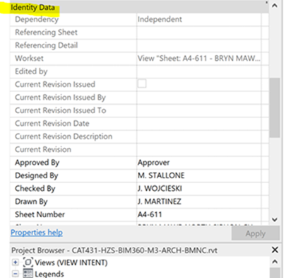

<head>
<meta http-equiv="Content-Type" content="text/html; charset=utf-8">
<link rel="stylesheet" type="text/css" href="bc.css">

</head>

<!---

- 8252 [Autodesk support]

- Forge at AU video links
  Sanjana Chand <sanjana.chand@autodesk.com>

- https://github.com/va3c/RvtVa3c/issues/18#issuecomment-748546481

 
twitter:

Forge at AU and open source property access with #JavaScript and the #RevitAPI @AutodeskForge @AutodeskRevit #bim #DynamoBim #ForgeDevCon http://autode.sk/forgeopensourceproperty

Today, we take a look at a fix for the RvtVa3c custom exporter and a Forge issue related to Revit property access
&ndash; Pull metadata from RVT in BIM 360
&ndash; Forge at AU class recordings 
&ndash; RvtVa3c updated and issues fixed...

linkedin:

Forge at AU and open source property access with #JavaScript and the #RevitAPI 

http://autode.sk/forgeopensourceproperty

Today, we take a look at a fix for the RvtVa3c custom exporter and a Forge issue related to Revit property access:

- Pull metadata from RVT in BIM 360
- Forge at AU class recordings 
- RvtVa3c updated and issues fixed...

#bim #DynamoBim #ForgeDevCon #Revit #API #IFC #SDK #AI #VisualStudio #Autodesk #AEC #adsk 

the [Revit API discussion forum](http://forums.autodesk.com/t5/revit-api-forum/bd-p/160) thread

-->

### Forge at AU and Open Source Property Access

Many thanks to all the numerous brilliant contributors to
the [Revit API discussion forum](http://forums.autodesk.com/t5/revit-api-forum/bd-p/160),
above all, during the past weeks,
Richard [RPThomas108](https://forums.autodesk.com/t5/user/viewprofilepage/user-id/1035859) Thomas,
continuing to provide tremendous help on the hard questions requiring both Revit API understanding and in-depth product usage experience.

Meanwhile, for today, let's take a quick look at a fix for the RvtVa3c custom exporter and a Forge issue related to Revit property access:

- [Pull metadata from RVT in BIM 360](#2)
- [Forge at AU class recordings](#3)
- [RvtVa3c updated and issues fixed](#4)

#### Pull Metadata from RVT in BIM 360

**Question:** I am looking for a way to pull metadata from all the Revit files that live in BIM 360 using Forge to then represent it on PowerBi.
I looked at a previous suggestion on using the Design Automation API but was unable to use that because it requires `ngrok`, which is not approved by my company.
Also, as far as I can tell from the [forge-customproperty-revit](https://github.com/augustogoncalves/forge-customproperty-revit) documentation on extracting compound layer information with the Revit engine, it would have to go to each file, one by one, to extract this meta data.

However, I can see the required data with the model viewer API. I was informed that even though I could view it, I would not be able to extract it using that API.

The data lives in Revit with in the sheet properties, in the section labeled identity data:

 <!-- 405 -->

**Answer:** Two quick comments off-hand:

First, I find it hard to believe that the Design Automation API requires `ngrok`. At least, I have never heard of such a requirement.

Secondly, and more to the point: the Forge viewer is basically open source.
Everything that you can see in the viewer is available in the browser JavaScript environment.
If you can see something in the viewer, you can access it yourself via JavaScript.

Conclusion: You can solve your task using JavaScript in the viewer.
There is no need for the Design Automation API.

**Response:** Correct, the Design Automation API doesn’t need ngrok.
I meant to say that it was needed for the example in the link that I included that Forge Support suggested using as a starting point.
Sorry for the confusion.

As for the Viewer API, I previously asked someone from a Forge program and they informed me that I would be able to see it but not extract it because that isn’t built into the API.

So, you’re saying if I manipulate the JavaScript in the Viewer API I would be able to automate and extract the fields I need within every Revit file on the project?

**Answer:** Yes indeed, afaik, you can use JavaScript in the Viewer API to access and manipulate all the model data, with no restriction, obviously also covering the fields within the Revit model you are interested in.

For safety's sake, I asked my more knowledgeable colleagues to confirm.
The development team confirmed my original statement:

**Question:** Can you please confirm (or not) one basic statement that I like making on JavaScript access to model data in the Forge Viewer: afaik, *you can use JavaScript in the Viewer API to access and manipulate all the model data, with no restriction*, obviously also covering the Revit sheet property identity data fields within the Revit model you are interested in. True or False?

**Answer:** You can find the correct statement inside the `viewer3d.js` source file:

> Autodesk Forge Viewer Usage Limitations:

> The Autodesk Forge viewer can only be used to view files generated by Autodesk Forge services.
The Autodesk Forge Viewer JavaScript must be delivered from an Autodesk hosted URL.

The same text is available in the documentation, at the bottom of the [developer guide overview](https://forge.autodesk.com/en/docs/viewer/v7/developers_guide/overview).

**Response:** Thank you for that clarification.

However, it does not answer my question.

My question is: are all model properties that can be seen in the viewer also accessible via JavaScript?
My assumption is YES.
Is that correct?

**Answer:** Yes, using
the [`GET Properties` endpoint](https://forge.autodesk.com/en/docs/model-derivative/v2/reference/http/urn-metadata-guid-properties-GET).

Furthermore, all properties can be accessed directly via JavaScript using `model.getProperties(elementID)`.

They cannot be modified, the viewer (being a viewer) is read-only.

If the model is already loaded, it is better to use the JS API directly, rather than the Forge REST API, because all properties are automatically downloaded by the viewer and available locally to the JS context.

Conclusion, yet again, expanded and reinforced: you can use JavaScvript to access all properties visible in the Forge viewer.

Doing so will save you time, effort  and money:

- The properties are all already loaded
- There is no need for additional Forge REST API programming effort
- There are no Forge DA4R workitem costs associated

#### Forge at AU

In case you would like to dive in a bit deeper into Forge today, the full articles and video recordings of the Forge classes at AU classes are available online for your convenience and enjoyment;
here are links to the Forge community blog articles and YouTube recordings:

- [Forge for Construction](https://forge.autodesk.com/blog/forge-construction-au-continuous-learning) &ndash; [recording](https://youtu.be/UKp7Dh_-usU)
- [Forge for Manufacturing](https://forge.autodesk.com/blog/forge-manufacturing-au-continuous-learning) &ndash; [recording](https://youtu.be/Kh_x_WtWITg)
- [Forge for Building Design](https://forge.autodesk.com/blog/forge-building-design-au-continuous-learning) &ndash; [recording](https://youtu.be/FFQdgEmFAxY)
- [Forge for Civil Infrastructure](https://forge.autodesk.com/blog/forge-civil-infrastructure-au-continuous-learning) &ndash; [recording](https://youtu.be/bKlgSl60m_0)
- [Forge Hackathon Showcase](https://forge.autodesk.com/blog/congrats-winners-forge-hackathon) &ndash; [recording](https://youtu.be/szsBtcYULuU)
- [Forge Fire Faceoff](https://forge.autodesk.com/blog/forge-fire-faceoff-exclusively-autodesk-university) &ndash; [recording](https://youtu.be/ma1ImLjtrJ0)

#### RvtVa3c Updated and Issues Fixed

[Jake Staub](https://github.com/jpstaub) raised an issue
with [RvtVa3c](https://github.com/va3c/RvtVa3c), 
a Revit custom exporter add-in generating JSON output for the vA3C three.js AEC viewer:
[Issue #18 &ndash; Filter parameters error in Revit 2020](https://github.com/va3c/RvtVa3c/issues/18).

The error was easy to fix, presumably also
resolving [Issue #17 &ndash; Error In Revit 2019](https://github.com/va3c/RvtVa3c/issues/17),
and also prompting me to update the project to Revit 2021.

Many thanks to Jake for raising the issue and confirming the fix.
