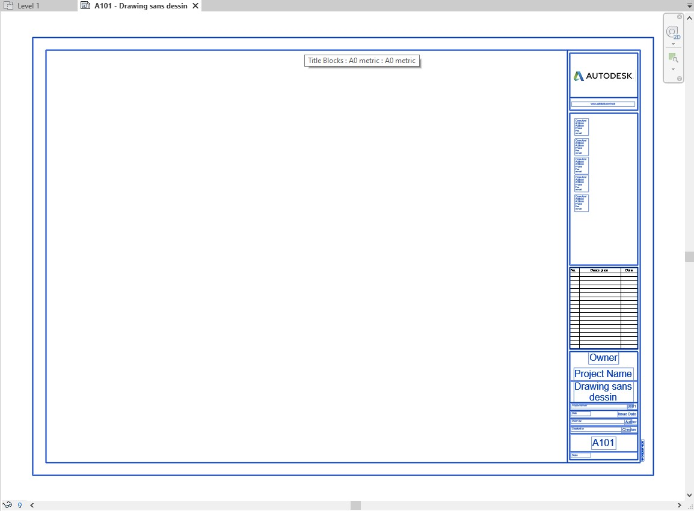

<head>
<meta http-equiv="Content-Type" content="text/html; charset=utf-8">
<link rel="stylesheet" type="text/css" href="bc.css">

</head>

<!---

- how to extract the geometry and the texts of the title block in a sheetview?
  https://forums.autodesk.com/t5/revit-api-forum/how-to-extract-the-geometry-and-the-texts-of-the-title-block-in/m-p/9998687
  /a/doc/revit/tbc/git/a/img/pm_sheet_view_text_geom.jpg
  [XPS or the Open XML Paper Specification] https://en.wikipedia.org/wiki/Open_XML_Paper_Specification

- The human side of AI for chess
  https://www.microsoft.com/en-us/research/blog/the-human-side-of-ai-for-chess/

- An Engineering Argument for Basic Income
  https://scottsantens.com/engineering-argument-for-unconditional-universal-basic-income-ubi-fault-tolerance-graceful-failure-redundancy
  Utilizing fault-tolerant design in critical life support systems

- Assessing Mandatory Stay‐at‐Home and Business Closure Effects on the Spread of COVID‐19
  https://onlinelibrary.wiley.com/doi/10.1111/eci.13484

- Stanford Studie mit Top Medizin-Wissenschaftler Ioannidis zeigt keinen Nutzen von Lockdowns
  https://tkp.at/2021/01/11/stanford-studie-mit-top-medizin-wissenschaftler-ioannidis-zeigt-keinen-nutzen-von-lockdowns/

twitter:

 the #RevitAPI @AutodeskForge @AutodeskRevit #bim #DynamoBim #ForgeDevCon 

&ndash; 
...

linkedin:

#bim #DynamoBim #ForgeDevCon #Revit #API #IFC #SDK #AI #VisualStudio #Autodesk #AEC #adsk 

the [Revit API discussion forum](http://forums.autodesk.com/t5/revit-api-forum/bd-p/160) thread

-->

### Title Block Geometry and Text

#### Transient Graphics

Here is an answer I put together to address 
the [Revit API discussion forum](http://forums.autodesk.com/t5/revit-api-forum/bd-p/160) thread
on [how to draw transient graphics in Revit](https://forums.autodesk.com/t5/revit-api-forum/how-to-draw-transient-graphics-in-revit/m-p/10000065):

**Question:** I want to draw 2D texts in a view, like Transient Graphics in AutoCAD.
These texts draw upon all model elements and will not adapt their size when scaling the view.
This can be applied to a situation such as when the grid names are outside of the view, the texts representing the grids display at the edge of view, so the user can easily know the current position while modeling.

**Answer:** Two pieces of Revit API functionality come to mind: the older [Analysis Visualisation Framework or AVF](https://thebuildingcoder.typepad.com/blog/avf) and the more recent DirectContext3D.

AVF is designed for displaying structural and other analysis results on the BIM element faces.
The Building Coder has presented numerous examples in the past, starting with the decade-old [Revit webcam](https://thebuildingcoder.typepad.com/blog/2012/02/revit-webcam-2012.html).

DirectContext3D is for displaying external graphics in the context of a Revit model:

- The [`IDirectContext3DServer` interface](https://www.revitapidocs.com/2020/7709521d-9954-ef80-1f13-3bc6ee660d5d.htm) for
displaying arbitrary 3D graphics in Revit, [introduced in Revit 2018](https://thebuildingcoder.typepad.com/blog/2017/04/whats-new-in-the-revit-2018-api.html#3.26)
- The [DuplicateGraphics SDK sample](https://thebuildingcoder.typepad.com/blog/2017/05/revit-2017-and-2018-sdk-samples.html#4.2) demonstrates
basic usage
- How to [draw or render over the active view](https://forums.autodesk.com/t5/revit-api-forum/draw-render-over-the-activeview/m-p/7074503)
- [DirectContext Rectangle Jig](https://thebuildingcoder.typepad.com/blog/2020/10/onbox-directcontext-jig-and-no-cdn.html#3) example
- [IDirectContext3DServer and scene size](https://forums.autodesk.com/t5/revit-api-forum/idirectcontext3dserver-and-scene-size/m-p/9939322)

For your use case, however, I can well imagine that a simpler and more effective solution can be implemented independently of Revit and its API, by making use of the native Windows API or .NET libraries.
However, that lies outside my area of extertise, so I have no specific advice to offer in that area.
Maybe you can simply use the [`DrawText` function from `winuser.h`](https://docs.microsoft.com/en-us/windows/win32/api/winuser/nf-winuser-drawtext).

#### Extracting Title Block Geometry and Text

Here is an in-depth look at accessing, extracting and exporting title block geometry and text from 
the [Revit API discussion forum](http://forums.autodesk.com/t5/revit-api-forum/bd-p/160) thread
on [how to extract the geometry and the texts of the title block in a sheetview](https://forums.autodesk.com/t5/revit-api-forum/how-to-extract-the-geometry-and-the-texts-of-the-title-block-in/m-p/9998687),
with several very interesting insights provided once again by 
Richard [RPThomas108](https://forums.autodesk.com/t5/user/viewprofilepage/user-id/1035859) Thomas,
e.g., an interesting possibility of programmatically exploiting the Revit print to `XPS` functionality:

**Question:** I want to extract all visible text and geometry in this image of a sheet view with its title block, including correct placement of all attributes:

 <!-- 1154 -->

To be more precise, I want to recreate an identical representation of the sheet view in my own exportable non-Revit document.

**Answer:** If you want to access the text and visible geometry to recreate a facsimile outside of Revit, you might be able to access text and geometry separately, e.g., using a filtered element collector for real data and a screen snapshot for the appearance.

Most of the the text data can be accessed using built-in parameters.

The Title Block is a Revit family, so its geometry can be accessed by reading it from the family definition.

You can Filter for specific elements and retrieve their parameters, e.g., using:

<pre class="code">
FilteredElementCollector collector = new FilteredElementCollector(document);
ICollection<Element> lines = collector.OfClass(typeof(FamilyInstance)).OfCategory(BuiltInCategory.OST_Lines).ToElements();
ICollection<Element> texts = collector.OfClass(typeof(FamilyInstance)).OfCategory(BuiltInCategory.OST_TextNotes).ToElements();
ICollection<Element> filledRegions = collector.OfClass(typeof(FamilyInstance)).OfCategory(BuiltInCategory.OST_FilledRegion).ToElements();
//etc.
</pre>

**Response:** Yes, I want to create a facsimile outside of Revit.

I managed to extract the content of the views that compose it but at real size and not yet find how to extract the cartridge and its content.

The solution you suggest above does not work, the filtered element collector result lists are empty.

**Answer:** As always, you can use RevitLookup to analyse the properties and other attributes of the Revit elements you are trying to retrieve with the filtered element collector.
That will show you which filters you need to apply to extract the desired elements.
If the filter returns no elements, you are applying too restrictive or downright erroneous filters.

**Response:** On the FamilyInstance of my ViewSheet, it finds neither `OST_Lines` nor `OST_TextNodes` (for the extract the Title Block).

Do you have a filter syntax that could find them ?

**Answer:** The most efficient way to define such a filter is for you to pick the elements you are filtering for and explore their properties using RevitLookup, cf., [how to research to find a Revit API solution](https://thebuildingcoder.typepad.com/blog/2017/01/virtues-of-reproduction-research-mep-settings-ontology.html#3).

**Response:** I have already explored the viewsheet and the associated family instance as well as the symbol and the family.
None has geometry.

**Answer:** The family definition document of the title block will contain the geometry.
You have to open the family for editing.
It may have various nested annotation symbols that also need to be traversed.

Besides that, there is the issue of items such as images and schedules.

It would probably be easier to read the fixed document sequence of a printed `xps` file, cf.,
[XPS or the Open XML Paper Specification](https://en.wikipedia.org/wiki/Open_XML_Paper_Specification).

This is an XML file containing path data represented in a mini language similar to what you get in `Xaml` and 'Glyphs' entries for text objects with render transforms to give their positions.
It takes a while to print an XPS, but if it is only the title block, it may be quicker.
You would still have to interpret the xml, but, as difficult to impossible tasks go, it is slightly less impossible.

`XPS` is a `zip` file; change the extension to `Zip` and unpack it, or, alternatively, there are namespaces for reading packages for such directly (System.IO.Packaging).

I don't envy your task, I usually just print a `pdf` when I want a copy of something.

`HPGL` is another historic plotter vector format that could be easily interpreted.

**Response:** My project is to export a viewsheet in `svg` format.
Currently, my code correctly exports all viewports, but I still have the title block (drawing and data) to export.
If I understand correctly, there is no way to export the title block (curve and position of the data)?

**Answer:** As you've noted, `Element.Geometry` is null for title blocks.

The only approach I know of with the Revit API would be to open the title block family using `Document.EditFamily` and extract such lines from the plan view within that. As noted above, however, this family could also contain revision schedule that you can't extract lines from and other nested generic annotation families and images. The parameter text values would not be correct, but from the text strings used in Labels and parameter names you can sometimes infer such a relationship (between text locations in your title block family and positions on your ViewSheet in the project). If label has a preview parameter value (which is often the case), then this can't be done. Also, the placement of multiple parameters with line breaks etc. in the same label add to complexity. You don't get a description of these with the API (which parameters used in which label).

Ideally, this task would be suited to `CustomExporter`, but I believe from previous discussions that this doesn't support ViewSheets.

`XLST` could potentially be used to convert the `XPS` path data previously noted to `SVG`, although I know of no existing templates for such.

Another potential long winded option would be to export the sheet with only the title block showing to `DWG` and import that on a drafting view to analyse the geometry. Not sure it is a good option, but could be done. DWG links favour polylines: any lines of the same layer joined together will be grouped into polylines. Text object positions could only be found by exploding the dwg (not sure if there is API function for that).

####

#### 
