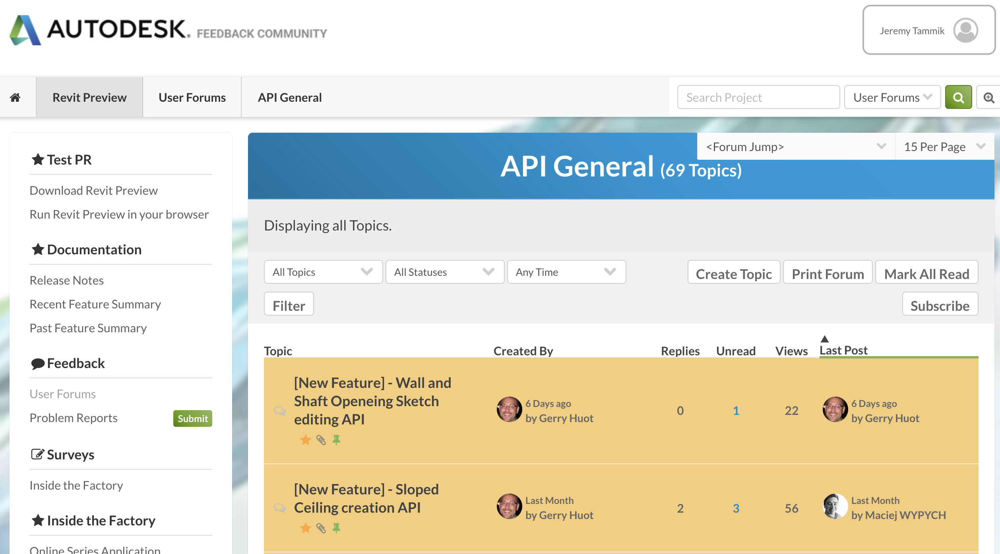

<head>
<meta http-equiv="Content-Type" content="text/html; charset=utf-8">
<link rel="stylesheet" type="text/css" href="bc.css">

</head>

<!---

twitter:

 #RevitAPI @AutodeskForge @AutodeskRevit #bim #DynamoBim #ForgeDevCon 

&ndash; 
...

linkedin:

#bim #DynamoBim #ForgeDevCon #Revit #API #IFC #SDK #AI #VisualStudio #Autodesk #AEC #adsk

the [Revit API discussion forum](http://forums.autodesk.com/t5/revit-api-forum/bd-p/160) thread

-->

### Sketch-Based Creation and Editing API Preview

The wish to be able to programmatically access and modify sketch-based elements is long-standing and was voiced back in 2013 in
the [Revit API discussion forum](http://forums.autodesk.com/t5/revit-api-forum/bd-p/160) thread
on [editing an existing slab boundary](https://forums.autodesk.com/t5/revit-api-forum/edit-existing-slab-boundary/m-p/10014819).

Oleg Sheydvasser, Software Architect in the Revit development team, just joined that conversation to announce an invitation to take a look at the preview of the upcoming next release of Revit, which offers several new sketch-based element creation and editing APIs:

- <a href="https://feedback.autodesk.com/project/forum/thread.html?cap=cb0fd5af18bb49b791dfa3f5efc47a72&amp;forid=%7b057e532f-e478-43d9-affc-01b3deb82a76%7d&amp;topid=%7b41E11E18-938F-4260-8190-3C3227B9C5FA%7d">Ceiling creation API</a>
- <a href="https://feedback.autodesk.com/project/forum/thread.html?cap=cb0fd5af18bb49b791dfa3f5efc47a72&amp;forid=%7b057e532f-e478-43d9-affc-01b3deb82a76%7d&amp;topid=%7b2B45F2E2-F58F-4FC3-9518-50D8E34C4394%7d">Sloped Ceiling creation API</a>
- <a href="https://feedback.autodesk.com/project/forum/thread.html?cap=cb0fd5af18bb49b791dfa3f5efc47a72&amp;forid=%7b057e532f-e478-43d9-affc-01b3deb82a76%7d&amp;topid=%7b1A358CD2-1C43-457E-A680-9F2DD81E3555%7d">Floor creation API</a>
- <a href="https://feedback.autodesk.com/project/forum/thread.html?cap=cb0fd5af18bb49b791dfa3f5efc47a72&amp;forid=%7b057e532f-e478-43d9-affc-01b3deb82a76%7d&amp;topid=%7bAE88ED3F-7EF9-4D0C-B599-E45BD5754DCA%7d">Get Sketch elements API</a>
- <a href="https://feedback.autodesk.com/project/forum/thread.html?cap=cb0fd5af18bb49b791dfa3f5efc47a72&amp;forid=%7b057e532f-e478-43d9-affc-01b3deb82a76%7d&amp;topid=%7b9C3D609F-0A86-4766-BB12-6315F49BCF03%7d">Sketch Edit Mode API</a>
- <a href="https://feedback.autodesk.com/project/forum/thread.html?cap=cb0fd5af18bb49b791dfa3f5efc47a72&amp;forid=%7b057e532f-e478-43d9-affc-01b3deb82a76%7d&amp;topid=%7bBD054C86-FFAA-442F-88D0-CAEFA1D89221%7d">Floor Sketch editing API</a>
- <a href="https://feedback.autodesk.com/project/forum/thread.html?cap=cb0fd5af18bb49b791dfa3f5efc47a72&amp;forid=%7b057e532f-e478-43d9-affc-01b3deb82a76%7d&amp;topid=%7bF15302E9-CC66-4BB3-8168-23D615E94558%7d">Wall and Shaft Opening Sketch editing API</a>

To join the Revit Preview program, please [email revit.preview.access@autodesk.com](mailto:revit.preview.access@autodesk.com).

I am looking forward to seeing you there, and the Revit development team is looking forward to your feedback on these new powerful programming possibilities.

Richard [RPThomas108](https://forums.autodesk.com/t5/user/viewprofilepage/user-id/1035859) Thomas already shared a first reaction: 

> Those titles look like exciting additions to the API.
If they provide stable functionality of the form noted in the titles then I would consider them to be a major step forward in API functionality (regardless of what lengths I need to go to in using them).

> Currently there are things we cannot do with the API.
When we have a situation where everything geometry wise done in the UI can be done in the API then that is the starting point for me, especially considering increasing Forge use etc.
Those items seem like a great step forward towards that aim.

> Now we just need to find out how to create and edit a scope box...

 <!-- 2516 -->

