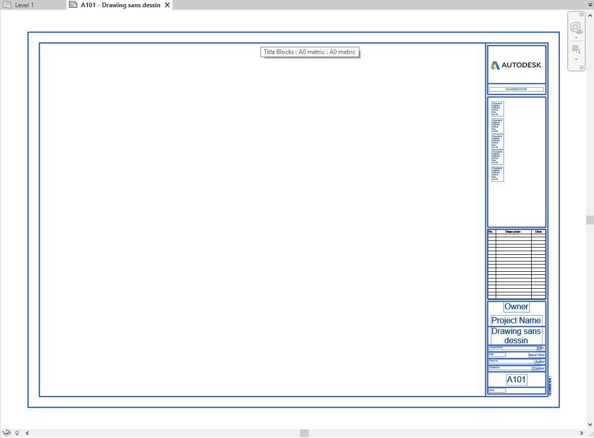
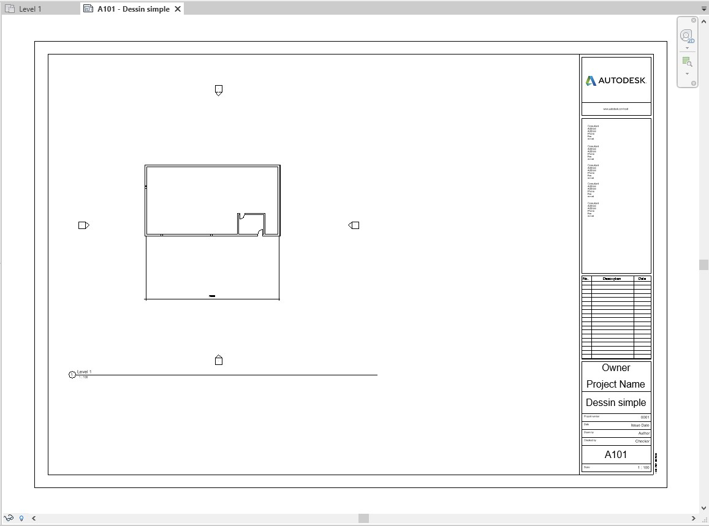
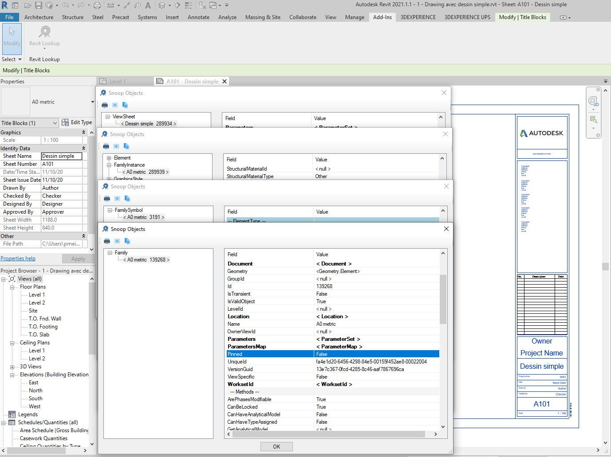
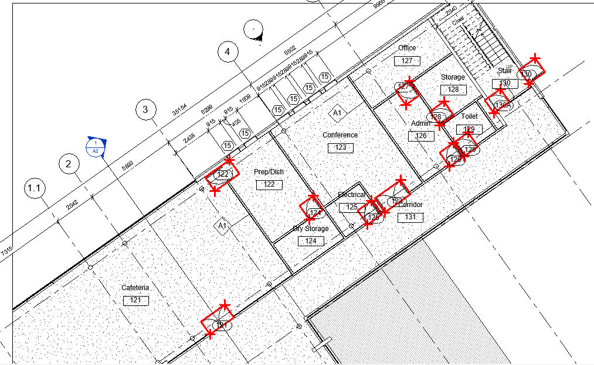
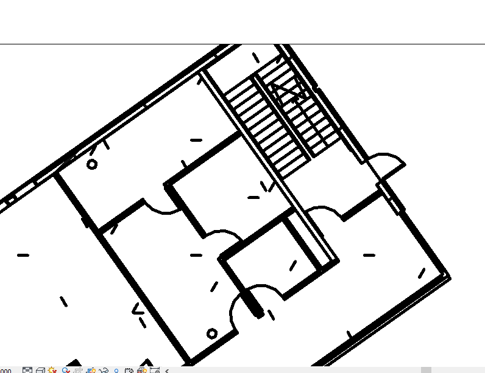
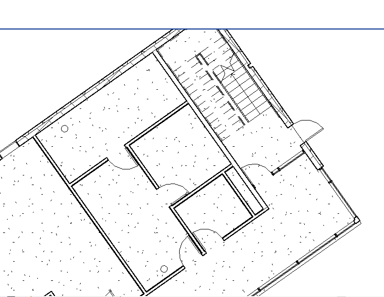

<head>
<meta http-equiv="Content-Type" content="text/html; charset=utf-8">
<link rel="stylesheet" type="text/css" href="bc.css">

</head>

<!---

- how to extract the geometry and the texts of the title block in a sheetview?
  https://forums.autodesk.com/t5/revit-api-forum/how-to-extract-the-geometry-and-the-texts-of-the-title-block-in/m-p/9998687
  /a/doc/revit/tbc/git/a/img/pm_sheet_view_text_geom.jpg
  [XPS or the Open XML Paper Specification] https://en.wikipedia.org/wiki/Open_XML_Paper_Specification

- Getting element coordiantes on sheet 
  https://forums.autodesk.com/t5/revit-api-forum/getting-element-coordiantes-on-sheet/m-p/9989539#M52411

- Export 2d sheets as images with high quality
  https://forums.autodesk.com/t5/revit-api-forum/export-2d-sheets-as-images-with-high-quality/m-p/9989471#M52410

twitter:

Accessing and exporting sheet view coordinates, transforms, images and title block data, including the title block geometry and text values with the #RevitAPI @AutodeskForge @AutodeskRevit #bim #DynamoBim #ForgeDevCon http://autode.sk/exportsheetview

Today, we look at accessing and exporting sheet view coordinates, transforms, images and title block data, including the title block geometry and text values
&ndash; Extracting title block geometry and text
&ndash; Element coordinates on sheet
&ndash; Export view as high quality image...

linkedin:

Accessing and exporting sheet view coordinates, transforms, images and title block data, including the title block geometry and text values with the #RevitAPI

http://autode.sk/exportsheetview

Today, we look at accessing and exporting sheet view coordinates, transforms, images and title block data, including the title block geometry and text values:

- Extracting title block geometry and text
- Element coordinates on sheet
- Export view as high quality image...

#bim #DynamoBim #ForgeDevCon #Revit #API #IFC #SDK #AI #VisualStudio #Autodesk #AEC #adsk

the [Revit API discussion forum](http://forums.autodesk.com/t5/revit-api-forum/bd-p/160) thread

-->

### Sheet View Xform, Coords, Img Export and Title Block

Today, we look at accessing and exporting sheet view coordinates, transforms, images and title block data, including the title block geometry and text values:

- [Extracting title block geometry and text](#2)
- [Element coordinates on sheet](#3)
- [Export view as high quality image](#4)

#### Extracting Title Block Geometry and Text

Here is a lengthy in-depth look at accessing, extracting and exporting title block geometry and text from 
the [Revit API discussion forum](http://forums.autodesk.com/t5/revit-api-forum/bd-p/160) thread
on [how to extract the geometry and the texts of the title block in a sheetview](https://forums.autodesk.com/t5/revit-api-forum/how-to-extract-the-geometry-and-the-texts-of-the-title-block-in/m-p/9998687),
with several interesting new insights provided once again by 
Richard [RPThomas108](https://forums.autodesk.com/t5/user/viewprofilepage/user-id/1035859) Thomas,
e.g., the possibility of programmatically exploiting the Revit print to `XPS` functionality:

**Question:** I want to extract all visible text and geometry in this image of a sheet view with its title block, including correct placement of all attributes:

 <!-- 1154 -->

To be more precise, I want to recreate an identical representation of the sheet view in my own exportable non-Revit document.

**Answer:** If you want to access the text and visible geometry to recreate a facsimile outside of Revit, you might be able to access text and geometry separately, e.g., using a filtered element collector for real data and a screen snapshot for the appearance.

Most of the text data can be accessed using built-in parameters.

The Title Block is a Revit family, so its geometry can be accessed by reading it from the family definition.

You can Filter for specific elements and retrieve their parameters, e.g., using:

<pre class="code">
&nbsp;&nbsp;FilteredElementCollector&nbsp;collector&nbsp;
&nbsp;&nbsp;&nbsp;&nbsp;=&nbsp;new&nbsp;FilteredElementCollector(&nbsp;document&nbsp;);
 
&nbsp;&nbsp;ICollection&lt;Element&gt;&nbsp;lines&nbsp;=&nbsp;collector
&nbsp;&nbsp;&nbsp;&nbsp;.OfClass(&nbsp;typeof(&nbsp;FamilyInstance&nbsp;)&nbsp;)
&nbsp;&nbsp;&nbsp;&nbsp;.OfCategory(&nbsp;BuiltInCategory.OST_Lines&nbsp;)
&nbsp;&nbsp;&nbsp;&nbsp;.ToElements();
 
&nbsp;&nbsp;ICollection&lt;Element&gt;&nbsp;texts&nbsp;=&nbsp;collector
&nbsp;&nbsp;&nbsp;&nbsp;.OfClass(&nbsp;typeof(&nbsp;FamilyInstance&nbsp;)&nbsp;)
&nbsp;&nbsp;&nbsp;&nbsp;.OfCategory(&nbsp;BuiltInCategory.OST_TextNotes&nbsp;)
&nbsp;&nbsp;&nbsp;&nbsp;.ToElements();
 
&nbsp;&nbsp;ICollection&lt;Element&gt;&nbsp;filledRegions&nbsp;=&nbsp;collector
&nbsp;&nbsp;&nbsp;&nbsp;.OfClass(&nbsp;typeof(&nbsp;FamilyInstance&nbsp;)&nbsp;)
&nbsp;&nbsp;&nbsp;&nbsp;.OfCategory(&nbsp;BuiltInCategory.OST_FilledRegion&nbsp;)
&nbsp;&nbsp;&nbsp;&nbsp;.ToElements();
 
&nbsp;&nbsp;//etc.
</pre>

Please note that the call to `ToElements` is very often a waste of performance time and memory space.
Avoid it when you can, i.e., mostly.

**Response:** Yes, I want to create a facsimile outside of Revit.

I managed to extract the content of the views that compose it but at real size and not yet find how to extract the cartridge and its content.

The solution you suggest above does not work, the filtered element collector result lists are empty.

**Answer:** As always, you can use RevitLookup to analyse the properties and other attributes of the Revit elements you are trying to retrieve with the filtered element collector.
That will show you which filters you need to apply to extract the desired elements.
If the filter returns no elements, you are applying too restrictive or downright erroneous filters.

**Response:** On the FamilyInstance of my ViewSheet, it finds neither `OST_Lines` nor `OST_TextNodes` (for the extract the Title Block).

Do you have a filter syntax that could find them ?

**Answer:** The most efficient way to define such a filter is for you to pick the elements you are filtering for and explore their properties using RevitLookup, cf., [how to research to find a Revit API solution](https://thebuildingcoder.typepad.com/blog/2017/01/virtues-of-reproduction-research-mep-settings-ontology.html#3).

**Response:** I have already explored the viewsheet and the associated family instance as well as the symbol and the family.
None has geometry.

**Answer:** The family definition document of the title block will contain the geometry.
You have to open the family for editing.
It may have various nested annotation symbols that also need to be traversed.

Besides that, there is the issue of items such as images and schedules.

It would probably be easier to read the fixed document sequence of a printed `xps` file, cf.,
[XPS or the Open XML Paper Specification](https://en.wikipedia.org/wiki/Open_XML_Paper_Specification).

This is an XML file containing path data represented in a mini language similar to what you get in `Xaml` and 'Glyphs' entries for text objects with render transforms to give their positions.
It takes a while to print an XPS, but if it is only the title block, it may be quicker.
You would still have to interpret the xml, but, as difficult to impossible tasks go, it is slightly less impossible.

`XPS` is a `zip` file; change the extension to `Zip` and unpack it, or, alternatively, there are namespaces for reading packages for such directly (System.IO.Packaging).

I don't envy your task, I usually just print a `pdf` when I want a copy of something.

`HPGL` is another historic plotter vector format that could be easily interpreted.

**Response:** My project is to export a viewsheet in `svg` format.
Currently, my code correctly exports all viewports, but I still have the title block (drawing and data) to export.
If I understand correctly, there is no way to export the title block (curve and position of the data)?

**Answer:** As you've noted, `Element.Geometry` is null for title blocks.

The only approach I know of with the Revit API would be to open the title block family using `Document.EditFamily` and extract such lines from the plan view within that. As noted above, however, this family could also contain revision schedule that you can't extract lines from and other nested generic annotation families and images. The parameter text values would not be correct, but from the text strings used in Labels and parameter names you can sometimes infer such a relationship (between text locations in your title block family and positions on your ViewSheet in the project). If label has a preview parameter value (which is often the case), then this can't be done. Also, the placement of multiple parameters with line breaks etc. in the same label add to complexity. You don't get a description of these with the API (which parameters used in which label).

Ideally, this task would be suited to `CustomExporter`, but I believe from previous discussions that this doesn't support ViewSheets.

`XLST` could potentially be used to convert the `XPS` path data previously noted to `SVG`, although I know of no existing templates for such.

Another potential long winded option would be to export the sheet with only the title block showing to `DWG` and import that on a drafting view to analyse the geometry. Not sure it is a good option, but could be done. DWG links favour polylines: any lines of the same layer joined together will be grouped into polylines. Text object positions could only be found by exploding the dwg (not sure if there is API function for that).

**Response:** I confirm that `CustomExporter2D` does not work on ViewSheets.

I tested the other approach:

<pre class="code">
&nbsp;&nbsp;//&nbsp;vs&nbsp;=&nbsp;current&nbsp;view&nbsp;(Viewsheet)
 
&nbsp;&nbsp;Element&nbsp;El&nbsp;=&nbsp;doc.GetElement(&nbsp;vs.Id&nbsp;);
&nbsp;&nbsp;FamilyInstance&nbsp;FI&nbsp;=&nbsp;null;
&nbsp;&nbsp;foreach(&nbsp;ElementId&nbsp;ElI&nbsp;in&nbsp;El.GetDependentElements(&nbsp;null&nbsp;)&nbsp;)
&nbsp;&nbsp;{
&nbsp;&nbsp;&nbsp;&nbsp;Element&nbsp;El1&nbsp;=&nbsp;El.Document.GetElement(&nbsp;ElI&nbsp;);
&nbsp;&nbsp;&nbsp;&nbsp;FI&nbsp;=&nbsp;El1&nbsp;as&nbsp;FamilyInstance;
&nbsp;&nbsp;&nbsp;&nbsp;if(&nbsp;FI&nbsp;!=&nbsp;null&nbsp;)
&nbsp;&nbsp;&nbsp;&nbsp;&nbsp;&nbsp;break;
&nbsp;&nbsp;}
&nbsp;&nbsp;FamilySymbol&nbsp;FS&nbsp;=&nbsp;FI.Symbol;
&nbsp;&nbsp;Document&nbsp;DocFamily&nbsp;=&nbsp;doc.EditFamily(&nbsp;FS.Family&nbsp;);
&nbsp;&nbsp;FamilyManager&nbsp;famManager&nbsp;=&nbsp;DocFamily.FamilyManager;
&nbsp;&nbsp;FamilyTypeSet&nbsp;famTypes&nbsp;=&nbsp;famManager.Types;
&nbsp;&nbsp;int&nbsp;nb&nbsp;=&nbsp;famTypes.Size;
 
&nbsp;&nbsp;FilteredElementCollector&nbsp;collector&nbsp;
&nbsp;&nbsp;&nbsp;&nbsp;=&nbsp;new&nbsp;FilteredElementCollector(&nbsp;docFamily&nbsp;);
 
&nbsp;&nbsp;foreach(&nbsp;Element&nbsp;ElF&nbsp;in&nbsp;collector&nbsp;)
&nbsp;&nbsp;{
&nbsp;&nbsp;&nbsp;&nbsp;DetailLine&nbsp;line&nbsp;=&nbsp;ElF&nbsp;as&nbsp;DetailLine;
 
&nbsp;&nbsp;&nbsp;&nbsp;if(&nbsp;line&nbsp;!=&nbsp;null&nbsp;)
&nbsp;&nbsp;&nbsp;&nbsp;{
&nbsp;&nbsp;&nbsp;&nbsp;&nbsp;&nbsp;Curve&nbsp;curve&nbsp;=&nbsp;line.GeometryCurve;
&nbsp;&nbsp;&nbsp;&nbsp;&nbsp;&nbsp;Line&nbsp;LI&nbsp;=&nbsp;(Line)&nbsp;curve;
 
&nbsp;&nbsp;&nbsp;&nbsp;&nbsp;&nbsp;if(&nbsp;LI&nbsp;!=&nbsp;null&nbsp;)
&nbsp;&nbsp;&nbsp;&nbsp;&nbsp;&nbsp;{
&nbsp;&nbsp;&nbsp;&nbsp;&nbsp;&nbsp;&nbsp;&nbsp;double&nbsp;XD&nbsp;=&nbsp;(LI.GetEndPoint(&nbsp;0&nbsp;).X&nbsp;*&nbsp;25.4&nbsp;*&nbsp;12);
&nbsp;&nbsp;&nbsp;&nbsp;&nbsp;&nbsp;&nbsp;&nbsp;double&nbsp;YD&nbsp;=&nbsp;(LI.GetEndPoint(&nbsp;0&nbsp;).Y&nbsp;*&nbsp;25.4&nbsp;*&nbsp;12);
&nbsp;&nbsp;&nbsp;&nbsp;&nbsp;&nbsp;&nbsp;&nbsp;double&nbsp;XF&nbsp;=&nbsp;(LI.GetEndPoint(&nbsp;1&nbsp;).X&nbsp;*&nbsp;25.4&nbsp;*&nbsp;12);
&nbsp;&nbsp;&nbsp;&nbsp;&nbsp;&nbsp;&nbsp;&nbsp;double&nbsp;YF&nbsp;=&nbsp;(LI.GetEndPoint(&nbsp;1&nbsp;).Y&nbsp;*&nbsp;25.4&nbsp;*&nbsp;12);
&nbsp;&nbsp;&nbsp;&nbsp;&nbsp;&nbsp;&nbsp;&nbsp;Deb.Write(&nbsp;
&nbsp;&nbsp;&nbsp;&nbsp;&nbsp;&nbsp;&nbsp;&nbsp;&nbsp;&nbsp;&quot;&nbsp;&lt;line&nbsp;x1=\&quot;{0}\&quot;&nbsp;y1=\&quot;{1}\&quot;&nbsp;x2=\&quot;{2}\&quot;&nbsp;y2=\&quot;{3}\&quot;&nbsp;style=\&quot;stroke-width:{4};&nbsp;stroke:rgb({5},&nbsp;{6},&nbsp;{7})\&quot;&nbsp;{8}/&gt;\n&quot;,
&nbsp;&nbsp;&nbsp;&nbsp;&nbsp;&nbsp;&nbsp;&nbsp;&nbsp;&nbsp;XD,&nbsp;V&nbsp;-&nbsp;YD,&nbsp;XF,&nbsp;V&nbsp;-&nbsp;YF,&nbsp;1,&nbsp;0,&nbsp;0,&nbsp;0,&nbsp;&quot;&quot;&nbsp;);
&nbsp;&nbsp;&nbsp;&nbsp;&nbsp;&nbsp;}
&nbsp;&nbsp;&nbsp;&nbsp;}
&nbsp;&nbsp;&nbsp;&nbsp;else
&nbsp;&nbsp;&nbsp;&nbsp;&nbsp;&nbsp;TaskDialog.Show(&nbsp;&quot;Test&quot;,&nbsp;&quot;No&nbsp;Line&quot;&nbsp;);
&nbsp;&nbsp;}
</pre>

This code extracts only 33 lines and nothing else.

How to have access to the text positions?

 <!-- 1154 -->

**Answer:** Your code extracts nothing but lines, because that is exactly what you have instructed it to do.

You can expand you code to analyse other elements besides lines.

Alternatively, and probably more effectively, you can analyse your family definition document interactively using RevitLookup to discover what other elements it contains.

**Response:** This family is internal (A0 metric).

How can I use RevitLookup to explore this family?

 <!-- 1154 -->

**Answer:** Application &gt; Documents &gt; select the family definition document.

**Response:** Ok, I found some `TextNode`, `TextElement` and `ImageInstance` elements.

But my filters are not working.

Is there any documentation of element filtering?

My code:

<pre class="code">
&nbsp;&nbsp;FilteredElementCollector&nbsp;collector&nbsp;
&nbsp;&nbsp;&nbsp;&nbsp;=&nbsp;new&nbsp;FilteredElementCollector(&nbsp;DocFamily&nbsp;);
 
&nbsp;&nbsp;ICollection&lt;Element&gt;&nbsp;lines&nbsp;=&nbsp;collector
&nbsp;&nbsp;&nbsp;&nbsp;.OfCategory(&nbsp;BuiltInCategory.OST_Lines&nbsp;)
&nbsp;&nbsp;&nbsp;&nbsp;.ToElements();
 
&nbsp;&nbsp;ICollection&lt;Element&gt;&nbsp;texts&nbsp;=&nbsp;collector
&nbsp;&nbsp;&nbsp;&nbsp;.OfClass(&nbsp;typeof(&nbsp;TextNote&nbsp;)&nbsp;)
&nbsp;&nbsp;&nbsp;&nbsp;.ToElements();
</pre>

They return no elements.

Where is the error?

**Answer:** You really do need to learn to search the Internet.

In this case, for instance, you can just search
for [Revit API filtered element collector](https://duckduckgo.com/?q=revit+api+filtered+element+collector).

Please practice this for a bit before asking the next question.

The specific problem that you ran into was discussed in the note
on [reinitialising the filtered element collector](https://thebuildingcoder.typepad.com/blog/2019/11/design-automation-api-stacks-collectors-and-links.html#4).

Happily, that seems to have resolved the problem for the moment, with no further response so far.

#### Element Coordinates on Sheet

Richard helped with two other sheet related issues as well.

One is
on [Getting element coordinates on sheet](https://forums.autodesk.com/t5/revit-api-forum/getting-element-coordiantes-on-sheet/m-p/9989539).

To cut a long story short, here is his final answer:

> I think you have just wrongly assumed the other two points of the bounding box, i.e., two points represent more than one unique rectangle. If you get all four points of the bounding box corners on plan without transformation and then transform them you can draw lines between them as below. I think what confused me when I looked at this originally was the double door families. Note however that in the case of the sample file all doors were parallel with the internal coordinate system. If your door instances were rotated (hosted on a non-vertical or non-horizontal directional wall) the bounding box would still be orientated to the internal system not rotated with the door. So, that aspect may add a layer of confusion, you would have to orientate the bounding box using the door instance transform first. This may not be possible actually since original two points circumscribe door with a box parallel to internal system, so when rotated this would be meaningless. In such a circumstance you likely need to build your own bounding box within the new orientation by looking at max/mins you get for the geometry in the new system.

> You can't get the rotation of a scope box but if you set a view to one then you can compare 1,0,0 to the right direction of the view to get scope box rotation. This should not be required here because the view right direction is used so transform should already incorporate it. Useful to know however that the orientation of a scope box can be found this way (using one of those transaction rollback workflows). The alternative may be to interrogate the geometry of the scope box to find direction of lines around the scope box bounding box centre (for the top or bottom rectangle of the cube). Although you likely couldn't get a full rotation between 0 and 2Pi for this due to symmetry. Depends on how geometry of cube is constructed in terms of line directions there may be some non-symmetrical pattern of this (looking at all 12 lines etc.).

 <!-- 1013 -->

<pre class="code">
  Dim&nbsp;Dr&nbsp;As&nbsp;Element&nbsp;=&nbsp;Doors(DRi)
  Dim&nbsp;BB&nbsp;As&nbsp;BoundingBoxXYZ&nbsp;=&nbsp;Dr.BoundingBox(V)
  Dim&nbsp;BL&nbsp;As&nbsp;New&nbsp;XYZ(BB.Min.X,&nbsp;BB.Min.Y,&nbsp;0)
  Dim&nbsp;BR&nbsp;As&nbsp;New&nbsp;XYZ(BB.Max.X,&nbsp;BB.Min.Y,&nbsp;0)
  Dim&nbsp;TL&nbsp;As&nbsp;New&nbsp;XYZ(BB.Min.X,&nbsp;BB.Max.Y,&nbsp;0)
  Dim&nbsp;TR&nbsp;As&nbsp;New&nbsp;XYZ(BB.Max.X,&nbsp;BB.Max.Y,&nbsp;0)
  BL&nbsp;=&nbsp;T.Inverse.OfPoint(BL).Multiply(1&nbsp;/&nbsp;Scale)&nbsp;+&nbsp;Offset
  BR&nbsp;=&nbsp;T.Inverse.OfPoint(BR).Multiply(1&nbsp;/&nbsp;Scale)&nbsp;+&nbsp;Offset
  TL&nbsp;=&nbsp;T.Inverse.OfPoint(TL).Multiply(1&nbsp;/&nbsp;Scale)&nbsp;+&nbsp;Offset
  TR&nbsp;=&nbsp;T.Inverse.OfPoint(TR).Multiply(1&nbsp;/&nbsp;Scale)&nbsp;+&nbsp;Offset
   
  Dim&nbsp;LN_B&nbsp;As&nbsp;Line&nbsp;=&nbsp;Line.CreateBound(BL,&nbsp;BR)
  Dim&nbsp;LN_R&nbsp;As&nbsp;Line&nbsp;=&nbsp;Line.CreateBound(BR,&nbsp;TR)
  Dim&nbsp;LN_T&nbsp;As&nbsp;Line&nbsp;=&nbsp;Line.CreateBound(TR,&nbsp;TL)
  Dim&nbsp;LN_L&nbsp;As&nbsp;Line&nbsp;=&nbsp;Line.CreateBound(TL,&nbsp;BL)
   
  doc.Create.NewDetailCurve(AcView,&nbsp;LN_B)
  doc.Create.NewDetailCurve(AcView,&nbsp;LN_R)
  doc.Create.NewDetailCurve(AcView,&nbsp;LN_T)
  doc.Create.NewDetailCurve(AcView,&nbsp;LN_L)
</pre>

#### Export View as High Quality Image

Another interested thread addressed by Richard is on how
to [export 2D sheets as images with high quality](https://forums.autodesk.com/t5/revit-api-forum/export-2d-sheets-as-images-with-high-quality/m-p/9989471),
wrapping up with:

> Without the annotation objects visible here are two images of the same view (not from exports); the top is set to 1:1000 and the bottom 1:200.

> The line weights are scaled in relation to paper space units, so if you set to 1:1 etc., then your lines end up thinner, which may carry through to images exported if you can temporarily set this before export:

 <!-- 769 -->
 
 <!-- 761 -->

#### Mustafa Salaheldin Ali adds:

> This works fine if you are exporting from a normal view, as changing the scale is not an issue.

> However, you can’t change the scale in the case of Sheets, because that will affect the viewport size and location.
