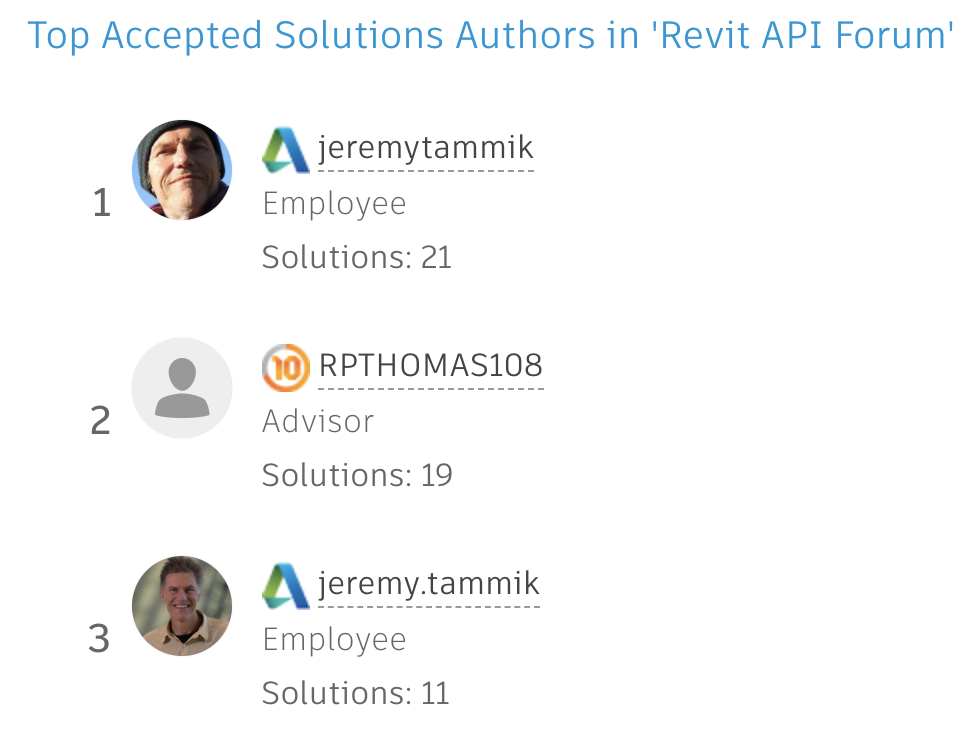

<head>
<meta http-equiv="Content-Type" content="text/html; charset=utf-8">
<link rel="stylesheet" type="text/css" href="bc.css">

</head>

<!---

- top_solutioon_authors_two_jeremys_2.png
  top_solutioon_authors_two_jeremys.png

- Multiple Collectors -- multiple filters
  https://forums.autodesk.com/t5/revit-api-forum/multiple-collectors/m-p/10046666

- https://archi-lab.net/element-tagging-with-dynamo/
  https://forums.autodesk.com/t5/revit-api-forum/tags-without-overlapping/m-p/10040873
  https://forums.autodesk.com/t5/revit-api-forum/auto-tagging-without-overlap/m-p/10036344

- Custom Errors – Preventing Specific Changes to the Revit model
  https://boostyourbim.wordpress.com/2021/01/28/custom-errors-preventing-specific-changes-to-the-revit-model/
  by harrymattison
  Let's say there is a specific list of View Scales that you want allowed in your Revit projects. Or certain naming conventions that should be used. Or something else like that where you'd like to automate the process of checking a user's change and determining if it should be allowed, prevented, or trigger a warning.
  This can be done with two pieces of Revit API functionality - Updater & Custom Failures. You can find all the code here and an explanation in the video below.

- autotag without overlap
  https://forums.autodesk.com/t5/revit-api-forum/auto-tagging-without-overlap/m-p/10036344/highlight/false#M52915

- https://github.com/jeremytammik/RevitLookup/releases/tag/2021.0.0.12

- The Unreasonable Ecological Cost of #CryptoArt (and crypto-currencies as well)
  https://memoakten.medium.com/the-unreasonable-ecological-cost-of-cryptoart-2221d3eb2053

twitter:

in the #RevitAPI @AutodeskForge @AutodeskRevit #bim #DynamoBim #ForgeDevCon 

&ndash; 
...

linkedin:

#bim #DynamoBim #ForgeDevCon #Revit #API #IFC #SDK #AI #VisualStudio #Autodesk #AEC #adsk

the [Revit API discussion forum](http://forums.autodesk.com/t5/revit-api-forum/bd-p/160) thread

-->

### Applying Multiple Filters and PostCommand + SendKeys

#### Two Jeremys

Apparently, the user account handling for
the [Revit API discussion forum](http://forums.autodesk.com/t5/revit-api-forum/bd-p/160) thread
recently changed.

I can no longer log in with the non-standard Autodesk `jeremytammik` account that I have been using all these years; the login automatically switches that over to my standard Autodesk `jeremy.tammik` account with a dot `.` instead.

As a result, we now have two active Jeremys in the forum:

 <!-- 964 -->

I guess the previous one will fade away as time goes on.

I wish I could meet him in person before he disappears.

#### Multiple Collectors versus Multiple Filters

This question arose repeatedly in the past few weeks, so let's reiterate it in detail, prompted by 
the [Revit API discussion forum](http://forums.autodesk.com/t5/revit-api-forum/bd-p/160) thread
on [multiple collectors](https://forums.autodesk.com/t5/revit-api-forum/multiple-collectors/m-p/10046666)

**Question:** I noticed that if I create multiple collectors in the same script, they don't work properly and most likely end up empty.
I've tried to use `Dispose` before creating the second collector to see if it can sort of "reset" the collector, but I always get this error:

- Exception : Autodesk.Revit.Exceptions.InvalidObjectException: The managed object is not valid.

What am I missing?

Here is a simple example where I collect all shared parameters in a project first, so I can use their GUIDs to collect data from them in families.

<pre class="code">
  collector = FilteredElementCollector(doc)

  # Find GUID of desired shared parameters
  
  sharedPars = collector.OfClass(SharedParameterElement)

  # Collect data from families based on parameter GUID.
  
  families = collector.OfClass(FamilyInstance)
    .WhereElementIsViewIndependent()
</pre>

**Answer:** You are not in fact creating multiple collectors.

You are creating one single collector and applying multiple filters to that.

Applying several different filters to one single collector does exactly what it should:

Every single filter is applied to the collector results.

If the filters are mutually exclusive, you end up with an empty result.

For a previous explanation, please read the discussion
on [reinitialising the filtered element collector](https://thebuildingcoder.typepad.com/blog/2019/11/design-automation-api-stacks-collectors-and-links.html#4).

The same question also came up in a few other recent threads, e.g.,
on [how to extract the geometry and the texts of the title block in a sheetview](https://forums.autodesk.com/t5/revit-api-forum/how-to-extract-the-geometry-and-the-texts-of-the-title-block-in/m-p/9943738),
summarised in the blog post 
on [extracting title block geometry and text](https://thebuildingcoder.typepad.com/blog/2021/01/sheet-view-xform-coords-img-export-and-title-block.html#2).

In your sample code snippet, simply create two separate collectors for shared parameters and family instances.

**Response:** I appreciate the reply and support.

I definitely understand what I did wrong now; I can't reuse the same collector variable as the filters just pile up, which obviously causes the collector to be empty, so simple.

It does worry me that after so much research I couldn't find the answer anywhere.

**Answer:** Thank you for your appreciation. Happy to hear that the problem is solved and the solution clear and simple.

I'll spell it out in the blog again and hope that will be easier to find in case anyone runs into this again in the future.

 <!-- 330 -->

####

####

