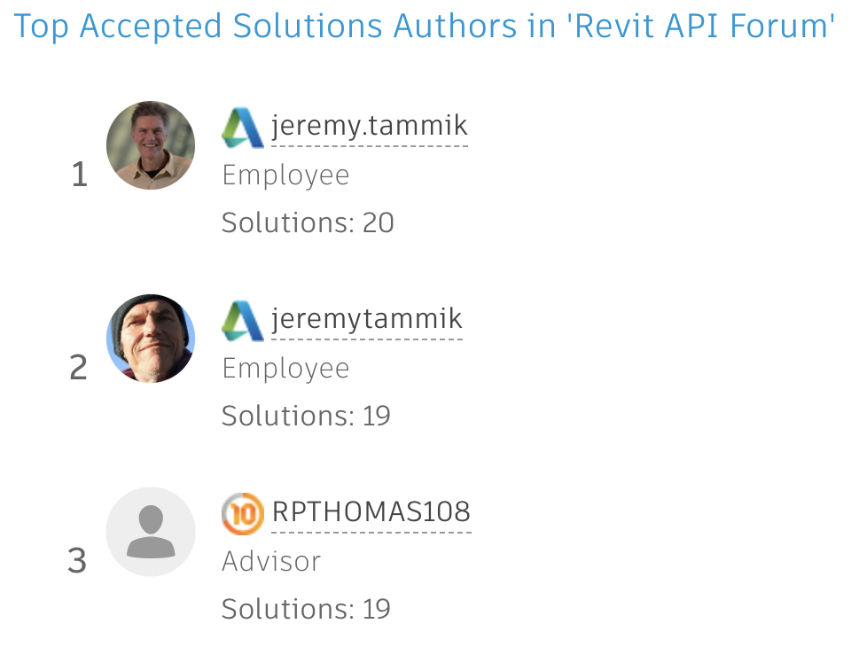
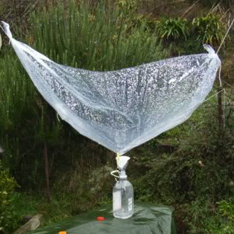

<head>
<meta http-equiv="Content-Type" content="text/html; charset=utf-8">
<link rel="stylesheet" type="text/css" href="bc.css">

</head>

<!---

- top_solutioon_authors_two_jeremys_2.png
  top_solutioon_authors_two_jeremys.png

- Multiple Collectors -- multiple filters
  https://forums.autodesk.com/t5/revit-api-forum/multiple-collectors/m-p/10046666

- https://github.com/jeremytammik/RevitLookup/releases/tag/2021.0.0.12

- autotag without overlap
  https://forums.autodesk.com/t5/revit-api-forum/auto-tagging-without-overlap/m-p/10036344/highlight/false#M52915

- https://archi-lab.net/element-tagging-with-dynamo/
  https://forums.autodesk.com/t5/revit-api-forum/tags-without-overlapping/m-p/10040873
  https://forums.autodesk.com/t5/revit-api-forum/auto-tagging-without-overlap/m-p/10036344

- Custom Errors – Preventing Specific Changes to the Revit model
  https://boostyourbim.wordpress.com/2021/01/28/custom-errors-preventing-specific-changes-to-the-revit-model/
  by harrymattison
  Let's say there is a specific list of View Scales that you want allowed in your Revit projects. Or certain naming conventions that should be used. Or something else like that where you'd like to automate the process of checking a user's change and determining if it should be allowed, prevented, or trigger a warning.
  This can be done with two pieces of Revit API functionality - Updater & Custom Failures. You can find all the code here and an explanation in the video below.

- The Unreasonable Ecological Cost of #CryptoArt (and crypto-currencies as well)
  https://memoakten.medium.com/the-unreasonable-ecological-cost-of-cryptoart-2221d3eb2053

twitter:

Split personality, auto-tagging without overlap, RevitLookup enhancement for split region offsets and multiple collectors in the #RevitAPI @AutodeskForge @AutodeskRevit #bim #DynamoBim #ForgeDevCon http://autode.sk/multiplecollectors

I need to come to terms with a split personality.
Meanwhile, lots more going on in the Revit API discussion forum
&ndash; Two Jeremys
&ndash; Multiple collectors versus multiple filters
&ndash; RevitLookup handles split region offsets
&ndash; Python and Dynamo autotag without overlap
&ndash; Custom errors and preventing changes
&ndash; Ecological cost of crypto currency and art...

linkedin:

Split personality, auto-tagging without overlap, RevitLookup enhancement for split region offsets and multiple collectors in the #RevitAPI

http://autode.sk/multiplecollectors

I need to come to terms with a split personality.
Meanwhile, lots more going on in the Revit API discussion forum:

- Two Jeremys
- Multiple collectors versus multiple filters
- RevitLookup handles split region offsets
- Python and Dynamo autotag without overlap
- Custom errors and preventing changes
- Ecological cost of crypto currency and art...

#bim #DynamoBim #ForgeDevCon #Revit #API #IFC #SDK #AI #VisualStudio #Autodesk #AEC #adsk

the [Revit API discussion forum](http://forums.autodesk.com/t5/revit-api-forum/bd-p/160) thread

-->

### Splits: Persona, Collector, Region, Tag, Modification

I need to come to terms with the split personality recently foisted upon me.
Thank God, RevitLookup now handles split regions.

Meanwhile, lots more going on in
the [Revit API discussion forum](http://forums.autodesk.com/t5/revit-api-forum/bd-p/160) and
elsewhere in the world:

- [Two Jeremys](#2)
- [Multiple collectors versus multiple filters](#3)
- [RevitLookup handles split region offsets](#4)
- [Python and Dynamo autotag without overlap](#5)
- [Custom errors and preventing changes](#6)
- [Ecological cost of crypto currency and art](#7)

#### Two Jeremys

Apparently, the user account handling for
the [Revit API discussion forum](http://forums.autodesk.com/t5/revit-api-forum/bd-p/160) thread
recently changed.

I can no longer log in with the non-standard Autodesk `jeremytammik` account that I have been using all these years; the login automatically switches that over to my standard Autodesk `jeremy.tammik` account with a dot `.` instead.

As a result, we now have two active Jeremys in the forum:

 <!-- 964 -->

I guess the previous one will fade away as time goes on.

I wish I could meet him in person before he disappears.

#### Multiple Collectors versus Multiple Filters

This question arose repeatedly in the past few weeks, so let's reiterate it in detail, prompted by 
the [Revit API discussion forum](http://forums.autodesk.com/t5/revit-api-forum/bd-p/160) thread
on [multiple collectors](https://forums.autodesk.com/t5/revit-api-forum/multiple-collectors/m-p/10046666)

**Question:** I noticed that if I create multiple collectors in the same script, they don't work properly and most likely end up empty.
I've tried to use `Dispose` before creating the second collector to see if it can sort of "reset" the collector, but I always get this error:

- Exception : Autodesk.Revit.Exceptions.InvalidObjectException: The managed object is not valid.

What am I missing?

Here is a simple example where I collect all shared parameters in a project first, so I can use their GUIDs to collect data from them in families.

<pre class="prettyprint">
  collector = FilteredElementCollector(doc)

  # Find GUID of desired shared parameters
  
  sharedPars = collector.OfClass(SharedParameterElement)

  # Collect data from families based on parameter GUID.
  
  families = collector.OfClass(FamilyInstance)
    .WhereElementIsViewIndependent()
</pre>

**Answer:** You are not in fact creating multiple collectors.

You are creating one single collector and applying multiple filters to that.

Applying several different filters to one single collector does exactly what it should:

Every single filter is applied to the collector results.

If the filters are mutually exclusive, you end up with an empty result.

For a previous explanation, please read the discussion
on [reinitialising the filtered element collector](https://thebuildingcoder.typepad.com/blog/2019/11/design-automation-api-stacks-collectors-and-links.html#4).

The same question also came up in a few other recent threads, e.g.,
on [how to extract the geometry and the texts of the title block in a sheet view](https://forums.autodesk.com/t5/revit-api-forum/how-to-extract-the-geometry-and-the-texts-of-the-title-block-in/m-p/9943738),
summarised in the blog post 
on [extracting title block geometry and text](https://thebuildingcoder.typepad.com/blog/2021/01/sheet-view-xform-coords-img-export-and-title-block.html#2).

In your sample code snippet, simply create two separate collectors for shared parameters and family instances.

**Response:** I appreciate the reply and support.

I definitely understand what I did wrong now; I can't reuse the same collector variable as the filters just pile up, which obviously causes the collector to be empty, so simple.

It does worry me that after so much research I couldn't find the answer anywhere.

**Answer:** Thank you for your appreciation. Happy to hear that the problem is solved and the solution clear and simple.

I'll spell it out in the blog again and hope that will be easier to find in case anyone runs into this again in the future.

 <!-- 330 -->

#### RevitLookup Handles Split Region Offsets

Thanks to Michael [@RevitArkitek](https://github.com/RevitArkitek) Coffey, RevitLookup can now handle split region offsets.

He submitted the [issue #68 &ndash; split region offsets (2021)](https://github.com/jeremytammik/RevitLookup/issues/68) and a
subsequent [pull request &ndash; adds handler for `GetSplitRegionOffsets`](https://github.com/jeremytammik/RevitLookup/pull/69),
explaining:

> The `ViewCropRegionShapeManager` method `GetSplitRegionOffset` was added in 2021.
This returns an `XYZ` but requires an integer index parameter.
A list of XYZs can be returned, named by the index that was used.

This enhancement is captured
in [RevitLookup release 2021.0.0.12](https://github.com/jeremytammik/RevitLookup/releases/tag/2021.0.0.12).

Many thanks to Michael for implementing and sharing this!

#### Python and Dynamo Autotag Without Overlap

Christopher Kepner shared a nice brute force Python solution
implementing [Auto Tagging without overlap](https://forums.autodesk.com/t5/revit-api-forum/auto-tagging-without-overlap/m-p/10036344),
explaining the algorithm like this:

A python script to auto-tag all doors and place them without clashing with other tags or doors, using a custom smart tag that is much bigger than typical door tag.

It starts with a list of doors in the variable `doorFiltered`. 

The location point of the first door in the list is fed into the function below to provide a test point to see if it overlaps any location points in the list of doors:

<pre class="prettyprint">
  def move_right(x,y,z):
    n = scaleFactor
    return x+n, y, z
  
  def move_down(x,y,z):
    n = scaleFactor
    return x,y-n,z
  
  def move_left(x,y,z):
    n = scaleFactor
    return x-n,y,z
  
  def move_up(x,y,z):
    n = scaleFactor
    return x,y+n,z
  
  moves = [move_right, move_down, move_left, move_up]
  
  def shift(end, point):
    from itertools import cycle
    _moves = cycle(moves)
    n = 1
    pos = point
    times_to_move = 1
  
    yield pos
  
    while True:
      for _ in range(2):
        move = next(_moves)
        for _ in range(times_to_move):
          if n >= end:
            return
          pos = move(*pos)
          n+=1
          yield pos
  
      times_to_move+=1
</pre>

If the point lands too close to any door locations in the list, the code adds a integer to the function and runs again to provide the next test point. Each time the function is re-run, the next point follows a spiral pattern from the origin (location point of the first door):

 <!-- 394 -->

Once a point is found that is far enough from the list of door locations, a tag is placed and the tag location is added to the list of door locations.

The process loops to the next door, checking against the list of door location plus the new tag location.

It's a working concept, but the output is inconsistent.

Issues include:

- Tags occasionally overlap with each other.
- The process takes a while. there's tons of points it tests that fail.
- Tag location it finds does not work well with leaders. the tags land in every direction from the door creating overlap of leaders. It might work better with smaller tags.

**Answer:** LOL. If you make the tags small enough, the problem will disappear entirely, along with the tags.

Thank you very much for the explanation. Brute force and effective, given time. I love that straightforward approach!

Another recent tagging conversation
on [tags without overlapping](https://forums.autodesk.com/t5/revit-api-forum/tags-without-overlapping/m-p/7750631)
mentions a couple of other useful possibilities.

More complex approaches are discussed on the Internet under the
term '[map labelling algorithms](https://duckduckgo.com/?q=map+labelling+algorithm)'.

Finally, Konrad Sobon of [archi+lab](https://archi-lab.net)
discussed [element tagging with dynamo](https://archi-lab.net/element-tagging-with-dynamo)
to create roof plans for a glass canopy system and tag each panel with its unique `Mark` value:

> basically, it's a Revit’s Tag All tool, but with extra control over where the tag actually gets placed.

#### Custom Errors and Preventing Changes

Harry Mattison presents a nice solution
implementing [custom errors &ndash; preventing specific changes to the Revit model](https://boostyourbim.wordpress.com/2021/01/28/custom-errors-preventing-specific-changes-to-the-revit-model),
explaining:

> Let's say there is a specific list of View Scales that you want allowed in your Revit projects.
Or certain naming conventions that should be used.
Or something else like that where you'd like to automate the process of checking a user's change and determining if it should be allowed, prevented, or trigger a warning.

 <!-- 705 -->

> This can be achieved with two pieces of Revit API functionality &ndash; Updater and Custom Failures...

Many thanks to Harry for sharing this nice explanation and implementation!

#### Ecological Cost of Crypto Currency and Art

I was intrigued and astounded at some of the information shared by Memo Akten in the analysis
of [the unreasonable ecological cost of #CryptoArt](https://memoakten.medium.com/the-unreasonable-ecological-cost-of-cryptoart-2221d3eb2053),
and crypto-currencies as well.
  
