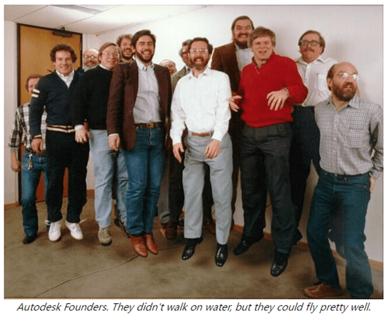
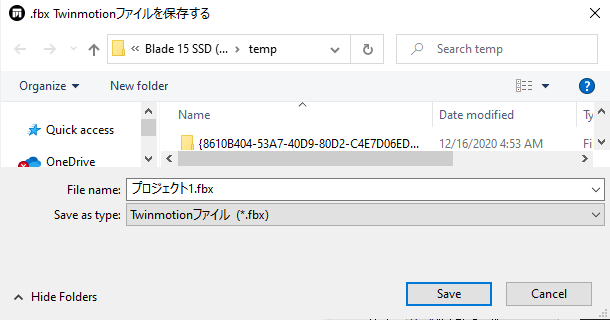

<head>
<meta http-equiv="Content-Type" content="text/html; charset=utf-8">
<link rel="stylesheet" type="text/css" href="bc.css">

</head>

<!---

- DevDays Online 2021
  https://www.keanw.com/2021/02/devdays-online-2021.html

			
At the beginning of March our Developer Advocacy and Support team will be running its annual series of DevDays Online events.

The first week will focus on public information – mainly news related to the <a href="https://forge.autodesk.com" target="_blank">Forge</a> platform – while the second week will be for <a href="https://autodesk.com/joinadn" target="_blank">Autodesk Developer Network</a> members, and focus mainly on our desktop products and APIs.

You can find <a href="https://adndevblog.typepad.com/autocad/2021/01/join-us-for-our-devdays-online-webinars.html" target="_blank">more complete information here</a>, and register via the links below:
<ul><li>For everyone</li><ul><li>March 2 – <a href="https://autodesk.zoom.us/webinar/register/WN_gWKcZ9miQaWPsLL8MQkn-w" target="_blank"><strong>DevDays Keynotes</strong></a> – <em>Jim Quanci</em></li><li>March 3 – <a href="https://autodesk.zoom.us/webinar/register/WN_unMOWlS_QIWa5zFHsToEvw" target="_blank"><strong>Forge API update</strong></a> – <em>Augusto Goncalves</em></li><li>March 4 – <a href="https://autodesk.zoom.us/webinar/register/WN_YMXE1hErSuuCysUFWyDnzQ" target="_blank"><strong>Autodesk Construction Cloud and API update</strong></a> – <em>Mikako Harada</em></li></ul><li>For ADN members</li><ul><li>March 9 – <a href="https://autodesk.zoom.us/webinar/register/WN_-lPyJKCxSayfTqyj39FKpA" target="_blank"><strong>The next release of AutoCAD APIs</strong></a> – <em>Madhukar Moogala</em></li><li>March 10 – <a href="https://autodesk.zoom.us/webinar/register/WN_vOr2gzcDSgKbfjQ67D7bTw" target="_blank"><strong>Revit API, Civil 3D &amp; InfraWorks updates</strong></a></li><ul><li>Civil 3D and InfraWorks update (10 minutes)</li><li>Revit API update (45 minutes)</li></ul><li>March 11 – <a href="https://autodesk.zoom.us/webinar/register/WN_r6eNOmsuRgaxP9jIdZaDRA" target="_blank"><strong>Inventor, Vault and Fusion 360 API update</strong></a></li></ul></ul>
<em>All webinars start at 4pm GMT | 17h00 CET | 11am EST | 8am PST. All sessions will be recorded in case the timing doesn’t work for you.</em>

		

  dvedays_2021.jpg
  Join us for our DevDays Online webinars
  https://adndevblog.typepad.com/autocad/2021/01/join-us-for-our-devdays-online-webinars.html
		

			
Join us for our special series of webinars! 

Webinars are a great opportunity for you to learn about&nbsp;<a href="https://forge.autodesk.com/">Autodesk Forge</a>&nbsp;and, of course, where Autodesk is taking the desktop platforms in the coming year.Click on the links below to register today for the webinar(s) of your choice.&nbsp;

All webinars start at 8am PST (4pm GMT, 5pm CET, 11am EST). 

<table style="border-collapse:collapse" border="0"><colgroup><col style="width:235px"><col style="width:217px"><col style="width:217px"><col style="width:217px"><col style="width:217px"></colgroup><tbody valign="top"><tr style="height: 36px"><td rowspan="2" style="padding-left: 18px; padding-right: 18px; border-top:  solid #9cc2e5 0.5pt; border-left:  solid #9cc2e5 0.5pt; border-bottom:  solid #9cc2e5 1.5pt; border-right:  solid #9cc2e5 0.5pt">

</td><td style="padding-left: 18px; padding-right: 18px; border-top:  solid #9cc2e5 0.5pt; border-left:  none; border-bottom:  solid #9cc2e5 1.5pt; border-right:  solid #9cc2e5 0.5pt">
<strong>PST</strong>
</td><td style="padding-left: 18px; padding-right: 18px; border-top:  solid #9cc2e5 0.5pt; border-left:  none; border-bottom:  solid #9cc2e5 1.5pt; border-right:  solid #9cc2e5 0.5pt">
<strong>GMT</strong>
</td><td style="padding-left: 18px; padding-right: 18px; border-top:  solid #9cc2e5 0.5pt; border-left:  none; border-bottom:  solid #9cc2e5 1.5pt; border-right:  solid #9cc2e5 0.5pt">
<strong>CET</strong>
</td><td style="padding-left: 18px; padding-right: 18px; border-top:  solid #9cc2e5 0.5pt; border-left:  none; border-bottom:  solid #9cc2e5 1.5pt; border-right:  solid #9cc2e5 0.5pt">
<strong>EST</strong>
</td></tr><tr style="height: 90px; background: #deeaf6"><td style="padding-left: 18px; padding-right: 18px; border-top:  none; border-left:  solid #9cc2e5 0.5pt; border-bottom:  solid #9cc2e5 0.5pt; border-right:  solid #9cc2e5 0.5pt">
08:00
</td><td style="padding-left: 18px; padding-right: 18px; border-top:  none; border-left:  none; border-bottom:  solid #9cc2e5 0.5pt; border-right:  solid #9cc2e5 0.5pt">
16:00
</td><td style="padding-left: 18px; padding-right: 18px; border-top:  none; border-left:  none; border-bottom:  solid #9cc2e5 0.5pt; border-right:  solid #9cc2e5 0.5pt">
17:00
</td><td style="padding-left: 18px; padding-right: 18px; border-top:  none; border-left:  none; border-bottom:  solid #9cc2e5 0.5pt; border-right:  solid #9cc2e5 0.5pt">
11:00
</td></tr></tbody></table>

&nbsp;

&nbsp;

&nbsp;

If the session timing is inconvenient for you to attend (which is true for most of our partners in Asia), you can rest assured we will be recording all the sessions and will post them on the web for your later viewing.&nbsp;Registration is open to all except where noted below.&nbsp;

Open to All
			
<ul><li>
<strong>Tuesday March 02: DevDays Keynotes&nbsp;</strong> Jim Quanci, Senior Director for Software Partner Development, kicks off our DevDays online webinar series with a 'state of the union' presentation on Autodesk's strategic direction; including the latest news for desktop developers, the move to subscription licenses, Forge strategy, the Autodesk App Store, and more. <strong>Register</strong> -&nbsp;&nbsp;<a href="https://nam11.safelinks.protection.outlook.com/?url=https%3A%2F%2Fautodesk.zoom.us%2Fwebinar%2Fregister%2FWN_gWKcZ9miQaWPsLL8MQkn-w&amp;data=04%7C01%7Cmadhukar.moogala%40autodesk.com%7C96fbe1e743754266fd1408d8c3b432ae%7C67bff79e7f914433a8e5c9252d2ddc1d%7C0%7C0%7C637474525992657994%7CUnknown%7CTWFpbGZsb3d8eyJWIjoiMC4wLjAwMDAiLCJQIjoiV2luMzIiLCJBTiI6Ik1haWwiLCJXVCI6Mn0%3D%7C1000&amp;sdata=k32Xb%2F5RWO7a58Uy8HzPdN6IwB37sXUPC05lUZxOQaA%3D&amp;reserved=0">https://autodesk.zoom.us/webinar/register/WN_gWKcZ9miQaWPsLL8MQkn-w</a>
				
</li><li>
<strong>Wednesday March 03: Forge API update</strong> Join Augusto Goncalves to learn in detail about the updated and new APIs added to the Forge platform during the last year.&nbsp; <strong>Register</strong> -&nbsp;<a href="https://nam11.safelinks.protection.outlook.com/?url=https%3A%2F%2Fautodesk.zoom.us%2Fwebinar%2Fregister%2FWN_unMOWlS_QIWa5zFHsToEvw&amp;data=04%7C01%7Cmadhukar.moogala%40autodesk.com%7C96fbe1e743754266fd1408d8c3b432ae%7C67bff79e7f914433a8e5c9252d2ddc1d%7C0%7C0%7C637474525992667988%7CUnknown%7CTWFpbGZsb3d8eyJWIjoiMC4wLjAwMDAiLCJQIjoiV2luMzIiLCJBTiI6Ik1haWwiLCJXVCI6Mn0%3D%7C1000&amp;sdata=b%2BtA8f%2FYsOqdCJO8BYcFy97Tn%2FjWt3a1Bz5g%2FSYgEAw%3D&amp;reserved=0">https://autodesk.zoom.us/webinar/register/WN_unMOWlS_QIWa5zFHsToEvw</a>
						
						
</li><li>
<strong>Thursday March 04:&nbsp;Autodesk Construction Cloud and API update </strong>Join Mikako Harada to hear the latest news about Autodesk Construction Cloud unified products and learn about its APIs. We'll also talk about BIM 360 API additions and enhancements. <strong>Register</strong> -&nbsp;<a href="https://nam11.safelinks.protection.outlook.com/?url=https%3A%2F%2Fautodesk.zoom.us%2Fwebinar%2Fregister%2FWN_YMXE1hErSuuCysUFWyDnzQ&amp;data=04%7C01%7Cmadhukar.moogala%40autodesk.com%7C96fbe1e743754266fd1408d8c3b432ae%7C67bff79e7f914433a8e5c9252d2ddc1d%7C0%7C0%7C637474525992677982%7CUnknown%7CTWFpbGZsb3d8eyJWIjoiMC4wLjAwMDAiLCJQIjoiV2luMzIiLCJBTiI6Ik1haWwiLCJXVCI6Mn0%3D%7C1000&amp;sdata=TjXlYbZOm3FD420m%2BYvWGt%2BD4KFo2qj%2FpKd%2F6HrcqGw%3D&amp;reserved=0">https://autodesk.zoom.us/webinar/register/WN_YMXE1hErSuuCysUFWyDnzQ</a>
						
</li></ul>
ADN Members Only
	
<ul><li>
<strong>Tuesday March 09:&nbsp;The next release of AutoCAD® APIs</strong>
				

Join Madhukar Moogala to discover API changes coming in the upcoming release of AutoCAD<strong>®</strong>
					

<strong>Register</strong> -&nbsp;<a href="https://nam11.safelinks.protection.outlook.com/?url=https%3A%2F%2Fautodesk.zoom.us%2Fwebinar%2Fregister%2FWN_-lPyJKCxSayfTqyj39FKpA&amp;data=04%7C01%7Cmadhukar.moogala%40autodesk.com%7C96fbe1e743754266fd1408d8c3b432ae%7C67bff79e7f914433a8e5c9252d2ddc1d%7C0%7C0%7C637474525992687979%7CUnknown%7CTWFpbGZsb3d8eyJWIjoiMC4wLjAwMDAiLCJQIjoiV2luMzIiLCJBTiI6Ik1haWwiLCJXVCI6Mn0%3D%7C1000&amp;sdata=uFmYSPease1Ywz951qlb5FfOLmGdYB1CZ58yfJIaIWA%3D&amp;reserved=0">https://autodesk.zoom.us/webinar/register/WN_-lPyJKCxSayfTqyj39FKpA</a>
					
</li><li>
<strong>Wednesday March 10:&nbsp;Revit API, Civil 3D &amp; InfraWorks updates </strong>Discover the product and API changes and enhancements coming in the next releases of Revit, Civil 3D and InfraWorks.

<ul><li>
Civil 3D and InfraWorks update – from 8:00 AM - 8:10 AM PST

</li><li>
Revit API Update – from 8:15 AM PST to 9:00 AM PST

</li></ul>
<strong>Register</strong> -&nbsp;<a href="https://nam11.safelinks.protection.outlook.com/?url=https%3A%2F%2Fautodesk.zoom.us%2Fwebinar%2Fregister%2FWN_vOr2gzcDSgKbfjQ67D7bTw&amp;data=04%7C01%7Cmadhukar.moogala%40autodesk.com%7C96fbe1e743754266fd1408d8c3b432ae%7C67bff79e7f914433a8e5c9252d2ddc1d%7C0%7C0%7C637474525992697973%7CUnknown%7CTWFpbGZsb3d8eyJWIjoiMC4wLjAwMDAiLCJQIjoiV2luMzIiLCJBTiI6Ik1haWwiLCJXVCI6Mn0%3D%7C1000&amp;sdata=WFDMvi5EPByxzyyyoBH415nVESK8qDbo132DYR3SMaw%3D&amp;reserved=0">https://autodesk.zoom.us/webinar/register/WN_vOr2gzcDSgKbfjQ67D7bTw</a>
					
</li><li>
<strong>Thursday March 11:&nbsp;Inventor, vault and Fusion API update </strong>Learn about the API changes coming in the upcoming release of Inventor as well as recent updates in Vault and Fusion 360 API. <strong>Register</strong> -&nbsp;<a href="https://nam11.safelinks.protection.outlook.com/?url=https%3A%2F%2Fautodesk.zoom.us%2Fwebinar%2Fregister%2FWN_r6eNOmsuRgaxP9jIdZaDRA&amp;data=04%7C01%7Cmadhukar.moogala%40autodesk.com%7C96fbe1e743754266fd1408d8c3b432ae%7C67bff79e7f914433a8e5c9252d2ddc1d%7C0%7C0%7C637474525992707968%7CUnknown%7CTWFpbGZsb3d8eyJWIjoiMC4wLjAwMDAiLCJQIjoiV2luMzIiLCJBTiI6Ik1haWwiLCJXVCI6Mn0%3D%7C1000&amp;sdata=VCI25pgxiPC016K%2FN8ZtX83st6OWkr9UTUJJjq6iYtY%3D&amp;reserved=0">https://autodesk.zoom.us/webinar/register/WN_r6eNOmsuRgaxP9jIdZaDRA</a>
						

After registering, you will receive a confirmation email containing information about joining the webinar.&nbsp;

&nbsp;

				&nbsp;
</li></ul>
		

- Autodesk Turns 39 Years Old
  https://autodesk.blogs.com/between_the_lines/2021/01/autodesk-turns-39-years-old.html
  autodesk_founders.png
  The Autodesk flying founders from left to right:
Rudolf Künzli, Mike Ford, Dan Drake, Mauri Laitinen, Greg Lutz, David Kalish, Lars Moureau, Richard Handyside,Kern Sibbald, Hal Royaltey, Duff Kurland, John Walker, Keith Marcelius”

- PostCommand + SendKeys to launch command and accept default UI input
  TwinMotion Dynamic Link Export Fbx Automatically
  https://forums.autodesk.com/t5/revit-api-forum/twinmotion-dynamic-link-export-fbx-automatically/m-p/10028748

- SVG Tutorial: How to Code SVG Icons by Hand
  https://www.aleksandrhovhannisyan.com/blog/svg-tutorial-how-to-code-svg-icons-by-hand/

twitter:

in the #RevitAPI @AutodeskForge @AutodeskRevit #bim #DynamoBim #ForgeDevCon 

&ndash; 
...

linkedin:

#bim #DynamoBim #ForgeDevCon #Revit #API #IFC #SDK #AI #VisualStudio #Autodesk #AEC #adsk

the [Revit API discussion forum](http://forums.autodesk.com/t5/revit-api-forum/bd-p/160) thread

-->

### PostCommand + SendKeys

#### Happy Birthday, Autodesk!

As Shaan Hurley pointed out,
[Autodesk turned 39 years old](https://autodesk.blogs.com/between_the_lines/2021/01/autodesk-turns-39-years-old.html) on
January 30, last Saturday.

Enjoy this snapshot of fhe flying Autodesk founders:

 <!-- 636 -->

From left to right: Rudolf Künzli, Mike Ford, Dan Drake, Mauri Laitinen, Greg Lutz, David Kalish, Lars Moureau, Richard Handyside, Kern Sibbald, Hal Royaltey, Duff Kurland, John Walker, Keith Marcelius.

Rudolf Künzli was still actively leading the Swiss office in Gundeldingen, Basel, when I first joined Autodesk in 1988.

Kern Sibbald was my direct manager when he started leading the European Technical Centre in Neuch&acirc;tel, and he didn't even realise so for over half a year, until I happened to mention the fact while chatting together on a ferry in Gothenburg &nbsp; :-)

#### DevDays Online 2021

Back to modern times...
just as usual, the annual DevDays Online events are taking place in the beginning of March, presented by my team, the Autodesk DAS or Developer Advocacy and Support, formerly ADN, Autodesk Developer Network.

The first week will focus on public information, mainly news related to
the [Forge platform](https://forge.autodesk.com).

The second week is for
registered [Autodesk Developer Network members](https://autodesk.com/joinadn) and
focuses mainly on our desktop products and APIs.

Please [refer to the official announcement for more complete information](https://adndevblog.typepad.com/autocad/2021/01/join-us-for-our-devdays-online-webinars.html).

All webinars start at 4pm GMT | 17h00 CET | 11am EST | 8am PST.

The sessions will be recorded, in case the timing doesn’t work for you.

Here is the schedule overview including links to register to each session:

#### For Everyone

- March 2 &ndash; [DevDays Keynotes](https://autodesk.zoom.us/webinar/register/WN_gWKcZ9miQaWPsLL8MQkn-w) &ndash; Jim Quanci
- March 3 &ndash; [Forge API update](https://autodesk.zoom.us/webinar/register/WN_unMOWlS_QIWa5zFHsToEvw) &ndash; Augusto Goncalves
- March 4 &ndash; [Autodesk Construction Cloud and API update](https://autodesk.zoom.us/webinar/register/WN_YMXE1hErSuuCysUFWyDnzQ) &ndash; Mikako Harada

#### For ADN Members

- March 9 &ndash; [The next release of AutoCAD APIs](https://autodesk.zoom.us/webinar/register/WN_-lPyJKCxSayfTqyj39FKpA) &ndash; Madhukar Moogala
- March 10 &ndash; [Revit API, Civil 3D & InfraWorks updates](https://autodesk.zoom.us/webinar/register/WN_vOr2gzcDSgKbfjQ67D7bTw)
    - Civil 3D and InfraWorks update (10 minutes)
    - Revit API update (45 minutes)
- March 11 &ndash; [Inventor, Vault and Fusion 360 API update](https://autodesk.zoom.us/webinar/register/WN_r6eNOmsuRgaxP9jIdZaDRA)

 <!-- 920 -->

####

Diving back into the Revit API, Yuko of shared a very nice solution in 
the [Revit API discussion forum](http://forums.autodesk.com/t5/revit-api-forum/bd-p/160) thread
on [TwinMotion dynamic link export FBX automatically](https://forums.autodesk.com/t5/revit-api-forum/twinmotion-dynamic-link-export-fbx-automatically/m-p/10028748),
showing how to launch a built-in Revit command using `PostCommand` and then proceed to programmatically accept all its default UI setting by using `SendKeys` to simulate the user input:

**Question:** I have been trying to export FBX using the TwinMotion Dynamic Link.

I would like to export FBX files from many Revit files, so I would like to know how I can use `PostCommand` and then operate Windows forms on the export panel.

I tried to use `SendKeys` but I couldn't make it.

Here are the forms I need to step through:

 <!-- 254 -->
 
 <!-- 254 -->
 
 <!-- 254 -->

I am a very new on Revit API forum. Any advice would be greatly appreciated! &nbsp; :-) 

**Answer:** Welcome to the Revit API!

Unfortunately, the Revit API provides no support for the scenario you describe.

The native Windows API does provide all the required functionality to simulate any user input you like.

Therefore, you can use the Windows API to drive the required workflow.

I used such a mechanism to implement [JtClicker, a simple Windows form clicker](https://github.com/jeremytammik/JtClicker).

You can try to implement something similar for your requirements.

However, as said, that has nothing whatsoever to do with the Revit API.

**Response:** Thank you for your reply!

I am able to export automatically by Windows API as you showed me the example! 

<pre class="code">
  void&nbsp;OnDialogBoxShowing(&nbsp;
  &nbsp;&nbsp;object&nbsp;sender,
  &nbsp;&nbsp;DialogBoxShowingEventArgs&nbsp;args&nbsp;)
  {
  &nbsp;&nbsp;//DialogBoxShowingEventArgs&nbsp;args
  &nbsp;&nbsp;TaskDialogShowingEventArgs&nbsp;e2&nbsp;=&nbsp;args
  &nbsp;&nbsp;&nbsp;&nbsp;as&nbsp;TaskDialogShowingEventArgs;
   
  &nbsp;&nbsp;e2.OverrideResult(&nbsp;(int)&nbsp;TaskDialogResult.Ok&nbsp;);
  }
   
  static&nbsp;async&nbsp;void&nbsp;RunCommands(
  &nbsp;&nbsp;UIApplication&nbsp;uiapp,
  &nbsp;&nbsp;RevitCommandId&nbsp;id_addin&nbsp;)
  {
  &nbsp;&nbsp;uiapp.PostCommand(&nbsp;id_addin&nbsp;);
  &nbsp;&nbsp;await&nbsp;Task.Delay(&nbsp;400&nbsp;);
  &nbsp;&nbsp;SendKeys.Send(&nbsp;&quot;{ENTER}&quot;&nbsp;);
  &nbsp;&nbsp;await&nbsp;Task.Delay(&nbsp;400&nbsp;);
  &nbsp;&nbsp;SendKeys.Send(&nbsp;&quot;{ENTER}&quot;&nbsp;);
  &nbsp;&nbsp;await&nbsp;Task.Delay(&nbsp;400&nbsp;);
  &nbsp;&nbsp;SendKeys.Send(&nbsp;&quot;{ENTER}&quot;&nbsp;);
  &nbsp;&nbsp;await&nbsp;Task.Delay(&nbsp;400&nbsp;);
  &nbsp;&nbsp;SendKeys.Send(&nbsp;&quot;{ESCAPE}&quot;&nbsp;);
  &nbsp;&nbsp;await&nbsp;Task.Delay(&nbsp;400&nbsp;);
  &nbsp;&nbsp;SendKeys.Send(&nbsp;&quot;{ESCAPE}&quot;&nbsp;);
  }
   
  public&nbsp;void&nbsp;myMacro(&nbsp;Document&nbsp;doc&nbsp;)
  {
  &nbsp;&nbsp;//Document&nbsp;doc&nbsp;=&nbsp;this.ActiveUIDocument.Document;
  &nbsp;&nbsp;Application&nbsp;app&nbsp;=&nbsp;doc.Application;
  &nbsp;&nbsp;UIApplication&nbsp;uiapp&nbsp;=&nbsp;new&nbsp;UIApplication(app);
   
  &nbsp;&nbsp;try
  &nbsp;&nbsp;{
  &nbsp;&nbsp;&nbsp;&nbsp;RevitCommandId&nbsp;id&nbsp;=&nbsp;RevitCommandId
  &nbsp;&nbsp;&nbsp;&nbsp;&nbsp;&nbsp;.LookupPostableCommandId(
  &nbsp;&nbsp;&nbsp;&nbsp;&nbsp;&nbsp;&nbsp;&nbsp;PostableCommand.PlaceAComponent&nbsp;);
   
  &nbsp;&nbsp;&nbsp;&nbsp;string&nbsp;name&nbsp;=&nbsp;&quot;CustomCtrl_%CustomCtrl_%&quot;
  &nbsp;&nbsp;&nbsp;&nbsp;&nbsp;&nbsp;+&nbsp;&quot;Twinmotion&nbsp;2020%Twinmotion&nbsp;Direct&nbsp;Link%&quot;
  &nbsp;&nbsp;&nbsp;&nbsp;&nbsp;&nbsp;+&nbsp;&quot;ExportButton&quot;;
   
  &nbsp;&nbsp;&nbsp;&nbsp;RevitCommandId&nbsp;id_addin&nbsp;=&nbsp;RevitCommandId
  &nbsp;&nbsp;&nbsp;&nbsp;&nbsp;&nbsp;.LookupCommandId(&nbsp;name&nbsp;);
   
  &nbsp;&nbsp;&nbsp;&nbsp;if(&nbsp;id_addin&nbsp;!=&nbsp;null&nbsp;)
  &nbsp;&nbsp;&nbsp;&nbsp;{
  &nbsp;&nbsp;&nbsp;&nbsp;&nbsp;&nbsp;uiapp.DialogBoxShowing&nbsp;+=&nbsp;new
  &nbsp;&nbsp;&nbsp;&nbsp;&nbsp;&nbsp;&nbsp;&nbsp;EventHandler&lt;DialogBoxShowingEventArgs&gt;(
  &nbsp;&nbsp;&nbsp;&nbsp;&nbsp;&nbsp;&nbsp;&nbsp;&nbsp;&nbsp;OnDialogBoxShowing&nbsp;);
   
  &nbsp;&nbsp;&nbsp;&nbsp;&nbsp;&nbsp;RunCommands(&nbsp;uiapp,&nbsp;id_addin&nbsp;);
  &nbsp;&nbsp;&nbsp;&nbsp;}
  &nbsp;&nbsp;}
   
  &nbsp;&nbsp;catch
  &nbsp;&nbsp;{
  &nbsp;&nbsp;&nbsp;&nbsp;TaskDialog.Show(&nbsp;&quot;Test&quot;,&nbsp;&quot;error&quot;&nbsp;);
  &nbsp;&nbsp;}
  &nbsp;&nbsp;finally
  &nbsp;&nbsp;{
  &nbsp;&nbsp;&nbsp;&nbsp;uiapp.DialogBoxShowing&nbsp;
  &nbsp;&nbsp;&nbsp;&nbsp;&nbsp;&nbsp;-=&nbsp;new&nbsp;EventHandler&lt;DialogBoxShowingEventArgs&gt;(&nbsp;
  &nbsp;&nbsp;&nbsp;&nbsp;&nbsp;&nbsp;&nbsp;&nbsp;OnDialogBoxShowing&nbsp;);
  &nbsp;&nbsp;}
  }
</pre>

Many thanks to Yuko for sharing this nice clean solution, and congratulations for getting up to speed with the Revit API so fast!

#### SVG Tutorial

I really like the quick and compelling introduction to SVG presented by Aleksandr Hovhannisyan in
his [SVG Tutorial: How to Code SVG Icons by Hand](https://www.aleksandrhovhannisyan.com/blog/svg-tutorial-how-to-code-svg-icons-by-hand).

