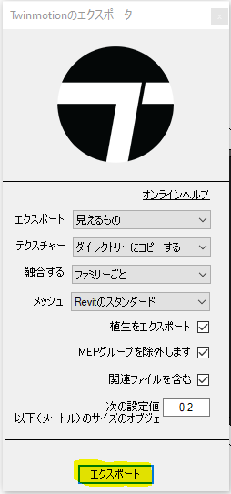

<head>
<meta http-equiv="Content-Type" content="text/html; charset=utf-8">
<link rel="stylesheet" type="text/css" href="bc.css">

</head>

<!---

- DevDays Online 2021
  https://www.keanw.com/2021/02/devdays-online-2021.html

- Autodesk Turns 39 Years Old
  https://autodesk.blogs.com/between_the_lines/2021/01/autodesk-turns-39-years-old.html
  autodesk_founders.png
  The Autodesk flying founders from left to right:
  Rudolf Künzli, Mike Ford, Dan Drake, Mauri Laitinen, Greg Lutz, David Kalish, Lars Moureau, Richard Handyside,Kern Sibbald, Hal Royaltey, Duff Kurland, John Walker, Keith Marcelius”

- PostCommand + SendKeys to launch command and accept default UI input
  TwinMotion Dynamic Link Export Fbx Automatically
  https://forums.autodesk.com/t5/revit-api-forum/twinmotion-dynamic-link-export-fbx-automatically/m-p/10028748

- SVG Tutorial: How to Code SVG Icons by Hand
  https://www.aleksandrhovhannisyan.com/blog/svg-tutorial-how-to-code-svg-icons-by-hand/

twitter:

Birthday in the past, DevDays in the future, and running a Revit command in the present moment using PostCommand + SendKeys in the #RevitAPI @AutodeskForge @AutodeskRevit #bim #DynamoBim #ForgeDevCon http://autode.sk/postcmd_sendkeys

Birthday in the past, DevDays in the future, and running a Revit command in the present moment
&ndash; Happy Birthday, Autodesk!
&ndash; DevDays online 2021
&ndash; For everyone
&ndash; For ADN members
&ndash; <code>PostCommand</code> + <code>SendKeys</code>
&ndash; SVG tutorial...

linkedin:

Birthday in the past, DevDays in the future, and running a Revit command in the present moment using PostCommand + SendKeys in the #RevitAPI

http://autode.sk/postcmd_sendkeys

Birthday in the past, DevDays in the future, and running a Revit command in the present moment:

- Happy Birthday, Autodesk!
- DevDays online 2021
- For everyone
- For ADN members
- PostCommand + SendKeys
- SVG tutorial...

#bim #DynamoBim #ForgeDevCon #Revit #API #IFC #SDK #AI #VisualStudio #Autodesk #AEC #adsk

the [Revit API discussion forum](http://forums.autodesk.com/t5/revit-api-forum/bd-p/160) thread

-->

### Birthday, DevDays, PostCommand + SendKeys

Birthday in the past, DevDays in the future, and running a Revit command in the present moment:

- [Happy Birthday, Autodesk!](#2)
- [DevDays online 2021](#3)
- [For everyone](#2.1)
- [For ADN members](#2.2)
- [`PostCommand` + `SendKeys`](#4)
- [SVG tutorial](#5)

#### Happy Birthday, Autodesk!

As Shaan Hurley pointed out,
[Autodesk turned 39 years old](https://autodesk.blogs.com/between_the_lines/2021/01/autodesk-turns-39-years-old.html) on
January 30, last Saturday.

Enjoy this snapshot of the flying Autodesk founders:

 <!-- 636 -->

From left to right: Rudolf Künzli, Mike Ford, Dan Drake, Mauri Laitinen, Greg Lutz, David Kalish, Lars Moureau, Richard Handyside, Kern Sibbald, Hal Royaltey, Duff Kurland, John Walker, Keith Marcelius.

Rudolf Künzli was still actively leading the Swiss office in Gundeldingen, Basel, when I first joined Autodesk in 1988.

Kern Sibbald was my direct manager when he started leading the European Technical Centre in Neuch&acirc;tel, and he didn't even realise so for over half a year, until I happened to mention the fact while chatting together on a ferry in Gothenburg &nbsp; :-)

#### DevDays Online 2021

Back to modern times...
just as usual, the annual DevDays Online events are taking place in the beginning of March, presented by my team, the Autodesk DAS or Developer Advocacy and Support, formerly ADN, Autodesk Developer Network.

The first week will focus on public information, mainly news related to
the [Forge platform](https://forge.autodesk.com).

The second week is for
registered [Autodesk Developer Network members](https://autodesk.com/joinadn) and
focuses mainly on our desktop products and APIs.

Please [refer to the official announcement for more complete information](https://adndevblog.typepad.com/autocad/2021/01/join-us-for-our-devdays-online-webinars.html).

All webinars start at 4pm GMT | 17h00 CET | 11am EST | 8am PST.

The sessions will be recorded, in case the timing doesn’t work for you.

Here is the schedule overview including links to register to each session:

#### For Everyone

- March 2 &ndash; [DevDays Keynotes](https://autodesk.zoom.us/webinar/register/WN_gWKcZ9miQaWPsLL8MQkn-w) &ndash; Jim Quanci
- March 3 &ndash; [Forge API update](https://autodesk.zoom.us/webinar/register/WN_unMOWlS_QIWa5zFHsToEvw) &ndash; Augusto Goncalves
- March 4 &ndash; [Autodesk Construction Cloud and API update](https://autodesk.zoom.us/webinar/register/WN_YMXE1hErSuuCysUFWyDnzQ) &ndash; Mikako Harada

#### For ADN Members

- March 9 &ndash; [The next release of AutoCAD APIs](https://autodesk.zoom.us/webinar/register/WN_-lPyJKCxSayfTqyj39FKpA) &ndash; Madhukar Moogala
- March 10 &ndash; [Revit API, Civil 3D & InfraWorks updates](https://autodesk.zoom.us/webinar/register/WN_vOr2gzcDSgKbfjQ67D7bTw)
    - Civil 3D and InfraWorks update (10 minutes)
    - Revit API update (45 minutes)
- March 11 &ndash; [Inventor, Vault and Fusion 360 API update](https://autodesk.zoom.us/webinar/register/WN_r6eNOmsuRgaxP9jIdZaDRA)

 <!-- 920 -->

#### PostCommand + SendKeys

Diving back into the Revit API, Yuko of shared a very nice solution in 
the [Revit API discussion forum](http://forums.autodesk.com/t5/revit-api-forum/bd-p/160) thread
on [TwinMotion dynamic link export FBX automatically](https://forums.autodesk.com/t5/revit-api-forum/twinmotion-dynamic-link-export-fbx-automatically/m-p/10028748),
showing how to launch a built-in Revit command using `PostCommand` and then proceed to programmatically accept all its default UI setting by using `SendKeys` to simulate the user input:

**Question:** I have been trying to export FBX using the TwinMotion Dynamic Link.

I would like to export FBX files from many Revit files, so I would like to know how I can use `PostCommand` and then operate Windows forms on the export panel.

I tried to use `SendKeys` but I couldn't make it.

Here are the forms I need to step through:

 <!-- 254 -->
 
 <!-- 610 -->
 
 <!-- 610 -->

I am a very new on Revit API forum. Any advice would be greatly appreciated! &nbsp; :-) 

**Answer:** Welcome to the Revit API!

Unfortunately, the Revit API provides no support for the scenario you describe.

The native Windows API does provide all the required functionality to simulate any user input you like.

Therefore, you can use the Windows API to drive the required workflow.

I used such a mechanism to implement [JtClicker, a simple Windows form clicker](https://github.com/jeremytammik/JtClicker).

You can try to implement something similar for your requirements.

However, as said, that has nothing whatsoever to do with the Revit API.

**Response:** Thank you for your reply!

I am able to export automatically by Windows API as you showed me the example! 

<pre class="code">
  void&nbsp;OnDialogBoxShowing(&nbsp;
  &nbsp;&nbsp;object&nbsp;sender,
  &nbsp;&nbsp;DialogBoxShowingEventArgs&nbsp;args&nbsp;)
  {
  &nbsp;&nbsp;//DialogBoxShowingEventArgs&nbsp;args
  &nbsp;&nbsp;TaskDialogShowingEventArgs&nbsp;e2&nbsp;=&nbsp;args
  &nbsp;&nbsp;&nbsp;&nbsp;as&nbsp;TaskDialogShowingEventArgs;
   
  &nbsp;&nbsp;e2.OverrideResult(&nbsp;(int)&nbsp;TaskDialogResult.Ok&nbsp;);
  }
   
  static&nbsp;async&nbsp;void&nbsp;RunCommands(
  &nbsp;&nbsp;UIApplication&nbsp;uiapp,
  &nbsp;&nbsp;RevitCommandId&nbsp;id_addin&nbsp;)
  {
  &nbsp;&nbsp;uiapp.PostCommand(&nbsp;id_addin&nbsp;);
  &nbsp;&nbsp;await&nbsp;Task.Delay(&nbsp;400&nbsp;);
  &nbsp;&nbsp;SendKeys.Send(&nbsp;&quot;{ENTER}&quot;&nbsp;);
  &nbsp;&nbsp;await&nbsp;Task.Delay(&nbsp;400&nbsp;);
  &nbsp;&nbsp;SendKeys.Send(&nbsp;&quot;{ENTER}&quot;&nbsp;);
  &nbsp;&nbsp;await&nbsp;Task.Delay(&nbsp;400&nbsp;);
  &nbsp;&nbsp;SendKeys.Send(&nbsp;&quot;{ENTER}&quot;&nbsp;);
  &nbsp;&nbsp;await&nbsp;Task.Delay(&nbsp;400&nbsp;);
  &nbsp;&nbsp;SendKeys.Send(&nbsp;&quot;{ESCAPE}&quot;&nbsp;);
  &nbsp;&nbsp;await&nbsp;Task.Delay(&nbsp;400&nbsp;);
  &nbsp;&nbsp;SendKeys.Send(&nbsp;&quot;{ESCAPE}&quot;&nbsp;);
  }
   
  public&nbsp;void&nbsp;myMacro(&nbsp;Document&nbsp;doc&nbsp;)
  {
  &nbsp;&nbsp;//Document&nbsp;doc&nbsp;=&nbsp;this.ActiveUIDocument.Document;
  &nbsp;&nbsp;Application&nbsp;app&nbsp;=&nbsp;doc.Application;
  &nbsp;&nbsp;UIApplication&nbsp;uiapp&nbsp;=&nbsp;new&nbsp;UIApplication(app);
   
  &nbsp;&nbsp;try
  &nbsp;&nbsp;{
  &nbsp;&nbsp;&nbsp;&nbsp;RevitCommandId&nbsp;id&nbsp;=&nbsp;RevitCommandId
  &nbsp;&nbsp;&nbsp;&nbsp;&nbsp;&nbsp;.LookupPostableCommandId(
  &nbsp;&nbsp;&nbsp;&nbsp;&nbsp;&nbsp;&nbsp;&nbsp;PostableCommand.PlaceAComponent&nbsp;);
   
  &nbsp;&nbsp;&nbsp;&nbsp;string&nbsp;name&nbsp;=&nbsp;&quot;CustomCtrl_%CustomCtrl_%&quot;
  &nbsp;&nbsp;&nbsp;&nbsp;&nbsp;&nbsp;+&nbsp;&quot;Twinmotion&nbsp;2020%Twinmotion&nbsp;Direct&nbsp;Link%&quot;
  &nbsp;&nbsp;&nbsp;&nbsp;&nbsp;&nbsp;+&nbsp;&quot;ExportButton&quot;;
   
  &nbsp;&nbsp;&nbsp;&nbsp;RevitCommandId&nbsp;id_addin&nbsp;=&nbsp;RevitCommandId
  &nbsp;&nbsp;&nbsp;&nbsp;&nbsp;&nbsp;.LookupCommandId(&nbsp;name&nbsp;);
   
  &nbsp;&nbsp;&nbsp;&nbsp;if(&nbsp;id_addin&nbsp;!=&nbsp;null&nbsp;)
  &nbsp;&nbsp;&nbsp;&nbsp;{
  &nbsp;&nbsp;&nbsp;&nbsp;&nbsp;&nbsp;uiapp.DialogBoxShowing&nbsp;+=&nbsp;new
  &nbsp;&nbsp;&nbsp;&nbsp;&nbsp;&nbsp;&nbsp;&nbsp;EventHandler&lt;DialogBoxShowingEventArgs&gt;(
  &nbsp;&nbsp;&nbsp;&nbsp;&nbsp;&nbsp;&nbsp;&nbsp;&nbsp;&nbsp;OnDialogBoxShowing&nbsp;);
   
  &nbsp;&nbsp;&nbsp;&nbsp;&nbsp;&nbsp;RunCommands(&nbsp;uiapp,&nbsp;id_addin&nbsp;);
  &nbsp;&nbsp;&nbsp;&nbsp;}
  &nbsp;&nbsp;}
   
  &nbsp;&nbsp;catch
  &nbsp;&nbsp;{
  &nbsp;&nbsp;&nbsp;&nbsp;TaskDialog.Show(&nbsp;&quot;Test&quot;,&nbsp;&quot;error&quot;&nbsp;);
  &nbsp;&nbsp;}
  &nbsp;&nbsp;finally
  &nbsp;&nbsp;{
  &nbsp;&nbsp;&nbsp;&nbsp;uiapp.DialogBoxShowing&nbsp;
  &nbsp;&nbsp;&nbsp;&nbsp;&nbsp;&nbsp;-=&nbsp;new&nbsp;EventHandler&lt;DialogBoxShowingEventArgs&gt;(&nbsp;
  &nbsp;&nbsp;&nbsp;&nbsp;&nbsp;&nbsp;&nbsp;&nbsp;OnDialogBoxShowing&nbsp;);
  &nbsp;&nbsp;}
  }
</pre>

Many thanks to Yuko for sharing this nice clean solution, and congratulations for getting up to speed with the Revit API so fast!

#### SVG Tutorial

I really like the quick and compelling introduction to SVG presented by Aleksandr Hovhannisyan in
his [SVG Tutorial: How to Code SVG Icons by Hand](https://www.aleksandrhovhannisyan.com/blog/svg-tutorial-how-to-code-svg-icons-by-hand).

