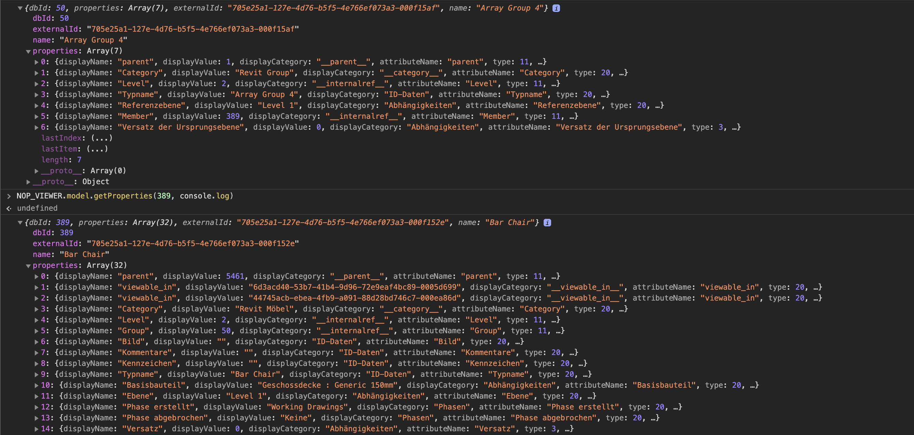

<head>
<meta http-equiv="Content-Type" content="text/html; charset=utf-8">
<link rel="stylesheet" type="text/css" href="bc.css">

</head>

<!---

- 8473 [Question about model group for Forge] retrieve and select model group in Forge viewer, cf. select MEP system
  https://autodesk.slack.com/archives/C0LP63082/p1612715834044900
  https://forge.zendesk.com/agent/tickets/8473

- 8492 [Language Settings of DA4R Engine]
  https://autodesk.slack.com/archives/C0LP63082/p1612862891058700
  https://forge.zendesk.com/agent/tickets/8492

- [ScheduleDefinition.GetField method not showing](https://github.com/jeremytammik/RevitLookup/issues/70)

- Naked Mole-Rats Speak in Community Dialects
  https://www.treehugger.com/naked-mole-rats-speak-dialects-5101265
  > Sharing a dialect strengthens cohesiveness in the colony
  > the dialect helps with group solidarity and connection
  > In any social group, including our own, having a rapid way of identifying who belongs to the group and who is excluded is useful for many practical reasons

- van Gogh 360
  https://static.kuula.io/share/79QMS
  https://kuula.co/profile/Mathy147
  https://kuula.co/share/79QMS?fs=1&vr=0&sd=1&thumbs=1&info=1&logo=0
  
  <iframe width="100%" height="640" style="width: 100%; height: 640px; border: none; max-width: 100%;" frameborder="0" allowfullscreen allow="xr-spatial-tracking; gyroscope; accelerometer" scrolling="no" src="https://kuula.co/share/79QMS?fs=1&vr=0&sd=1&thumbs=1&info=1&logo=0"></iframe>
  https://kuula.co/post/79QMS?fs=1&vr=0&sd=1&thumbs=1&info=1&logo=0

twitter:

 the #RevitAPI @AutodeskForge @AutodeskRevit #bim #DynamoBim #ForgeDevCon 

&ndash; 
...

linkedin:

#bim #DynamoBim #ForgeDevCon #Revit #API #IFC #SDK #AI #VisualStudio #Autodesk #AEC #adsk

the [Revit API discussion forum](http://forums.autodesk.com/t5/revit-api-forum/bd-p/160) thread

-->

### Model Group in Forge and DA4R Language

Today, let's look at two Forge questions from Japan on model groups and the Revit engine language, another RevitLookup enhancement, and, while we're talking about languages, a scientific discovery on naked mole-rat dialects:

#### Retrieving Revit Model Group in Forge

**Question:** I have a question about Revit model groups.

Is it possible to get the group information in Forge?

For example, if I select Group 1 in the UI, I would like to select all the objects in it, determine the group name and other information about group member elements.

So, does the Forge viewer support selecting a Revit model group? Is there any way to retrieve the model group information in Forge, or is it 'lost in translation'?

**Answewr:** The viewer doesn't support it out of the box, but the information is still preserved in the Forge translation of the RVT model, not lost in translation.

You can navigate Groups and their Members by descending down the non-graphical property hierarchy, starting at the root/model element. Then, it is also possible to programmatically simulate group selection by selecting group members.

Here is an example of a group (ID=50) with one member (ID=389), which is a chair element in the Revit sample project rac_basic_sample_project.rvt:

 <!-- 2680 -->

The StackOverflow discussion
on [grouping elements cannot find in Forge viewer](https://stackoverflow.com/a/61998004) shows 
a pretty neat code snippet by Eason Kang implementing this functionality.

Many thanks to Traian Stanev and Eason for their valuable help in addressing this.

#### Specifying the Revit UI Language in DA4R

8492 [Language Settings of DA4R Engine]

松井優, yu-matsui@apptec.co.jp

https://autodesk.slack.com/archives/C0LP63082/p1612862891058700

https://forge.zendesk.com/agent/tickets/8492

Language Settings of DA4R Engine

松井優
 
Dear Forge Support Team,

Hi, I have a question about DA4R (Design Automation for Revit).

Can I specify the language of the Engine of DR4R?
I would like to use the Japanese Engine. (The default engine is English?)
It is because the addin seems to depend on the Japanese Engine.

Best Regards,
Yu Matsui
Application Developer
APPLIED TECHNOLOGY CO.,LTD.

-----------------------------------------------------------------------
https://forums.autodesk.com/t5/revit-api-forum/bd-p/160

I searched it for the term 'language' and found two useful entries:

How to change Revit language using API?

https://forums.autodesk.com/t5/revit-api-forum/how-to-change-revit-language-using-api/m-p/9156524

How to get the language of Revit user interface?

https://forums.autodesk.com/t5/revit-api-forum/how-to-get-the-language-of-revit-user-interface/m-p/6840139

-----------------------------------------------------------------------
Jeremy Tammik

Dear Yu Matsui,

Thank you for your query.

Good programming practice would ensure that the add-in is not language dependent.

Since every DA4R add-in is a DB-only application, it should in theory be language independent automatically.

Unfortunately, Revit itself does not completely follow this practice in all points.

Furthermore, every Revit BIM relies on many component that can be modified and added by end users, e.g., family definitions, which are pretty hard to make language independent.

So, I understand your challenge.

As a first step, let's look at the situation in the desktop Revit API.

One place to find information on that is the Revit API discussion forum:

https://forums.autodesk.com/t5/revit-api-forum/bd-p/160

I searched it for the term 'language' and found two useful entries:

How to get the language of Revit user interface?

https://forums.autodesk.com/t5/revit-api-forum/how-to-get-the-language-of-revit-user-interface/m-p/6840139

How to change Revit language using API?

https://forums.autodesk.com/t5/revit-api-forum/how-to-change-revit-language-using-api/m-p/9156524

The Revit API provides the `Application.Language` property to determine the language used in the current session of Revit, so that part is easy:

https://www.revitapidocs.com/2020/2b1d8b80-a11c-2a57-63bd-6c0d67691879.htm

However, the API does not provide any method to control the language being used.

On the desktop, you can use the language switch in the Revit.exe command line:

https://thebuildingcoder.typepad.com/blog/2017/01/distances-switches-kiss-ing-and-a-dino.html#3

https://thebuildingcoder.typepad.com/blog/2017/02/multiple-language-resx-resource-files.html

Now, trying to apply this insight to the DA4R environment, there are two questions:

- Can we specify command line argument to the Revit engine in DA4R?
- Will the DA4R Revit engine react to the language switch in the command line passed in?

I believe the answer to both of these is yes.

Here is an example of passing in a command line argument to the DA4R engine:

https://stackoverflow.com/questions/63128763/error-application-revitcoreconsole-exe-exits-with-code-19088744-which-indicate

I'll check with the development team for you to make sure.

I hope this helps.

Best regards,

Jeremy Tammik

-----------------------------------------------------------------------
https://autodesk.slack.com/archives/C0LP63082/p1612862891058700

Can the language of the Revit engine be controlled in DA4R? A Japanese developer needs to have his app run in a Japanese version. On the desktop, you can use the language switch in the `Revit.exe` command line. Can we specify command line argument to the Revit engine in DA4R? Will the DA4R Revit engine honour the language switch in the command line passed in? Do you have a sample demonstrating how to pass in the Revit engine command line? Thank you! -- zen #8492

Rahul Bhobe

Yes, same language codes work with an optional `/l` argument to `revitcoreconsole.exe`.

See documentation and sample here:

https://forge.autodesk.com/en/docs/design-automation/v3/tutorials/revit/step5-publish-activity/#additional-notes

-----------------------------------------------------------------------
Jeremy Tammik

Dear Yu Matsui,

Thank you for your patience.

I confirmed my assumption with the development team.

The same language command line switch works with an optional `/l` argument to `revitcoreconsole.exe`.

It is described in more detail with a sample code snippet in the official documentation here:

https://forge.autodesk.com/en/docs/design-automation/v3/tutorials/revit/step5-publish-activity/#additional-notes

Best regards,

Jeremy Tammik

-----------------------------------------------------------------------
松井優
 
Dear Jeremy Tammik,

I tried /l option, then my add-in completed the process with no error.

revitcoreconsole.exe /l JPN (arguments...)

Thanks much for your support and information!
I would check the forum site also from the next time.

Best Regards,
Yu Matsui

-----------------------------------------------------------------------
Jeremy Tammik

Dear Yu Matsui,

Thank you very much for your appreciation and confirmation.

Best of luck and much success with your further development.

Best regards,

Jeremy Tammik

-----------------------------------------------------------------------
Mikako Harada 

FYI - OS is still English. You may see font changes, cf. the known limitations:

https://jira.autodesk.com/browse/RVTDA-1342
https://jira.autodesk.com/browse/RVTDA-1340

-----------------------------------------------------------------------

#### RevitLookup Access to ScheduleDefinition GetField

Following up on his enhancement
enabling [RevitLookup to handle split region offsets](https://thebuildingcoder.typepad.com/blog/2021/02/splits-persona-collector-region-tag-modification.html#4) last
week, Michael [@RevitArkitek](https://github.com/RevitArkitek) Coffey submitted a
new [issue #70 &ndash; `ScheduleDefinition.GetField` method not showing](https://github.com/jeremytammik/RevitLookup/issues/70) and
and the subsequent [pull request #71  adds handler for GetSplitRegionOffsets](), saying:

> The method `ScheduleDefinition.GetField` does not show because it requires an integer index parameter.
A list of ScheduleFields can be returned, named by the index that was used.

> I have this working and can submit a pull request.
I have an issue though, in that there are two `GetField` methods, the other taking in an id.
I have not found a way to filter out the second method, so when viewing the `ScheduleDefinition` properties there will be two `GetField` entries.
If you know of a way to filter out that second method you can let me know or you could add it.
Otherwise, it could be left as is or put on hold.

**Answer:** That sounds great, very useful!

Thank you very much for the offer!

That would require analysing the complete `GetField` method signature.

The two overloads `GetField(Int32)` and `GetField(ScheduleFieldId)` have
different [method signatures](https://www.c-sharpcorner.com/UploadFile/puranindia/method-signatures-in-C-Sharp).

They can be distinguished using by checking their parameter types using .NET Reflection, as explained
in [how to get only methods with a specific signature out of `Type.GetMethods`](https://stackoverflow.com/questions/5152346/get-only-methods-with-specific-signature-out-of-type-getmethods).

The new functionality is captured
in [RevitLookup release 2021.0.0.13](https://github.com/jeremytammik/RevitLookup/releases/tag/2021.0.0.13).

- RevitLookup supports ScheduleDefinition.GetField
  https://github.com/jeremytammik/RevitLookup/releases/tag/2021.0.0.13
  [Q] The method ScheduleDefinition.GetField does not show because it requires an integer index parameter. A list of ScheduleFields can be returned, named by the index that was used.
  I have this working and can submit a pull request. I have an issue though, in that there are two GetField methods, the other taking in an id. I have not found a way to filter out the second method, so when viewing the ScheduleDefinition properties there will be two GetField entries. If you know of a way to filter out that second method you can let me know or you could add it. Otherwise it could be left as is or put on hold.
  [A] That sounds great, very useful!
  Thank you very much for the offer!
  That would require analysing the complete GetField method signature.
  The two overloads GetField(Int32) and GetField(ScheduleFieldId) have different method signatures:
  https://www.c-sharpcorner.com/UploadFile/puranindia/method-signatures-in-C-Sharp/
  They can be distinguished using by checking their parameter types using Reflection, as explained in how to get only methods with a specific signature out of Type.GetMethods:
  https://stackoverflow.com/questions/5152346/get-only-methods-with-specific-signature-out-of-type-getmethods

#### Naked Mole-Rats Speak in Community Dialects

A surprising scientific analysis of their vocalisations demonstrates
that [naked mole-rats speak in community dialects](https://www.treehugger.com/naked-mole-rats-speak-dialects-5101265):

> Sharing a dialect strengthens cohesiveness in the colony

> ... helps with group solidarity and connection

> In any social group, including our own, having a rapid way of identifying who belongs to the group and who is excluded is useful for many practical reasons.

#### Van Gogh 360

For something not related to programming or science, let's take a moment to simply savour and
enjoy [van Gogh 360](https://static.kuula.io/share/79QMS):

<!--
js

  

iframe

-->

<iframe width="100%" height="640" style="width: 100%; height: 640px; border: none; max-width: 100%;" frameborder="0" allowfullscreen allow="xr-spatial-tracking; gyroscope; accelerometer" scrolling="no" src="https://kuula.co/share/79QMS?fs=1&vr=0&sd=1&thumbs=1&info=1&logo=0"></iframe>

