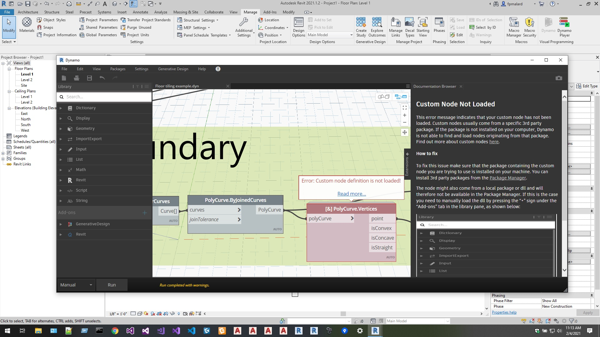
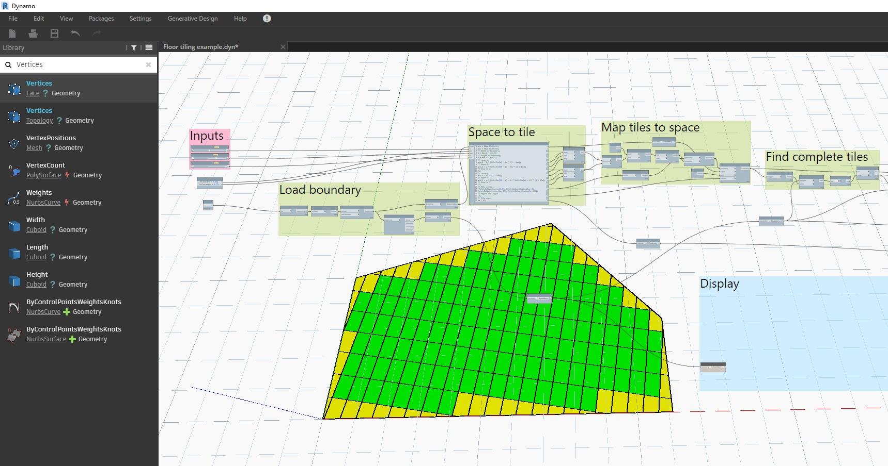

<head>
<meta http-equiv="Content-Type" content="text/html; charset=utf-8">
<link rel="stylesheet" type="text/css" href="bc.css">

</head>

<!---

twitter:

 the #RevitAPI @AutodeskForge @AutodeskRevit #bim #DynamoBim #ForgeDevCon 

&ndash; 
...

linkedin:

#bim #DynamoBim #ForgeDevCon #Revit #API #IFC #SDK #AI #VisualStudio #Autodesk #AEC #adsk

the [Revit API discussion forum](http://forums.autodesk.com/t5/revit-api-forum/bd-p/160) thread

-->

### Generative Design Add-In

#### Generative Design in C&#35;

Fernando Malard, CTO at [ofcdesk](http://ofcdesk.com), brought up an intersting question that Kean Walmsley kindly clarified:

**Question:** Looking for a suggestion about what route to pursue...
 
We are creating a Revit plugin for a customer that requires a wall panel tiling system in Revit.

The tiling problem involves lots of optimization variables and it would be perfect to be addressed by a Generative algorithm.
 
Basically, the plugin would walk through the project walls (inside and outside), perform panel tiling, evaluate, do the genetic operations, repeat, etc.
 
Is it possible to use Revit GD tools via C# API or is it mandatory to use Dynamo?
 
I know we could pursue the creation of an SGAII or III algorithm in pure C# but Revit/Forge would give us those extremely helpful tools to visualize design options, parameter graphs, etc.
 
Any advice here?

**Answer:** It does sound like a good use of GD.
 
That said, the GD feature doesn’t have an automation API: you use Dynamo to define the parametric models that it uses. The Dynamo graph can use C# “zero-touch” nodes, if you want it to &ndash; and people more commonly integrate Python code, when they need to &ndash; but that’s just helping flesh out the logic of the graph, it’s not to automate the overall process.
 
In case it helps, I made a first pass (which is not at all optimal) at doing
a [floor tiling graph for use with Refinery](https://autode.sk/tiling-graph) ([^](zip/RefineryTiling.zip)).

**Response:** Interesting.
 
Is it possible to trigger the Dynamo graph from Revit and have it running in the background? 
 
Maybe we could create the manager app in C# and call the graph as we need without exposing Dynamo UI to the end user.

I just want to avoid any complexity to the user.
 
Thanks!

**Answer:** The user doesn’t see Dynamo at all: the GD feature does exactly what you’ve described (actually that’s it’s whole point &nbsp; :-)).

**Response:** It seems your sample graph loads ok but it shows a missing PolyCurve custom node:

 <!-- 1920 -->

 
I’m running Revit 2021.1.2, Dynamo Core 2.6.1.8786 and Dynamo Revit 2.6.1.8850.

Any additional package I need to install?

**Answer:** Ampersand, I believe.

**Response:** Exactly, thanks!

 <!-- 1719 -->

<!--

**Question:** 

<pre>
</pre>

**Answer:** 

**Response:** 

#### 

-->