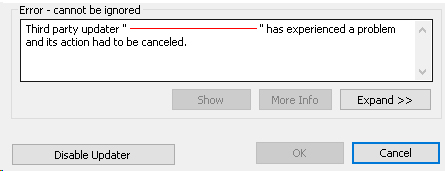

<head>
<meta http-equiv="Content-Type" content="text/html; charset=utf-8">
<link rel="stylesheet" type="text/css" href="bc.css">

</head>

<!---

- addin manifest diy
  https://thebuildingcoder.typepad.com/blog/2021/02/addin-file-learning-python-and-ifcjs.html#comment-5276653852

- No redemption for naughty updater
  https://autodesk.slack.com/archives/C0SR6NAP8/p1614361528035100
  Notify when IUpdater is disabled by Revit error and re-enable
  https://forums.autodesk.com/t5/revit-api-forum/notify-when-iupdater-is-disabled-by-revit-error-amp-re-enable/m-p/10114949

- Mohamed Adel, BIM Coordinator at SEPCO Electric Power Construction Corporation, Egypt
  https://www.linkedin.com/posts/mohamed-adel-a3b26160_autodesk-revit-modeling-activity-6769520499216158720-AFS7
  Using machine learning in modeling is quiet an approach which definitely will save hours of work.
I developed an application that can automatically model from linked AutoCAD file in Revit. Using machine learning concept which guide the Revit API to model the proper element.
In the following video This CAD contains only polylines with nothing to distinguish from each other. Either by layer or block name…etc.
The user will provide some initial information in the UI like which family to use in the loadable families, type of system families and the working levels
For any element it will automatically duplicate the family to a new type with right dimension that fits the linked polyline. This except the depth of the floors the user will choose which type.
This a beta version of the app a future development shall be done for better features and workflow.

- Why did IBM's OS/2 project lose to Microsoft, given that IBM had much more resources than Microsoft at that time?
  https://www.quora.com/Why-did-IBMs-OS-2-project-lose-to-Microsoft-given-that-IBM-had-much-more-resources-than-Microsoft-at-that-time/answers/12576993

- How to Turn Google Sheets into a REST API and Use it with a React Application
  https://www.freecodecamp.org/news/react-and-googlesheets/

- JavaScript Array Methods Tutorial – The Most Useful Methods Explained with Examples
  https://www.freecodecamp.org/news/complete-introduction-to-the-most-useful-javascript-array-methods/

- Allserver
  https://github.com/flash-oss/allserver
  Multi-transport and multi-protocol simple RPC server and (optional) client. Boilerplate-less. Opinionated. Minimalistic. DX-first.

twitter:

 the #RevitAPI @AutodeskForge @AutodeskRevit #bim #DynamoBim #ForgeDevCon 

Lots of exciting discussion going on in the Revit API discussion forum and elsewhere
&ndash; No redemption for naughty updaters
&ndash; DIY Add-in manifest DIY
&ndash; Generative design in C&#35;
&ndash; AI identifies and classifies BIM elements in 2D sketch...

linkedin:

#bim #DynamoBim #ForgeDevCon #Revit #API #IFC #SDK #AI #VisualStudio #Autodesk #AEC #adsk

the [Revit API discussion forum](http://forums.autodesk.com/t5/revit-api-forum/bd-p/160) thread

-->

### Naughty Updaters, DIY Add-In Manifest, GD, AI, etc.

Lots of exciting discussion going on in the [Revit API discussion forum](http://forums.autodesk.com/t5/revit-api-forum/bd-p/160) and elsewhere:

- [No redemption for naughty updaters](#2)
- [DIY Add-in manifest DIY](#3)
- [Generative design in C&#35;](#4)
- [AI identifies and classifies BIM elements in 2D sketch](#5)

#### No Redemption for Naughty Updaters

An interesting aspect of the DMU dynamic model updater framework was raised in
the [Revit API discussion forum](http://forums.autodesk.com/t5/revit-api-forum/bd-p/160) thread
on [notifying when `IUpdater` is disabled by Revit error and re-enabling](https://forums.autodesk.com/t5/revit-api-forum/notify-when-iupdater-is-disabled-by-revit-error-amp-re-enable/m-p/10114949),
and clarified for us by Scott Conover:

**Question:** Is there any way to be notified when an IUpdater is disabled by Revit error and re-enable it?

I have a several IUpdaters in my add-in of which a user can disable or enable by clicking an associated button. For example, there is a pushbutton A for IUpdaterA, which the Push Button image shows the status of the IUpdater.

On PushButton Click:

<pre class="code">
  if (UpdaterRegistry.IsUpdaterRegistered(updater.GetUpdaterId()))
  {
    UpdaterRegistry.UnregisterUpdater(updater.GetUpdaterId());
    pushButtonA.LargeImage = Off;
  }
  else
  {
    UpdaterRegistry.RegisterUpdater(updater);
    UpdaterRegistry.EnableUpdater(updater.GetUpdaterId());
    // ... Add Triggers, etc. (omitted here for conciseness)
    pushButtonA.LargeImage = On;
  }
</pre>

This works fine when the user manually clicks and turns on or off the IUpdater.
However, when something during the session or project environment causes the IUpdater execution to fail throwing an error, the button does not respond to re-enabling the IUpdater after it has been disabled:

 <!-- 445 -->

So, two questions:

- When this error is thrown and disable Updater is clicked, is there a way to tie this back to change the pushButtonA img to OFF?
- As seen in the code, `UpdaterRegistry.EnableUpdater` is used but it doesn't seem to enable the `IUpdater` back up after it has been disabled through the error dialog. How can one re-enable it?

This is not to say one should always want to re-enable a disabled IUpdater as there was a reason it was disabled, but in some cases under discretion it may be due to something resolvable like loading in a missing family that was needed, etc.
In those situations, it would be ideal to resolve the missing item, and re-enable the IUpdater back up.

Thank you.

**Answer:** Thank you for the interesting question.

If all else fails, have you tried to unregister the updater and reinitialise it completely from scratch?

Or, even more extremely, maybe even change its GUID, so that every failed updater GUID is discarded, and a new one issued on every failure?

Anyway, I have asked the development team whether they have any constructive suggestions for you.

They respond: this is asking the question in the wrong way.

If it's critical to keep the Updater functional, it's on the implementer to ensure that exceptions are not passed back to Revit.

Of course, there are runtime things (System exceptions) that they may not want to catch and deal with, but if the exceptions are thrown from Revit API calls when the updater tries to do its work, I'd suggest the updater catch and deal with them.

It may be that once a call-back or interface class starts throwing exceptions, it goes put on the "naughty list".

There may be no way to recover from that in the current session.

Richard [RPThomas108](https://forums.autodesk.com/t5/user/viewprofilepage/user-id/1035859) Thomas added an explanation of how the current 'naughty list' approach disabling the updater may lead to (the most knowledgeable) people not using DMU at all:

The only possible approach perhaps, since that is a failure, would be to deal with the failure:

- Autodesk.Revit.DB.BuiltInFailures.DocumentFailures.DUMisbehavingUpdater

If you are able to cancel, rather than user doing it (not sure), you are then able to the disable your updater yourself and know about it.

I've long found this approach to 'suspending' rather than disabling DMU's very problematic.
For example, people have asked me 'why can't you make it so pile coordinates are updated automatically when they are moved?'
In theory, I know I could use a DMU for this, but what happens if it gets disabled halfway through an alteration and the user assumes something is being updated when it is not?
I then potentially have a pile schedule with incorrect coordinates being sent out and the distinct possibility of very expensive work being done in the wrong place (I hope some sanity check would prevent that but you never know).
These are the users that say, "I'm just the guy pressing the button (your button)!"

You need some fail-safe approach, really.
So, I prefer to press a button at a certain point to do a task, then check the results against previous before issue.
Even for the most simplistic code DMU's have the potential to be disabled due to complex interactions, i.e., you can account for your own code, but not that of other DMU's by others and the timings of such (the impacts for the states of elements these have between your interactions).

Thanks to Scott and Richard for their input on this.

#### DIY Add-In Manifest

Joshua Lumley added
a [comment](https://thebuildingcoder.typepad.com/blog/2021/02/addin-file-learning-python-and-ifcjs.html#comment-5276653852) on the discussion
on  showing
how to generate your own add-in manifest XML `addin` file on the fly:

> This is the code I use to make the manifest from the CustomMethods of the Deployment Project.

<pre class="code">
void&nbsp;GenerateAddInManifest(
&nbsp;&nbsp;string&nbsp;dll_folder,
&nbsp;&nbsp;string&nbsp;dll_name&nbsp;)
{
&nbsp;&nbsp;string&nbsp;sDir&nbsp;=&nbsp;Environment.GetFolderPath(
&nbsp;&nbsp;&nbsp;&nbsp;Environment.SpecialFolder.CommonApplicationData&nbsp;)
&nbsp;&nbsp;&nbsp;&nbsp;+&nbsp;&quot;\\Autodesk\\Revit\\Addins&quot;;
 
&nbsp;&nbsp;bool&nbsp;exists&nbsp;=&nbsp;Directory.Exists(&nbsp;sDir&nbsp;);
 
&nbsp;&nbsp;if(&nbsp;!exists&nbsp;)
&nbsp;&nbsp;&nbsp;&nbsp;Directory.CreateDirectory(&nbsp;sDir&nbsp;);
 
&nbsp;&nbsp;XElement&nbsp;XElementAddIn&nbsp;=&nbsp;new&nbsp;XElement(&nbsp;&quot;AddIn&quot;,
&nbsp;&nbsp;&nbsp;&nbsp;new&nbsp;XAttribute(&nbsp;&quot;Type&quot;,&nbsp;&quot;Application&quot;&nbsp;)&nbsp;);
 
&nbsp;&nbsp;XElementAddIn.Add(&nbsp;new&nbsp;XElement(&nbsp;&quot;Name&quot;,&nbsp;dll_name&nbsp;)&nbsp;);
&nbsp;&nbsp;XElementAddIn.Add(&nbsp;new&nbsp;XElement(&nbsp;&quot;Assembly&quot;,&nbsp;dll_folder&nbsp;+&nbsp;dll_name&nbsp;+&nbsp;&quot;.dll&quot;&nbsp;)&nbsp;);
&nbsp;&nbsp;XElementAddIn.Add(&nbsp;new&nbsp;XElement(&nbsp;&quot;AddInId&quot;,&nbsp;Guid.NewGuid().ToString()&nbsp;)&nbsp;);
&nbsp;&nbsp;XElementAddIn.Add(&nbsp;new&nbsp;XElement(&nbsp;&quot;FullClassName&quot;,&nbsp;dll_name&nbsp;+&nbsp;&quot;.SettingUpRibbon&quot;&nbsp;)&nbsp;);
&nbsp;&nbsp;XElementAddIn.Add(&nbsp;new&nbsp;XElement(&nbsp;&quot;VendorId&quot;,&nbsp;&quot;01&quot;&nbsp;)&nbsp;);
&nbsp;&nbsp;XElementAddIn.Add(&nbsp;new&nbsp;XElement(&nbsp;&quot;VendorDescription&quot;,&nbsp;&quot;Joshua&nbsp;Lumley&nbsp;Secrets,&nbsp;twitter&nbsp;@joshnewzealand&quot;&nbsp;)&nbsp;);
 
&nbsp;&nbsp;XElement&nbsp;XElementRevitAddIns&nbsp;=&nbsp;new&nbsp;XElement(&nbsp;&quot;RevitAddIns&quot;&nbsp;);
&nbsp;&nbsp;XElementRevitAddIns.Add(&nbsp;XElementAddIn&nbsp;);
 
&nbsp;&nbsp;foreach(&nbsp;string&nbsp;d&nbsp;in&nbsp;Directory.GetDirectories(&nbsp;sDir&nbsp;)&nbsp;)
&nbsp;&nbsp;{
&nbsp;&nbsp;&nbsp;&nbsp;string&nbsp;myString_ManifestPath&nbsp;=&nbsp;d&nbsp;+&nbsp;&quot;\\&quot;&nbsp;+&nbsp;dll_name&nbsp;+&nbsp;&quot;.addin&quot;;
 
&nbsp;&nbsp;&nbsp;&nbsp;string[]&nbsp;directories&nbsp;=&nbsp;d.Split(&nbsp;Path.DirectorySeparatorChar&nbsp;);
 
&nbsp;&nbsp;&nbsp;&nbsp;if(&nbsp;int.TryParse(&nbsp;directories[&nbsp;directories.Count()&nbsp;-&nbsp;1&nbsp;],
&nbsp;&nbsp;&nbsp;&nbsp;&nbsp;&nbsp;out&nbsp;int&nbsp;myInt_FromTextBox&nbsp;)&nbsp;)
&nbsp;&nbsp;&nbsp;&nbsp;{
&nbsp;&nbsp;&nbsp;&nbsp;&nbsp;&nbsp;//&nbsp;Install&nbsp;on&nbsp;version&nbsp;2017&nbsp;and&nbsp;above
 
&nbsp;&nbsp;&nbsp;&nbsp;&nbsp;&nbsp;if(&nbsp;myInt_FromTextBox&nbsp;&gt;=&nbsp;2017&nbsp;)
&nbsp;&nbsp;&nbsp;&nbsp;&nbsp;&nbsp;{
&nbsp;&nbsp;&nbsp;&nbsp;&nbsp;&nbsp;&nbsp;&nbsp;new&nbsp;XDocument(&nbsp;XElementRevitAddIns&nbsp;).Save(
&nbsp;&nbsp;&nbsp;&nbsp;&nbsp;&nbsp;&nbsp;&nbsp;&nbsp;&nbsp;myString_ManifestPath&nbsp;);
&nbsp;&nbsp;&nbsp;&nbsp;&nbsp;&nbsp;}
&nbsp;&nbsp;&nbsp;&nbsp;&nbsp;&nbsp;else
&nbsp;&nbsp;&nbsp;&nbsp;&nbsp;&nbsp;{
&nbsp;&nbsp;&nbsp;&nbsp;&nbsp;&nbsp;&nbsp;&nbsp;if(&nbsp;File.Exists(&nbsp;myString_ManifestPath&nbsp;)&nbsp;)
&nbsp;&nbsp;&nbsp;&nbsp;&nbsp;&nbsp;&nbsp;&nbsp;{
&nbsp;&nbsp;&nbsp;&nbsp;&nbsp;&nbsp;&nbsp;&nbsp;&nbsp;&nbsp;File.Delete(&nbsp;myString_ManifestPath&nbsp;);
&nbsp;&nbsp;&nbsp;&nbsp;&nbsp;&nbsp;&nbsp;&nbsp;}
&nbsp;&nbsp;&nbsp;&nbsp;&nbsp;&nbsp;}
&nbsp;&nbsp;&nbsp;&nbsp;}
&nbsp;&nbsp;}
}
</pre>

Many thanks to Joshua for sharing this DIY approach.
I added it to The Building Coder samples, cf.
the [diff to the previous version](https://github.com/jeremytammik/the_building_coder_samples/compare/2021.0.150.19...2021.0.150.20).

#### Generative Design in C&#35;

Fernando Malard, CTO at [ofcdesk](http://ofcdesk.com), brought up an interesting question that an unnamed colleague of mine <!-- Kean Walmsley --> kindly clarified:

**Question:** Looking for a suggestion about what route to pursue...
 
We are creating a Revit plugin for a customer that requires a wall panel tiling system in Revit.

The tiling problem involves lots of optimization variables and it would be perfect to be addressed by a Generative algorithm.
 
Basically, the plugin would walk through the project walls (inside and outside), perform panel tiling, evaluate, do the genetic operations, repeat, etc.
 
Is it possible to use Revit GD tools via C# API or is it mandatory to use Dynamo?
 
I know we could pursue the creation of an SGAII or III algorithm in pure C# but Revit/Forge would give us those extremely helpful tools to visualize design options, parameter graphs, etc.
 
Any advice here?

**Answer:** It does sound like a good use of GD.
 
That said, the GD feature doesn’t have an automation API: you use Dynamo to define the parametric models that it uses. The Dynamo graph can use C# “zero-touch” nodes, if you want it to &ndash; and people more commonly integrate Python code, when they need to &ndash; but that’s just helping flesh out the logic of the graph, it’s not to automate the overall process.
 
In case it helps, I made a first pass (which is not at all optimal) at doing
a [floor tiling graph for use with Refinery](https://autode.sk/tiling-graph) ([^](zip/RefineryTiling.zip)).

**Response:** Interesting.
 
Is it possible to trigger the Dynamo graph from Revit and have it running in the background? 
 
Maybe we could create the manager app in C# and call the graph as we need without exposing Dynamo UI to the end user.

I just want to avoid any complexity to the user.
 
Thanks!

**Answer:** The user doesn’t see Dynamo at all: the GD feature does exactly what you’ve described (actually that’s it’s whole point &nbsp; :-)).

**Response:** It seems your sample graph loads ok but it shows a missing PolyCurve custom node:

 <!-- 1920 -->

 
I’m running Revit 2021.1.2, Dynamo Core 2.6.1.8786 and Dynamo Revit 2.6.1.8850.

Any additional package I need to install?

**Answer:** Ampersand, I believe.

**Response:** Exactly, thanks!

 <!-- 1719 -->

#### AI Identifies and Classifies BIM Elements in 2D Sketch

Before closing, I'd like to pick up a couple of interesting miscellaneous items I happened to run into, starting with
a [LinkedIn post](https://www.linkedin.com/posts/mohamed-adel-a3b26160_autodesk-revit-modeling-activity-6769520499216158720-AFS7)
by Mohamed Adel, BIM Coordinator at SEPCO Electric Power Construction Corporation, Egypt:

> Using machine learning in modelling is quite an approach which definitely will save hours of work.
I developed an application that can automatically model from linked AutoCAD file in Revit.
Using machine learning concept which guide the Revit API to model the proper element.
In his video, a CAD contains only polylines with nothing to distinguish them from each other. 
The user provides some initial information in the UI like which family to use in the loadable families, type of system families and working levels.
For any element it will automatically duplicate the family to a new type with the right dimension that fits the linked polyline.
For the depth of the floors, the user will choose which type.

<video width="480" height="270" preload="metadata" muted="muted" src="https://dms.licdn.com/playlist/C4D05AQGre2tKOAOL2w/mp4-720p-30fp-crf28/0/1613979455733?e=1614873600&amp;v=beta&amp;t=q2FZMnMx01AELeo7dzDOJm7L553O4Dj3cxRS4a3uUEQ" autoplay="autoplay"></video>

<!-- 

  

  
  <video class="vjs-tech" id="vjs_video_3_html5_api" tabindex="-1" preload="metadata" muted="muted" src="https://dms.licdn.com/playlist/C4D05AQGre2tKOAOL2w/mp4-720p-30fp-crf28/0/1613979455733?e=1614873600&amp;v=beta&amp;t=q2FZMnMx01AELeo7dzDOJm7L553O4Dj3cxRS4a3uUEQ" autoplay="autoplay">
  </video>
    

<button class="vjs-big-play-button" type="button" title="Play" aria-disabled="false">Play</button>
Media is loading

Loaded: 62.51%

0:10

0:08

<button class="vjs-play-control vjs-control vjs-button vjs-paused" type="button" aria-disabled="false" title="Play">Play
Play
</button><button class="vjs-control vjs-button vjs-back-to-start-button" type="button" aria-disabled="false" title="Back to start of video">Back to start of video
Back to start
</button>
Current time&nbsp;0:08

/

Duration&nbsp;1:54

Stream Type&nbsp;LIVE

&nbsp;
<button class="vjs-control vjs-button vjs-hidden vjs-captions-toggle" type="button" aria-disabled="false" title="Turn closed captions on">Turn closed captions on
Show captions
</button>
<button class="vjs-mute-control vjs-control vjs-button vjs-vol-0" type="button" title="Unmute" aria-disabled="false">Unmute</button>

<button class="vjs-fullscreen-control vjs-control vjs-button" type="button" aria-disabled="false" title="Turn fullscreen on">Turn fullscreen on
Fullscreen
</button>

Media player modal window

-->

It looks pretty neat!

Here are a few more:

- Why did OS/2 Lose to Windows 3?
   [Why did IBM's OS/2 project lose to Microsoft, given that IBM had much more resources than Microsoft at that time?](https://www.quora.com/Why-did-IBMs-OS-2-project-lose-to-Microsoft-given-that-IBM-had-much-more-resources-than-Microsoft-at-that-time/answers/12576993)
- Google Sheets as a REST API and React App
   [How to turn Google sheets into a REST API and use it with a React application](https://www.freecodecamp.org/news/react-and-googlesheets)
- [JavaScript array methods tutorial &ndash; the most useful methods explained with examples](https://www.freecodecamp.org/news/complete-introduction-to-the-most-useful-javascript-array-methods)
- [Allserver](https://github.com/flash-oss/allserver), a minimalist multi-transport and multi-protocol simple RPC server and (optional) client

