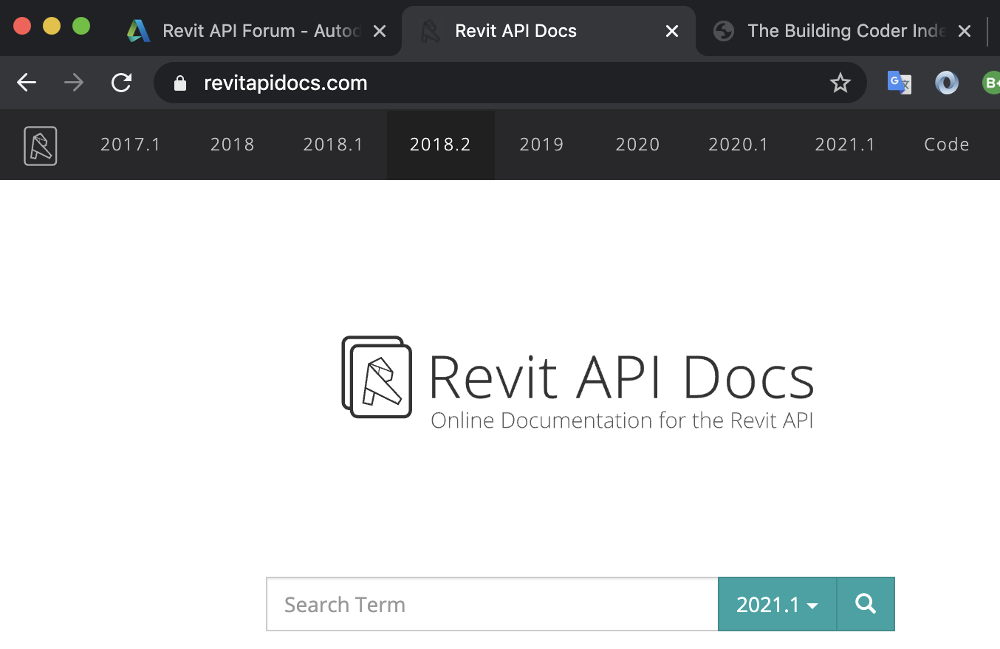

<head>
<meta http-equiv="Content-Type" content="text/html; charset=utf-8">
<link rel="stylesheet" type="text/css" href="bc.css">

</head>

<!---

- https://twitter.com/ipetrbroz/status/1370652255662309377?s=20
  Forge Online Training: April 2021
  https://forge.autodesk.com/blog/forge-online-training-april-2021

- ApiDocs.co was updated last month and ReviApiDocs.com was updated today! Gui Talarico
  revitapidocs_2021.png

- simon jones was one of the first and foremost aec oriented people at autodesk fr a couple of decades in the previous millennium.
  simon recently left autodesk after over 35 years with us and launched [AEC BIM TOOLS](https://www.aecbimtools.com)
  since then, he published his first own Revit add-in, a [Shared Parameter Inspector for Revit](https://www.aecbimtools.com/sharedparameterinspector).
  you can download and test run a trial version. if you find it useful, you can donate what you think it is worth to you.

- feedback on Visual Materials API -- https://autodesk.slack.com/archives/C0SR6NAP8/p1615391423002700
  Scott Conover 10 Mar at 16:50
  Some feedback (praise and constructive criticism) for the Visual Materials API we exposed a few years ago: https://archi-lab.net/few-more-comments-about-materials-in-revit-dynamo-apis-etc/  @Boris Shafiro @Alex Pytel @Alex Zhang  One interesting question raised was about setting the name for new elements and the need for for a try/catch to ensure uniqueness for the name being assigned; seems we could be doing better there.
  Alex Pytel:shell:  9 days ago
  the image at the bottom is very helpful
  assetnames.jpg 
  Jacob Small  9 days ago
  In my opinion this is the sort of documentation we should aim for. Clear, simple, A is B in the other environment.
  There are a lot of consumers of the API now with no coding background as a result of things like Dynamo, PyRevit, and RhinoInside.
  The fact that there isn't a easy to consume 1:1 mapping like this for our complex tool makes it difficult to do things easily and leads to a lot of rants. This is compounded by the go to resource of sharable API info (revitapidocs.com) having apparently fallen into a no-longer-maintained status.
  The concepts we've been doing in depth technical write ups need to be simplified for this large cohort of users. It's a big ask, but would have a HUGE impact.
  Alex Zhang  8 days ago
  add @Joe Qiao to this thread.

- 24x24 StackedItems
  https://forums.autodesk.com/t5/revit-api-forum/24x24-stackeditems/m-p/10169950

- drone driving film making to new heights, lengths, curves and other experiences
  https://www.abc.net.au/news/2021-03-12/hollywood-drone-video-minnesota-bowling-alley/13241718

twitter:

Forge online training, RevitApiDocs update, Visual Materials API in Dynamo and 24x24 stacked ribbon items in the #RevitAPI @AutodeskForge @AutodeskRevit #bim #DynamoBim #ForgeDevCon http://autode.sk/revitapidocs2021

Here are some exciting Forge, Revit API and other topics for today
&ndash; Forge online training in April 2021
&ndash; RevitApiDocs support for Revit 2021
&ndash; Welcome, AEC BIM Tools
&ndash; Visual materials API in Dynamo
&ndash; 24x24 stacked ribbon items
&ndash; Innovative drone fly-through film...

linkedin:

Forge online training, RevitApiDocs update, Visual Materials API in Dynamo and 24x24 stacked ribbon items in the #RevitAPI

http://autode.sk/revitapidocs2021

Here are some exciting Forge, Revit API and other topics for today:

- Forge online training in April 2021
- RevitApiDocs support for Revit 2021
- Welcome, AEC BIM Tools
- Visual materials API in Dynamo
- 24x24 stacked ribbon items
- Innovative drone fly-through film...

#bim #DynamoBim #ForgeDevCon #Revit #API #IFC #SDK #AI #VisualStudio #Autodesk #AEC #adsk

the [Revit API discussion forum](http://forums.autodesk.com/t5/revit-api-forum/bd-p/160) thread

-->

### Forge, RevitApiDocs, Materials and Stacked Items

Here are some exciting Forge, Revit API and other topics for this week:

- [Forge online training in April 2021](#2)
- [RevitApiDocs support for Revit 2021](#3)
- [Welcome, AEC BIM Tools](#4)
- [Visual materials API in Dynamo](#5)
- [24x24 stacked ribbon items](#6)
- [Innovative drone fly-through film](#7)

#### Forge Online Training in April 2021

Are you interested in getting started with the Autodesk Forge platform development, perhaps in a more interactive, guided way?
Or maybe you already have experience with our platform, and are just interested in honing your skills?
If so, come and join us for another series of Forge Training webinars from April 13th until April 16th.
During these days, our dev advocates will guide your through the development of sample applications (using Node.js or .NET) leveraging different parts of Forge, and answer your questions along the way as you develop these applications yourself.
You can refer to Petr Broz's blog post for full details and register
either [here](https://www.eventbrite.com/e/forge-online-training-april-13-16-2021-registration-145580133097) or
there:

<a href="https://forge.autodesk.com/blog/forge-online-training-april-2021">Forge Online Training: April 2021</a>

#### RevitApiDocs Support for Revit 2021

Back to the Revit API, Gui Talarico just announced an update to the online Revit API documentation for Revit 2021.1:

> [ApiDocs.co](https://apidocs.co) was updated last month and [RevitApiDocs.com](https://www.revitapidocs.com) last Friday!

Very many thanks to Gui for the great news and all his work on this invaluable resource.

We hope to reduce the turn-around time for the next release &nbsp; :-)

 <!-- 1354 -->

#### Welcome, AEC BIM Tools

Simon Jones was one of the first and foremost AEC oriented people at Autodesk for a couple of decades in the previous millennium.
Simon recently left Autodesk after over 35 years with us and launched [AEC BIM Tools](https://www.aecbimtools.com).
He now published his first own Revit add-in, a [Shared Parameter Inspector for Revit](https://www.aecbimtools.com/sharedparameterinspector).
You can download and test run a trial version.
If you find it useful, you can donate what you think it is worth to you.

Good luck and much success in your new adventure, Simon!

#### Visual Materials API in Dynamo

Konrad K Sobon published
a [few more comments about materials in Revit, Dynamo, APIs etc](https://archi-lab.net/few-more-comments-about-materials-in-revit-dynamo-apis-etc).

It explores the use of Dynamo to create materials in Revit from something like an Excel spreadsheet, presents several useful solutions and also points out weaknesses in the current API functionality.

The material appearance asset property mapping image at the end is especially useful and valuable:

 <!-- 2560 -->

#### 24x24 Stacked Ribbon Items

Diving deeper into some practical coding, let's look at 
the [Revit API discussion forum](http://forums.autodesk.com/t5/revit-api-forum/bd-p/160) thread
on [24x24 StackedItems](https://forums.autodesk.com/t5/revit-api-forum/24x24-stackeditems/m-p/10169950):

**Question:** This may be an easy one, but so far I am struggling to find anything specific about it.
How do you make a `StackedItem` where the icons are 24x24 when there are only 2 in the stack?
It seems like it should be possible as it is used multiple times in the modify tab, cf. this example:

 <!-- 246 -->

I have been able to set the `ShowText` property to `false` to get the 3 stacked icons, but, when I use the same method with the 2 icon stack, it remains 16x16, regardless of the icon resolution.
I have tried to obtain and change the button's height and width, minWidth and minHeight through the Autodesk.Window.RibbonItem object to no avail.
Has anyone had any success in creating these icons?

Alexander [@aignatovich](https://forums.autodesk.com/t5/user/viewprofilepage/user-id/1257478) [@CADBIMDeveloper](https://github.com/CADBIMDeveloper) Ignatovich, aka Александр Игнатович, presents an elegant solution with some very pretty code indeed:
 
**Answer:** I succeeded &nbsp; :-) 

With text:

 <!-- 144 -->

Without text:

 <!-- 144 -->

<pre class="code">
&nbsp;&nbsp;var&nbsp;revitRibbonItem&nbsp;=&nbsp;UIFramework.RevitRibbonControl
&nbsp;&nbsp;&nbsp;&nbsp;.RibbonControl.findRibbonItemById(&nbsp;
&nbsp;&nbsp;&nbsp;&nbsp;&nbsp;&nbsp;ribbonItem.GetId()&nbsp;);
 
&nbsp;&nbsp;if(&nbsp;useMediumIconSize&nbsp;)
&nbsp;&nbsp;&nbsp;&nbsp;revitRibbonItem.Size&nbsp;=&nbsp;RibbonItemSize.Large;
 
&nbsp;&nbsp;if(&nbsp;hideButtonCaption&nbsp;)
&nbsp;&nbsp;&nbsp;&nbsp;revitRibbonItem.ShowText&nbsp;=&nbsp;false;
</pre>

`GetId` is an extension method:

<pre class="code">
&nbsp;&nbsp;internal&nbsp;static&nbsp;class&nbsp;RibbonItemExtensions
&nbsp;&nbsp;{
&nbsp;&nbsp;&nbsp;&nbsp;public&nbsp;static&nbsp;string&nbsp;GetId(&nbsp;
&nbsp;&nbsp;&nbsp;&nbsp;&nbsp;&nbsp;this&nbsp;RibbonItem&nbsp;ribbonItem&nbsp;)
&nbsp;&nbsp;&nbsp;&nbsp;{
&nbsp;&nbsp;&nbsp;&nbsp;&nbsp;&nbsp;var&nbsp;type&nbsp;=&nbsp;typeof(&nbsp;RibbonItem&nbsp;);
 
&nbsp;&nbsp;&nbsp;&nbsp;&nbsp;&nbsp;var&nbsp;parentId&nbsp;=&nbsp;type
&nbsp;&nbsp;&nbsp;&nbsp;&nbsp;&nbsp;&nbsp;&nbsp;.GetField(&nbsp;&quot;m_parentId&quot;,&nbsp;
&nbsp;&nbsp;&nbsp;&nbsp;&nbsp;&nbsp;&nbsp;&nbsp;&nbsp;&nbsp;BindingFlags.Instance&nbsp;
&nbsp;&nbsp;&nbsp;&nbsp;&nbsp;&nbsp;&nbsp;&nbsp;&nbsp;&nbsp;|&nbsp;BindingFlags.NonPublic&nbsp;)
&nbsp;&nbsp;&nbsp;&nbsp;&nbsp;&nbsp;&nbsp;&nbsp;?.GetValue(&nbsp;ribbonItem&nbsp;)&nbsp;
&nbsp;&nbsp;&nbsp;&nbsp;&nbsp;&nbsp;&nbsp;&nbsp;??&nbsp;string.Empty;
 
&nbsp;&nbsp;&nbsp;&nbsp;&nbsp;&nbsp;var&nbsp;generateIdMethod&nbsp;=&nbsp;type
&nbsp;&nbsp;&nbsp;&nbsp;&nbsp;&nbsp;&nbsp;&nbsp;.GetMethod(&nbsp;&quot;generateId&quot;,&nbsp;
&nbsp;&nbsp;&nbsp;&nbsp;&nbsp;&nbsp;&nbsp;&nbsp;&nbsp;&nbsp;BindingFlags.Static&nbsp;
&nbsp;&nbsp;&nbsp;&nbsp;&nbsp;&nbsp;&nbsp;&nbsp;&nbsp;&nbsp;|&nbsp;BindingFlags.NonPublic&nbsp;);
 
&nbsp;&nbsp;&nbsp;&nbsp;&nbsp;&nbsp;return&nbsp;(string)&nbsp;generateIdMethod?.Invoke(&nbsp;
&nbsp;&nbsp;&nbsp;&nbsp;&nbsp;&nbsp;&nbsp;&nbsp;ribbonItem,&nbsp;new[]&nbsp;{
&nbsp;&nbsp;&nbsp;&nbsp;&nbsp;&nbsp;&nbsp;&nbsp;&nbsp;&nbsp;parentId,&nbsp;ribbonItem.Name&nbsp;}&nbsp;);
&nbsp;&nbsp;&nbsp;&nbsp;}
&nbsp;&nbsp;}
</pre>

Many thanks to Alexander for the nice solution and the succinct, instructive and inspiring coding.

#### Innovative Drone Fly-Through Film

The one-and-a-half-minute drone video [Right Up Our Alley](https://youtu.be/VgS54fqKxf0) may
help drive film making to new heights, lengths, curves and other experiences
&ndash; [Hollywood bigwigs shower praise on creators of Minnesota bowling alley drone video](https://www.abc.net.au/news/2021-03-12/hollywood-drone-video-minnesota-bowling-alley/13241718):

> A single-take video shot with a drone flying through a Minnesota bowling alley has been hailed as "stupendous" by a string of celebrities and big-name film-makers.
From there, the drone flies in and around bowlers in the lanes and drinkers at the bar, going in between legs and into the back compartment where the bowling pins are swept up and set up and all around &ndash; all in one shot.
It finishes with something of a cliffhanger (SPOILER: No drones were seriously harmed in the making of the video).
Key points:

> - The video is all one-take
- It took about 10 to 12 attempts
- The only thing added in post-production is the audio
- The filmmakers are trying to encourage people to return to bars, restaurants and bowling alleys
- The near 90-second video titled [Right Up Our Alley](https://youtu.be/VgS54fqKxf0) begins outside, the drone swoops in from across the street, through the doors, all around the bowling alley, bar, between people, next to the rolling bowling ball, ...

<iframe width="480" height="270" src="https://www.youtube.com/embed/VgS54fqKxf0" title="Right Up Our Alley" frameborder="0" allow="accelerometer; autoplay; clipboard-write; encrypted-media; gyroscope; picture-in-picture" allowfullscreen></iframe>

