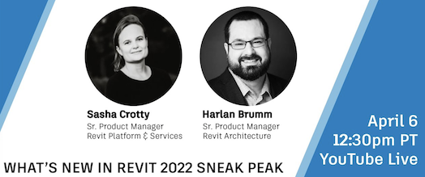
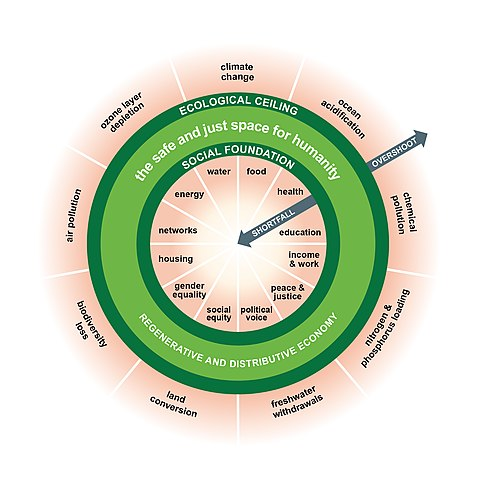

<head>
<meta http-equiv="Content-Type" content="text/html; charset=utf-8">
<link rel="stylesheet" type="text/css" href="bc.css">

</head>

<!---

- What's New in Revit 2022 Sneak Peek
  https://youtu.be/FjSbv6W6tcg
  Join Senior Revit Product Manager's Sasha Crotty and Harlan Brumm for a Live Preview of What's New in Revit 2022, including their favorite new features.

- normalise arc start and end angle
  How to retrieve startAngle and endAngle of Arc object
  https://forums.autodesk.com/t5/revit-api-forum/how-to-retrieve-startangle-and-endangle-of-arc-object/m-p/10213537#M54910

- the doughnout economic model is gaining official acceptnce, e.g.,
  https://en.wikipedia.org/wiki/Doughnut_(economic_model)
  Amsterdam bet its post-Covid recovery on ‘doughnut’ economics — more cities are now following suit
  https://www.cnbc.com/2021/03/25/amsterdam-brussels-bet-on-doughnut-economics-amid-covid-crisis.html

- create a set of column types from a list of dimensions
  https://forums.autodesk.com/t5/revit-api-forum/create-columns-types/m-p/10181049
  +
- Automatic Column Creation from Imported CAD Drawing
  https://forums.autodesk.com/t5/revit-api-forum/automatic-column-creation-from-imported-cad-drawing/m-p/9648240

- The Object Oriented Guide to Microservices & Serverless Architecture Whitepaper
  https://www.mongodb.com/collateral/download-the-oo-guide-to-microservices-and-serverless-architecture?utm_campaign=stack_ww_dg_flighted_overflowooguide_wp_dev&utm_source=stackoverflow&utm_medium=sponsored_newsletter

- Intriguing new result from the LHCb experiment at CERN
  https://home.cern/news/news/physics/intriguing-new-result-lhcb-experiment-cern
  The LHCb results strengthen hints of a violation of lepton flavour universality
  LHCb (Large Hadron Collider beauty) collaboration
  Today the LHCb experiment at CERN announced new results which, if confirmed, would suggest hints of a violation of the Standard Model of particle physics.
  
  [Standard Model](https://home.cern/science/physics/standard-model)
  The Standard Model explains how the basic building blocks of matter interact, governed by four fundamental forces.
  The theories and discoveries of thousands of physicists since the 1930s have resulted in a remarkable insight into the fundamental structure of matter: everything in the universe is found to be made from a few basic building blocks called fundamental particles, governed by four fundamental forces. Our best understanding of how these particles and three of the forces are related to each other is encapsulated in the Standard Model of particle physics. Developed in the early 1970s, it has successfully explained almost all experimental results and precisely predicted a wide variety of phenomena. Over time and through many experiments, the Standard Model has become established as a well-tested physics theory.
  
  [Standard Model](https://en.wikipedia.org/wiki/Standard_Model)

twitter:

in the #RevitAPI @AutodeskForge @AutodeskRevit #bim #DynamoBim #ForgeDevCon 

&ndash; 
...

linkedin:

#bim #DynamoBim #ForgeDevCon #Revit #API #IFC #SDK #AI #VisualStudio #Autodesk #AEC #adsk

the [Revit API discussion forum](http://forums.autodesk.com/t5/revit-api-forum/bd-p/160) thread

-->

### Sneak Peek, Jobs and Placing Column Instances

Autodesk is offering exciting opportunities all over the place, and some lively discussion n creating column family symbols and automatically placing instances:

#### What's New in Revit 2022 Sneak Peek

Are you nterested in the new features and enhancements coming in the upcoming next release of Revit?

Take the opportunity to join the sneak peek webinar on What's New in Revit 2022 next week, on April 13, 2021, at 10am PT or 1pm ET.

- [What's New in Revit 2022 Sneak Peek](https://youtu.be/FjSbv6W6tcg)

> Join Senior Revit Product Manager's Sasha Crotty and Harlan Brumm for a Live Preview of What's New in Revit 2022, including their favorite new features.

> [Link to registration page](https://autode.sk/31xUn2g)

 <!-- 524 -->

#### Normalising Arc Start and End Angle

Richard [RPThomas108](https://forums.autodesk.com/t5/user/viewprofilepage/user-id/1035859) Thomas added some important notes on normalising arc start and end angles in
the [Revit API discussion forum](http://forums.autodesk.com/t5/revit-api-forum/bd-p/160) thread
on [how to retrieve startAngle and endAngle of arc object](https://forums.autodesk.com/t5/revit-api-forum/how-to-retrieve-startangle-and-endangle-of-arc-object/m-p/10213537):

What I've noticed recently is that the actual parameters of an arc can be far greater than 2 * pi, so how does this happen?

If you draw a detail arc and drag the ends of the arc one at a time around the circumference, the parameter values will accumulate and become greater than 2 pi (after 1 cycle).
They don't reset; you can effectively wind up the arc parameters this way (I discovered parameter numbers reaching 1000 degrees).
We could not create arcs otherwise since the creation method enforces p0 must be less than p1 and arcs are drawn anti clockwise.
When you cross the 2 pi or 0 boundary, you need p1 not to be starting again from 0, otherwise it would be less than p0 on the other side of the boundary.

So, as @JimJia noted, they are not reliable for arc start end angles (or are if the ends have not been manipulated in such a way).
However, in a way, you can get back to the correct angles between 0 and 2 x pi (since each rotation is a multiple of 2 x pi) i.e.

- Divide by 2 * pi
- Deduct integer part of result
- If this is less than 0 add 1 (to negative number)
- Multiply by 2 * pi

I'm not sure why you would need to do this however.

Other thing I would note is always use `Arc.XDirection` and `Arc.Normal` with `AngleOnPlaneTo` (rather than assuming), since arc can be flipped or rotated.

Also, above was related to winding the arc ends around the circumference in an anti-clockwise direction to increase parameter values.

If user drags ends around in a clockwise direction, then you get negative values for the parameters.
Takes less movement from original by user to go into negative domain, so this is more likely to be seen perhaps.

Many thanks to Richard for these helpful observations!

#### Many Exciting Opportunities at Autodesk

#### The Sustainable Doughnut Econmic Model

The [doughnout economic model](https://en.wikipedia.org/wiki/Doughnut_(economic_model)) is
gaining official acceptnce.
For instance, [Amsterdam bet its post-Covid recovery on doughnut economics, and more cities are now following suit](https://www.cnbc.com/2021/03/25/amsterdam-brussels-bet-on-doughnut-economics-amid-covid-crisis.html).

> The Doughnut, or Doughnut economics, is a visual framework for sustainable development &ndash; shaped like a doughnut or lifebelt &ndash; combining the concept of planetary boundaries with the complementary concept of social boundaries:

 <!-- 489 -->

- What's New in Revit 2022 Sneak Peek
  https://youtu.be/FjSbv6W6tcg
  Join Senior Revit Product Manager's Sasha Crotty and Harlan Brumm for a Live Preview of What's New in Revit 2022, including their favorite new features.
  2021-04-06_rvt_2022_sneak_peek.png

Then register to join product experts from Autodesk for the "What's New in Revit 2022" webinar on April 13, 2021, at 10am PT/1pm ET.

Link to registration page: https://autode.sk/31xUn2g
