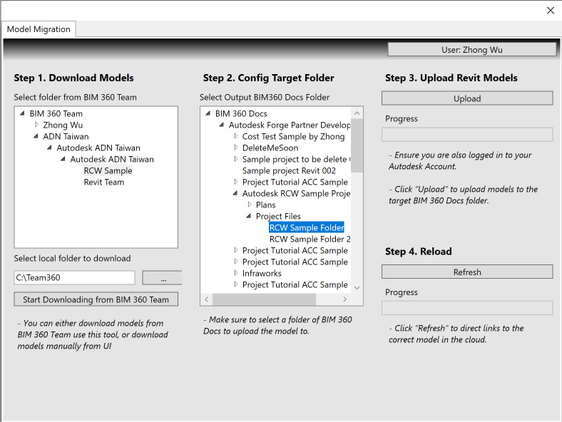

<head>
<meta http-equiv="Content-Type" content="text/html; charset=utf-8">
<link rel="stylesheet" type="text/css" href="bc.css">

</head>

<!---

- zhong
  I have a Revit Addon sample, which demostrate migrating Revit cloud worksharing models from BIM 360 Team to BIM 360 Docs using the latest Revit API(2022). It’s a Revit plugin with integration of Forge DM, mainly target for Revit developer. Currently I put it under my personal repo at https://github.com/JohnOnSoftware/forge-rcw.file.migration-revit.addon, but I am thinking to move it to https://github.com/ADN-DevTech or https://github.com/autodesk-Forge, I think https://github.com/ADN-DevTech is better place, but your ideas?
  Here is the blog of this sample: https://forge.autodesk.com/blog/migrate-revit-worksharing-models-bim-360-team-bim-360-docs-powered-revit-2022-cloud
  Yes, the goal of this sample is to demonstrate the process to migrate Revit cloud worksharing models from BIM 360 Team to BIM 360 Docs, Forge related, but the core API is within Revit. Will make it clear if we put under Autodesk-Forge.
  And for your question, normally, our tools use the process environment variable, set the environments within the command line before running the application.
  But for the Revit plugin, since this should be running within Revit, it’s not user-friendly to running Revit every time from the command line with process environment variables setup, using user environment variable could solve this problem to make it easy, and only the user can get the environment variables…
  The instruction for the 3 different environment variable type is: https://docs.microsoft.com/en-us/dotnet/api/system.environmentvariabletarget?view=netframework-4.8
  zw_bim360docs_migration.png

twitter:

Revit 2022 migrates BIM360 Team to Docs using the #RevitAPI @AutodeskForge @AutodeskRevit #bim #DynamoBim #ForgeDevCon http://autode.sk/rvt2022migratedocs

RevitLookup migrated to Revit 2022. Ever so many thanks to @PeterHirn for his great support with this and all the work on perfecting the CI!

We continue the foray into Revit 2022 enhancements with a real-world migration tool using the new <code>SaveAsCloudModel</code> functionality and the flat migration of RevitLookup
&ndash; Save as cloud model from BIM360 Team to Docs
&ndash; RevitLookup 2022
&ndash; A librarian's take on corona...

linkedin:

Revit 2022 migrates BIM360 Team to Docs using the #RevitAPI

http://autode.sk/rvt2022migratedocs

We continue the foray into Revit 2022 enhancements with a real-world migration tool using the new SaveAsCloudModel functionality and the flat migration of RevitLookup:

- Save as cloud model from BIM360 Team to Docs
- RevitLookup 2022
- A librarian's take on corona...

#bim #DynamoBim #ForgeDevCon #Revit #API #IFC #SDK #AI #VisualStudio #Autodesk #AEC #adsk

RevitLookup migrated to Revit 2022. Ever so many thanks to Peter Hirn for his great support with this and all his work on perfecting the CI!

the [Revit API discussion forum](http://forums.autodesk.com/t5/revit-api-forum/bd-p/160) thread

-->

### Revit 2022 Migrates BIM360 Team to Docs

We continue the foray into Revit 2022 enhancements with a real-world migration tool using the new `SaveAsCloudModel` functionality and the flat migration of RevitLookup:

- [Save as cloud model from BIM360 Team to Docs](#2)
- [RevitLookup 2022](#3)
- [A librarian's take on corona](#4)

#### Save as Cloud Model from BIM360 Team to Docs

My colleague Zhong Wu published an enhancement to the Revit 2022 SDK sample *CloudAPISample*
to [migrate Revit Worksharing models from BIM 360 Team to BIM 360 Docs &ndash; powered by Revit 2022 Cloud Worksharing API](https://forge.autodesk.com/blog/migrate-revit-worksharing-models-bim-360-team-bim-360-docs-powered-revit-2022-cloud).

In his own words:

Revit 2022 was officially released on April 8th, 2021
with [a host of new features](https://thebuildingcoder.typepad.com/blog/2021/04/revit-2022-released.html).

Support for saving a Revit worksharing central model to the cloud is one important enhancement in the Revit 2022 API, using the method

<pre class="code">
  Document.SaveAsCloudModel(Guid, Guid, String, String)
</pre>

I enhanced it to support uploading a local workshared file into BIM 360 Design as a Revit Cloud Worksharing central model.

The Revit 2022 SDK also includes a sample add-in *CloudAPISample* demonstrating how to use this API.

I made some improvements to make it easy to use and demonstrate how to migrate your Revit cloud worksharing model from BIM 360 Team to BIM 360 Docs.

It includes the following features:

- Access all the contents within BIM 360 Team and Docs by logging in with your Autodesk Account
- Download the Revit models from BIM 360 Team to a specified local folder
- Select a target folder by navigating from BIM 360 Docs
- Upload the Revit models from the local folder to the target folder on BIM 360 Docs
- Reload the links to the correct model in the cloud

 <!-- 788 -->

Revit Cloud Worksharing Model Migration Sample from BIM 360 Team to BIM 360 Docs

The sample tool source code, full documentation and demo is hosted in
the [forge-rcw.file.migration-revit.addon GitHub repository](https://github.com/JohnOnSoftware/forge-rcw.file.migration-revit.addon).

Enjoy coding with Revit, Forge and BIM360, and please feel free to enhance the sample based on your needs.
Pull requests are always welcome.

Ever so many thanks to Zhong for implementing and sharing this useful and important utility!

#### RevitLookup 2022

I performed a quick flat migration of RevitLookup to the Revit 2022 API.

I just encountered one error and two warnings.

The error is caused by code checking the `DisplayUnitType`, which was deprecated in Revit 2021:

<pre class="code">
#pragma&nbsp;warning&nbsp;disable&nbsp;CS0618
&nbsp;&nbsp;//&nbsp;warning&nbsp;CS0618:&nbsp;`DisplayUnitType`&nbsp;is&nbsp;obsolete:&nbsp;
&nbsp;&nbsp;//&nbsp;This&nbsp;enumeration&nbsp;is&nbsp;deprecated&nbsp;in&nbsp;Revit&nbsp;2021&nbsp;and&nbsp;may&nbsp;be&nbsp;removed&nbsp;in&nbsp;a&nbsp;future&nbsp;version&nbsp;of&nbsp;Revit.&nbsp;
&nbsp;&nbsp;//&nbsp;Please&nbsp;use&nbsp;the&nbsp;`ForgeTypeId`&nbsp;class&nbsp;instead.&nbsp;
&nbsp;&nbsp;//&nbsp;Use&nbsp;constant&nbsp;members&nbsp;of&nbsp;the&nbsp;`UnitTypeId`&nbsp;class&nbsp;to&nbsp;replace&nbsp;uses&nbsp;of&nbsp;specific&nbsp;values&nbsp;of&nbsp;this&nbsp;enumeration.
 
&nbsp;&nbsp;if(&nbsp;2&nbsp;==&nbsp;parameters.Length&nbsp;)
&nbsp;&nbsp;{
&nbsp;&nbsp;&nbsp;&nbsp;ParameterInfo&nbsp;p1&nbsp;=&nbsp;parameters.First();
&nbsp;&nbsp;&nbsp;&nbsp;ParameterInfo&nbsp;p2&nbsp;=&nbsp;parameters.Last();
&nbsp;&nbsp;&nbsp;&nbsp;return&nbsp;p1.ParameterType&nbsp;==&nbsp;typeof(&nbsp;Field&nbsp;)
&nbsp;&nbsp;&nbsp;&nbsp;&nbsp;&nbsp;&amp;&amp;&nbsp;(p2.ParameterType&nbsp;==&nbsp;typeof(&nbsp;DisplayUnitType&nbsp;)
&nbsp;&nbsp;&nbsp;&nbsp;&nbsp;&nbsp;&nbsp;&nbsp;||&nbsp;p2.ParameterType&nbsp;==&nbsp;typeof(&nbsp;ForgeTypeId&nbsp;));
&nbsp;&nbsp;}
#pragma&nbsp;warning&nbsp;restore&nbsp;CS0618
</pre>

Since `DisplayUnitType` is obsolete in Revit 2022, we have no choice but to remove it.

The two warnings are related to the deprecated `ParameterType` and can be left for the moment.

Here is the complete [error and warning log so far](zip/revit_2022_revitlookup_errors_warnings_0.txt).

I wish you easy sailing and much success in your own migration work.

#### A Librarian's Take on Corona

A quite poetic librarian's recommendation to stay healthy:

 <!-- 728 -->

