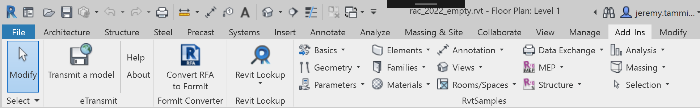

<head>
<meta http-equiv="Content-Type" content="text/html; charset=utf-8">
<link rel="stylesheet" type="text/css" href="bc.css">

</head>

<!---

- https://forums.autodesk.com/t5/revit-api-forum/revit-2022-parametertype-text-to-forgetypeid/m-p/10247574

- https://autodesk.slack.com/archives/C0KBT3859/p1618938930051100
  https://www.oreilly.com/online-learning/feature-answers.html
  To use O’Reilly Answers in Slack, type `/oreilly-answers` followed by a question to scan the O'Reilly content and get the answer.

twitter:

Obtain and compile the Revit 2022 SDK, set up RvtSamples, load the SDK external commands, migrate The Building Coder samples and convert ParameterType to ForgeTypeId in the #RevitAPI @AutodeskForge @AutodeskRevit #bim #DynamoBim #ForgeDevCon http://autode.sk/rvtsamples2022

The Revit 2022 SDK is now available for download from the Revit Developer Centre autodesk.com/developrevit.
I logged my experiences installing it, setting up RvtSamples, loading the SDK external commands, and migrating The Building Coder samples to the new release
&ndash; First the logs
&ndash; Revit 2022 SDK warnings
&ndash; Setting up RvtSamples
&ndash; The Building Coder samples migration
&ndash; <code>ParameterType</code> and <code>ForgeTypeId</code>
&ndash; O'Reilly answers...

linkedin:

Obtain and compile the Revit 2022 SDK, set up RvtSamples, load the SDK external commands, migrate The Building Coder samples and convert ParameterType to ForgeTypeId in the #RevitAPI

http://autode.sk/rvtsamples2022

The Revit 2022 SDK is now available for download from the Revit Developer Centre autodesk.com/developrevit.
I logged my experiences installing it, setting up RvtSamples, loading the SDK external commands, and migrating The Building Coder samples to the new release:

- First the logs
- Revit 2022 SDK warnings
- Setting up RvtSamples
- The Building Coder samples migration
- ParameterType and ForgeTypeId
- O'Reilly answers...

#bim #DynamoBim #ForgeDevCon #Revit #API #IFC #SDK #AI #VisualStudio #Autodesk #AEC #adsk

the [Revit API discussion forum](http://forums.autodesk.com/t5/revit-api-forum/bd-p/160) thread

-->

### Revit 2022 SDK and The Building Coder Samples

The Revit 2022 SDK is now available for download from
the [Revit Developer Centre, autodesk.com/developrevit](https://www.autodesk.com/developer-network/platform-technologies/revit).

I logged my experiences installing and compiling it, setting up the RvtSamples application to load all the SDK external commands, and migrating The Building Coder samples to the new release:

- [First the logs](#2)
- [Revit 2022 SDK warnings](#3)
- [Setting up RvtSamples](#4)
- [The Building Coder samples migration](#5)
- [`ParameterType` and `ForgeTypeId`](#6)
- [O'Reilly answers](#7)

#### First the Logs

In reality, I migrated RevitLookup first, then The Building Coder samples, and last I installed the SDK and set up RvtSamples.
Here are my log files of errors, warnings and WIP notes in that order:

- [RevitLookup](zip/revit_2022_revitlookup_errors_warnings_0.txt)
- [The Building Coder samples](zip/tbc_samples_2022_migr_01.txt)
- [Revit 2022 SDK and RvtSamples](zip/revit_2022_sdk_samples_errors_warnings_1.txt)

Let's look at the SDK installation first, though:

#### Revit 2022 SDK Warnings

The first thing I did was update
my [RevitSdkSamples GitHub repository](https://github.com/jeremytammik/RevitSdkSamples) to
the new release, enabling me (and you) to easily track all the changes I made,
cf. [release 2022.0.0.0](https://github.com/jeremytammik/RevitSdkSamples/releases/tag/2022.0.0.0) and subsequent ones.

I loaded the `SDKSamples.sln` solution file and was glad to note that the Revit API assembly references were all set up and ready to go.
The compilation succeeded out of the box and all 196 projects completed.
The compilation generated [49 warnings](zip/revit_2022_sdk_samples_errors_warnings_1.txt).

Most of the warnings concern the
ever-recurring [architecture mismatch issue](http://thebuildingcoder.typepad.com/blog/2013/06/processor-architecture-mismatch-warning.html)
and can be resolved using
my [DisableMismatchWarning.exe utility](http://thebuildingcoder.typepad.com/blog/2013/07/recursively-disable-architecture-mismatch-warning.html)
implemented back in 2013 and available from
the [DisableMismatchWarning GitHub repository](https://github.com/jeremytammik/DisableMismatchWarning).

After fixing those, only seven warnings remain;
two were due to missing XML documentation comments, and three missing rule sets. 
I added two trivial documentation comments and deleted a reference to one of the rule sets.

In the end, four warnings remain that I will ignore for now;
actually, I don't even know what is causing them or how they could be fixed:

- GeometryCreation_BooleanOperation: Could not find rule set file "GeometryCreation_BooleanOperation.ruleset".    
- ProximityDetection_WallJoinControl: Could not find rule set file "ProximityDetection_WallJoinControl.ruleset".    
- AppearanceAssetEditing: `Microsoft.Csharp.targets` cannot be imported again. It was already imported... This is most likely a build authoring error. This subsequent import will be ignored.
- SampleCommandsSteelElements: ditto

#### Setting up RvtSamples

To set up RvtSamples, I need to do two things:

The first is trivial &ndash; adapt its `*.addin` file appropriately and copy it to the Revit `AddIns` folder.

The second is mostly a lot more work, fixing up the `RvtSamples.txt` file to correctly list all the external commands defined by the SDK, specifically the pathname of their assembly DLL and their correct .NET class name.

To help with that, I temporarily turn on a debugging flag that tests the validity of that data by attempting to load and thus test the existence of each external command.

That turned up a few errors, e.g.:

- Erroneous `bin` path in several VB.NET samples, `VB.NET/bin/Debug/` instead of `/VB.NET/bin/`
- Duplicate menu item name `Infrastructure alignments`

In the end, all loaded fine:

 <!-- 1934 -->

You can track the changes I made in
the [GitHub diffs](https://github.com/jeremytammik/RevitSdkSamples/compare/2022.0.0.2...2022.0.0.4).

#### The Building Coder Samples Migration

After referencing the new Revit 2022 API assemblies, The Building Coder samples compilation succeeded,
producing [35 warnings](zip/tbc_samples_2022_migr_01.txt).

Many were related to the obsolete `ParameterType` class and the `FilterStringRule` constructor that loses its `caseSensitive` argument.

#### ParameterType and ForgeTypeId

We discussed some aspects of the former issue in
the [Revit API discussion forum](http://forums.autodesk.com/t5/revit-api-forum/bd-p/160) thread
on [Revit 2022: `ParameterType.Text` to `ForgeTypeId`](https://forums.autodesk.com/t5/revit-api-forum/revit-2022-parametertype-text-to-forgetypeid/m-p/10247574).

David Becroft summarises the gist of the matter like this:

To create a text parameter, please use `SpecTypeId.String.Text`.

For context, the `ForgeTypeId` properties directly in the `SpecTypeId` class identify the measurable data types, like `SpecTypeId.Length` or `SpecTypeId.Mass`.
The non-measurable data types are organized into nested classes within `SpecTypeId`, like `SpecTypeId.String.Text`, `SpecTypeId.Boolean.YesNo`, `SpecTypeId.Int.Integer`, or `SpecTypeId.Reference.Material`.

Regarding text parameters that report their type as `Number`, here's the history:

- Prior to Revit 2021, a `Definition` had a `UnitType` and a `ParameterType`.
  The `UnitType` property was only meaningful for parameters with measurable `ParameterType` values, and a parameter with `ParameterType.Text` would report a meaningless `UnitType.Number` value.
- Revit 2021 deprecated the `UnitType` property and replaced it with the `GetSpecTypeId` method.
  The behaviour remained the same &ndash; a parameter with `ParameterType.Text` would have `GetSpecTypeId()` == `SpecTypeId.Number`.
- Revit 2022 deprecated the `ParameterType` property and the `GetSpecTypeId` method, replacing them both with the `GetDataType` method.
  A parameter with `ParameterType.Text` will report `GetDataType()` == `SpecTypeId.String.Text`.
  Side note: The `GetDataType` method can also return a category identifier, indicating a Family Type parameter of that category.

In The Building Coder samples, I made the following replacements:

- ParameterType.Text &rarr; SpecTypeId.String.Text 
- ParameterType.Number &rarr; SpecTypeId.Number 
- Definition.ParameterType &rarr; Definition.GetDataType()
- ParameterType.Material &rarr; SpecTypeId.Reference.Material 
- ParameterType.Text &rarr; SpecTypeId.String.Text 
- removed Util.SpellingErrorCorrector 
- removed CompatibilityMethods.Creaste2( this Definitions ) 
- UnitUtils.GetAllSpecs() &rarr; UnitUtils.GetAllMeasurableSpecs() 
- ParameterType.Length &rarr; SpecTypeId.Length
- BuiltInParameterGroup.PG_IDENTITY_DATA &rarr; GroupTypeId.IdentityData
- ParameterType.Length &rarr; SpecTypeId.Length
- BuiltInParameterGroup.PG_CONSTRAINTS &rarr; GroupTypeId.Constraints
- tag.GetTaggedLocalElement() &rarr; tag.GetTaggedLocalElements()
- newTag.TaggedElementId &rarr; newTag.GetTaggedElementIds()
- removed the `FilterStringRule` constructor last argument

I replaced one call to the `NewFloor` method by `Floor.Create`.
It required the conversion of the edge loop container data type, so it was not completely trivial.

That left two warnings about similar deprecated methods that I chose to leave for the time being:

- Warning CS0618 'Document.NewFloor(CurveArray, bool)' is obsolete: This method is deprecated in Revit 2022 and may be removed in the future version of Revit. To create new instance of Floor, call Floor.Create()
- Warning CS0618 'Document.NewSlab(CurveArray, Level, Line, double, bool)' is obsolete: This method is deprecated in Revit 2022 and may be removed in the future version of Revit. To create new instance of Floor, call Floor.Create().

Loading The Building Coder samples via RvtSamples with the external command checking flag turned on revealed that two external commands were no longer defined, since I commented them out due to excessive use of deprecated unit handling functionality that is of little interest any more: `CmdParameterUnitConverter` and `CmdDutAbbreviation`. I simply commented them out in `BcSamples.txt`.

Now RvtSamples loads The Building Coder samples as well:

 <!-- 2040 -->

The changes I made are clearly listed in
the [GitHub diffs](https://github.com/jeremytammik/the_building_coder_samples/compare/2022.0.150.0...2022.0.150.4).

I wish you the best of luck and smooth sailing with your own migration efforts.

#### O'Reilly Answers

A nice new little AI application provided by the main professional technical literature publisher,
[O’Reilly Answers](https://www.oreilly.com/online-learning/feature-answers.html) responds
to technical questions of all kinds by scanning thousands of go-to books on the subject at hand:

> Need a quick solution you can put to work fast? Just ask O’Reilly Answers. It’s an advanced natural language processing engine that instantly scans thousands of O’Reilly titles to find the snippet that can save the day.

At Autodesk, we use [Slack](https://slack.com) quite a bit, so this will come in handy for me.
To use O’Reilly Answers in Slack, type `/oreilly-answers` followed by a question to scan the O'Reilly content and get the answer.

