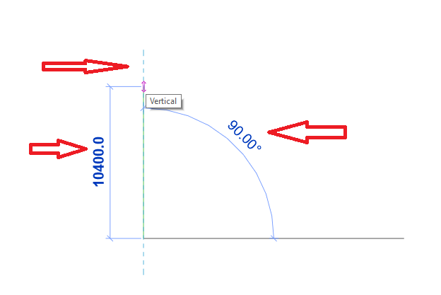

<head>
<meta http-equiv="Content-Type" content="text/html; charset=utf-8">
<link rel="stylesheet" type="text/css" href="bc.css">

</head>

<!---

- /a/doc/revit/tbc/git/a/zip/line_based_detail_item_direction_arrow_jig.mp4
  How can I draw the Detail Line to let the information of direction and angle emerge before finishing the command?
  https://forums.autodesk.com/t5/revit-api-forum/how-can-i-draw-the-detail-line-to-let-the-information-of/m-p/10291715
  jig
  
- get file paths in BIM 360 regardless of
  Thanks for the original code to determine the file in the local cache for cloud models.
  However, I found it only worked for WorkShared Cloud models.
  this is the revision to work also with non-workshared cloud models:
  17787640 [How to determine local path of non-workshared cloud model]
  Get BIm 360 model's "absolute" path
  https://forums.autodesk.com/t5/revit-api-forum/get-bim-360-model-s-quot-absolute-quot-path/m-p/10292538

- need for regen
  committing the transaction is the next level up after regeneration
  Why does GroupType.Groups contain ungrouped groups?
  https://forums.autodesk.com/t5/revit-api-forum/why-does-grouptype-groups-contain-ungrouped-groups/m-p/10291256/highlight/false#M55705  

- https://github.com/ADN-DevTech/revit-api-chms
  https://github.com/gtalarico/revit-api-chms/pull/4

- C++/C# Frontend Engineer
  https://www.comeet.com/jobs/knauf/56.004/cc-frontend-engineer-mfd/9F.D1F
  /a/doc/revit/tbc/git/a/zip/2021-04-30_knauf_job_frontend_engineer.pdf
  to develop and deliver solutions for CAD programs (e.g., Revit, ArchiCAD) mixing native SDK technologies in C++ and .NET and web views

twitter:

An example of a line angle and direction jig for real-time live graphical user input feedback, cloud model local file path access and the ever important need to regenerate in the #RevitAPI @AutodeskForge @AutodeskRevit #bim #DynamoBim #ForgeDevCon http://autode.sk/angledirectionjig

An example of real-time live graphical user input feedback, cloud model functionality, the ever important need to regenerate and other important topics for this holiday day
&ndash; Line angle and direction jig
&ndash; Determine cloud model local file path
&ndash; How to refresh GroupType.Groups
&ndash; Online access to RevitAPI.chm help files
&ndash; C++/C&#35; frontend engineer...

linkedin:

An example of a line angle and direction jig for real-time live graphical user input feedback, cloud model local file path access and the ever important need to regenerate in the #RevitAPI

http://autode.sk/angledirectionjig

- Line angle and direction jig
- Determine cloud model local file path
- How to refresh GroupType.Groups
- Online access to RevitAPI.chm help files
- C++/C&#35; frontend engineer...

#bim #DynamoBim #ForgeDevCon #Revit #API #IFC #SDK #AI #VisualStudio #Autodesk #AEC #adsk

the [Revit API discussion forum](http://forums.autodesk.com/t5/revit-api-forum/bd-p/160) thread

-->

### Refreshment, Cloud Model Path, Angle and Direction

An example of real-time live graphical user input feedback, cloud model functionality, the ever important need to regenerate and other important topics for this holiday day:

- [Line angle and direction jig](#2)
- [Determine cloud model local file path](#3)
- [How to refresh GroupType.Groups](#4)
- [Online access to RevitAPI.chm help files](#5)
- [C++/C&#35; frontend engineer](#6)

#### Line Angle and Direction Jig

The Revit API does not provide much support for real-time feedback on graphical user input, so this original idea
by Maarten van der Linden of [Wagemaker](https://www.wagemaker.nl) may
come in handy, using `PromptForFamilyInstancePlacement` as a workaround, in answering 
the [Revit API discussion forum](http://forums.autodesk.com/t5/revit-api-forum/bd-p/160) thread
on [how to draw the detail line to let the information of direction and angle emerge before finishing the command](https://forums.autodesk.com/t5/revit-api-forum/how-can-i-draw-the-detail-line-to-let-the-information-of/m-p/10291715):

**Question:** How can I draw the Detail Line to let the information of direction and angle emerge before finishing the command?

Currently, I am using `PickPoint` to prompt the use to select line endpoints and creating a detail curve from that information.

However, I see no way to display any useful graphical feedback while picking these points like Revit itself does internally:

 <!-- 624 -->
 <!-- 358 -->

**Answer:** You could try to launch the built-in Revit command together with the built-in user interface by using `PostCommand`.

Another option might be to implement some kind of
own [jig, e.g., using the `IDirectContext3DServer`](https://thebuildingcoder.typepad.com/blog/2020/10/onbox-directcontext-jig-and-no-cdn.html#3).,

Maybe you could also use some kind of Windows tooltip to display the required real-time information.

Unfortunately, since this functionality is not supported by the Revit API out of the box, I'm afraid it may be hard to implement anything that is both useful and nice to use.

However, here Maarten comes to the rescue, saying:

> In my command to rotate the crop region of plan view, I use a line-based detail item in combination with `PromptForFamilyInstancePlacement` to mimic that kind of behaviour.
Here is a video of the functionality:

<video style="display:block; width:600px; height:auto;" autoplay="" muted="" loop="loop">
<source src="img/line_based_detail_item_direction_arrow_jig.mp4" type="video/mp4"> <!-- 1629 -->
<!-- https://thebuildingcoder.typepad.com/img/line_based_detail_item_direction_arrow_jig.mp4 -->
<source src="https://thebuildingcoder.typepad.com/2020/banana_small.mp4" type="video/mp4">
</video>

Many thanks to Maarten for the great suggestion.

#### Determine Cloud Model Local File Path

We recently discussed the question 
of [determining a BIM 360 model's local "absolute" path](https://forums.autodesk.com/t5/revit-api-forum/get-bim-360-model-s-quot-absolute-quot-path/m-p/10292538).
Unfortunately, the initial solution was limited to workshared cloud models.

Now Simon Jones shared a more general method that works with non-workshared cloud models as well, saying:

> Thanks for the original code to determine the file in the local cache for cloud models.

> However, I found it only worked for workshared cloud models.

> This is a revision to work also with non-workshared cloud models:

<pre class="code">
string&nbsp;GetCloudModelLocalCacheFilepath(&nbsp;
&nbsp;&nbsp;Document&nbsp;doc,&nbsp;
&nbsp;&nbsp;string&nbsp;version_number&nbsp;)
{
&nbsp;&nbsp;string&nbsp;title&nbsp;=&nbsp;doc.Title;
&nbsp;&nbsp;string&nbsp;ext&nbsp;=&nbsp;Path.GetExtension(&nbsp;doc.PathName&nbsp;);
&nbsp;&nbsp;string&nbsp;localRevitFile&nbsp;=&nbsp;null;
 
&nbsp;&nbsp;if(&nbsp;doc.IsModelInCloud&nbsp;)
&nbsp;&nbsp;{
&nbsp;&nbsp;&nbsp;&nbsp;ModelPath&nbsp;modelPath&nbsp;=&nbsp;doc.GetCloudModelPath();
&nbsp;&nbsp;&nbsp;&nbsp;string&nbsp;guid&nbsp;=&nbsp;modelPath.GetModelGUID().ToString();
 
&nbsp;&nbsp;&nbsp;&nbsp;string&nbsp;folder&nbsp;=&nbsp;&quot;C:\\Users\\&quot;&nbsp;+&nbsp;Environment.UserName&nbsp;
&nbsp;&nbsp;&nbsp;&nbsp;&nbsp;&nbsp;+&nbsp;&quot;\\AppData\\Local\\Autodesk\\Revit\\Autodesk&nbsp;Revit&nbsp;&quot;&nbsp;
&nbsp;&nbsp;&nbsp;&nbsp;&nbsp;&nbsp;+&nbsp;version_number&nbsp;+&nbsp;&quot;\\CollaborationCache&quot;;
 
&nbsp;&nbsp;&nbsp;&nbsp;string&nbsp;revitFile&nbsp;=&nbsp;guid&nbsp;+&nbsp;ext;
 
&nbsp;&nbsp;&nbsp;&nbsp;string[]&nbsp;files&nbsp;=&nbsp;Directory
&nbsp;&nbsp;&nbsp;&nbsp;&nbsp;&nbsp;.GetFiles(&nbsp;folder,&nbsp;revitFile,&nbsp;SearchOption.AllDirectories&nbsp;)
&nbsp;&nbsp;&nbsp;&nbsp;&nbsp;&nbsp;.Where(&nbsp;c&nbsp;=&gt;&nbsp;!c.Contains(&nbsp;&quot;CentralCache&quot;&nbsp;)&nbsp;)
&nbsp;&nbsp;&nbsp;&nbsp;&nbsp;&nbsp;.ToArray();
 
&nbsp;&nbsp;&nbsp;&nbsp;if(&nbsp;0&nbsp;&lt;&nbsp;files.Length&nbsp;)
&nbsp;&nbsp;&nbsp;&nbsp;{
&nbsp;&nbsp;&nbsp;&nbsp;&nbsp;&nbsp;localRevitFile&nbsp;=&nbsp;files[&nbsp;0&nbsp;];
&nbsp;&nbsp;&nbsp;&nbsp;}
&nbsp;&nbsp;&nbsp;&nbsp;else
&nbsp;&nbsp;&nbsp;&nbsp;{
&nbsp;&nbsp;&nbsp;&nbsp;&nbsp;&nbsp;Debug.Print(&nbsp;&quot;Unable&nbsp;to&nbsp;find&nbsp;local&nbsp;rvt&nbsp;for:&nbsp;&quot;&nbsp;+&nbsp;doc.PathName&nbsp;);
&nbsp;&nbsp;&nbsp;&nbsp;}
&nbsp;&nbsp;}
&nbsp;&nbsp;else
&nbsp;&nbsp;{
&nbsp;&nbsp;&nbsp;&nbsp;localRevitFile&nbsp;=&nbsp;doc.PathName;
&nbsp;&nbsp;}
&nbsp;&nbsp;return&nbsp;localRevitFile;
}
</pre>

> The key is to use `modelPath.GetModelGUID` rather than `doc.WorksharingCentralGUID`
&ndash; thanks @jeremy.tammik for pointing out this function to me (apparently it has been there since 2019.1)...

Many thanks to Simon for sharing this.

I added it
to [The Building Coder samples](https://github.com/jeremytammik/the_building_coder_samples) to
make it easy to keep track of, cf.
the [diff to the previous release](https://github.com/jeremytammik/the_building_coder_samples/compare/2022.0.150.5...2022.0.150.6).

#### How to Refresh GroupType.Groups

The [Revit API discussion forum](http://forums.autodesk.com/t5/revit-api-forum/bd-p/160) thread
asking [why `GroupType.Groups` contains ungrouped groups](https://forums.autodesk.com/t5/revit-api-forum/why-does-grouptype-groups-contain-ungrouped-groups/m-p/10291256) demonstrates
another example of
the [need to regenerate](https://thebuildingcoder.typepad.com/blog/about-the-author.html#5.33)
and shows that sometimes more than just regenerating the model is required to avoid accessing stale data.
Committing the transaction is the next level up after regeneration:

**Question:** The following code prints the same number twice:

<pre class="code">
&nbsp;&nbsp;var&nbsp;groupType&nbsp;=&nbsp;group.GroupType;
&nbsp;&nbsp;Debug.Print(&nbsp;groupType.Groups.Size.ToString()&nbsp;);
&nbsp;&nbsp;group.UngroupMembers();
&nbsp;&nbsp;Debug.Print(&nbsp;groupType.Groups.Size.ToString()&nbsp;);
</pre> 

Is this the correct behaviour?

What do I need to do to make sure groupType.Groups always returns the correct GroupSet?

I tried calling `Regenerate` and that doesn't help.

It looks like I need to end and restart the transaction.

This code shows that GroupType.Groups still reports the ungrouped group after doc.Regenerate() and finally disappears after committing and restarting a new transaction. I tried to get a new reference to the GroupType, hoping that avoiding some caching would help, but it didn't:

<pre class="code">
&nbsp;&nbsp;tx.Start(&nbsp;&quot;Test&nbsp;1&quot;&nbsp;);
 
&nbsp;&nbsp;var&nbsp;elementIds&nbsp;=&nbsp;new&nbsp;List&lt;ElementId&gt;
&nbsp;&nbsp;{
&nbsp;&nbsp;&nbsp;&nbsp;Utils.CreateModelLine(new&nbsp;XYZ(0,&nbsp;0,&nbsp;0),&nbsp;new&nbsp;XYZ(1,&nbsp;0,&nbsp;0),&nbsp;doc).Id,
&nbsp;&nbsp;&nbsp;&nbsp;Utils.CreateModelLine(new&nbsp;XYZ(0,&nbsp;1,&nbsp;0),&nbsp;new&nbsp;XYZ(1,&nbsp;1,&nbsp;0),&nbsp;doc).Id,
&nbsp;&nbsp;&nbsp;&nbsp;Utils.CreateModelLine(new&nbsp;XYZ(0,&nbsp;2,&nbsp;0),&nbsp;new&nbsp;XYZ(1,&nbsp;2,&nbsp;0),&nbsp;doc).Id,
&nbsp;&nbsp;};
&nbsp;&nbsp;var&nbsp;group1&nbsp;=&nbsp;doc.Create.NewGroup(&nbsp;elementIds&nbsp;);
&nbsp;&nbsp;var&nbsp;group2&nbsp;=&nbsp;doc.Create.PlaceGroup(&nbsp;new&nbsp;XYZ(&nbsp;0,&nbsp;5,&nbsp;0&nbsp;),&nbsp;group1.GroupType&nbsp;);
&nbsp;&nbsp;var&nbsp;group3&nbsp;=&nbsp;doc.Create.PlaceGroup(&nbsp;new&nbsp;XYZ(&nbsp;0,&nbsp;10,&nbsp;0&nbsp;),&nbsp;group1.GroupType&nbsp;);
&nbsp;&nbsp;Debug.Print(&nbsp;group1.GroupType.Groups.Size.ToString()&nbsp;);
 
&nbsp;&nbsp;group2.UngroupMembers();
&nbsp;&nbsp;Debug.Print(&nbsp;group1.GroupType.Groups.Size.ToString()&nbsp;);
 
&nbsp;&nbsp;doc.Regenerate();
&nbsp;&nbsp;Debug.Print(&nbsp;group1.GroupType.Groups.Size.ToString()&nbsp;);
 
&nbsp;&nbsp;var&nbsp;groupType&nbsp;=&nbsp;new&nbsp;FilteredElementCollector(&nbsp;doc&nbsp;)
&nbsp;&nbsp;&nbsp;&nbsp;&nbsp;&nbsp;.OfClass(&nbsp;typeof(&nbsp;GroupType&nbsp;)&nbsp;)
&nbsp;&nbsp;&nbsp;&nbsp;&nbsp;&nbsp;.Cast&lt;GroupType&gt;()
&nbsp;&nbsp;&nbsp;&nbsp;&nbsp;&nbsp;.FirstOrDefault(&nbsp;gt&nbsp;=&gt;&nbsp;gt.Name&nbsp;==&nbsp;group1.GroupType.Name&nbsp;);
&nbsp;&nbsp;Debug.Print(&nbsp;groupType.Groups.Size.ToString()&nbsp;);
 
&nbsp;&nbsp;tx.Commit();
 
&nbsp;&nbsp;tx.Start(&nbsp;&quot;Test&nbsp;2&quot;&nbsp;);
 
&nbsp;&nbsp;Debug.Print(&nbsp;groupType.Groups.Size.ToString()&nbsp;);
&nbsp;&nbsp;groupType&nbsp;=&nbsp;new&nbsp;FilteredElementCollector(&nbsp;doc&nbsp;)
&nbsp;&nbsp;&nbsp;&nbsp;&nbsp;&nbsp;.OfClass(&nbsp;typeof(&nbsp;GroupType&nbsp;)&nbsp;)
&nbsp;&nbsp;&nbsp;&nbsp;&nbsp;&nbsp;.Cast&lt;GroupType&gt;()
&nbsp;&nbsp;&nbsp;&nbsp;&nbsp;&nbsp;.FirstOrDefault(&nbsp;gt&nbsp;=&gt;&nbsp;gt.Name&nbsp;==&nbsp;group1.GroupType.Name&nbsp;);
&nbsp;&nbsp;Debug.Print(&nbsp;groupType.Groups.Size.ToString()&nbsp;);
 
&nbsp;&nbsp;tx.Commit();
</pre>

I tried using a subtransaction, but that didn't help.

At this point I do have a workaround, but I don't like to create transactions only because I can't rely on GroupType.Groups not reporting ungrouped groups.

Any advice?

**Answer:** Just firing off the top of my head here but... instead of transactions and subtransactions, you might try a transaction group with transactions within it... works just a little differently and perhaps that difference will be a little cleaner in the end...

**Response:** Using a transaction group seem to be the best workaround. Here are the steps:

- transactionGroup.Start
- transaction.Start
- group.UngroupMemebers
- group.GroupType.Groups still contains the ungrouped group
- transaction.Commit
- group.GroupType.Groups does not contain the ungrouped group

Unfortunately, such a workaround cannot be used in a generic case.
Wrapping the call to `UngroupMembers` inside its own transaction only because any following `groupType.Groups` would return the wrong result is ugly, because it forces the caller to use a transaction group rather than a transaction.

**Answer:** I recently had a somewhat similar problem (working w/ completely different objects though). It seems like in some cases the value returned by a Revit API object's property or method is always the same as when it was first obtained from the API, even after regenerating the model. To resolve this in my case I had to obtain a new copy of the object from the API after regenerating the model (e.g., myElement = myDocument.GetElement(myElementId);). I don't know if this will help in your situation, but I hope it does.

**Response:** Thanks for the advice.
I just tried and in this stale case the cached info sticks around even after getting a new element.
Adding these two lines before closing the transaction to my code, still return the wrong value:

<pre class="code">
&nbsp;&nbsp;group1&nbsp;=&nbsp;doc.GetElement(&nbsp;group1.Id&nbsp;)&nbsp;as&nbsp;Group;
&nbsp;&nbsp;Debug.Print(&nbsp;groupType.Groups.Size.ToString()&nbsp;);
 
&nbsp;&nbsp;groupType&nbsp;=&nbsp;doc.GetElement(&nbsp;group1.GroupType.Id&nbsp;)&nbsp;as&nbsp;GroupType;
&nbsp;&nbsp;Debug.Print(&nbsp;groupType.Groups.Size.ToString()&nbsp;);
</pre>

#### Online Access to RevitAPI.chm Help Files

Guy Talarico set up a repository sharing the RevitAPI.chm Windows help file provided by the Revit SDK for all Revit API releases reaching back to Revit 2012.

These files are used to generate the online Revit API documentation
resources [revitapidocs.com](https://www.revitapidocs.com/)
and [apidocs.co](https://apidocs.co/) that
provide web presentations of the same content.

Due to the growing size of the CHM files, we were forced to turn on
the [Git Large File Storage (LFS)](https://git-lfs.github.com/) and move the repository to a new location in the ADN-DevTech organisation
at [github.com/ADN-DevTech/revit-api-chms](https://github.com/ADN-DevTech/revit-api-chms).

#### C++/C&#35; Frontend Engineer

Friend and colleague Carlo asked me to point out
a [career opportunity for a C++/C&#35; frontend engineer](https://www.comeet.com/jobs/knauf/56.004/cc-frontend-engineer-mfd/9F.D1F) with
Knauf in Germany to develop and deliver solutions for CAD programs, e.g., Revit and ArchiCAD, mixing native SDK technologies in C++, .NET and web views.

