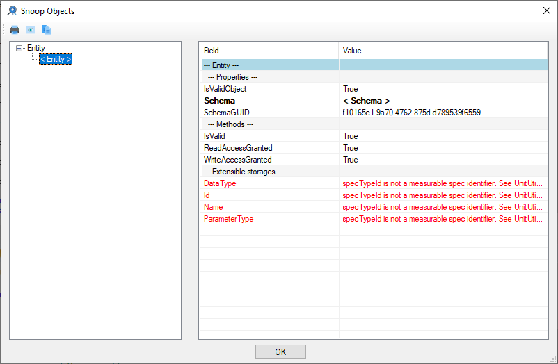
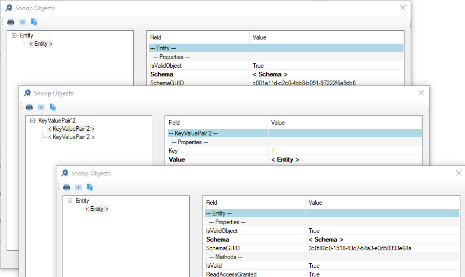
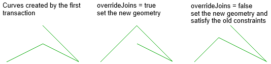

<head>
<meta http-equiv="Content-Type" content="text/html; charset=utf-8">
<link rel="stylesheet" type="text/css" href="bc.css">

</head>

<!---

- RevitLookup updates:
  2022.0.0.1 integrated pull request #74 by @peterhirn setting up CI for Revit 2022
  2022.0.0.2 integrated pull request #75 by @peterhirn to fix CI for Revit 2022 and non-dotnet-core project file
  2022.0.0.3 integrated pull request #73 implementing temporary transaction and rollback allowing to snoop PlanTopology, reset Revit API assembly DLL references to Copy Local false and specified Configuration as 2022
  2022.0.0.4 upgraded to Visual Studio 2019 (from 2017) and adopted @peterhirn project and solution files
  2022.0.0.5 integrated pull request #76 by @peterhirn to fix CI for new VS 2019 Revit 2022 dotnet-core csproj
  2022.0.0.6 integrated pull request #77 by @RevitArkitek to get end points for curves
  2022.0.0.7 integrated pull request #78 by @RevitArkitek to handle TableData.GetSectionData
  2022.0.0.8 integrated pull request #80 by @WspDev to remove deprecated ParameterType usage
  2022.0.0.9 integrated pull request #81 by @CADBIMDeveloper enhancing ElementId and Revit 2022 extensible storage support:
  - fix broken schema fields values display
  - SpecTypeId.Custom is not a measurable spec (it represents double values), but requires UnitTypeId.Custom to get an entity field value
  - this allows to view extensible storage schema map fields (dictionaries)
  - ElementId could represent Revit model element or built-in parameter id or built-in category id. for the latter two, show id value instead of "null"
  - now keyvaluepair is a truly snoopable object
  - remove unused using
  - show value if ElementId represents built-in parameters or built-in category
  I've fixed the app for Extensible storages. Extensible storage fields were broken:
  revitlookup_pr_81_1.png
  Now RevitLookup also supports Dictionary KeyValuePairs lookup. It is also useful to view extensible storage entities data:
  revitlookup_pr_81_2.png
  Plus a small improvement. ElementId could be a model element id, a built-in parameter or built-in-category. For the last two it is much more useful to see an integer value instead of "< null >"

- VisualStudioRevitAddinWizard 2022
  https://forums.autodesk.com/t5/revit-api-forum/visualstudiorevitaddinwizard-2022/m-p/10233833
  
- ADN Training material 2022

- AdnRevitApiLabsXtra 2022
 
- explore the use of the SetGeometryCurve Method
  overrideJoins argument -- An option to specify whether or not existing joins will affect setting the geometry of the CurveElement. Setting this parameter to false is essentially the same as directly setting the GeometryCurve property.
  https://www.revitapidocs.com/2021.1/9deec90c-4efc-9aa6-245d-061669022aa2.htm
  What does the overrideJoins parameter do in CurveElement.SetGeometryCurve?
  https://forums.autodesk.com/t5/revit-api-forum/what-does-the-overridejoins-parameter-do-in-curveelement/m-p/10298762
  SetGeometryCurve_overrideJoins.png 634

- My Revit app can't find SQLite. dll
  https://forums.autodesk.com/t5/revit-api-forum/my-revit-app-can-t-find-sqlite-dll/m-p/10323105
  Sean Page, RDG Planning & Design:
  I ran into issues recently in 2022 related to references that previously worked and turning on and using the Fusion Assembly Binding log viewer was a substantial help.
  "Fuslogvw.exe (Assembly Binding Log Viewer) | Microsoft Docs"
  https://docs.microsoft.com/en-us/dotnet/framework/tools/fuslogvw-exe-assembly-binding-log-viewer
  https://docs.microsoft.com/en-us/dotnet/framework/tools/fuslogvw-exe-assembly-binding-log-viewer

twitter:

RevitLookup enhancements, Visual Studio Revit add-in templates and #RevitAPI labs training material 2022, SetGeometryCurve overrideJoins and exploring assembly reference DLL hell with Fuslogvw @AutodeskForge @AutodeskRevit #bim #DynamoBim #ForgeDevCon http://autode.sk/overridejoins

Here are a couple of the interesting topics that came up in the last couple of days
&ndash; Numerous RevitLookup enhancements
&ndash; Revit API Labs training material 2022
&ndash; Visual Studio Revit add-in templates 2022
&ndash; The SetGeometryCurve <code>overrideJoins</code> argument
&ndash; Exploring assembly reference DLL hell with Fuslogvw...

linkedin:

RevitLookup enhancements, Visual Studio Revit add-in templates and #RevitAPI labs training material 2022, SetGeometryCurve overrideJoins and exploring assembly reference DLL hell with Fuslogvw

http://autode.sk/overridejoins

Here are a couple of the interesting topics that came up in the last couple of days:

- Numerous RevitLookup enhancements
- Revit API Labs training material 2022
- Visual Studio Revit add-in templates 2022
- The SetGeometryCurve <code>overrideJoins</code> argument
- Exploring assembly reference DLL hell with Fuslogvw...

#bim #DynamoBim #ForgeDevCon #Revit #API #IFC #SDK #AI #VisualStudio #Autodesk #AEC #adsk

the [Revit API discussion forum](http://forums.autodesk.com/t5/revit-api-forum/bd-p/160) thread

-->

### RevitLookup Update, Fuslogvw and Override Joins

Here are a couple of the interesting topics that came up in the last couple of days:

- [Numerous RevitLookup enhancements](#2)
- [Revit API Labs training material 2022](#3)
- [Visual Studio Revit add-in templates 2022](#4)
- [The SetGeometryCurve `overrideJoins` argument](#5)
- [Exploring assembly reference DLL hell with Fuslogvw](#6)

#### Numerous RevitLookup Enhancements

Numerous contributions with
important [RevitLookup](https://github.com/jeremytammik/RevitLookup) enhancements
were submitted since
the [flat migration of RevitLookup to the Revit 2022 API](https://thebuildingcoder.typepad.com/blog/2021/04/revit-2022-migrates-bim360-team-to-docs.html#3):

- [2022.0.0.1](https://github.com/jeremytammik/RevitLookup/releases/tag/2022.0.0.1) &ndash; integrated pull request #74 by @peterhirn setting up CI for Revit 2022
- [2022.0.0.2](https://github.com/jeremytammik/RevitLookup/releases/tag/2022.0.0.2) &ndash; integrated pull request #75 by @peterhirn to fix CI for Revit 2022 and non-dotnet-core project file
- [2022.0.0.3](https://github.com/jeremytammik/RevitLookup/releases/tag/2022.0.0.3) &ndash; integrated pull request #73 implementing temporary transaction and rollback allowing to snoop PlanTopology, reset Revit API assembly DLL references to Copy Local false and specified Configuration as 2022
- [2022.0.0.4](https://github.com/jeremytammik/RevitLookup/releases/tag/2022.0.0.4) &ndash; upgraded to Visual Studio 2019 (from 2017) and adopted @peterhirn project and solution files
- [2022.0.0.5](https://github.com/jeremytammik/RevitLookup/releases/tag/2022.0.0.5) &ndash; integrated pull request #76 by @peterhirn to fix CI for new VS 2019 Revit 2022 dotnet-core csproj
- [2022.0.0.6](https://github.com/jeremytammik/RevitLookup/releases/tag/2022.0.0.6) &ndash; integrated pull request #77 by @RevitArkitek to get end points for curves
- [2022.0.0.7](https://github.com/jeremytammik/RevitLookup/releases/tag/2022.0.0.7) &ndash; integrated pull request #78 by @RevitArkitek to handle TableData.GetSectionData
- [2022.0.0.8](https://github.com/jeremytammik/RevitLookup/releases/tag/2022.0.0.8) &ndash; integrated pull request #80 by @WspDev to remove deprecated ParameterType usage
- [2022.0.0.9](https://github.com/jeremytammik/RevitLookup/releases/tag/2022.0.0.9) &ndash; integrated pull request #81 by @CADBIMDeveloper enhancing ElementId and Revit 2022 extensible storage support:
    - fix broken schema fields values display
    - SpecTypeId.Custom is not a measurable spec (it represents double values), but requires UnitTypeId.Custom to get an entity field value
    - this allows to view extensible storage schema map fields (dictionaries)
    - ElementId could represent Revit model element or built-in parameter id or built-in category id. for the latter two, show id value instead of "null"
    - now keyvaluepair is a truly snoopable object
    - remove unused using
    - show value if ElementId represents built-in parameters or built-in category

In the latter,
Alexander [@aignatovich](https://forums.autodesk.com/t5/user/viewprofilepage/user-id/1257478) [@CADBIMDeveloper](https://github.com/CADBIMDeveloper) Ignatovich, aka Александр Игнатович, adds:

I fixed RevitLookup handling of extensible storage.
The `Extensible storages` fields were broken:

 <!-- 802 -->

Now RevitLookup also supports `Dictionary` `KeyValuePairs` lookup.
That is useful to view extensible storage entity data:

 <!-- 907 -->

Plus another small improvement: each `ElementId` could represent a model element id, a built-in parameter or a built-in-category.
For the latter two, it is much more useful to see an integer value instead of `null`.

Many thanks to all contributors for your great enhancements!

In case you, dear reader, would like to add your own to these as well, please fork the repository, clone to your local system, modify at will, commit, push the changes back to your fork and submit a pull request for them to be included into the main code stream.

You can easily track and analyse the changes to see how each individual enhancement above interacts with main project by clicking the `Compare` button to view the difference between
the [individual releases](https://github.com/jeremytammik/RevitLookup/releases).

#### Revit API Labs Training Material 2022

My colleague [Naveen Kumar](https://forums.autodesk.com/t5/user/viewprofilepage/user-id/5661631) [@NK29 T](https://github.com/NK29) is
steadily building up his collection of solutions in
the [Revit API discussion forum](http://forums.autodesk.com/t5/revit-api-forum/bd-p/160).

He also migrated
the [Revit API Labs Training Material](https://github.com/ADN-DevTech/RevitTrainingMaterial) to
Revit 2022.
The [latest release](https://github.com/ADN-DevTech/RevitTrainingMaterial/releases/latest) is
currently [2022.0.0.2](https://github.com/ADN-DevTech/RevitTrainingMaterial/releases/tag/2022.0.0.2).

Many thanks to Naveen for his contributions!

The closely related [AdnRevitApiLabsXtra](https://github.com/jeremytammik/AdnRevitApiLabsXtra) have
yet to be migrated to Revit 2022... coming up anon...

#### Visual Studio Revit Add-in Templates 2022

Prompted by both Naveen and 
the [Revit API discussion forum](http://forums.autodesk.com/t5/revit-api-forum/bd-p/160) thread
asking for [VisualStudioRevitAddinWizard 2022](https://forums.autodesk.com/t5/revit-api-forum/visualstudiorevitaddinwizard-2022/m-p/10233833), 
I performed a quick flat migration of that tool to the new version last week.

The [latest release](https://github.com/jeremytammik/VisualStudioRevitAddinWizard/releases/latest) is
currently [2022.0.0.0](https://github.com/jeremytammik/VisualStudioRevitAddinWizard/releases/tag/2022.0.0.0).

#### The SetGeometryCurve OverrideJoins Argument

Stefano Menci very kindly shared some useful research results in
his [Revit API discussion forum](http://forums.autodesk.com/t5/revit-api-forum/bd-p/160) thread
explaining [what the `overrideJoins` parameter does in `CurveElement.SetGeometryCurve`](https://forums.autodesk.com/t5/revit-api-forum/what-does-the-overridejoins-parameter-do-in-curveelement/m-p/10298762):

The [Revit API documentation](https://www.revitapidocs.com/2021.1/9deec90c-4efc-9aa6-245d-061669022aa2.htm) contents
itself with the statement that the `overrideJoins` argument provides:

> an option to specify whether or not existing joins will affect setting the geometry of the `CurveElement`.
Setting this parameter to `false` is essentially the same as directly setting the `GeometryCurve` property.

Stefano's research provides a little bit more detail, explaining:

I figured it out, so I will post the question with the answer anyway, for anybody interested (and for me, the next time I need it, because sometimes I'm a little forgetful):

- If set to true, it will set the new geometry for the curve element
- If set to false, after setting the geometry, it will try to satisfy any constraints associated with the element

The following code:

<pre class="code">
&nbsp;&nbsp;tx.Start(&nbsp;&quot;Test&nbsp;1&quot;&nbsp;);
 
&nbsp;&nbsp;var&nbsp;plane&nbsp;=&nbsp;Plane.CreateByNormalAndOrigin(&nbsp;XYZ.BasisZ,&nbsp;XYZ.Zero&nbsp;);
&nbsp;&nbsp;var&nbsp;sketchPlane&nbsp;=&nbsp;SketchPlane.Create(&nbsp;doc,&nbsp;plane&nbsp;);
&nbsp;&nbsp;var&nbsp;p1&nbsp;=&nbsp;new&nbsp;XYZ(&nbsp;0,&nbsp;0,&nbsp;0&nbsp;);
&nbsp;&nbsp;var&nbsp;p2&nbsp;=&nbsp;new&nbsp;XYZ(&nbsp;10,&nbsp;5,&nbsp;0&nbsp;);
&nbsp;&nbsp;var&nbsp;p3&nbsp;=&nbsp;new&nbsp;XYZ(&nbsp;20,&nbsp;0,&nbsp;0&nbsp;);
&nbsp;&nbsp;var&nbsp;p2Higher&nbsp;=&nbsp;new&nbsp;XYZ(&nbsp;10,&nbsp;10,&nbsp;0&nbsp;);
 
&nbsp;&nbsp;var&nbsp;line1&nbsp;=&nbsp;doc.Create.NewModelCurve(&nbsp;
&nbsp;&nbsp;&nbsp;&nbsp;Line.CreateBound(&nbsp;p1,&nbsp;p2&nbsp;),&nbsp;sketchPlane&nbsp;);
 
&nbsp;&nbsp;var&nbsp;line2&nbsp;=&nbsp;doc.Create.NewModelCurve(&nbsp;
&nbsp;&nbsp;&nbsp;&nbsp;Line.CreateBound(&nbsp;p2,&nbsp;p3&nbsp;),&nbsp;sketchPlane&nbsp;);
 
&nbsp;&nbsp;var&nbsp;line3&nbsp;=&nbsp;doc.Create.NewModelCurve(&nbsp;
&nbsp;&nbsp;&nbsp;&nbsp;Line.CreateBound(&nbsp;p2Higher,&nbsp;p3&nbsp;),&nbsp;sketchPlane&nbsp;);
 
&nbsp;&nbsp;tx.Commit();
 
&nbsp;&nbsp;tx.Start(&nbsp;&quot;Test&nbsp;2&quot;&nbsp;);
 
&nbsp;&nbsp;line1.SetGeometryCurve(&nbsp;
&nbsp;&nbsp;&nbsp;&nbsp;Line.CreateBound(&nbsp;p1,&nbsp;p2Higher&nbsp;),&nbsp;&lt;&nbsp;false&nbsp;|&nbsp;false&nbsp;&gt;);
 
&nbsp;&nbsp;tx.Commit();
</pre>

Will return the following result:

 <!-- 634 -->

Many thanks to Stefano for the analysis and explanation.

#### Exploring Assembly Reference DLL Hell with Fuslogvw

Sean Page of [RDG Planning &amp; Design](https://rdgusa.com) shares another useful hint in 
the [Revit API discussion forum](http://forums.autodesk.com/t5/revit-api-forum/bd-p/160) thread
on [my Revit app can't find SQLite.dll](https://forums.autodesk.com/t5/revit-api-forum/my-revit-app-can-t-find-sqlite-dll/m-p/10323105), saying:

> I ran into issues recently in 2022 related to references that previously worked.
Turning on and using
the [`Fuslogvw.exe` assembly binding log viewer](https://docs.microsoft.com/en-us/dotnet/framework/tools/fuslogvw-exe-assembly-binding-log-viewer) was
a substantial help.

Thank you, Sean, for pointing this out!
