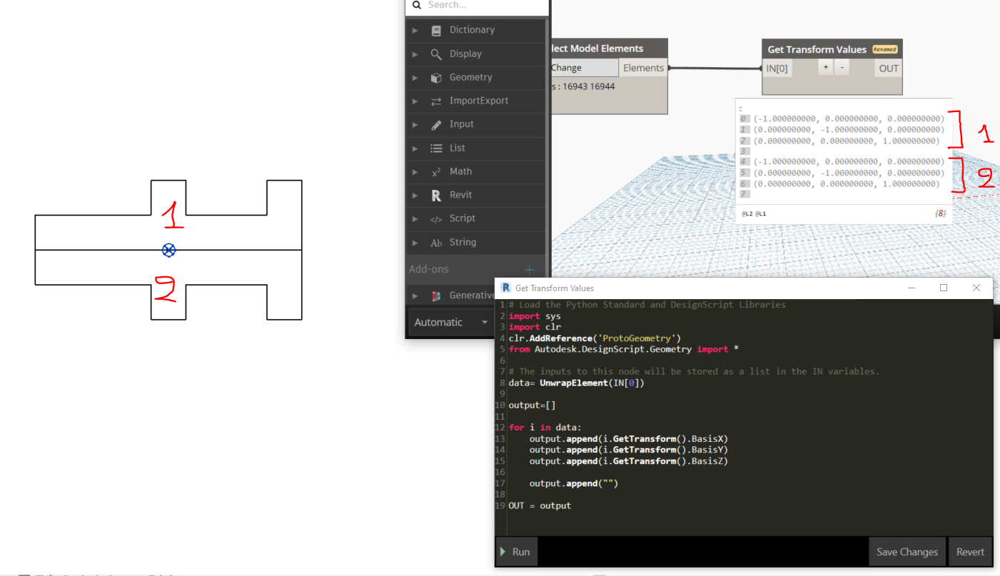
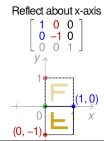
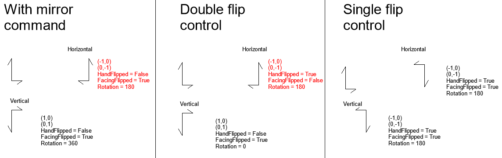

<head>
<meta http-equiv="Content-Type" content="text/html; charset=utf-8">
<link rel="stylesheet" type="text/css" href="bc.css">

</head>

<!---

- a careful analysis by rpthomnas to clarify the effects of rotation and reflection achieved by mirroring and flipping on BIM element transform
  GetTransform() does not include reflection into the transformation
  https://forums.autodesk.com/t5/revit-api-forum/gettransform-does-not-include-reflection-into-the-transformation/m-p/10334547
  GetTransform_ignores_mirror_1.png 1401
  GetTransform_ignores_mirror_2.png 216
  GetTransform_ignores_mirror_3.png 1144
  
- Document.MakeTransientElements
  https://forums.autodesk.com/t5/revit-api-forum/document-maketransientelements/m-p/10333812
  hacky and unsupported but fun to hack
  13903607 [Document.MakeTransientElements]
  https://forums.autodesk.com/t5/revit-api-forum/document-maketransientelements/m-p/7774471

- shared versus non-shared parameter creation
  Create Project Parameter (not shared parameter)
  https://forums.autodesk.com/t5/revit-api-forum/create-project-parameter-not-shared-parameter/m-p/10335503
  12125641 [Create Project Parameter(not shared parameter)]
  http://forums.autodesk.com/t5/revit-api/create-project-parameter-not-shared-parameter/m-p/5150182

- Design Automation for Revit 2022 now support exporting to PDF directly
  https://forge.autodesk.com/blog/design-automation-revit-2022-now-support-exporting-pdf-directly
  by Zhong Wu

twitter:

add #thebuildingcoder

Flip and mirror reflected in the element transform, transient elements, temporary incanvas graphics, shared versus non-shared parameter creation and direct PDF export in DA4R and the #RevitAPI @AutodeskForge @AutodeskRevit #bim #DynamoBim #ForgeDevCon http://autode.sk/reflectiontransform

How are reflections like flip and mirror reflected in the BIM element transform?
&ndash; Transient elements hack
&ndash; Temporary incanvas graphics API video
&ndash; Shared versus non-shared parameter creation
&ndash; Direct PDF export and DA4R...

linkedin:

Flip and mirror reflected in the element transform, transient elements, temporary incanvas graphics, shared versus non-shared parameter creation and direct PDF export in DA4R and the #RevitAPI 

http://autode.sk/reflectiontransform

- How are reflections like flip and mirror reflected in the BIM element transform?
- Transient elements hack
- Temporary incanvas graphics API video
- Shared versus non-shared parameter creation
- Direct PDF export and DA4R...

#bim #DynamoBim #ForgeDevCon #Revit #API #IFC #SDK #AI #VisualStudio #Autodesk #AEC #adsk

the [Revit API discussion forum](http://forums.autodesk.com/t5/revit-api-forum/bd-p/160) thread

-->

### Flip, Mirror, Transform and Transient Graphics

Richard [RPThomas108](https://forums.autodesk.com/t5/user/viewprofilepage/user-id/1035859) Thomas
continues providing numerous invaluable solutions and explanations in 
the [Revit API discussion forum](http://forums.autodesk.com/t5/revit-api-forum/bd-p/160):

- [Flip, mirror and transform](#2)
    - [Motivation and chilling example](#2.1)
- [Transient elements hack](#3)
- [Temporary incanvas graphics API video](#4)
- [Shared versus non-shared parameter creation](#5)
- [Direct PDF export and DA4R](#6)

Before diving into these topics, a nice quote of the week from Quincy Larson's [freecodecamp](https://www.freecodecamp.org) newsletter:

<blockquote>

<i>There are only two kinds of programming languages: the ones people complain about and the ones nobody uses.</i>

&ndash; Bjarne Stroustrup, creator of C++

</blockquote>

#### Flip, Mirror and Transform

A careful analysis by Richard in the thread 
on [`GetTransform` does not include reflection into the transformation](https://forums.autodesk.com/t5/revit-api-forum/gettransform-does-not-include-reflection-into-the-transformation/m-p/10334547) clarifies
the effects of rotation and reflection achieved by mirroring and flipping on the BIM element transform:

**Question:** The 
[`Instance.GetTransform` method](https://www.revitapidocs.com/2015/50aa275d-031e-ce19-9cfd-18a7a341ed19.htm)
does not include reflection, e.g.,
the [family mirrored property](https://www.revitapidocs.com/2015/20ab2f32-e3ca-8173-aac3-a03e998fd0ab.htm) into
its transformation.
Below a family instance which is mirrored and outputs the equivalent `GetTansform` values:

 <!-- 1401 -->

Here is the python code:

<pre class="prettyprint">
import sys
import clr
clr.AddReference('ProtoGeometry')
from Autodesk.DesignScript.Geometry import *
data= UnwrapElement(IN[0])

output=[]
for i in data:
	output.append(i.Location.Point)
	output.append(i.GetTransform().BasisX)
	output.append(i.GetTransform().BasisY)
	output.append(i.GetTransform().BasisZ)
	output.append("")
OUT = output
</pre>

That is expected and intentional in Revit.

However, from a mathematical perspective, it should not be expected.
The [Wikipedia article on Transformation matrix](https://en.wikipedia.org/wiki/Transformation_matrix) shows
clearly that an element that is reflected around the `X` axis should have a different transformation matrix:

 <!-- 216 -->

Can you please share any explanation and why this intentional for Revit? 

**Answer:** I found results that indicate Revit uses a combination of reflection and rotation for the various mirror and flip operations:

 <!-- 1144 -->

One thing that stands out is the difference between horizontal double flip control and mirror command about same axis (noted red).
These operations are almost identical apart from the horizontal one that results in opposite facing and handed state.
Graphically, it appears the same, but not according to facing/handed orientation.

It has been noted previously that single flip control is more like rotating rather than mirroring (it doesn't result in reflected geometry).
We see by transform that it is reflected but facing/handed state is also set to true.

Generally, I think of the facing/handed state as being an internal to the family state, i.e., the internal geometry may be reflected but the family itself isn't (unless it is by transform).

You probably need to look at flip state/rotation and transform to get a definitive idea of the situation.
These controls long ago I believe were introduced for doors, which side they are hung and swing direction.
As they started being used for other things, the ambiguities crept in, i.e., double negative (same ultimate representation but two definitions for it).

##### Motivation and Chilling Example

I think everyone has probably fallen foul of these geometric aspects at some point.
I recall we had a pile cap with four piles and we marked one of the corners so that we could identify the edges numerically in a clockwise order around this square cap (which had double symmetry).
The idea was that we would have a table of parameters which noted the edge distances (edge of cap to edge of pile).
What we didn't count on was the fact sometimes people mirrored these caps, so although the corner marker flipped from one side to the other as expected the numbering of edges was no longer clockwise.
So, numbered edge distances in table didn't correspond with what was counted clockwise from corner marker.
 
The question is why would someone mirror a symmetrical object?
The answer was that this cap was one of many and there was a line of symmetry across the site.
Therefore, they had filled half the site with pile caps and mirrored them for completion (perfectly acceptable).
An important lesson from this is that the flip state of the symmetrical object was a hidden feature with subtle implications (when identifying parametric relationships).

Many thanks to Richard for this very helpful explanation!

#### Transient Elements Hack

Back in 2018, the development team clearly stated that the
interesting-looking [`Document.MakeTransientElements` method](https://www.revitapidocs.com/2021.1/0decdddc-ae4a-d46d-d141-9d37e7973e05.htm)
is 'half-finished' work that should not have been exposed to the public API and will probably be removed again.

It has not been removed yet, though, so Moustafa Khalil and Richard discussed a hacky approach to make it do something at all in
the [Revit API discussion forum](http://forums.autodesk.com/t5/revit-api-forum/bd-p/160) thread
on [`Document.MakeTransientElements`](https://forums.autodesk.com/t5/revit-api-forum/document-maketransientelements/m-p/7774471),
in case you are interested in taking a further look yourself.

Just for the sake of completeness, some other officially supported approaches to display non-BIM-geometry
include [AVF](https://thebuildingcoder.typepad.com/blog/avf),
DirectContext3D and, new in Revit 2022, 
the [temporary incanvas graphics API](#4) (below).

Here are some AVF samples:
 
<ul>
<li><a href="http://thebuildingcoder.typepad.com/blog/2011/12/using-avf-to-display-intersections-and-highlight-rooms.html">AVF Displays Intersections and Highlights Rooms</a></li>
<li><a href="http://thebuildingcoder.typepad.com/blog/2012/09/sphere-creation-for-avf-and-filtering.html">Sphere Creation for AVF and Filtering</a></li>
<li><a href="http://thebuildingcoder.typepad.com/blog/2012/09/apollonian-packing-of-spheres-via-web-service-and-avf.html">Apollonian Sphere Packing via Web Service and AVF</a></li>
<li><a href="http://thebuildingcoder.typepad.com/blog/2017/03/rvtfader-avf-ray-tracing-and-signal-attenuation.html">RvtFader, AVF, Ray Tracing and Signal Attenuation</a></li>
</ul>

I have not explored the direct context 3D functionality myself yet, but here are some bits and pieces on that:
 
<ul>
<li><a href="http://thebuildingcoder.typepad.com/blog/2017/03/revitlookup-enhancements-future-revit-and-other-api-news.html">RevitLookup and DevDays Online API News</a></li>
<li><a href="http://thebuildingcoder.typepad.com/blog/2017/04/whats-new-in-the-revit-2018-api.html">What's New in the Revit 2018 API</a>
&rarr; <a href="https://thebuildingcoder.typepad.com/blog/2017/04/whats-new-in-the-revit-2018-api.html#3.26">DirectContext3D for display of externally managed 3D graphics in Revit</a></li>
<li><a href="http://thebuildingcoder.typepad.com/blog/2017/05/revit-2017-and-2018-sdk-samples.html">Revit 2017 and 2018 SDK Samples</a>
&rarr; <a href="https://thebuildingcoder.typepad.com/blog/2017/05/revit-2017-and-2018-sdk-samples.html#4.2">DuplicateGraphics</a></li>
<li><a href="https://thebuildingcoder.typepad.com/blog/2021/01/transient-graphics-humane-ai-basic-income-and-lockdown.html#2">Transient Graphics</a></li>
</ul>

#### Temporary InCanvas Graphics API Video

Bobby the [3rd Dimension Developer](https://www.youtube.com/channel/UCPCZ59KhJ4XrdkHgzmhZXKA/about) shared a video tutorial on
making use of
the new Revit 2022 [temporary in-canvas graphics](https://thebuildingcoder.typepad.com/blog/2021/04/whats-new-in-the-revit-2022-api.html#4.2.8.1) functionality in his thread
on [temporary incanvas graphics image colors](https://forums.autodesk.com/t5/revit-api-forum/temporary-incanvas-graphics-image-colors/m-p/10318210)

> I created a [video on the awesome new Temporary InCanvas Graphics API](https://youtu.be/ekLz54hLcHc).
That raises a question on the image colours.
As you can see, they are... off...
What are the rules the images, and colours, we can use in this feature?
...

<iframe width="480" height="270" src="https://www.youtube.com/embed/ekLz54hLcHc" title="YouTube video player" frameborder="0" allow="accelerometer; autoplay; clipboard-write; encrypted-media; gyroscope; picture-in-picture" allowfullscreen></iframe>

Many thanks to Bobby for this nice introduction!

Unfortunately, his question on the colour mapping currently still remains unresolved.

#### Shared versus Non-Shared Parameter Creation

Finally, some further useful clarification by Richard on shared versus non-shared parameters, their use and creation in
the [Revit API discussion forum](http://forums.autodesk.com/t5/revit-api-forum/bd-p/160) thread
on [creating project parameter (not shared parameter)](https://forums.autodesk.com/t5/revit-api-forum/create-project-parameter-not-shared-parameter/m-p/10335503).

#### Direct PDF Export and DA4R

The Revit 2022 API provides [built-in direct export to PDF functionality](https://thebuildingcoder.typepad.com/blog/2021/04/whats-new-in-the-revit-2022-api.html#4.2.3).

This new functionality obviously enables
the [Forge Design Automation API for Revit 2022 now to support exporting to PDF directly](https://forge.autodesk.com/blog/design-automation-revit-2022-now-support-exporting-pdf-directly),
as documented by my colleague Zhong Wu.

Thanks to Zhong for testing and pointing this out.

