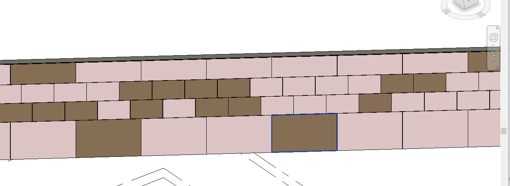
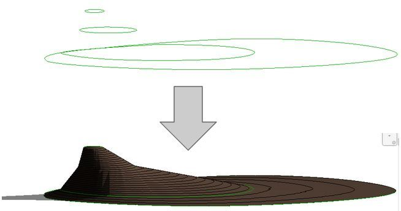

<head>
<meta http-equiv="Content-Type" content="text/html; charset=utf-8">
<link rel="stylesheet" type="text/css" href="bc.css">

</head>

<!---

- Asset Keyword Access
  https://app.slack.com/client/T02NW42JD/C0SR6NAP8
  Ryuji Ogasawara, RuoQian Lu and Joe Qiao 

- need to regen:
  Set Different Materials to Parts of a Wall
  https://forums.autodesk.com/t5/revit-api-forum/set-different-materials-to-parts-of-a-wall/m-p/10427403

- need to regen:
  Modifying group in api results in duplicate group
  https://forums.autodesk.com/t5/revit-api-forum/modifying-group-in-api-results-in-duplicate-group/m-p/10374430

- New post on Boost Your BIM
  Topo From Lines now in the free Revit tool set
  by harrymattison
  This tool is an"oldie but goodie" that lets you create and update a toposurface from a set of model lines. A new version for 2022 was recently requested, so I added it to the Terrific Tool project and created a 2022 build. You can download the current installer here and if you like code, that is here
  https://bitbucket.org/BoostYourBIM/boostyourbimterrifictools/src/master/BoostYourBIMTerrificTools/TopoFromLines.cs
  https://bitbucket.org/BoostYourBIM/boostyourbimterrifictools/raw/cd5589e83a158f283774d7a5e9590f07d85c904a/Boost+Your+BIM+Terrific+Tools-SetupFiles/Boost+Your+BIM+Terrific+Tools.msi&data=04%7C01%7Cjeremy.tammik%40autodesk.com%7Ce709df334bc34c20e06f08d9371557e6%7C67bff79e7f914433a8e5c9252d2ddc1d%7C0%7C0%7C637601387077658469%7CUnknown%7CTWFpbGZsb3d8eyJWIjoiMC4wLjAwMDAiLCJQIjoiV2luMzIiLCJBTiI6Ik1haWwiLCJXVCI6Mn0%3D%7C1000&sdata=HBFqPbGzz8Js990PpjCS5UuexeYytjlaxnU/EIDMFTw%3D&reserved=0

twitter:

add #thebuildingcoder

Painting stairs and shooting for the beams with the #RevitAPI @AutodeskForge @AutodeskRevit #bim #DynamoBim #ForgeDevCon https://autode.sk/paintstair

Two Revit API discussion forum threads that I am currently involved in
&ndash; Painting stairs
&ndash; Ray tracing vs bounding box to find beams intersecting columns...

linkedin:

Painting stairs and shooting for the beams with the #RevitAPI

https://autode.sk/paintstair

Two Revit API discussion forum threads that I am currently involved in:

- Painting stairs
- Ray tracing vs bounding box to find beams intersecting columns...

#bim #DynamoBim #ForgeDevCon #Revit #API #IFC #SDK #AI #VisualStudio #Autodesk #AEC #adsk

the [Revit API discussion forum](http://forums.autodesk.com/t5/revit-api-forum/bd-p/160) thread

**Question:** 

**Answer:**

**Response:**  

Many thanks to  for this very helpful explanation!

-->

### Asset Keyword

Two [Revit API discussion forum](http://forums.autodesk.com/t5/revit-api-forum/bd-p/160) threads
reinforce the ever-present [need to regenerate](https://thebuildingcoder.typepad.com/blog/about-the-author.html#5.33),
the development team clarifies access to various asset keyword properties, and Harry Mattison shares a free tool to create and update a toposurface from a set of model lines:

- [Asset keyword access](#2)
- [Modifying group requires regen](#3)
- [Modifying part material requires regen](#4)
- [Topo from lines](#5)

 <!-- 850 -->

#### Asset Keyword Access

**Question:** I have an issue setting a string value to the material appearance asset keyword property.
In one material, it can be set as expected, but another material returns an error saying, "The input value is invalid for this AssetPropertyString property.\r\nParameter name: value".
I found the blog article
on [Material, Physical and Thermal Assets](https://thebuildingcoder.typepad.com/blog/2019/11/material-physical-and-thermal-assets.html) and the internal development ticket *REVIT-170824* which explains that the keyword property on the `Identity` tab is not exposed yet.
However, I still expect the "keyword" property on the appearance tab to accept a string value.
In addition, I can see some error message in the journal file when I try to run the code below.
Is it possible to set the "keyword" property of the appearance asset?

<pre class="code">
void&nbsp;SetMaterialAppearanceAssetKeywordProperty(
&nbsp;&nbsp;AppearanceAssetElement&nbsp;assetElem,
&nbsp;&nbsp;string&nbsp;new_keyword&nbsp;)
{
&nbsp;&nbsp;Document&nbsp;doc&nbsp;=&nbsp;assetElem.Document;

&nbsp;&nbsp;using(&nbsp;Transaction&nbsp;tx&nbsp;=&nbsp;new&nbsp;Transaction(&nbsp;doc&nbsp;)&nbsp;)
&nbsp;&nbsp;{
&nbsp;&nbsp;&nbsp;&nbsp;tx.Start(&nbsp;&quot;Transaction&nbsp;Set&nbsp;Keyword&quot;&nbsp;);
&nbsp;&nbsp;&nbsp;&nbsp;using(&nbsp;AppearanceAssetEditScope&nbsp;editScope&nbsp;
&nbsp;&nbsp;&nbsp;&nbsp;&nbsp;&nbsp;=&nbsp;new&nbsp;AppearanceAssetEditScope(&nbsp;assetElem.Document&nbsp;)&nbsp;)
&nbsp;&nbsp;&nbsp;&nbsp;{
&nbsp;&nbsp;&nbsp;&nbsp;&nbsp;&nbsp;Asset&nbsp;editableAsset&nbsp;=&nbsp;editScope.Start(&nbsp;assetElem.Id&nbsp;);
 
&nbsp;&nbsp;&nbsp;&nbsp;&nbsp;&nbsp;try
&nbsp;&nbsp;&nbsp;&nbsp;&nbsp;&nbsp;{
&nbsp;&nbsp;&nbsp;&nbsp;&nbsp;&nbsp;&nbsp;&nbsp;var&nbsp;parameter&nbsp;=&nbsp;editableAsset.FindByName(&nbsp;&quot;keyword&quot;&nbsp;);
&nbsp;&nbsp;&nbsp;&nbsp;&nbsp;&nbsp;&nbsp;&nbsp;if(&nbsp;parameter&nbsp;!=&nbsp;null&nbsp;)
&nbsp;&nbsp;&nbsp;&nbsp;&nbsp;&nbsp;&nbsp;&nbsp;{
&nbsp;&nbsp;&nbsp;&nbsp;&nbsp;&nbsp;&nbsp;&nbsp;&nbsp;&nbsp;AssetPropertyString&nbsp;propKeyword&nbsp;=&nbsp;parameter&nbsp;
&nbsp;&nbsp;&nbsp;&nbsp;&nbsp;&nbsp;&nbsp;&nbsp;&nbsp;&nbsp;&nbsp;&nbsp;as&nbsp;AssetPropertyString;
 
&nbsp;&nbsp;&nbsp;&nbsp;&nbsp;&nbsp;&nbsp;&nbsp;&nbsp;&nbsp;if(&nbsp;propKeyword&nbsp;!=&nbsp;null&nbsp;)
&nbsp;&nbsp;&nbsp;&nbsp;&nbsp;&nbsp;&nbsp;&nbsp;&nbsp;&nbsp;{
&nbsp;&nbsp;&nbsp;&nbsp;&nbsp;&nbsp;&nbsp;&nbsp;&nbsp;&nbsp;&nbsp;&nbsp;if(&nbsp;string.IsNullOrEmpty(&nbsp;propKeyword.Value&nbsp;)&nbsp;)
&nbsp;&nbsp;&nbsp;&nbsp;&nbsp;&nbsp;&nbsp;&nbsp;&nbsp;&nbsp;&nbsp;&nbsp;{
&nbsp;&nbsp;&nbsp;&nbsp;&nbsp;&nbsp;&nbsp;&nbsp;&nbsp;&nbsp;&nbsp;&nbsp;&nbsp;&nbsp;propKeyword.Value&nbsp;=&nbsp;new_keyword;
&nbsp;&nbsp;&nbsp;&nbsp;&nbsp;&nbsp;&nbsp;&nbsp;&nbsp;&nbsp;&nbsp;&nbsp;}
&nbsp;&nbsp;&nbsp;&nbsp;&nbsp;&nbsp;&nbsp;&nbsp;&nbsp;&nbsp;&nbsp;&nbsp;else
&nbsp;&nbsp;&nbsp;&nbsp;&nbsp;&nbsp;&nbsp;&nbsp;&nbsp;&nbsp;&nbsp;&nbsp;{
&nbsp;&nbsp;&nbsp;&nbsp;&nbsp;&nbsp;&nbsp;&nbsp;&nbsp;&nbsp;&nbsp;&nbsp;&nbsp;&nbsp;if(&nbsp;!propKeyword.Value.Contains(&nbsp;new_keyword&nbsp;)&nbsp;)
&nbsp;&nbsp;&nbsp;&nbsp;&nbsp;&nbsp;&nbsp;&nbsp;&nbsp;&nbsp;&nbsp;&nbsp;&nbsp;&nbsp;{
&nbsp;&nbsp;&nbsp;&nbsp;&nbsp;&nbsp;&nbsp;&nbsp;&nbsp;&nbsp;&nbsp;&nbsp;&nbsp;&nbsp;&nbsp;&nbsp;string&nbsp;val&nbsp;=&nbsp;propKeyword.Value&nbsp;
&nbsp;&nbsp;&nbsp;&nbsp;&nbsp;&nbsp;&nbsp;&nbsp;&nbsp;&nbsp;&nbsp;&nbsp;&nbsp;&nbsp;&nbsp;&nbsp;&nbsp;&nbsp;+&nbsp;&quot;:&nbsp;&quot;+&nbsp;new_keyword;
&nbsp;&nbsp;&nbsp;&nbsp;&nbsp;&nbsp;&nbsp;&nbsp;&nbsp;&nbsp;&nbsp;&nbsp;&nbsp;&nbsp;&nbsp;&nbsp;propKeyword.Value&nbsp;=&nbsp;val;
&nbsp;&nbsp;&nbsp;&nbsp;&nbsp;&nbsp;&nbsp;&nbsp;&nbsp;&nbsp;&nbsp;&nbsp;&nbsp;&nbsp;}
&nbsp;&nbsp;&nbsp;&nbsp;&nbsp;&nbsp;&nbsp;&nbsp;&nbsp;&nbsp;&nbsp;&nbsp;}
&nbsp;&nbsp;&nbsp;&nbsp;&nbsp;&nbsp;&nbsp;&nbsp;&nbsp;&nbsp;}
&nbsp;&nbsp;&nbsp;&nbsp;&nbsp;&nbsp;&nbsp;&nbsp;}
&nbsp;&nbsp;&nbsp;&nbsp;&nbsp;&nbsp;}
&nbsp;&nbsp;&nbsp;&nbsp;&nbsp;&nbsp;catch(&nbsp;Exception&nbsp;ex&nbsp;)
&nbsp;&nbsp;&nbsp;&nbsp;&nbsp;&nbsp;{
&nbsp;&nbsp;&nbsp;&nbsp;&nbsp;&nbsp;&nbsp;&nbsp;Debug.WriteLine(&nbsp;ex.Message&nbsp;);
&nbsp;&nbsp;&nbsp;&nbsp;&nbsp;&nbsp;}
&nbsp;&nbsp;&nbsp;&nbsp;&nbsp;&nbsp;editScope.Commit(&nbsp;true&nbsp;);
&nbsp;&nbsp;&nbsp;&nbsp;}
&nbsp;&nbsp;&nbsp;&nbsp;tx.Commit();
&nbsp;&nbsp;}
}
</pre>

**Answer:** Yes, indeed, we already have a request *REVIT-171312* for this improvement.

The API does support modification of the `Keyword` property on an appearance asset.
You can set keyword under the `Appearance` tab in the material dialog through API.
You currently cannot set the `Keyword` property for `Structural` and `Thermal` through the API. 

After testing, I can reproduce this issue in the public release Revit 2022.
It works in my internal development version, however.
I created an issue *REVIT-179045* to track why this fails in Revit 2022 and will evaluate it for an upcoming point release fix.
Here is our understanding of the current situation accessing the keyword property in the various tabs:

- For keywords under the `Identity` tab, which is the keyword for `Material`, there is currently no API exposed for either `get` or `set`.
- Keywords under `Appearance` can be both `get` and `set` using the code above.
- Keywords under `Thermal` and `Structural` can be read using `get`, as described in the article
on [material, physical and thermal assets](https://thebuildingcoder.typepad.com/blog/2019/11/material-physical-and-thermal-assets.html).
`Set` is currently not supported for historical reasons (cf. internal tickets *REVIT-171312* and *REVIT-170824*).

#### Modifying Group Requires Regen

Forgetting or not realising
the [need to regenerate](https://thebuildingcoder.typepad.com/blog/about-the-author.html#5.33) and
accessing stale data can lead to pretty confusing and challenging problems.

As already noted in some previous examples, certain operations require more than just a call to `Regenerate`, e.g., starting and committing two or more separate transactions in a row.
Happily, in such cases, they can be assimilated into one single `TransactionGroup`, cf. the additional discussion
on [handling transactions and transaction groups](https://thebuildingcoder.typepad.com/blog/about-the-author.html#5.50).

It took a lengthy discussion with input from a couple of experienced add-in developers to clarify this need in the thread
on [modifying group in API results in duplicate group](https://forums.autodesk.com/t5/revit-api-forum/modifying-group-in-api-results-in-duplicate-group/m-p/10374430).

#### Modifying Part Material Requires Regen

Another example of 
the [need to regenerate](https://thebuildingcoder.typepad.com/blog/about-the-author.html#5.33) was
raised and solved by
Richard [RPThomas108](https://forums.autodesk.com/t5/user/viewprofilepage/user-id/1035859) Thomas in
the [Revit API discussion forum](http://forums.autodesk.com/t5/revit-api-forum/bd-p/160) thread on how
to [set different materials to parts of a wall](https://forums.autodesk.com/t5/revit-api-forum/set-different-materials-to-parts-of-a-wall/m-p/10427403).

In this case, careful observation and thorough understanding of the user interface helps significantly to resolve the problem, since the property to modify is greyed out &ndash; disabled or enabled &ndash; depending on the setting of another value:

**Question:** I am trying to set different materials to different parts of a wall as shown in the picture below:

 <!-- 1328 -->

My current method allows me to set all the parts to have the same material, but doesn't let me assign each part its own material. Here is my current approach:

- Get all the parts in the file (this is a controlled file where I know exactly what parts are there)
- Check whether a part is currently set to material "Facade Material" &ndash; this is how I've organized my wall ahead of time and I only want to change the material of parts of the wall that have material "Facade Material"
- Set each part's built-in parameter "Material by original" to false
- Set each part's built-in material parameter to my desired one

The issue is, once I set the material parameter for a given part, then it changes the material parameters for all the other parts.
I'm not sure if the concept of instance parameter vs type parameter vs family parameter holds for Parts, but from the object browser in Revit, the material parameter seems to be an instance parameter.

<pre class="code">
IEnumerable<Part> facadePanels2 = new FilteredElementCollector(doc).OfClass(typeof(Part)).Cast<Part>();
                foreach (Part p in facadePanels2)
                { 
                    using (var trans = new Transaction(doc, "Modify1"))
                    {
                        trans.Start();                        
                        Parameter pMat = p.get_Parameter(BuiltInParameter.DPART_MATERIAL_ID_PARAM);                        
                        System.Diagnostics.Debug.Print(pMat.AsValueString());
                        if (pMat.AsValueString() == "Facade Material")
                        {
                            System.Diagnostics.Debug.Print("Facade Material Found");
                            Parameter pOrig = p.get_Parameter(BuiltInParameter.DPART_MATERIAL_BY_ORIGINAL);
                            if (pOrig.IsReadOnly == false)
                            {
                                pOrig.Set(0);
                            }
                            if (pMat.IsReadOnly == false)
                            {
                                ElementId matId = materialIds[getMaterialOfPart(p, panels, viewDefault3D)];
                                
                                pMat.Set(matId);
                            }                            
                        }
                        trans.Commit();
                    }
</pre>

Any thoughts?

I've seen this thing be done before, so I know it's possible.

**Answer:** First, thoughts that have little to do with your question:

- I mostly recommend to avoid using AsValueString. I prefer the methods that return the raw parameter value: `AsInteger`, `AsDouble`, `AsElementId`, `AsString`.
- Why do you start a new transaction for each part in the loop? Can't you just use one single large transaction and run the loop within that?

**Response:** I figured it out.
It had to do with my transactions.

Once I wrapped the setting of the two parameters (`pOrig` and `pMat`) in their own transactions for each part, it now works properly.
It looks like all other parameters get set to read only when you change 1 parameter for a part in a single transaction?

Here's the code that's working, for those who care:

<pre class="code">
IEnumerable<Part> facadePanels2 = new FilteredElementCollector(doc).OfClass(typeof(Part)).Cast<Part>();
                foreach (Part p in facadePanels2)
                {
                        
                    Parameter pMat = p.get_Parameter(BuiltInParameter.DPART_MATERIAL_ID_PARAM);
                    if (pMat.AsElementId().IntegerValue == 309859) //("Facade Material")
                    {
                        System.Diagnostics.Debug.Print("Facade Material Found");
                        Parameter pOrig = p.get_Parameter(BuiltInParameter.DPART_MATERIAL_BY_ORIGINAL);
                        if (pOrig.IsReadOnly == false)
                        {
                            using (var trans = new Transaction(doc, "Modify1"))
                            {
                                trans.Start();
                                pOrig.Set(0);
                                trans.Commit();
                            }
                        }
                        if (pMat.IsReadOnly == false)
                        {
                            ElementId matId = materialIds[getMaterialOfPart(p, panels, viewDefault3D)];
                            using (var trans = new Transaction(doc, "Modify1"))
                            {
                                trans.Start();
                                pMat.Set(matId);
                                trans.Commit();
                            }
                        } 
                    }
</pre>

**Answer:** Yes.
That makes sense, since the second parameter would also be greyed out in UI if the first is not set to false, i.e., the ability to set thew second parameter is dependant on the value of first.

This also highlights the importance of order when batch processing built-in parameter values.
There are a few add-ins out there that populate parameter values, but they probably are not considering such relationships between parameters.

In that case, you can probably increase performance by using only one transaction after all and replacing the multiple mini-transactions by calls to `doc.Regenerate` after each cll to set `DPART_MATERIAL_BY_ORIGINAL`.

#### Topo From Lines

[Harry Mattison](https://twitter.com/BoostYourBIM)'s new post
on [Boost Your BIM](https://boostyourbim.wordpress.com) presents
[Topo From Lines now in the free Revit tool set](https://boostyourbim.wordpress.com/2021/06/24/topo-from-lines-now-in-the-free-revit-tool-set):

> This tool is an "oldie but goodie" that lets you create and update a toposurface from a set of model lines.
A new version for 2022 was recently requested, so I added it to the Terrific Tool project and created a 2022 build.
You can download the current installer here and if you like code, that is [here](https://bitbucket.org/BoostYourBIM/boostyourbimterrifictools/src/master/BoostYourBIMTerrificTools/TopoFromLines.cs).

 <!-- 654 -->

Many thanks to Harry for implementing and sharing this and so many other useful tools!

