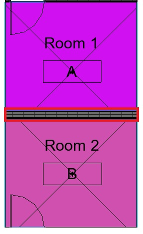

<head>
<meta http-equiv="Content-Type" content="text/html; charset=utf-8">
<link rel="stylesheet" type="text/css" href="bc.css">

</head>

<!---

- for all rooms, map all their bounding walls to the neighbouring rooms; then, add a list of all neighbouring rooms to the comment field on each wall 
  https://forums.autodesk.com/t5/revit-api-forum/extract-the-names-of-the-rooms-separated-by-a-wall/m-p/10428696
  another example of a relationship inversion:
  thee room maintains a relationship to its bounding elements, the walls.
  by retrieving that mapping, we can int=vert the raltionship and add information to each wall about its adjacent rooms.
  A [Relationship Inverter](http://thebuildingcoder.typepad.com/blog/2008/10/relationship-in.html) was
  the topic of one of The Building Coder's very first posts, #16, in October 2008.  

- get all warnings
  https://forums.autodesk.com/t5/revit-api-forum/get-a-list-of-all-the-revit-warnings/m-p/10399203
   schnierer.gabor
  Gábor Schnierer
  > Using the awesome code
  from [@FAIR59](https://forums.autodesk.com/t5/user/viewprofilepage/user-id/2083518)
  and [@perry.swoboda](https://forums.autodesk.com/t5/user/viewprofilepage/user-id/7186046) here
  is a spreadsheet containing
  the [BuiltInFailures for Revit 2022](https://docs.google.com/spreadsheets/d/12glULCZL_yJkq7ko_vI-gEHu69dUIoiCRnmvdLpIoSU/edit#gid=0) with
  their Severity, Classname, Guid and Description. Might come handy.

- revitlookup updates + installation

twitter:

add #thebuildingcoder

#RevitAPI add-in installer sample, RevitLookup enhancements, a list of built-in @AutodeskRevit failures, and how to determine and list all adjacent rooms and walls @AutodeskForge @AutodeskRevit #bim #DynamoBim #ForgeDevCon https://autode.sk/adjacentrooms

We discuss enhancements to RevitLookup,  and a neat utility to determine all room-wall adjacencies
&ndash; Adjacent rooms and walls
&ndash; List of all built-in failures
&ndash; Recent RevitLookup updates
&ndash; RevitLookup installation...

linkedin:

#RevitAPI add-in installer sample, RevitLookup enhancements, a list of built-in Revit failures, and how to determine and list all adjacent rooms and walls 

https://autode.sk/adjacentrooms

We discuss enhancements to RevitLookup,  and a neat utility to determine all room-wall adjacencies:

- Adjacent rooms and walls
- List of all built-in failures
- Recent RevitLookup updates
- RevitLookup installation...

#bim #DynamoBim #ForgeDevCon #Revit #API #IFC #SDK #AI #VisualStudio #Autodesk #AEC #adsk

the [Revit API discussion forum](http://forums.autodesk.com/t5/revit-api-forum/bd-p/160) thread

**Question:** 

**Answer:**

**Response:**  

Many thanks to  for this very helpful explanation!

-->

### Installer, List of Failures, Adjacent Rooms and Walls

We discuss enhancements to RevitLookup, a list of all built-in Revit failures, and a neat utility to determine all room-wall adjacencies:

- [Adjacent rooms and walls](#2)
- [List of all built-in failures](#3)
- [Recent RevitLookup updates](#4)
- [RevitLookup installation](#5)

 <!-- 286 -->

#### Adjacent Rooms and Walls

The [Revit API discussion forum](http://forums.autodesk.com/t5/revit-api-forum/bd-p/160) question
on how to [extract the names of the rooms separated by a wall](https://forums.autodesk.com/t5/revit-api-forum/extract-the-names-of-the-rooms-separated-by-a-wall/m-p/10428696)
prompted Richard [RPThomas108](https://forums.autodesk.com/t5/user/viewprofilepage/user-id/1035859) Thomas
to share a neat utility method implementing much more than that:

**Question:** I use Revit to model my projects, then I export the BOMs to a spreadsheet that creates my quotes for clients.
However, I am running into a problem:

When I need to demolish or create a wall, I would like to see its location, if any, appear in the BOM. 

For example, if I break a wall between the kitchen and the living room, I would like to see "kitchen" or "living room", or even both, next to the surfaces. But I can't find a way to implement this.

Do you have any ideas to help me?

**Answer:** Via the API, you can use
the [`Room.GetBoundarySegments` method](https://www.revitapidocs.com/2022/8e0919af-6172-9d16-26d2-268e42f7e936.htm).

This will return a nested list of `BoundarySegment` objects on which you can query their `ElementId` or `LinkElementId` property.

Then it is just a case or matching up the ElementId with the wall id and pairing that with the room(s). 

Some walls will be part of more than two rooms:

<pre class="code">
Private Function Obj_210629a( _
  ByVal commandData As Autodesk.Revit.UI.ExternalCommandData, _
  ByRef message As String, _
  ByVal elements As Autodesk.Revit.DB.ElementSet) _
  As Result

  Dim UIDoc As UIDocument = commandData.Application.ActiveUIDocument
  If UIDoc Is Nothing Then Return Result.Cancelled Else
  Dim IntDoc As Document = UIDoc.Document

  Dim FEC As New FilteredElementCollector(IntDoc)
  Dim ECF As New ElementCategoryFilter(BuiltInCategory.OST_Rooms)
  Dim Els As List(Of ElementId) = FEC.WherePasses(ECF) _
    .WhereElementIsNotElementType.ToElementIds

  Dim WallRefs As New Dictionary(Of ElementId, List(Of String))
  For i = 0 To Els.Count - 1
    Dim Rm As Room = IntDoc.GetElement(Els(i))

    Dim BSegs As IList(Of IList(Of BoundarySegment)) = _
      Rm.GetBoundarySegments(New SpatialElementBoundaryOptions)
      
    For x = 0 To BSegs.Count - 1
      Dim BSegs0 As IList(Of BoundarySegment) = BSegs(x)
      For y = 0 To BSegs0.Count - 1
        Dim Bseg As BoundarySegment = BSegs0(y)
        If Bseg.ElementId <> ElementId.InvalidElementId Then
          Dim CurRef As List(Of String)
          If WallRefs.ContainsKey(Bseg.ElementId) Then
            CurRef = WallRefs(Bseg.ElementId)
          Else
            CurRef = New List(Of String)
            WallRefs.Add(Bseg.ElementId, CurRef)
          End If

          Dim Rm_el As Element = Rm 
          Dim RoomName As String = Rm_el.Name
          If CurRef.Contains(RoomName) = False Then
            CurRef.Add(RoomName)
          End If
        End If
      Next
    Next
  Next

  Dim FECw As New FilteredElementCollector(IntDoc)
  Dim ECFw As New ElementClassFilter(GetType(Wall))
  Dim Elsw As List(Of ElementId) = FECw.WherePasses(ECFw).ToElementIds

  Using Tx As New Transaction(IntDoc, "Name walls based on rooms")
    If Tx.Start = TransactionStatus.Started Then

      For i = 0 To Elsw.Count - 1
        'Some boundary segments will not relate to walls.
        If WallRefs.ContainsKey(Elsw(i)) Then

          Dim El As Element = IntDoc.GetElement(Elsw(i))

          'Using instance comments parameter for convenience
          
          Dim P As Parameter = El.Parameter(BuiltInParameter.ALL_MODEL_INSTANCE_COMMENTS)
          If P Is Nothing Then Continue For Else

          Dim Refs As List(Of String) = WallRefs(Elsw(i))
          Refs.Sort()
          Dim V As New Text.StringBuilder
          For j = 0 To Refs.Count - 1
            If j = Refs.Count - 1 Then
              V.Append(Refs(j))
            Else
              V.Append(Refs(j) & " / ")
            End If
          Next
          P.Set(V.ToString)

        End If
      Next
      Tx.Commit()
    End If
  End Using
  Return Result.Succeeded
End Function
</pre>

Thanks to Richard for sharing this very nice VB.NET implementation!

Spelling it out, this does two things:

- For all rooms, for each of its bounding walls, note the room to wall relationship
- Use this to create a dictionary mapping the wall element id to a list of the rooms it bounds
- For each wall element id in the dictionary, add a list of the names of the rooms it bounds to its comment field 

I ported the VB.NET code to C# and [The Building Coder samples](https://github.com/jeremytammik/the_building_coder_samples/compare/2022.0.150.14...2022.0.150.15):

<pre class="code">
///&nbsp;&lt;summary&gt;
///&nbsp;For&nbsp;all&nbsp;rooms,&nbsp;determine&nbsp;all&nbsp;adjacent&nbsp;walls,
///&nbsp;create&nbsp;dictionary&nbsp;mapping&nbsp;walls&nbsp;to&nbsp;adjacent&nbsp;rooms,
///&nbsp;and&nbsp;tag&nbsp;the&nbsp;walls&nbsp;with&nbsp;the&nbsp;adjacent&nbsp;room&nbsp;names.
///&nbsp;&lt;/summary&gt;
void&nbsp;TagWallsWithAdjacentRooms(&nbsp;Document&nbsp;doc&nbsp;)
{
&nbsp;&nbsp;FilteredElementCollector&nbsp;rooms
&nbsp;&nbsp;&nbsp;&nbsp;=&nbsp;new&nbsp;FilteredElementCollector(&nbsp;doc&nbsp;)
&nbsp;&nbsp;&nbsp;&nbsp;&nbsp;&nbsp;.WhereElementIsNotElementType()
&nbsp;&nbsp;&nbsp;&nbsp;&nbsp;&nbsp;.OfCategory(&nbsp;BuiltInCategory.OST_Rooms&nbsp;);
 
&nbsp;&nbsp;Dictionary&lt;ElementId,&nbsp;List&lt;string&gt;&gt;&nbsp;map_wall_to_rooms
&nbsp;&nbsp;&nbsp;&nbsp;=&nbsp;new&nbsp;Dictionary&lt;ElementId,&nbsp;List&lt;string&gt;&gt;();
 
&nbsp;&nbsp;SpatialElementBoundaryOptions&nbsp;opts
&nbsp;&nbsp;&nbsp;&nbsp;=&nbsp;new&nbsp;SpatialElementBoundaryOptions();
 
&nbsp;&nbsp;foreach(&nbsp;Room&nbsp;room&nbsp;in&nbsp;rooms&nbsp;)
&nbsp;&nbsp;{
&nbsp;&nbsp;&nbsp;&nbsp;IList&lt;IList&lt;BoundarySegment&gt;&gt;&nbsp;loops&nbsp;
&nbsp;&nbsp;&nbsp;&nbsp;&nbsp;&nbsp;=&nbsp;room.GetBoundarySegments(&nbsp;opts&nbsp;);
 
&nbsp;&nbsp;&nbsp;&nbsp;foreach&nbsp;(IList&lt;BoundarySegment&gt;&nbsp;loop&nbsp;in&nbsp;loops&nbsp;)
&nbsp;&nbsp;&nbsp;&nbsp;{
&nbsp;&nbsp;&nbsp;&nbsp;&nbsp;&nbsp;foreach(&nbsp;BoundarySegment&nbsp;seg&nbsp;in&nbsp;loop&nbsp;)
&nbsp;&nbsp;&nbsp;&nbsp;&nbsp;&nbsp;{
&nbsp;&nbsp;&nbsp;&nbsp;&nbsp;&nbsp;&nbsp;&nbsp;ElementId&nbsp;idWall&nbsp;=&nbsp;seg.ElementId;
 
&nbsp;&nbsp;&nbsp;&nbsp;&nbsp;&nbsp;&nbsp;&nbsp;if(&nbsp;ElementId.InvalidElementId&nbsp;!=&nbsp;idWall&nbsp;)
&nbsp;&nbsp;&nbsp;&nbsp;&nbsp;&nbsp;&nbsp;&nbsp;{
&nbsp;&nbsp;&nbsp;&nbsp;&nbsp;&nbsp;&nbsp;&nbsp;&nbsp;&nbsp;if(!map_wall_to_rooms.ContainsKey(idWall))
&nbsp;&nbsp;&nbsp;&nbsp;&nbsp;&nbsp;&nbsp;&nbsp;&nbsp;&nbsp;{
&nbsp;&nbsp;&nbsp;&nbsp;&nbsp;&nbsp;&nbsp;&nbsp;&nbsp;&nbsp;&nbsp;&nbsp;map_wall_to_rooms.Add(&nbsp;
&nbsp;&nbsp;&nbsp;&nbsp;&nbsp;&nbsp;&nbsp;&nbsp;&nbsp;&nbsp;&nbsp;&nbsp;&nbsp;&nbsp;idWall,&nbsp;new&nbsp;List&lt;string&gt;()&nbsp;);
&nbsp;&nbsp;&nbsp;&nbsp;&nbsp;&nbsp;&nbsp;&nbsp;&nbsp;&nbsp;}
 
&nbsp;&nbsp;&nbsp;&nbsp;&nbsp;&nbsp;&nbsp;&nbsp;&nbsp;&nbsp;string&nbsp;room_name&nbsp;=&nbsp;room.Name;
 
&nbsp;&nbsp;&nbsp;&nbsp;&nbsp;&nbsp;&nbsp;&nbsp;&nbsp;&nbsp;if(!map_wall_to_rooms[idWall].Contains(&nbsp;room_name&nbsp;)&nbsp;)
&nbsp;&nbsp;&nbsp;&nbsp;&nbsp;&nbsp;&nbsp;&nbsp;&nbsp;&nbsp;{
&nbsp;&nbsp;&nbsp;&nbsp;&nbsp;&nbsp;&nbsp;&nbsp;&nbsp;&nbsp;&nbsp;&nbsp;map_wall_to_rooms[&nbsp;idWall&nbsp;].Add(&nbsp;room_name&nbsp;);
&nbsp;&nbsp;&nbsp;&nbsp;&nbsp;&nbsp;&nbsp;&nbsp;&nbsp;&nbsp;}
&nbsp;&nbsp;&nbsp;&nbsp;&nbsp;&nbsp;&nbsp;&nbsp;}
&nbsp;&nbsp;&nbsp;&nbsp;&nbsp;&nbsp;}
&nbsp;&nbsp;&nbsp;&nbsp;}
&nbsp;&nbsp;}
 
&nbsp;&nbsp;using(&nbsp;Transaction&nbsp;tx&nbsp;=&nbsp;new&nbsp;Transaction(&nbsp;doc&nbsp;)&nbsp;)
&nbsp;&nbsp;{
&nbsp;&nbsp;&nbsp;&nbsp;tx.Start(&nbsp;&quot;Add&nbsp;list&nbsp;of&nbsp;adjacent&nbsp;rooms&nbsp;to&nbsp;wall&nbsp;comments&quot;&nbsp;);
 
&nbsp;&nbsp;&nbsp;&nbsp;Dictionary&lt;ElementId,&nbsp;List&lt;string&gt;&gt;.KeyCollection&nbsp;ids
&nbsp;&nbsp;&nbsp;&nbsp;&nbsp;&nbsp;=&nbsp;map_wall_to_rooms.Keys;
 
&nbsp;&nbsp;&nbsp;&nbsp;foreach(&nbsp;ElementId&nbsp;id&nbsp;in&nbsp;ids&nbsp;)
&nbsp;&nbsp;&nbsp;&nbsp;{
&nbsp;&nbsp;&nbsp;&nbsp;&nbsp;&nbsp;Element&nbsp;wall&nbsp;=&nbsp;doc.GetElement(&nbsp;id&nbsp;);
 
&nbsp;&nbsp;&nbsp;&nbsp;&nbsp;&nbsp;Parameter&nbsp;p&nbsp;=&nbsp;wall.get_Parameter(
&nbsp;&nbsp;&nbsp;&nbsp;&nbsp;&nbsp;&nbsp;&nbsp;BuiltInParameter.ALL_MODEL_INSTANCE_COMMENTS&nbsp;);
 
&nbsp;&nbsp;&nbsp;&nbsp;&nbsp;&nbsp;if(&nbsp;null&nbsp;!=&nbsp;p&nbsp;)
&nbsp;&nbsp;&nbsp;&nbsp;&nbsp;&nbsp;{
&nbsp;&nbsp;&nbsp;&nbsp;&nbsp;&nbsp;&nbsp;&nbsp;string&nbsp;s&nbsp;=&nbsp;string.Join(&nbsp;&quot;&nbsp;/&nbsp;&quot;,&nbsp;
&nbsp;&nbsp;&nbsp;&nbsp;&nbsp;&nbsp;&nbsp;&nbsp;&nbsp;&nbsp;map_wall_to_rooms[&nbsp;id&nbsp;]&nbsp;);
 
&nbsp;&nbsp;&nbsp;&nbsp;&nbsp;&nbsp;&nbsp;&nbsp;p.Set(&nbsp;s&nbsp;);
&nbsp;&nbsp;&nbsp;&nbsp;&nbsp;&nbsp;}
&nbsp;&nbsp;&nbsp;&nbsp;}
&nbsp;&nbsp;&nbsp;&nbsp;tx.Commit();
&nbsp;&nbsp;}
}
</pre>

Note that the C# version processes all elements whose element id appears as a key in the wall to room mapping, regardless of whether they are in fact a wall or not.

The VB.NET version uses a filtered element collector to retrieve only wall elements.

You need to decide which approach better matches your specific requirements.

This is yet another example of a relationship inversion:
every room maintains a relationship to its bounding elements, the walls.
by retrieving and processing that mapping, we can invert the relationship and use that to add information to each wall about its adjacent rooms.

This is a common Revit API task. 
A similar [relationship inverter](http://thebuildingcoder.typepad.com/blog/2008/10/relationship-in.html) was
the topic of one of The Building Coder's very first posts, #16, in October 2008.

#### List of All Built-In Failures

Gábor Schnierer very kindly shares a list of
all [built-in failures](https://www.revitapidocs.com/2021.1/eda15d4a-6b14-ee6b-0c44-6011077e6cfc.htm) in
the [Revit API discussion forum](http://forums.autodesk.com/t5/revit-api-forum/bd-p/160) thread
on how to [get all warnings](https://forums.autodesk.com/t5/revit-api-forum/get-a-list-of-all-the-revit-warnings/m-p/10399203):

> Using the awesome code
from [@FAIR59](https://forums.autodesk.com/t5/user/viewprofilepage/user-id/2083518)
and [@perry.swoboda](https://forums.autodesk.com/t5/user/viewprofilepage/user-id/7186046),
here is
a [spreadsheet containing the BuiltInFailures for Revit 2022](https://docs.google.com/spreadsheets/d/12glULCZL_yJkq7ko_vI-gEHu69dUIoiCRnmvdLpIoSU/edit#gid=0) with
their `Severity`, `Classname`, `Guid` and `Description`.
Might come handy.

Thank you very much, Gábor!

#### Recent RevitLookup Updates

The number of pull requests to add enhancements 
to [RevitLookup](https://github.com/jeremytammik/RevitLookup) has
increased recently significantly.

That is great news!

Each individual improvement may be small and simple.
However, they all add up, and the entire community ends up enjoying a brilliant and full-fledged tool.

Here are the important enhancements made since 
the [previous bunch of updates](https://thebuildingcoder.typepad.com/blog/2021/05/revitlookup-update-fuslogvw-and-override-joins.html). 

- [2022.0.0.10](https://github.com/jeremytammik/RevitLookup/releases/tag/2022.0.0.10) fix error where element cannot be retrieved for an element id because `SupportedColorFillCategoryIds` returns category ids instead
- [2022.0.0.11](https://github.com/jeremytammik/RevitLookup/releases/tag/2022.0.0.11) add `PlanViewRange` functionality to display view range level id and offset
- [2022.0.0.13](https://github.com/jeremytammik/RevitLookup/releases/tag/2022.0.0.13) add `OnLoad` to increase and optimise width of Snoop window value `ListView` last column
- [2022.0.0.15](https://github.com/jeremytammik/RevitLookup/releases/tag/2022.0.0.15) add RevitLookup.Installation

Many thanks to
all [contributors](https://github.com/jeremytammik/RevitLookup/graphs/contributors) for
your great support!

#### RevitLookup Installation

Luiz Henrique [@ricaun](https://github.com/ricaun) Cassettari created
the [RevitLookup.Installation](https://github.com/ricaun/RevitLookup.Installation) project,
a simple installation using [Inno Setup](https://jrsoftware.org/isinfo.php) to
extract the files to the `ApplicationPlugins` folder.

It generates a digitally signed version of RevitLookup and includes multi-version support for the Revit releases 2017, 2018, 2019, 2020, 2021 and 2022.

It can obviously also be used as a starting point for your own add-in installer.

Many thanks to Luiz Henrique for this and his other nice contributions!

