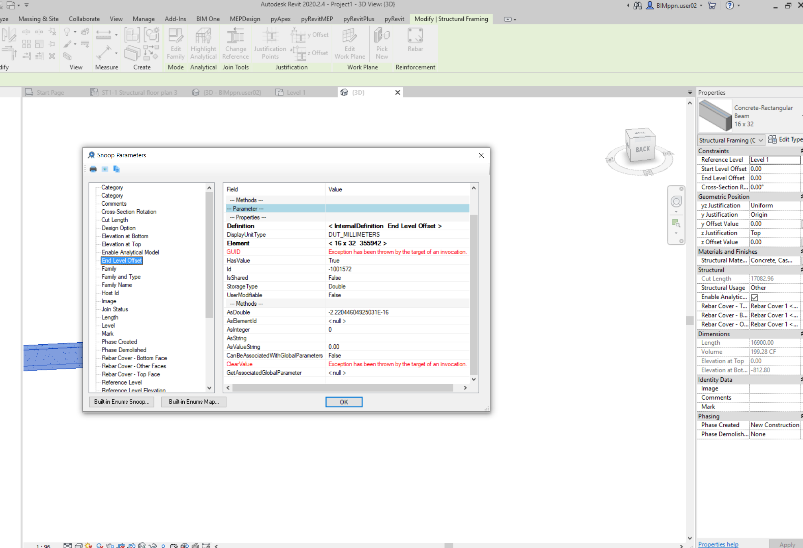
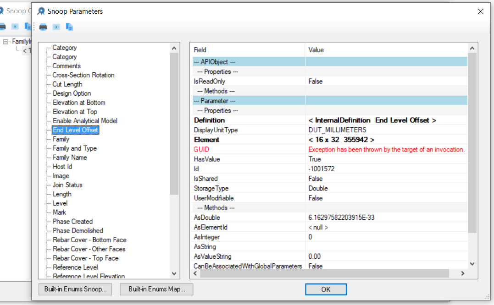

<head>
<meta http-equiv="Content-Type" content="text/html; charset=utf-8">
<link rel="stylesheet" type="text/css" href="bc.css">

</head>

<!---

- au registration open and free
  email Autodesk University Registration is Now Open

- the importance of fuzz
  https://forums.autodesk.com/t5/revit-api-forum/weird-double-value-that-suppose-to-be-0-but-isn-t/m-p/10443154
  almost_zero_1.png
  almost_zero_2.png
  https://forums.autodesk.com/t5/revit-api-forum/element-geometry-not-returning-expected-face-count/m-p/10473778
  zr_beam_and_slab_surfaces_1.png
  zr_beam_and_slab_surfaces_dynamo.png

- afaik, the ultimate guide on [Getting started with Python]
  https://stackoverflow.blog/2021/07/14/getting-started-with-python/
  
- solar panels
  many_solar_panels.jpg
  jtracer
  running into all the hurdles described in [Learning from the real world: A hardware hobby project]
  https://stackoverflow.blog/2021/07/12/the-difference-between-software-and-hardware-projects/

twitter:

add #thebuildingcoder

AU registration is open, real number comparison always requires fuzz, Python learning material and time for vacation from the  the #RevitAPI @AutodeskForge @AutodeskRevit #bim #DynamoBim #ForgeDevCon https://autode.sk/au_python_fuzz_vacation

AU registration is open, fuzzy comparison is important for real numbers, Python learning material and time for a break
&ndash; Autodesk University 2021 open and free
&ndash; Real number comparison requires fuzz
&ndash; Getting started with Python
&ndash; Vacation time...

linkedin:

AU registration is open, real number comparison always requires fuzz, Python learning material and time for vacation from the #RevitAPI

https://autode.sk/au_python_fuzz_vacation

- Autodesk University 2021 open and free
- Real number comparison requires fuzz
- Getting started with Python
- Vacation time...

#bim #DynamoBim #ForgeDevCon #Revit #API #IFC #SDK #AI #VisualStudio #Autodesk #AEC #adsk

the [Revit API discussion forum](http://forums.autodesk.com/t5/revit-api-forum/bd-p/160) thread

**Question:** 

**Answer:**

**Response:**  

Many thanks to  for this very helpful explanation!

-->

### Autodesk University 2021, Python, Fuzz and Break

AU registration is open, fuzzy comparison is important for real numbers, Python learning material and time for a break:

- [Autodesk University 2021 open and free](#2)
- [Real number comparison requires fuzz](#3)
- [Getting started with Python](#4)
- [Vacation time](#5)

#### Autodesk University 2021 Open and Free

Registration is live for Autodesk University 2021.
 
This year the event is a free, virtual and global conference held on October 5-14.

For more info on the conference as a whole, visit the conference page.

If you are curious what Forge is doing, please check out the web page and blog:
 
- [AU conference](https://www.autodesk.com/autodesk-university/conference/overview)
- [AU registration](https://autodeskuniversity.smarteventscloud.com/portal)
- [Forge at AU](https://forge.autodesk.com/AU)
- [Forge Bootcamp registration](https://www.eventbrite.com/e/forge-training-online-sept-13-17-2021-registration-157191924277)
- [Forge Hackathon registration](https://forge.autodesk.com/hackathon)

 <!-- 774 -->

#### Real Number Comparison Requires Fuzz

On a digital computer, all real number comparisons require fuzz.

This means that you cannot compare two real numbers directly.
Instead, you test whether they are close enough together, where 'close enough' is defined by a given tolerance.
The tolerance depends on the context and the type of comparison being made.

Revit BIM geometry often ends up with significant imprecision due to various complex editing steps, so fuzz is especially important in this area.

This was highlighted yet again by the 
recent [Revit API discussion forum](http://forums.autodesk.com/t5/revit-api-forum/bd-p/160) thread
on a [weird double value supposed to be zero but isn't](https://forums.autodesk.com/t5/revit-api-forum/weird-double-value-that-suppose-to-be-0-but-isn-t/m-p/10443154):

**Question:** This happens after I set the beam family parameter `Start Level Offset` and `End Level Offset` to any non-zero value and then change it back to zero again:

 <!-- 1974 -->

 <!-- 1077 -->

**Answer:** This is due to the imprecision associated with real numbers in digital computers.

The 'weird' number that you see is not really weird at all.

It is just a very small number written in exponential or scientific notation.
Read about:

- [Real numbers in computation](https://en.wikipedia.org/wiki/Real_number#In_computation)
- [Scientific notation](https://en.wikipedia.org/wiki/Scientific_notation)

From your description, it was generated by adding an offset and subtracting it again.
Both of the offsets were not represented precisely, e.g., because they were converted from metric to imperial units.
The result is imprecise, almost exactly zero, but very slightly off.

That is completely normal and must be taken into account whenever dealing with real numbers of a digital computer, for instance, in many operations, e.g., comparisons,  by adding some fuzz:

- [Fuzzy comparison](https://thebuildingcoder.typepad.com/blog/2017/06/sensors-bim-ai-revitlookup-and-fuzzy-comparison.html#4)
- [Fuzzy comparison versus exact arithmetic for curve intersection](https://thebuildingcoder.typepad.com/blog/2017/12/project-identifier-and-fuzzy-comparison.html#3)
- [Importance of fuzz for curtain wall dimensioning](https://thebuildingcoder.typepad.com/blog/2018/12/rebars-in-host-net-framework-and-importance-of-fuzz.html#4)

The same issue came up again right away in the discussion
on [element geometry not returning expected face count](https://forums.autodesk.com/t5/revit-api-forum/element-geometry-not-returning-expected-face-count/m-p/10473778).

As Rudi @Revitalizer Honke very succinctly puts it:

> when comparing double values, it is necessary to add some tolerance.

> Values may differ by 0.000000001, for example.

#### Getting Started with Python

In case you are considering learning Python, or to get started with programming in general, 
[freecodecamp](https://www.freecodecamp.org) published the ultimate guide
on [getting started with Python](https://stackoverflow.blog/2021/07/14/getting-started-with-python).

For more material on Dynamo, Python, and .NET, please refer to our earlier notes on

<!--
0964:Python the Hard Way
1057:Interactive Revit Database Exploration Using the Revit Python Shell
1078:How to use Python with Revit
1143:WAV Database, Python and GUI Tutorials
1448:<"#3">RevitPythonShell Dynamic Model Updater Tutorial
1452:<"#2">Retrieving a C# <code>out</code> Argument Value in Python
1570:Determining RVT File Version Using Python
1712:<"#1"> Cyril's Python HVAC Blog
1712:<"#2"> Rotating Elements Around Their Centre in Python
1712:<"#6"> Python Popularity Growing
1715:Retrieving Linked IfcZone Elements Using Python
1756:<"#3"> Retrieve RVT Preview Thumbnail Image with Python
1786:Pet Change &ndash; Python + Dynamo Swap Nested Family
1821:<"#2">Duplicate Legend Component in Python
1821:<"#3">Convert Latitude and Longitude to Metres in Python
1838:<"#3.1"> C&#35; versus Python
1838:<"#3.2"> Python and .NET
1890:<"#5"> Python and Dynamo Autotag Without Overlap
1893:<"#3"> Learning Python and Dynamo
1893:<"#3.2"> Take Dynamo Further Using Python

0964 1057 1143 1448 1452 1570 1712 1712 1712 1715 1756 1786 1821 1821 1838 1838 1890 1893 1893
-->

<ul>
<li><a href="http://thebuildingcoder.typepad.com/blog/2013/06/python-and-ruby-scripting-resources-and-the-sharp-glyph.html">Python and Ruby Scripting Resources and the Sharp Glyph</a></li>
<li><a href="http://thebuildingcoder.typepad.com/blog/2013/11/intimate-revit-database-exploration-with-the-python-shell.html">Interactive Revit Database Exploration with the Python Shell</a></li>
<li><a href="http://thebuildingcoder.typepad.com/blog/2014/04/wav-database-python-and-gui-tutorials.html">Python Tutorials</a></li>
<li><a href="http://thebuildingcoder.typepad.com/blog/2016/06/revitpythonshell-dynamic-model-updater-tutorial-and-wizard-update.html#3">RevitPythonShell Dynamic Model Updater Tutorial</a></li>
<li><a href="http://thebuildingcoder.typepad.com/blog/2016/07/retrieving-a-c-out-argument-value-in-python.html">Retrieving a C# out Argument Value in Python</a></li>
<li><a href="http://thebuildingcoder.typepad.com/blog/2017/06/determining-rvt-file-version-using-python.html">Determining RVT File Version Using Python</a></li>
<li><a href="https://thebuildingcoder.typepad.com/blog/2018/12/rotate-picked-element-around-bounding-box-centre-in-python.html#1">Cyril's Python HVAC Blog</a></li>
<li><a href="https://thebuildingcoder.typepad.com/blog/2018/12/rotate-picked-element-around-bounding-box-centre-in-python.html#2">Rotating Elements Around Their Centre in Python</a></li>
<li><a href="https://thebuildingcoder.typepad.com/blog/2018/12/rotate-picked-element-around-bounding-box-centre-in-python.html#6">Python Popularity Growing</a></li>
<li><a href="https://thebuildingcoder.typepad.com/blog/2019/01/retrieving-linked-ifczone-elements-using-python.html">Retrieving Linked IfcZone Elements Using Python</a></li>
<li><a href="https://thebuildingcoder.typepad.com/blog/2019/06/accessing-bim360-cloud-links-thumbnail-and-dynamo.html#3">Retrieve RVT Preview Thumbnail Image with Python</a></li>
<li><a href="https://thebuildingcoder.typepad.com/blog/2019/10/pet-change-python-and-dynamo-swap-nested-families.html">Pet Change &ndash; Python + Dynamo Swap Nested Family</a></li>
<li><a href="https://thebuildingcoder.typepad.com/blog/2020/02/lat-long-to-metres-and-duplicate-legend-component.html#2">Duplicate Legend Component in Python</a></li>
<li><a href="https://thebuildingcoder.typepad.com/blog/2020/02/lat-long-to-metres-and-duplicate-legend-component.html#3">Convert Latitude and Longitude to Metres in Python</a></li>
<li><a href="https://thebuildingcoder.typepad.com/blog/2020/04/2021-migration-add-in-language-and-bim360-login.html#3.1">C&#35; versus Python</a></li>
<li><a href="https://thebuildingcoder.typepad.com/blog/2020/04/2021-migration-add-in-language-and-bim360-login.html#3.2">Python and .NET</a></li>
<li><a href="https://thebuildingcoder.typepad.com/blog/2021/02/splits-persona-collector-region-tag-modification.html#5">Python and Dynamo Autotag Without Overlap</a></li>
<li><a href="https://thebuildingcoder.typepad.com/blog/2021/02/addin-file-learning-python-and-ifcjs.html#3">Learning Python and Dynamo</a></li>
<li><a href="https://thebuildingcoder.typepad.com/blog/2021/02/addin-file-learning-python-and-ifcjs.html#3.2">Take Dynamo Further Using Python</a></li>
</ul>

#### Vacation Time

I'll be mostly offline for the coming three weeks, from July 26 until August 13, spending time in nature in different parts of Switzerland.

I wish you a happy and fruitful time until I return.
