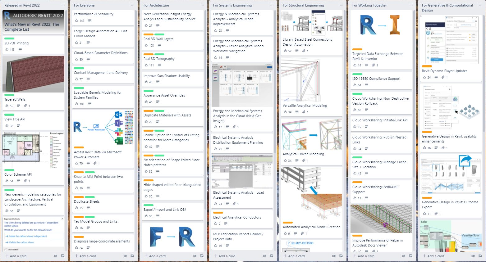

<head>
<meta http-equiv="Content-Type" content="text/html; charset=utf-8">
<link rel="stylesheet" type="text/css" href="bc.css">

</head>

<!---

- https://blogs.autodesk.com/revit/2021/07/06/revit-public-roadmap-update-summer-2021/

twitter:

add #thebuildingcoder

 the #RevitAPI @AutodeskForge @AutodeskRevit #bim #DynamoBim #ForgeDevCon 

&ndash; 
...

linkedin:

#bim #DynamoBim #ForgeDevCon #Revit #API #IFC #SDK #AI #VisualStudio #Autodesk #AEC #adsk

the [Revit API discussion forum](http://forums.autodesk.com/t5/revit-api-forum/bd-p/160) thread

**Question:** 

**Answer:**

**Response:**  

Many thanks to  for this very helpful explanation!

<pre class="code">
</pre>

-->

### Revit Roadmap, API and DA4R Survey

#### Revit Public Roadmap Update

The [Revit Public Roadmap Update Summer 2021](https://blogs.autodesk.com/revit/2021/07/06/revit-public-roadmap-update-summer-2021)
was published in July with the invitation to provide feedback via likes:

> Autodesk Revit 2022 shipped in April and we have added new features to the Revit Public Roadmap.
For a live look, check out
the [Kanban board on Trello and like your favorites...](https://trello.com/b/ldRXK9Gw/revit-public-roadmap) 

Please refer to the main article for a snapshot of the Summer 2021 update.

 <!-- 1564 -->

#### Revit and DA4R API Survey 2021

[Revit and Design Automation for Revit &ndash; API Survey 2021](https://forge.autodesk.com/blog/revit-and-design-automation-revit-api-survey-2021)
BY MIKAKO HARADA

The Revit product team is conducting a survey to improve the functionality of Revit services. Please take this brief 5 minutes survey to help the Revit team prioritize new features and upcoming enhancements to the future releases of Autodesk Revit and the Forge Design Automation for Revit. 

Survey is open till September 24th.

Thank you in advance for your time and interest!  

GO TO REVIT API SURVEY 

https://autodeskfeedback.az1.qualtrics.com/jfe/form/SV_ex5UwT1A2lj0s6y

#### MacOS Big Sur Upgrade

Company policy forced me to upgrade to Big Sur MacOS 11.5.2.

The upgrade went smoothly.

However, a few things caused problems after the successful upgrade.
Luckily, other people have faced and solved the same issues in the months since the initial Big Sur release:

- [Unable to mount my `/a`, `/j`, `/m` and `/p` folders in the root dir](https://www.quora.com/Can-you-mount-the-root-system-file-system-as-writable-in-Big-Sur-MacOS-Big-Sur-Apple)
- [Komodo editor stopped running](https://community.komodoide.com/t/komodo-and-big-sur-do-not-upgrade/5191/15)
- [The VeraCrypt encryption tool failed](https://techstuffer.com/veracrypt-macos-bigsur-compatibility/)

<!---  
https://stackoverflow.com/questions/60469031/create-directory-dotenv-on-macos-read-only-file-system

disable the read-only file system in Catalina by following these steps

Boot you mac system into recovery mode. (by bootup system with holding CMD+R).

Open terminal (Present in "Utilities" in the top left menu).

run command

csrutil disable
Restart your system, Bootup normally and check the status: csrutil status.

Before doing any activity open terminal and run command.

sudo mount -uw /
Once this all done you can do write in root location

https://wpbeaches.com/enable-the-root-user-in-macos-big-sur-and-earlier-macos-versions/

Root jta2root

https://github.com/fxgst/writeable_root

/Users/jta/a/src/c/writeable_root/README.md
/Users/jta/a/src/c/writeable_root/writeable_root.c

https://elitemacx86.com/threads/how-to-enable-write-access-on-root-volume-on-macos-big-sur-and-later.652/

https://egpu.io/forums/mac-setup/macos-up-to-11/

https://www.quora.com/Can-you-mount-the-root-system-file-system-as-writable-in-Big-Sur-MacOS-Big-Sur-Apple?share=1

Can you mount the root (system) file system as writable in Big Sur (MacOS, Big Sur, Apple)?

Answer:

- Disable FileVault
- Reboot into recovery mode and run: csrutil authenticated-root disable
- Reboot back into macOS
- Find your root mount's device - run mount and chop off the lasts, e.g. if your root is /dev/disk1s2s3, you'll mount /dev/disk1s2
- Create a new directory, for example, ~/mount mkdir -p -m777 ~/mount
- Run sudo mount -o nobrowse -t apfs DISK_PATH MOUNT_PATH, using the values from above
sudo mount -o nobrowse -t apfs /dev/disk1s2 ~/mount
- Modify the files under the mounted directory
- Run sudo bless --folder MOUNT_PATH/System/Library/CoreServices --bootefi --create-snapshot
- Reboot your system, and the changes will take place

- tc stopped working
  Error: the OSXFUSE file system is not available (2)
  https://github.com/osxfuse/osxfuse/issues/324
  /var/log/system.log
  $ sudo kextutil /Library/Filesystems/osxfuse.fs/Contents/Extensions/10.12/osxfuse.kext

- after osx update, i had to rerun this
  $ sudo kextutil /Library/Filesystems/osxfuse.fs/Contents/Extensions/10.15/osxfuse.kext

-->

Mainly for my personal future reference, here are the steps I ended up taking to mount my shortcut folder in the root directory:

<pre>
mount --&gt; /dev/disk1s5s1 on / (apfs, sealed, local, read-only, journaled)
mkdir -p -m777 ~/mount
sudo mount -o nobrowse -t apfs /dev/disk1s5 ~/mount
cd ~/mount/
sudo ln -s /Users/jta/a
sudo ln -s /Users/jta/j
sudo ln -s /Users/jta/music m
sudo ln -s /Users/jta/Pictures p
sudo ln -s /Volumes v
sudo bless --folder ~/mount/System/Library/CoreServices --bootefi --create-snapshot
</pre>

#### The Economist on Ransomware and Cybersecurity

The Economist published a nice overview
stating that [ransomware highlights the challenges and subtleties of cybersecurity](https://www.economist.com/briefing/2021/06/19/ransomware-highlights-the-challenges-and-subtleties-of-cybersecurity) &ndash;
governments want to defend themselves—and attack others.

