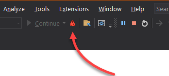

<head>
<meta http-equiv="Content-Type" content="text/html; charset=utf-8">
<link rel="stylesheet" type="text/css" href="bc.css">

</head>

<!---

twitter:

add #thebuildingcoder

New local language Forge classes and the renewed ability to easily edit and continue while debugging a #RevitAPI add-in #DynamoBim @AutodeskForge @AutodeskRevit #bim #ForgeDevCon https://autode.sk/applycodechanges

Today, I highlight our new local language Forge classes and the renewed ability to easily edit and continue while debugging a Revit add-in
&ndash; Non-mobile after computer crash
&ndash; Local language Forge classes
&ndash; Apply code changes debugging Revit add-in...

linkedin:

New local language Forge classes and the renewed ability to easily edit and continue while debugging a #RevitAPI add-in

https://autode.sk/applycodechanges

- Non-mobile after computer crash
- Local language Forge classes
- Apply code changes debugging Revit add-in...

#bim #DynamoBim #ForgeDevCon #Revit #API #IFC #SDK #AI #VisualStudio #Autodesk #AEC #adsk

the [Revit API discussion forum](http://forums.autodesk.com/t5/revit-api-forum/bd-p/160) thread

**Question:** 

**Answer:**

**Response:**  

Many thanks to  for this very helpful explanation!

<pre class="code">
</pre>

-->

### Localised Forge Intros and Apply Code Changes

Today, I highlight our new local language Forge classes and the renewed ability to easily edit and continue while debugging a Revit add-in:

- [Non-mobile after computer crash](#2)
- [Local language Forge classes](#3)
- [Apply code changes debugging Revit add-in](#4)

Before diving in, here is a nice little snippet of wisdom, courtesy
of [Ehsan @eirannejad](https://twitter.com/eirannejad):

<blockquote>

<i>Every man has two lives; the second starts when he realizes he has just one.</i>

&ndash; Confucius

</blockquote>

#### Non-Mobile after Computer Crash

My computer crashed, quite literally, falling several metres onto a stone floor and hitting its right front corner:

 <!-- 637 -->

Unsurprisingly, the screen broke:

 <!-- 359 -->

That forced me off-line for a while... 

More to my surprise, the rest remained intact; so, I am now happily up and running again with peripherals: external screen, keyboard and mouse:

 <!-- 359 -->

Could have been worse...

#### Local Language Forge Classes 

Back to topics of more general interest, we are running a Forge hackathon this week and have Autodesk University coming up next, so there is a lot of exciting activity going on at that front.

If you are interested in learning more about Forge and your primary language is not English, one of our new local language classes may be for you:

<!--
Automation & Jumeaux Numériques pour l‘industrialisation de la construction (SD500073) (French)
Digitaler Zwilling und Automation auf dem Weg zum digitalen Bau (AS500379) (German)
Uso de Forge para la transformación digital en arquitectura y construcción (CS500234) (Spanish)
Be sure to check one of them out if your preferred language is French, German or Spanish.
-->

<ul>
<li><a href="https://events-platform.autodesk.com/event/autodesk-university-2021/planning/UGxhbm5pbmdfNjcwMjAy" target="_blank">Automation &amp; Jumeaux numériques pour l'industrialisation de la construction (SD500073)</a> (French)</li>
<li><a href="https://events-platform.autodesk.com/event/autodesk-university-2021/planning/UGxhbm5pbmdfNjcwMjMy" target="_blank">Digitaler Zwilling und Automation auf dem Weg zum digitalen Bau (AS500379)</a> (German)</li>
<li><a href="https://events-platform.autodesk.com/event/autodesk-university-2021/planning/UGxhbm5pbmdfNjcwMTQz" target="_blank">Uso de Forge para la transformación digital en arquitectura y construcción (CS500234)</a> (Spanish)</li>
</ul>

Please check them out if your preferred language is French, German or Spanish.

For more information on the current Forge hackathon and Autodesk University, you can look at
the [AU website](https://www.autodesk.com/autodesk-university) and
Kean's article
on [the Forge Hackathon and counting down to AU2021](https://www.keanw.com/2021/09/at-the-forge-hackathon-counting-down-to-au2021.html).

#### Apply Code Changes Debugging Revit Add-In

Chris Hildebran pointed out that 'Apply code changes' now works when debugging and editing a Revit add-in:

I'm writing as a result of a discovery I saw in Visual Studio today.
That discovery is the 'Apply Code Changes' button located to the right of the Start/Continue button:

 <!-- 348 -->

I gather it has been available for C++ for quite a while, but just recently for .NET projects, as of Visual Studio Version 16.11.0 Preview 1.0.

While debugging, I thought I'd see if this would work in Revit add-in development.
 
Initial testing confirmed that it does indeed apply code changes that can be seen in my video demonstrating the modification of an add-in tool I'm working on &ndash; at least in C#; still need to test `.xaml`.
 
Here is my [two-minute video](https://www.screencast.com/t/5oCj1jBJha) demonstrating the initial test, which I hope is clear enough to see.
 
I had planned to implement a solution Josh Lumley proposed, but if this continues to work, I will continue using this feature to drastically speed up development.
 
Perhaps I'm late to the party, but I thought I'd mention it anyway.
 
Here is
the Microsoft article [introducing the .NET Hot Reload experience for editing code at runtime](https://devblogs.microsoft.com/dotnet/introducing-net-hot-reload).

Many thanks to Chris for sharing this!

For completeness, The Building Coder topic group
on [debugging without restart and live development](https://thebuildingcoder.typepad.com/blog/about-the-author.html#5.49) discusses
how 'Edit and Continue' used to work way back in Revit 2008 and various other solutions suggested in the meantime.

