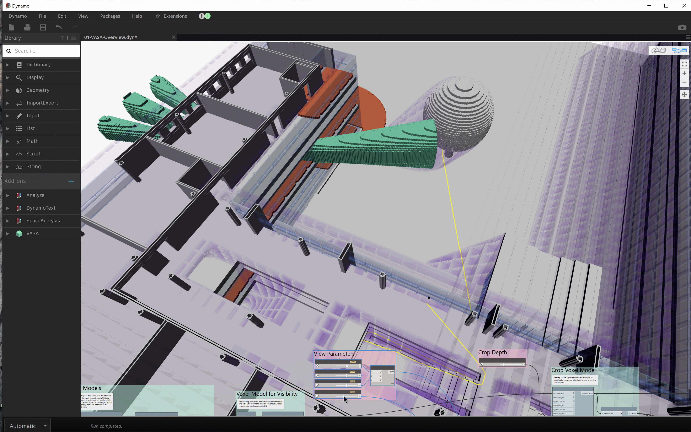

<head>
<meta http-equiv="Content-Type" content="text/html; charset=utf-8">
<link rel="stylesheet" type="text/css" href="bc.css">

</head>

<!---

- roadmap
  [@AutodeskRevit](https://twitter.com/AutodeskRevit) shares
  the [Revit Public Roadmap Update Fall 2021](https://blogs.autodesk.com/revit/2021/09/30/revit-public-roadmap-update-fall-2021)
  > The [#Revit team](https://twitter.com/hashtag/Revit) is out with the latest edition of the Revit Public Roadmap.
  Check it on the blog and don't forget to register for [#AU21](https://twitter.com/hashtag/AU21), w
  here we're hosting [3 #AMA sessions](https://twitter.com/hashtag/AMA) to take your questions
  on what's new, what's in development, and the road ahead.

- Pawel Piechnik
  Product Manager, Strategist and Structural Engineer standing at the intersection of AEC and IT industries
   ... a structural recommendation for the upcoming #AU2021 : Check out this session discussing an immersive, "inside-#revit" structural design case study: "Revit-driven design of steel structures with real-time model updating using ENERCALC Structural Engineering Library design calculations.". https://lnkd.in/e2SS9J7N
#structuralengineering

- Revit Category Guide
  https://docs.google.com/spreadsheets/d/1uNa77XYLjeN-1c63gsX6C5D5Pvn_3ZB4B0QMgPeloTw/edit#gid=1549586957
  Category Name, Built In Enum, User Mapped, Display Category Name, Display Category Name (Rus)
  
- how to hide internal edges of solids
  18247333 [Appearance of DirectShape created with Dynamo vs API]

- [VASA, a Dynamo tool for 3D voxel-based architectural space analysis](https://www.keanw.com/2021/09/introducing-vasa-for-voxel-based-architectural-space-analysis.html)

twitter:

add #thebuildingcoder

Revit roadmap update, structural news and AMA at AU, category guide, VASA 3D voxel-based architectural space analysis and how to hide internal edges of solids with the #RevitAPI add-in #DynamoBim @AutodeskForge @AutodeskRevit #bim #ForgeDevCon https://autode.sk/hideedges

Numerous exciting announcements leading up to AU this week
&ndash; Revit roadmap update and AMA at AU
&ndash; Structural news at AU
&ndash; Revit category guide
&ndash; How to hide internal edges of solids
&ndash; VASA 3D voxel-based architectural space analysis...

linkedin:

Revit roadmap update, structural news and AMA at AU, category guide, VASA 3D voxel-based architectural space analysis and how to hide internal edges of solids with the #RevitAPI

https://autode.sk/hideedges

- Revit roadmap update and AMA at AU
- Structural news at AU
- Revit category guide
- How to hide internal edges of solids
- VASA 3D voxel-based architectural space analysis...

#bim #DynamoBim #ForgeDevCon #Revit #API #IFC #SDK #AI #VisualStudio #Autodesk #AEC #adsk

the [Revit API discussion forum](http://forums.autodesk.com/t5/revit-api-forum/bd-p/160) thread

**Question:** 

**Answer:**

**Response:**  

Many thanks to  for this very helpful explanation!

<pre class="code">
</pre>

-->

### Hiding Edges, AU, Roadmaps and Vasa

Numerous exciting announcements leading up to AU this week:

- [Revit roadmap update and AMA at AU](#2)
- [Structural news at AU](#3)
- [Revit category guide](#4)
- [How to hide internal edges of solids](#5)
- [VASA 3D voxel-based architectural space analysis](#6)

#### Revit Roadmap Update and AMA at AU

To provide an idea where Revit is headed and enable you to contribute and influence the plans, 
[@AutodeskRevit](https://twitter.com/AutodeskRevit) shares
the [Revit Public Roadmap Update Fall 2021](https://blogs.autodesk.com/revit/2021/09/30/revit-public-roadmap-update-fall-2021):

> The [#Revit team](https://twitter.com/hashtag/Revit) is out with the latest edition of the Revit Public Roadmap.
Check it on the blog and don't forget to register
for [#AU21](https://twitter.com/hashtag/AU21),
where we're hosting [3 #AMA sessions](https://twitter.com/hashtag/AMA) (ask me anything) to
take your questions on what's new, what's in development, and the road ahead.

#### Structural News at AU

[Pawel Piechnik](https://twitter.com/piechnikp), Product Manager, Strategist and Structural Engineer standing at the intersection of AEC and IT industries, shares numerous other important recommendations for Revit Structural at AU, e.g.,

> Check out [this session](https://lnkd.in/e2SS9J7N) discussing an immersive, 'inside-#revit' structural design case study: "Revit-driven design of steel structures with real-time model updating using ENERCALC Structural Engineering Library design calculations.", 
[BIM-Driven Engineering: Structural Design Without Redundant Workload &ndash; *BES500004*](https://events-platform.autodesk.com/event/autodesk-university-2021/planning/UGxhbm5pbmdfNjY2OTI4)

#### Revit Category Guide

Talking about roadmaps, here is a handy
[Revit Category Guide](https://docs.google.com/spreadsheets/d/1uNa77XYLjeN-1c63gsX6C5D5Pvn_3ZB4B0QMgPeloTw/edit#gid=1549586957), a spreadsheet listing all category names and associating Category Name, Built In Enum, User Mapped, Display Category Name, and Display Category Name in Russian.
  
#### How to Hide Internal Edges of Solids

Back to a pure programming topic, we gleaned some new information on how to hide internal edges of solids in a discussion on the appearance of `DirectShape` elements created with Dynamo vs directly using the Revit API:

**Question:** I made a custom node that creates volumes using `DesignScript.Geometry.Solid`.
If I convert this solid to a `DirectShape` in my node, the resulting solids obtained in Revit, `Revit.DB.Solid`, display the internal mesh edges.
If I use the Dynamo `DirectShape.ByGeometry` node instead, the resulting Revit is smooth and no internal mesh edges are shown.

 <!-- 921 -->

Why?

How do I create a solid without mesh edges in my own code? 

See my code for the creation of DirectShape:

<pre class="code">
&nbsp;&nbsp;RevitDB.Material&nbsp;material&nbsp;=&nbsp;GetPassMaterial(&nbsp;doc&nbsp;);
 
&nbsp;&nbsp;using(&nbsp;RevitDB.Transaction&nbsp;t&nbsp;=&nbsp;new&nbsp;RevitDB.Transaction(&nbsp;doc,&nbsp;
&nbsp;&nbsp;&nbsp;&nbsp;&quot;Create&nbsp;sphere&nbsp;direct&nbsp;shape&quot;&nbsp;)&nbsp;)
&nbsp;&nbsp;{
&nbsp;&nbsp;&nbsp;&nbsp;t.Start();
 
&nbsp;&nbsp;&nbsp;&nbsp;int&nbsp;sens&nbsp;=&nbsp;1;
 
&nbsp;&nbsp;&nbsp;&nbsp;var&nbsp;sortedPointsVolumesDS&nbsp;=&nbsp;pointsVolumesDS.ToArray().OrderBy(&nbsp;
&nbsp;&nbsp;&nbsp;&nbsp;&nbsp;&nbsp;pv&nbsp;=&gt;&nbsp;origine.DistanceTo(&nbsp;pv.Key&nbsp;)&nbsp;*&nbsp;sens&nbsp;);
 
&nbsp;&nbsp;&nbsp;&nbsp;int&nbsp;passNumber&nbsp;=&nbsp;1;
&nbsp;&nbsp;&nbsp;&nbsp;foreach(&nbsp;var&nbsp;item&nbsp;in&nbsp;sortedPointsVolumesDS&nbsp;)
&nbsp;&nbsp;&nbsp;&nbsp;{
&nbsp;&nbsp;&nbsp;&nbsp;&nbsp;&nbsp;string&nbsp;name&nbsp;=&nbsp;$&quot;{fanName}_{driName}_{passNumber}&quot;;
 
&nbsp;&nbsp;&nbsp;&nbsp;&nbsp;&nbsp;//&nbsp;creation&nbsp;de&nbsp;la&nbsp;géometrie
 
&nbsp;&nbsp;&nbsp;&nbsp;&nbsp;&nbsp;IList&lt;RevitDB.GeometryObject&gt;&nbsp;revitGeometry&nbsp;=&nbsp;item.Value.ToRevitType(
&nbsp;&nbsp;&nbsp;&nbsp;&nbsp;&nbsp;&nbsp;&nbsp;RevitDB.TessellatedShapeBuilderTarget.Solid,
&nbsp;&nbsp;&nbsp;&nbsp;&nbsp;&nbsp;&nbsp;&nbsp;RevitDB.TessellatedShapeBuilderFallback.Abort,
&nbsp;&nbsp;&nbsp;&nbsp;&nbsp;&nbsp;&nbsp;&nbsp;material.Id&nbsp;);
 
&nbsp;&nbsp;&nbsp;&nbsp;&nbsp;&nbsp;//IList&lt;RevitDB.GeometryObject&gt;&nbsp;tessellatedShape&nbsp;=&nbsp;null;
&nbsp;&nbsp;&nbsp;&nbsp;&nbsp;&nbsp;//&nbsp;tessellatedShape&nbsp;=&nbsp;item.Value.ToRevitType(
&nbsp;&nbsp;&nbsp;&nbsp;&nbsp;&nbsp;//&nbsp;RevitDB.TessellatedShapeBuilderTarget.AnyGeometry,
&nbsp;&nbsp;&nbsp;&nbsp;&nbsp;&nbsp;//&nbsp;RevitDB.TessellatedShapeBuilderFallback.Abort,
&nbsp;&nbsp;&nbsp;&nbsp;&nbsp;&nbsp;//&nbsp;material.Id);
 
&nbsp;&nbsp;&nbsp;&nbsp;&nbsp;&nbsp;if(&nbsp;revitGeometry?.Count&nbsp;&gt;&nbsp;0&nbsp;)
&nbsp;&nbsp;&nbsp;&nbsp;&nbsp;&nbsp;{
&nbsp;&nbsp;&nbsp;&nbsp;&nbsp;&nbsp;&nbsp;&nbsp;RevitDB.DirectShape&nbsp;ds&nbsp;=&nbsp;RevitDB.DirectShape.CreateElement(&nbsp;doc,
&nbsp;&nbsp;&nbsp;&nbsp;&nbsp;&nbsp;&nbsp;&nbsp;&nbsp;&nbsp;new&nbsp;RevitDB.ElementId(&nbsp;RevitDB.BuiltInCategory.OST_GenericModel&nbsp;)&nbsp;);
&nbsp;&nbsp;&nbsp;&nbsp;&nbsp;&nbsp;&nbsp;&nbsp;ds.ApplicationId&nbsp;=&nbsp;name;
&nbsp;&nbsp;&nbsp;&nbsp;&nbsp;&nbsp;&nbsp;&nbsp;ds.ApplicationDataId&nbsp;=&nbsp;Guid.NewGuid().ToString();&nbsp;//&nbsp;&quot;Geometry&nbsp;object&nbsp;id&quot;;
&nbsp;&nbsp;&nbsp;&nbsp;&nbsp;&nbsp;&nbsp;&nbsp;ds.SetShape(&nbsp;revitGeometry&nbsp;);
&nbsp;&nbsp;&nbsp;&nbsp;&nbsp;&nbsp;&nbsp;&nbsp;//ds.SetShape(tessellatedShape);
&nbsp;&nbsp;&nbsp;&nbsp;&nbsp;&nbsp;}
 
&nbsp;&nbsp;&nbsp;&nbsp;&nbsp;&nbsp;//&nbsp;on&nbsp;incremente&nbsp;le&nbsp;numéro&nbsp;de&nbsp;la&nbsp;passe
&nbsp;&nbsp;&nbsp;&nbsp;&nbsp;&nbsp;passNumber++;
&nbsp;&nbsp;&nbsp;&nbsp;}
&nbsp;&nbsp;&nbsp;&nbsp;t.Commit();
&nbsp;&nbsp;}
</pre>

**Answer:** The quick answer is simple:

The entire Dynamo framework is open source, giving you access to
the [full implementation source code](https://github.com/DynamoDS)

So, you might be able to find out how yourself from the Dynamo source code.
You could also discuss this in detail with the Dynamo experts in
the [Dynamo discussion forum](https://forum.dynamobim.com).

However, I have a suspicion or two of my own that I would like to check with the Revit development team for you first:

Maybe, the direct shape showing all the internal face tessellation edges has been defined using lots of separate individual triangular faces, whereas the other one uses just one single more complex planar face for the top and bottom.

Actually, I believe that direct shapes are not limited to linear edges, but can include curved edges as well. Maybe, the non-tessellated shape face does not consist of triangles at all, but just two straight edges and an arc.

Later: the development team confirm my hunch:

The Revit API doesn't have a way to turn on or off mesh edges.
However, creating a mesh through `TessellatedShapeBuilder` may attempt to hide certain edges depending on the topology of the mesh. 

We have not yet changed or added any API functions for our recent project to hide (some) interior mesh edges.
We simply modified the function that marks certain mesh edges as hidden so that it marks all two-sided mesh edges as hidden.
Previously, it only marked (nearly) tangential edges as hidden.

It was already the case that `TessellatedShapeBuilder` called that function when it created a mesh.
However, `TessellatedShapeBuilder` may create a 'faceted' BRep, i.e., a BRep with planar faces and straight edges, instead of a mesh, in which case no edge hiding is done (as far as I know).
Moreover, the effectiveness of the new edge-hiding depends very much on the topological structure of the mesh, which itself depends on several factors.

Given that the sample code uses the option `TessellatedShapeBuilderTarget.Solid`, it could be that the Revit object is a `Solid` (internally, a BRep) and not a `Mesh` (internally, a GPolyMesh).

Dynamo is not hiding interior mesh edges.
It is simply creating a proper solid in this case, which it will do when it can.
Note that in the next major release, we will hide the mesh edges, although that will unfortunately fool the user into creating sub-optimal geometry as a result, creating a mesh, when a solid is possible.

In exploring this further, you might also appreciate this GitHub link to the open source Dynamo for Revit code base [DirectShape.cs module](https://github.com/DynamoDS/DynamoRevit/blob/5c3b0d869ccdc2f4d5fd24b5346933f22d39f279/src/Libraries/RevitNodes/Elements/DirectShape.cs).

Might not solve this problem entirely, but it should give a few strings to pull at.

To summarise: if the input geometry is a solid or surface, Dynamo tries to use the `BrepBuilder`; if it fails, it uses the tessellated shape builder, e.g., if the input geometry is a `Mesh`, then it uses the tessellated shape builder directly. 

#### VASA 3D Voxel-Based Architectural Space Analysis

Talking about Dynamo, solids and volumes, you might be interested in Kean's presentation
of [VASA, a Dynamo tool for 3D voxel-based architectural space analysis](https://www.keanw.com/2021/09/introducing-vasa-for-voxel-based-architectural-space-analysis.html):

> Here’s a quick animation from the 'overview' sample that shows daylight, visibility and pathfinding combined. Performance is impressive &ndash; it’s very nearly interactive as we change the distance for the visibility field’s cut-off:

 <!-- 3584 -->

