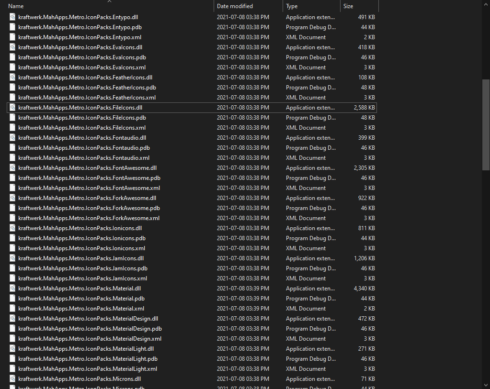

<head>
<meta http-equiv="Content-Type" content="text/html; charset=utf-8">
<link rel="stylesheet" type="text/css" href="bc.css">

</head>

<!---

- used migration assistant to move to loaner machine
  /Users/jta/a/doc/revit/tbc/git/a/img/problem_no_problem.jpg

- ExportCncFab updated for Revit 2022 https://github.com/jeremytammik/ExportCncFab/releases/tag/2022.0.0.0
  ExportCncFab eliminated deprecated API usage https://github.com/jeremytammik/ExportCncFab/releases/tag/2022.0.0.1

- lots of interest and many threads on multi-version Revit add-in
  check out wizard alternatives
  https://forums.autodesk.com/t5/revit-api-forum/multi-version-revit-template/m-p/10659412
  https://github.com/jeremytammik/VisualStudioRevitAddinWizard#alternatives
  
- Additional .dll files as resource
  https://forums.autodesk.com/t5/revit-api-forum/additional-dll-files-as-resource/m-p/10653802#M58650
  ricaun in reply to: antonio.hipolito
  @jrothMEIand @antonio.hipolito you could use Fody.Costura to embed the .dll references automatically, the Costura.Template has the ILTemplate.cs and Common.cs to handle all the load resources files, if the Assembly is already loaded the code does not force it to load again.
  @jeremy.tammik I use this technic on the ConduitMaterial and others plugins.
  Adding... ILTemplate.Attach(); on the IExternalApplication should do the trick.

twitter:

add #thebuildingcoder

Working mobile again, lots of options to implement multi-version add-ins and examples showing how to store DLL dependencies in your add-in resources with the #RevitAPI #DynamoBim @AutodeskForge @AutodeskRevit #bim #ForgeDevCon https://autode.sk/multiversion

Lots of options to implement multi-version add-ins and examples showing how to store DLL dependencies in your add-in resources
&ndash; Migration assistant rocks
&ndash; ExportCncFab 2022
&ndash; Multi-version Revit add-in
&ndash; Deploying a DLL file as a resource...

linkedin:

Working mobile again, lots of options to implement multi-version add-ins and examples showing how to store DLL dependencies in your add-in resources with the #RevitAPI

https://autode.sk/multiversion

- Migration assistant rocks
- ExportCncFab 2022
- Multi-version Revit add-in
- Deploying a DLL file as a resource...

#bim #DynamoBim #ForgeDevCon #Revit #API #IFC #SDK #AI #VisualStudio #Autodesk #AEC #adsk

the [Revit API discussion forum](http://forums.autodesk.com/t5/revit-api-forum/bd-p/160) thread

**Question:** 

**Answer:**

**Response:**  

Many thanks to  for this very helpful explanation!

<pre class="code">
</pre>

-->

### DLL as Resource and Multi-Version Add-Ins

Successfully moved from my broken-screen laptop to a loaner machine, updated `ExportCncFab`, collected a list of options to implement multi-version add-ins and some hints on storingLots of odependencies in your add-in resources:

- [Migration assistant rocks](#2)
- [ExportCncFab 2022](#3)
- [Multi-version Revit add-in](#4)
- [Deploying a DLL file as a resource](#5)

#### Migration Assistant Rocks

I mentioned
my [computer mishap resulting in a broken screen](https://thebuildingcoder.typepad.com/blog/2021/10/localised-forge-intros-and-apply-code-changes.html#2) and
the happy fact that the rest of the system still works.
Unfortunately, requiring an external screen and hence mains power significantly reduces mobility.

As a next step, I was able to transfer the entire system with all user and application data to a temporary loaner machine using the Mac migration assistant.

That worked right out the box.
The only problem remaining being that the updated OS prevented me
from [setting up my personal root level directories](https://thebuildingcoder.typepad.com/blog/2021/08/revit-roadmap-api-and-da4r-survey.html#4).
I am forced to rewrite all my (numerous) shell scripts and add `$HOME` to them.
I guess I can live with that.

 <!-- 825 -->

#### ExportCncFab 2022 

By popular demand, I now
updated [ExportCncFab](https://github.com/jeremytammik/ExportCncFab) for Revit 2022.

It is a Revit .NET API add-in that exports Revit wall parts to DXF or SAT for CNC fabrication, demonstrating various useful aspects along the way, such as:

- Implement the external application
- Create ribbon panel and command push buttons
- Load icons from assembly resources
- Select wall parts and handle optional pre-selection
- Export wall part elements to DWF or SAT
- Manage, create and populate shared parameter values

The flat migration is captured
in [ExportCncFab release 2022.0.0.0](https://github.com/jeremytammik/ExportCncFab/releases/tag/2022.0.0.0) and
some deprecated API usage is eliminated in the subsequent
[release 2022.0.0.1](https://github.com/jeremytammik/ExportCncFab/releases/tag/2022.0.0.1).

#### Multi-Version Revit Add-In

There has been a lot of interest and several new threads on multi-version Revit add-ins recently, e.g.,
the [Revit API discussion forum](http://forums.autodesk.com/t5/revit-api-forum/bd-p/160) thread
on [multi-version Revit template](https://forums.autodesk.com/t5/revit-api-forum/multi-version-revit-template/m-p/10659412).

Several Visual Studio Revit add-in templates now implement support for that functionality right out of the box.

To provide an overview of the some available options, I added
a [list of alternatives](https://github.com/jeremytammik/VisualStudioRevitAddinWizard#alternatives) to
the [VisualStudioRevitAddinWizard GitHub repository](https://github.com/jeremytammik/VisualStudioRevitAddinWizard).

#### Addendum &ndash; Multiple Projects in Single SLN

Pablo Derendinger adds:

Hi! I would like to share our experience with multi-version projects.

After a lot of work with scripting and pre/post build steps, we found a solution that works like a charm.
 
We use a shared project with all the code and a "build" project for each Revit version.
 
Each build version retrieves its specific Revit dlls from nuget. 
 
To support a new version, we just copy `csproj`, change it's name and nuget references.
 
To support changes in the API, we use compile rules to ignore deprecated features.
 
At the end of the day we have a single `sln` with a `csproj` per Revit version.

Works perfectly under a CI/CD workflow.
 
Hope you find it useful.

#### Deploying a DLL File as a Resource

In the thread
on [additional `.dll` files as resource](https://forums.autodesk.com/t5/revit-api-forum/additional-dll-files-as-resource/m-p/10653802#M58650),
Luiz Henrique [@ricaun](https://forums.autodesk.com/t5/user/viewprofilepage/user-id/4176855) Cassettari provides
a pointer to some useful examples showing how to embed a DLL in the add-in assembly, saying:

> You could
use [Fody.Costura](https://github.com/Fody/Costura) to
embed the .dll references automatically.
The [Costura.Template](https://github.com/Fody/Costura/tree/develop/src/Costura.Template) provides
`ILTemplate.cs` and `Common.cs` to handle all the load resources files.
If the Assembly is already loaded, the code does not force it to load again.
I use this technique on
the [ConduitMaterial](https://apps.autodesk.com/RVT/en/Detail/Index?id=9120027511121592515) and
other plugins.
Adding `ILTemplate.Attach()` on the `IExternalApplication` should do the trick.

Many thanks to Luiz Henrique for sharing this!

#### Addendum &ndash; Handling MahApps Dependencies

Micah [@kraftwerk15](https://forums.autodesk.com/t5/user/viewprofilepage/user-id/4045014) Gray adds:

‎I also wanted to chime in here with resources.
Ehsan actually hopped on a call with me and showed me his process with submodules.
Since then that's how I have been handling other libraries that I need to use in my project.

While I started with an `AssemblyResolver`, loading in a newer version of the assembly will not resolve correctly when a previous version has already been loaded.
This came about because of the CTC addins still used the MahApps version 2 (I believe).
Then I come barrelling in to the situation with the new 3.x versions of MahApps because I wanted to use the new, fancy features.
Revit will resolve everything up to the point where you wanted to use one of the 3.x features that the 2.x didn't have.
Then my app would throw an Exception telling me that it couldn't find that 3.x feature because CTC had loaded the 2.x version first.

So, Ehsan told me about submodules in git (which I had to learn about) and re-building MahApps open-source code under a new .dll name.

Opening the open-source project, changing the name, building the submodules, and then referencing the new submodules have been fantastic.

Here is a snippet of my library with the re-built MahApps content:

 <!-- 1023 -->

Also, if you look in pyRevit's library, Ehsan does the same thing, or at least used to.

Kudos of course to Ehsan for showing me this and thanks to Jeremy for pointing out this thread from the blog.

Hopefully this helps someone in the future.

Kennan Chen adds:

Same issue with MahApps before and I also rebuilt the whole project.

Life can be easier to compile MahApps project with another Public/Private key pair (.snk file), which will sign a unique strong name to the dll.
Referencing a strong-named dll is supposed to be a common practise to address the "dll hell" issue:

- [Strong-named assemblies | Microsoft Docs](https://docs.microsoft.com/en-us/dotnet/standard/assembly/strong-named)

