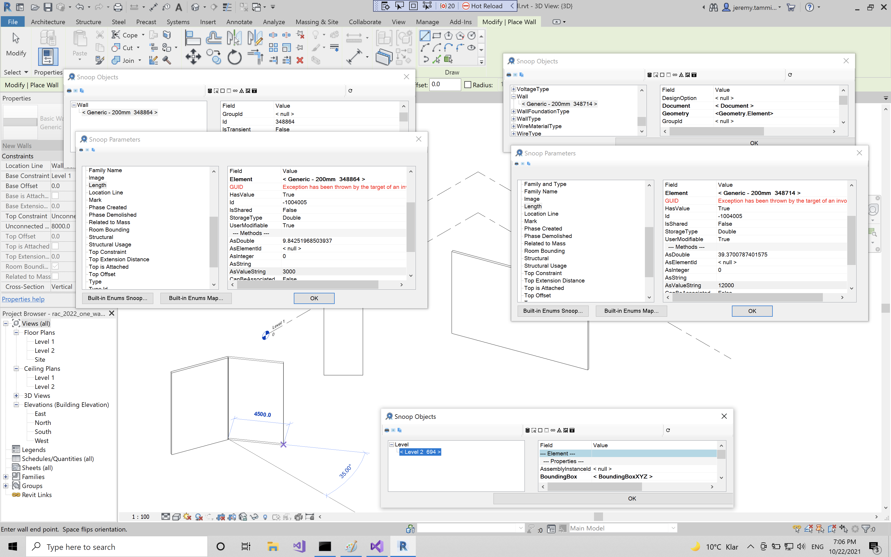

<head>
<meta http-equiv="Content-Type" content="text/html; charset=utf-8">
<link rel="stylesheet" type="text/css" href="bc.css">

</head>

<!---

- Modeless RevitLookup
  RevitLookup_modeless.png

- need for regen:
  https://forums.autodesk.com/t5/revit-api-forum/unable-to-get-parameter-asstring-value-when-the-parameter-is/m-p/10713499#M59301

- need for regen
  [LevelOffset not working for Arc extrusion Roof](https://forums.autodesk.com/t5/revit-api-forum/leveloffset-not-working-for-arc-extrusion-roof/m-p/7681949)
  [circular chain of reference when creating opening on a floor](https://forums.autodesk.com/t5/revit-api-forum/error-circular-chain-of-reference-when-creating-opening-on-a/td-p/7681213)

- Structural Bridge Design
  18288465 Accessing Bridge design from external app
  Accessing Structural Bridge Design from external app
  There is no API. But there is a command line that you can use:
  From 2020 release we have command led automation for the design section and design beam creation and analysis.  All data and commands are written to a json file which drives the automation.  For more details refer here.
  https://help.autodesk.com/view/SBRDES/ENU/?guid=ASBD_Automation_Overview_html

- img/outdoor_seatbelt.jpg

twitter:

add #thebuildingcoder

Modeless RevitLookup, the most exciting enhancement in its entire history, and yet another need for regeneration accessing a read-only parameter with the #RevitAPI #DynamoBim @AutodeskForge @AutodeskRevit #bim #ForgeDevCon https://autode.sk/modelesslookup

The most exciting RevitLookup enhancement in its entire history, yet another need for regeneration and a great new option for your personal safety
&ndash; Modeless RevitLookup
&ndash; Need for regen for read-only parameter
&ndash; Structural bridge design
&ndash; Outdoor seatbelt...

linkedin:

Modeless RevitLookup, the most exciting enhancement in its entire history, and yet another need for regeneration accessing a read-only parameter with the #RevitAPI

https://autode.sk/modelesslookup

- Modeless RevitLookup
- Need for regen for read-only parameter
- Structural bridge design
- Outdoor seatbelt...

#bim #DynamoBim #ForgeDevCon #Revit #API #IFC #SDK #AI #VisualStudio #Autodesk #AEC #adsk

the [Revit API discussion forum](http://forums.autodesk.com/t5/revit-api-forum/bd-p/160) thread

**Question:** 

**Answer:**

**Response:**  

Many thanks to  for this very helpful explanation!

<pre class="code">
</pre>

-->

### Bridges, Regeneration and Modeless RevitLookup

I am glad and proud to announce the most exciting RevitLookup enhancement in its entire history so far, yet another need for regeneration and a great new option for your personal safety:

- [Modeless RevitLookup](#2)
- [Need for regen for read-only parameter](#3)
- [Structural bridge design](#4)
- [Outdoor seatbelt](#5)

#### Modeless RevitLookup

[Jmcouffin](https://jmcouffin.com) raised a cool request for
a [RevitLookup](https://github.com/jeremytammik/RevitLookup) enhancement
in [issue #92 &ndash; modeless window for lookup tools](https://github.com/jeremytammik/RevitLookup/issues/92):

> ... while not able to code it myself, especially not in C#, a nice feature would be to get the windows of the tool in modeless mode.
Allowing us to interact with the model directly.

[NeVeSpl](https://github.com/NeVeSpl) very kindly picked this up and heroically implemented and tested it in a whole series of pull requests:

- [93](https://github.com/jeremytammik/RevitLookup/pull/93) &ndash; Modeless windows
- [94](https://github.com/jeremytammik/RevitLookup/pull/94) &ndash; Fixed problem with tranferring focus to Revit when using selectors from modeless window
- [95](https://github.com/jeremytammik/RevitLookup/pull/95) &ndash; Handle multiple open documents at the same time
- [96](https://github.com/jeremytammik/RevitLookup/pull/96) &ndash; Fix for crash that happens when user cancel picking object in cmds SnoopPickFace, SnoopPickEdge, SnoopLinkedElement
- [97](https://github.com/jeremytammik/RevitLookup/pull/97) &ndash; Restore ability to snoop plan topologies
- [99](https://github.com/jeremytammik/RevitLookup/pull/99) &ndash; Eliminate warnings from [issue #98, warnings compiling...](https://github.com/jeremytammik/RevitLookup/issues/98)

Here is a sample screen snapshot showing the result, snooping a level and two different walls, simultaneously running the Revit command to create yet more new walls:

 <!-- 3360 -->

Summary by Jmcouffin:

> It works much better than I even thought possible.
You can now open multiple instances of RevitLookup tool and have each grab its own set of elements and data and dig through it!
I tried all the functionalities without hitting a wall so far.
I will keep on using it this week and let you know if anything arises.
Great job @NeVeSpl!

Ever so many thanks to NeVeSpl from me too for the careful and efficient implementation and thorough testing!

#### Need for Regen for Read-Only Parameter

A surprising new context to add to
our [list of situations with a need for regeneration](https://thebuildingcoder.typepad.com/blog/about-the-author.html#5.33) came up in
the [Revit API discussion forum](http://forums.autodesk.com/t5/revit-api-forum/bd-p/160) thread
on being [unable to get parameter `AsString` value when the parameter is read-only](https://forums.autodesk.com/t5/revit-api-forum/unable-to-get-parameter-asstring-value-when-the-parameter-is/m-p/10713499):

**Question:** I've been struggling with this weird problem for a few hours now.

I have some elements that has a parameter called `PANEL ID`.
Sometimes, this parameter is in read-only mode.

When I'm accessing the element directly, I can get the parameter value perfectly fine.

When accessing the same kinds of elements as part of any collection, the value is an empty string `""`.

**Answer:** Seems like my problem was not using `doc.Regenerate()`.

My read-only params were updated from other elements, that changed those parameter values.
But I couldn't see it in the API until I used `doc.Regenerate()`.

Here are some other previous examples that I also already earmarked for inclusion in
the ['need to regenerate' list](https://thebuildingcoder.typepad.com/blog/about-the-author.html#5.33):

- [`LevelOffset` not working for arc extrusion roof](https://forums.autodesk.com/t5/revit-api-forum/leveloffset-not-working-for-arc-extrusion-roof/m-p/7681949)
 **Question:** I've encountered a strange result and I'd like to know if it's my fault or if there's an error somewhere or a known issue.
I'm trying to create a new `ExtrusionRoof` with an arc profile and then change the `Level Offset` parameter to a different value.
I use the `ROOF_CONSTRAINT_OFFSET_PARAM` `BuiltInParameter` to find that parameter and then set it.
Unexpectedly, Revit sets the parameter to my value, but the roof doesn't shift.
So, there's a discrepancy between the parameter value and the effective position of the roof.
 **Answer:** You are creating geometry and then in the same transaction make a change to it.
In the past, such a workflow caused problems that could be solved by separating the creation and modification into 2 transactions.
I would suggest you do the same and see if that resolves your problem.
- [Circular chain of reference when creating opening on a floor](https://forums.autodesk.com/t5/revit-api-forum/error-circular-chain-of-reference-when-creating-opening-on-a/td-p/7681213)
 **Question:** Unable to create opening on a created floor, posted error "circular chain of reference"
Problem is floor can be create while not the opening.
 **Answer:** Try to regenerate the model after creating the floor and before creating the opening.

#### Structural Bridge Design

**Question:** A question came up on
accessing [Structural Bridge Design](https://www.autodesk.com/products/structural-bridge-design/overview) from
an external app.

**Answer:** There is no API, but there is a command line that you can use:

From the 2020 release on, we have command led automation for the design section and design beam creation and analysis.
All data and commands are written to a `json` file which drives the automation.
For more details, please refer
to the [ASBD Automation Overview](https://help.autodesk.com/view/SBRDES/ENU/?guid=ASBD_Automation_Overview_html).

#### Outdoor Seatbelt

If you learned to enjoy wearing a mask when alone, you might also feel safer with an outdoor seatbelt:

 <!-- 720 -->

