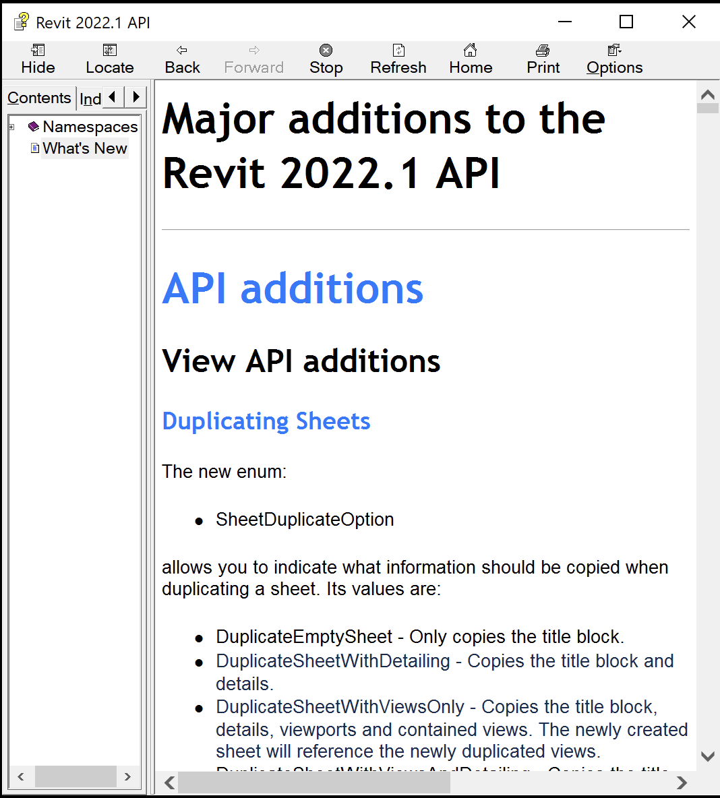

<head>
<meta http-equiv="Content-Type" content="text/html; charset=utf-8">
<link rel="stylesheet" type="text/css" href="bc.css">

</head>

<!---

- blog 2022.1
  create what's new
  check diff files
  diff
  /Users/jta/a/lib/revit/jeremy/diff_2022_2022_1_obj.txt
  /Users/jta/a/lib/revit/jeremy/diff_2022_2022_1.txt

twitter:

Whats New in the Revit 2022.1 API? Important enhancements addressing new Revit product functionality and developer wishes and requests; full details of the new #RevitAPI @AutodeskForge @AutodeskRevit #bim #DynamoBim #ForgeDevCon https://autode.sk/whatsnew2022_1

The Revit 2022.1 API includes some important enhancements addressing new Revit product functionality and developer wishes and requests
&ndash; Information sources
&ndash; What's new in previous versions
&ndash; Diff to the Revit 2022 SDK
&ndash; API additions...

linkedin:

Whats New in the Revit 2022.1 API? Important enhancements addressing new Revit product functionality and developer wishes and requests; full details of the new #RevitAPI 

https://autode.sk/whatsnew2022_1

- Information sources
- What's new in previous versions
- Diff to the Revit 2022 SDK
- API additions...

#bim #DynamoBim #ForgeDevCon #Revit #API #IFC #SDK #AI #VisualStudio #Autodesk #AEC #adsk

the [Revit API discussion forum](http://forums.autodesk.com/t5/revit-api-forum/bd-p/160) thread

-->

### What's New in the Revit 2022.1 API

The [Revit 2022.1 API was recently released](https://thebuildingcoder.typepad.com/blog/2021/11/revit-20221-sdk-revitlookup-build-and-install.html#2) and
includes some important enhancements addressing new Revit product functionality and developer wishes and requests:

- [Information sources](#1)
- [What's new in previous versions](#2)
- [Diff to the Revit 2022 SDK](#3)
- [API Additions to the Revit 2022.1 API](#4)

<ul class="toc">
<li>4.1 <a href="#4.1"> View API additions</a></li>
<ul class="toc">
<li>4.1.1. <a href="#4.1.1."> Duplicating Sheets</a></li>
</ul>
<li>4.2. <a href="#4.2."> Schedule API additions</a></li>
<ul class="toc">
<li>4.2.1. <a href="#4.2.1."> Schedule heights on sheets</a></li>
<li>4.2.2. <a href="#4.2.2."> Managing schedule segments</a></li>
</ul>
<li>4.3. <a href="#4.3."> Worksharing API additions</a></li>
<ul class="toc">
<li>4.3.1. <a href="#4.3.1."> Delete Workset API</a></li>
</ul>
<li>4.4. <a href="#4.4."> Import and Export API additions</a></li>
<ul class="toc">
<li>4.4.1. <a href="#4.4.1."> AXM Import</a></li>
<li>4.4.2. <a href="#4.4.2."> OBJ & STL import/export</a></li>
</ul>
</ul>

####Information Sources

The information below is based on the contents of the *Revit Platform API Changes and Additions.docx* document included with
the Revit 2022 SDK, the software developers kit available from
the [Revit Developer Centre](https://www.autodesk.com/developer-network/platform-technologies/revit).

It is also provided in the section on *What's New* in the Revit 2022.1 API help file `RevitAPI.chm` included with the SDK:

 <!-- 1068 -->

For convenient, easy, and effective web searching, this blog post provides a cleaned-up online HTML version of that information with numbering and table of contents added, as well as the following PDF printout of the original document included in the SDK:

- [Revit_Platform_API_Changes_and_Additions_2022_1.pdf](zip/Revit_Platform_API_Changes_and_Additions_2022_1.pdf)

The *What's New* section and the *Changes and Additions* document provide important information, both for discovering and exploring the newly added API functionality and for later reference.

If you encounter any issues migrating your existing add-ins between different versions, this is one of the first places to look.

For detailed information on all other aspects of the Revit API, please refer to the rest of the API documentation and samples provided in the SDK.

The most important things to install and always keep at hand are:

- The Revit API help file `RevitAPI.chm`
- The Visual Studio solution containing all the SDK samples, `Samples\SDKSamples.sln`

You will regularly need both for research on how to solve specific Revit API programming tasks.

More in-depth official explanations and background information is provided by the
online [Revit API Developers Guide](http://help.autodesk.com/view/RVT/2022/ENU/?guid=Revit_API_Revit_API_Developers_Guide_html) included
in the [Revit 2022 online help](http://help.autodesk.com/view/RVT/2022/ENU).

####What's New in Previous Versions

Here are links to previous discussions of *What's New in the Revit API*:

- [What's New in the Revit 2010 API](http://thebuildingcoder.typepad.com/blog/2013/02/whats-new-in-the-revit-2010-api.html)
- [What's New in the Revit 2011 API](http://thebuildingcoder.typepad.com/blog/2013/02/whats-new-in-the-revit-2011-api.html)
- [What's New in the Revit 2012 API](http://thebuildingcoder.typepad.com/blog/2013/02/whats-new-in-the-revit-2012-api.html)
- [What's New in the Revit 2013 API](http://thebuildingcoder.typepad.com/blog/2013/03/whats-new-in-the-revit-2013-api.html)
- [What's New in the Revit 2014 API](http://thebuildingcoder.typepad.com/blog/2013/04/whats-new-in-the-revit-2014-api.html)
- [What's New in the Revit 2015 API](http://thebuildingcoder.typepad.com/blog/2014/04/whats-new-in-the-revit-2015-api.html)
- [What's New in the Revit 2016 API](http://thebuildingcoder.typepad.com/blog/2015/04/whats-new-in-the-revit-2016-api.html)
- [What's New in the Revit 2017 API](http://thebuildingcoder.typepad.com/blog/2016/04/whats-new-in-the-revit-2017-api.html)
- [What's New in the Revit 2017.1 API](http://thebuildingcoder.typepad.com/blog/2016/11/whats-new-in-the-revit-20171-api.html)
- [What's New in the Revit 2018 API](http://thebuildingcoder.typepad.com/blog/2017/04/whats-new-in-the-revit-2018-api.html)
- [Revit 2018.1 and the Visual Materials API](http://thebuildingcoder.typepad.com/blog/2017/08/revit-20181-and-the-visual-materials-api.html)
- [Revit 2018.1.1 and 2018.1 API Docs Online](http://thebuildingcoder.typepad.com/blog/2017/09/revit-201811-fixes-cropbox-setting.html)
- [Revit 2018.1 Visual Materials API](http://thebuildingcoder.typepad.com/blog/2017/11/modifying-material-visual-appearance.html)
- [What's New in the Revit 2018.2 API](http://thebuildingcoder.typepad.com/blog/2017/12/whats-new-in-the-revit-20182-api.html)
- [What's New in the Revit 2019 API](http://thebuildingcoder.typepad.com/blog/2018/04/whats-new-in-the-revit-2019-api.html)
- [What's New in the Revit 2020 API](https://thebuildingcoder.typepad.com/blog/2019/04/whats-new-in-the-revit-2020-api.html)
- [What's New in the Revit 2020.1 API](https://thebuildingcoder.typepad.com/blog/2019/09/whats-new-in-the-revit-20201-api.html)
- [What's New in the Revit 2021 API](https://thebuildingcoder.typepad.com/blog/2020/04/whats-new-in-the-revit-2021-api.html)
- [What's New in the Revit 2021.1 API](https://thebuildingcoder.typepad.com/blog/2020/08/revit-20211-sdk-and-whats-new.html)
- [What's New in the Revit 2022 API](https://thebuildingcoder.typepad.com/blog/2021/04/whats-new-in-the-revit-2022-api.html)

####Diff to the Revit 2022 SDK

I performed a quick diff between this update release and the original Revit 2022 SDK and found no significant differences at all.

Presumably unintentionally, numerous `obj` intermediate compilation results were included in the SDK release, so
my [first diff](zip/diff_2022_2022_1_obj.txt) was large, 155 KB.

Disregarding the `obj` files, however, I end up with only these [differences](zip/diff_2022_2022_1.txt):

<pre>
-- Revit 2022 : Revit 2022.1
-- includes right-only and differing files:
.\getting started with the revit api.docx (Revit 2022.1 is more recent)
.\read me first.doc (Revit 2022.1 is more recent)
.\revit platform api changes and additions.docx (Revit 2022.1 is more recent)
.\revitaddinutility.chm (Revit 2022.1 is more recent)
.\revitapi.chm (Revit 2022.1 is more recent)
.\add-in manager\autodesk.addinmanager.command.dll (Revit 2022.1 is more recent)
.\samples\samplescontent.htm (Revit 2022.1 is more recent)
.\samples\samplesindex.htm (Revit 2022.1 is more recent)
.\samples\cloudapisample\cs\readme_cloudapisample.rtf (Revit 2022 is more recent)
-- 9 files listed
</pre>

<h1 class="new" style="font-weight: bold">API Additions to the Revit 2022.1 API</h1>

<h2 class="new">4.1. View API additions</h2>

<h3 class="new">4.1.1. Duplicating Sheets</h3>

The new enum:

- SheetDuplicateOption

allows you to indicate what information should be copied when duplicating a sheet. Its values are:

- DuplicateEmptySheet &ndash; Only copies the title block.
- DuplicateSheetWithDetailing &ndash; Copies the title block and details.
- DuplicateSheetWithViewsOnly &ndash; Copies the title block, details, viewports and contained views. The newly created sheet will reference the newly duplicated views.
- DuplicateSheetWithViewsAndDetailing &ndash; Copies the title block, details, and viewports. Duplicates the sheet's contained views with detailing. The newly created sheet will reference the newly duplicated views.
- DuplicateSheetWithViewsAsDependent &ndash; Copies the title block, details, and viewports. Duplicates the sheet's contained views as dependent. The newly created sheet will reference the newly duplicated dependent views.

The new methods:

- ViewSheet.Duplicate(SheetDuplicateOption)
- ViewSheet.CanBeDuplicated(SheetDuplicateOption)

allow you to duplicate sheets and identify sheets which can be duplicated.

<h2 class="new">4.2. Schedule API additions</h2>
<h3 class="new">4.2.1. Schedule heights on sheets</h3>

The new class:

- Autodesk.Revit.DB.ScheduleHeightsOnSheet

returns the heights of schedule title, column header and each body row on sheet view.

The new method:

- ViewSchedule.GetScheduleHeightsOnSheet()

will return the heights object.

<h3 class="new">4.2.2. Managing schedule segments</h3>
The new methods:

- ViewSchedule.IsSplit()
- ViewSchedule.Split(int segmentNumber)
- ViewSchedule.Split(IList&lt;double&gt; segmentHeights)
- ViewSchedule.SplitSegment()
- ViewSchedule.DeleteSegment()
- ViewSchedule.MergeSegments()
- ViewSchedule.GetSegmentCount()
- ViewSchedule.GetSegmentHeight()
- ViewSchedule.SetSegmentHeight()

provide the ability to split schedules and manage schedule segments.

The new method:

- ViewSchedule.GetScheduleInstances()

will return the schedule sheet instances for a schedule segment.

The new methods:

- ScheduleSheetInstance.SegmentIndex
- ScheduleSheetInstance.Create(Document document, ElementId viewSheetId, ElementId scheduleId, XYZ origin, int segmentIndex)

provide the ability to place a schedule segment on sheet and to get and set the schedule segment instance's segment index.

<h2 class="new">4.3. Worksharing API additions</h2>
<h3 class="new">4.3.1. Delete Workset API</h3>

The new method:

- WorksetTable.DeleteWorkset()

supports deleting of worksets from the model.  It takes a DeleteWorksetSettings input with options for what to do with elements contained by that workset.

<h2 class="new">4.4. Import and Export API additions</h2>
<h3 class="new">4.4.1. AXM Import</h3>

The new class:

- Autodesk.Revit.DB.AXMImportOptions

allows user to determine the import options when importing an AXM file.

The new method:

- Document.Import(String, AXMImportOptions, View)

imports an AXM file into the document.

The new method:

- OptionalFunctionalityUtils.IsAXMImportLinkAvailable()

checks if the Import FormIt function is available.

<h3 class="new">4.4.2. OBJ & STL import/export</h3>

The new method:

- Document.Export(String, String, OBJExportOptions)

supports export of Revit geometry to OBJ format.  It uses a new class containing the options available for export:

- OBJExportOptions.TargetUnit
- OBJExportOptions.SurfaceTolerance
- OBJExportOptions.NormalTolerance
- OBJExportOptions.MaxEdgeLength
- OBJExportOptions.GridAspectRatio
- OBJExportOptions.SetTessellationSettings()

The new methods:

- Document.Import(String, OBJImportOptions, View)
- Document.Import(String, STLImportOptions, View)

provide support for importing files of STL and OBJ formats.  These methods use new classes representing the options for each of the new formats.

The new property:

- BaseImportOptions.DefaultLengthUnit

supports specification of a default length unit to use during import of unitless STL and OBJ files.

