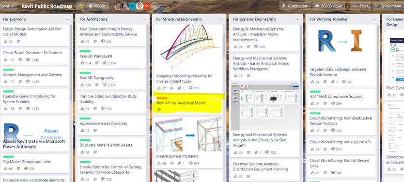

<head>
<meta http-equiv="Content-Type" content="text/html; charset=utf-8">
<link rel="stylesheet" type="text/css" href="bc.css">

</head>

<!---

- Analytical Model API - Message for Public Roadmap
  New API Analytical Model
  New API to enable direct control of the structural analytical model that allows developers to operate independently the creation and modification of analytical elements, offering simplified implementations that work in abstraction from physical elements.
  new_analytical_model_api.jpg

- https://github.com/jeremytammik/RevitLookup/issues/113
  It would be nice to remove this filter and replace ids.Any() with ids.Count > 0. This will improve performance as Any creates a new Enumerator
  Regarding performance, code readability and semantic meaning are more important than performance in places where performance does not matter.
  I agree that sometimes code readability is more important, but in this case additional lines or conditions are not added. And here is the difference in speed 1200 times with memory allocation = (
  benchmark_any_vs_count.png
  wow, impressive! thank you for the conclusive benchmark. i'll add a note of that result to the blog, i think.

- Tweets of Praise for Modeless RevitLookup:
  Joshua Lumley @joshnewzealand: This is a breakthough.
  Timon Hazell @TmnHzll: These are some nice adds.  Thanks @jeremytammik
  Manjaka Rakotoarisoa @RaManjaka: A dream come true
  Jean-Marc Couffin @JeanMarcCouffin: A huge thank you to @NeVeSpl who took on my improvement request right away and made it real!
  Carl S @CarlSirid: Thanks Jeremy, RevitLookup is my favorite addin. It is the must have addin for me.
  LinkedIn
  David Wilson: Installed it yesterday. Thanks very much.
  Roy Qian: Great! 👍👍👍
  Daniel Swearson: Nice! Thanks Jeremy.
  Micheal Ibrahim: You are my hero ❤️

- use extensible storage carefully
  https://forums.autodesk.com/t5/revit-api-forum/bug-unable-to-open-revit-2019-model-after-saving-custom-schema/m-p/10736885
  
- jQuery Outdated
  https://thenewstack.io/why-outdated-jquery-is-still-the-dominant-javascript-library/

twitter:

 the #RevitAPI @AutodeskForge @AutodeskRevit #bim #DynamoBim #ForgeDevCon 

&ndash;
...

linkedin:

#bim #DynamoBim #ForgeDevCon #Revit #API #IFC #SDK #AI #VisualStudio #Autodesk #AEC #adsk

the [Revit API discussion forum](http://forums.autodesk.com/t5/revit-api-forum/bd-p/160) thread

-->

### New Analytical Model API

#### New Analytical Model API

We have just added a new item to
the [Revit Public Roadmap](https://trello.com/b/ldRXK9Gw/revit-public-roadmap) announcing
a new API for analytical modelling in Revit.
This is quite an evolution (if not revolution, as the old one will be deprecated).
Please take a close look at it if you are interested in this area.

> **New API Analytical Model**

> New API to enable direct control of the structural analytical model that allows developers to operate independently the creation and modification of analytical elements, offering simplified implementations that work in abstraction from physical elements.

 <!-- 1068 -->

To further track progress and news on analytical modellingg, you are also invited to apply to join
the [Revit preview project](https://feedback.autodesk.com/key/LHMJFVHGJK085G2M).

Just like the [Revit Idea Station](https://forums.autodesk.com/t5/revit-ideas/idb-p/302),
the roadmap enables you to vote for the roadmap items that have the greatest importance for your specific projects.

#### Praise for Modeless RevitLookup

A lot of praise came in on Twitter and LinkedIn for
the new [modeless RevitLookup](https://thebuildingcoder.typepad.com/blog/2021/10/bridges-regeneration-and-modeless-revitlookup.html):

- This is a breakthough. &ndash; <i>Joshua Lumley @joshnewzealand</i>
- These are some nice adds. Thanks @jeremytammik. &ndash; <i>Timon Hazell @TmnHzll</i>
- A dream come true. &ndash; <i>Manjaka Rakotoarisoa @RaManjaka</i>
- A huge thank you to [@NeVeSpl](https://github.com/NeVeSpl) who took on my improvement request right away and made it real!
  &ndash; <i>Jean-Marc Couffin @JeanMarcCouffin</i>
- Thanks Jeremy, RevitLookup is my favorite addin. It is the must have addin for me. &ndash; <i>Carl S @CarlSirid</i>
- Installed it yesterday. Thanks very much. &ndash; <i>David Wilson</i>
- Great! 👍👍👍 &ndash; <i>Roy Qian</i>
- Nice! Thanks Jeremy. &ndash; <i>Daniel Swearson</i>
- You are my hero ❤️ &ndash; <i>Micheal Ibrahim</i>

Thank you for tyour appreciation, everybody, and yet again a huge thanks to [@NeVeSpl](https://github.com/NeVeSpl) from me too.

####

####

####

####
