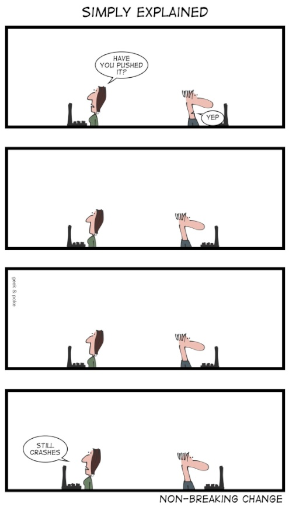

<head>
<meta http-equiv="Content-Type" content="text/html; charset=utf-8">
<link rel="stylesheet" type="text/css" href="bc.css">

</head>

<!---

- REVIT-184115 [Prepare KB article for 2022.1 API change]

twitter:

Breaking news from the Revit development team on the WallCrossSection to WallCrossSectionDefinition renaming in the Revit 2022.1 #RevitAPI update @AutodeskForge @AutodeskRevit #bim #DynamoBim #ForgeDevCon https://autode.sk/wallcrosssection

Breaking news from the Revit development team on the <code>WallCrossSection</code> to <code>WallCrossSectionDefinition</code> renaming in the Revit 2022.1 API update...

linkedin:

Breaking news from the Revit development team on the WallCrossSection to WallCrossSectionDefinition renaming in the Revit 2022.1 #RevitAPI update:

https://autode.sk/wallcrosssection

#bim #DynamoBim #ForgeDevCon #Revit #API #IFC #SDK #AI #VisualStudio #Autodesk #AEC #adsk

the [Revit API discussion forum](http://forums.autodesk.com/t5/revit-api-forum/bd-p/160) thread

-->

### WallCrossSection Renaming in the Revit 2022.1 API

Breaking news from the Revit development team:

#### WallCrossSection versus WallCrossSectionDefinition

Last week, we mentioned the unfortunate breaking change inadvertently introduced with the Revit 2022.1 API update
by [renaming `WallCrossSection` to `WallCrossSectionDefinition`](https://thebuildingcoder.typepad.com/blog/2021/11/revit-20221-sdk-revitlookup-build-and-install.html#3) and
suggested a fix for the `BuiltInParameterGroup` enumeration value.

Here is the workaround suggested by the development team to also address the `ForgeTypeId` modification to support both versions of the API:

As you know from
the [Revit API discussion forum](http://forums.autodesk.com/t5/revit-api-forum/bd-p/160) thread
on [Revit API 2022.1 update change `WallCrossSection` to `WallCrossSectionDefinition`](https://forums.autodesk.com/t5/revit-api-forum/revitapi-2022-update-change-wallcrosssection-to/td-p/10720345),
there was a breaking change introduced in Revit 2022.1:

- `BuiltInParameterGroup.PG_WALL_CROSS_SECTION`
- `ForgeTypeId.WallCrossSection`

were renamed to 

- `BuiltInParameterGroup.PG_WALL_CROSS_SECTION_DEFINITION`
- `ForgeTypeId.WallCrossSectionDefinition`

respectively.

A solution for the first name change in the enum value was already suggested in the forum discussion thread:

The actual integer value can be used instead to define a constant like this:

<pre class="code">
  var&nbsp;PG_WALL_CROSS_SECTION&nbsp;=&nbsp;(BuiltInParameterGroup)&nbsp;(-5000228);
</pre>

This value be used in both Revit 2022.0 and Revit 2022.1 without causing the problem.

A workaround for the second rename, the `WallCrossSection` property of the `ForgeTypeId` class, can be implemented using Reflection in all .NET languages.

Here is a sample code snippet in C#:

<pre class="code">
using&nbsp;System.Reflection;

. . .

  ForgeTypeId&nbsp;id&nbsp;=&nbsp;new&nbsp;ForgeTypeId();
  Type&nbsp;type&nbsp;=&nbsp;typeof(GroupTypeId);
  PropertyInfo&nbsp;propOld&nbsp;=&nbsp;type.GetProperty(&quot;WallCrossSection&quot;,
    BindingFlags.Public&nbsp;|&nbsp;BindingFlags.Static);
   
  if&nbsp;(null&nbsp;!=&nbsp;propOld)
  {
    id&nbsp;=&nbsp;(ForgeTypeId)&nbsp;propOld.GetValue(null,&nbsp;null);
  }
  else
  {
    PropertyInfo&nbsp;propNew&nbsp;=&nbsp;type.GetProperty(&quot;WallCrossSectionDefinition&quot;,
      BindingFlags.Public&nbsp;|&nbsp;BindingFlags.Static);
    id&nbsp;=&nbsp;(ForgeTypeId)&nbsp;propNew.GetValue(null,&nbsp;null);
  }
</pre>

Or, if you prefer a more succinct version, use this:

<pre class="code">
&nbsp;&nbsp;Type&nbsp;type&nbsp;=&nbsp;typeof(GroupTypeId);
 
&nbsp;&nbsp;PropertyInfo&nbsp;prop&nbsp;=&nbsp;type.GetProperty(&quot;WallCrossSection&quot;,&nbsp;
&nbsp;&nbsp;&nbsp;&nbsp;BindingFlags.Public&nbsp;|&nbsp;BindingFlags.Static)&nbsp;
&nbsp;&nbsp;&nbsp;&nbsp;&nbsp;&nbsp;??&nbsp;type.GetProperty(&quot;WallCrossSectionDefinition&quot;,&nbsp;
&nbsp;&nbsp;&nbsp;&nbsp;&nbsp;&nbsp;&nbsp;&nbsp;BindingFlags.Public&nbsp;|&nbsp;BindingFlags.Static);
 
&nbsp;&nbsp;ForgeTypeId&nbsp;id&nbsp;=&nbsp;(ForgeTypeId)&nbsp;prop.GetValue(null,&nbsp;null);
</pre>

We tested it here, and it works for both Revit 2022.0 and Revit 2022.1.
  

 <!-- 495 -->

Non-breaking change &ndash; &copy; <a href="https://www.datamation.com">Datamation</a>

