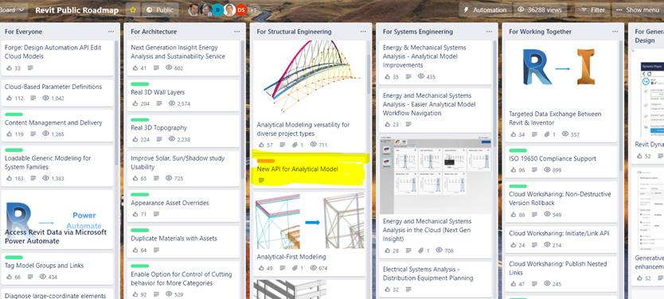
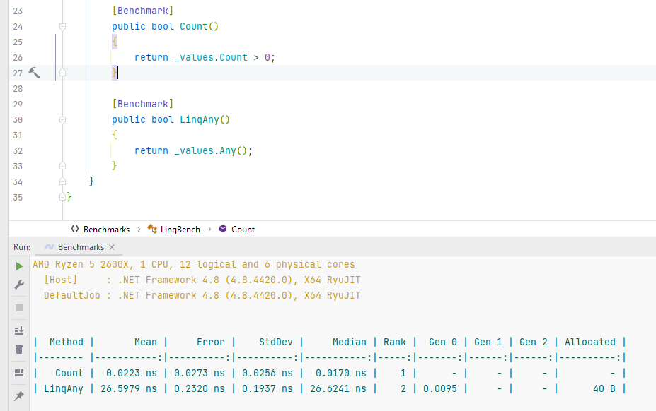

<head>
<meta http-equiv="Content-Type" content="text/html; charset=utf-8">
<link rel="stylesheet" type="text/css" href="bc.css">

</head>

<!---

- Analytical Model API - Message for Public Roadmap
  New API Analytical Model
  New API to enable direct control of the structural analytical model that allows developers to operate independently the creation and modification of analytical elements, offering simplified implementations that work in abstraction from physical elements.
  new_analytical_model_api.jpg

- Tweets of Praise for Modeless RevitLookup:
  Joshua Lumley @joshnewzealand: This is a breakthough.
  Timon Hazell @TmnHzll: These are some nice adds.  Thanks @jeremytammik
  Manjaka Rakotoarisoa @RaManjaka: A dream come true
  Jean-Marc Couffin @JeanMarcCouffin: A huge thank you to @NeVeSpl who took on my improvement request right away and made it real!
  Carl S @CarlSirid: Thanks Jeremy, RevitLookup is my favorite addin. It is the must have addin for me.
  LinkedIn
  David Wilson: Installed it yesterday. Thanks very much.
  Roy Qian: Great! 👍👍👍
  Daniel Swearson: Nice! Thanks Jeremy.
  Micheal Ibrahim: You are my hero ❤️

- https://github.com/jeremytammik/RevitLookup/issues/113
  It would be nice to remove this filter and replace ids.Any() with ids.Count > 0. This will improve performance as Any creates a new Enumerator
  Regarding performance, code readability and semantic meaning are more important than performance in places where performance does not matter.
  I agree that sometimes code readability is more important, but in this case additional lines or conditions are not added. And here is the difference in speed 1200 times with memory allocation = (
  benchmark_any_vs_count.png
  wow, impressive! thank you for the conclusive benchmark. i'll add a note of that result to the blog, i think.

- https://github.com/jeremytammik/RevitLookup/pull/115
  Add Keyboard Escape to Close Form #115

- use extensible storage carefully
  https://forums.autodesk.com/t5/revit-api-forum/bug-unable-to-open-revit-2019-model-after-saving-custom-schema/m-p/10736885
  
- jQuery Outdated
  https://thenewstack.io/why-outdated-jquery-is-still-the-dominant-javascript-library/

twitter:

Important news on the Analytical Model API coming for structural developers, further development in RevitLookup and detailed notes on how to use extensible storage in the #RevitAPI @AutodeskForge @AutodeskRevit #bim #DynamoBim #ForgeDevCon https://autode.sk/newanalyticalmodel

Important news coming for structural developers, further development in RevitLookup, notes on extensible storage and JavaScript
&ndash; New Analytical Model API
&ndash; Praise for modeless RevitLookup
&ndash; Benchmarking generic <code>Any</code> versus <code>Count</code>
&ndash; Escape RevitLookup
&ndash; Use extensible storage carefully
&ndash; jQuery is widespread but outdated...

linkedin:

Important news on the Analytical Model API coming for structural developers, further development in RevitLookup, JavaScript and detailed notes on how to use extensible storage in the #RevitAPI 

https://autode.sk/newanalyticalmodel

- New Analytical Model API
- Praise for modeless RevitLookup
- Benchmarking generic <code>Any</code> versus <code>Count</code>
- Escape RevitLookup
- Use extensible storage carefully
- jQuery is widespread but outdated...

#bim #DynamoBim #ForgeDevCon #Revit #API #IFC #SDK #AI #VisualStudio #Autodesk #AEC #adsk

the [Revit API discussion forum](http://forums.autodesk.com/t5/revit-api-forum/bd-p/160) thread

-->

### New Analytical Model API

Important news coming for structural developers, further development in RevitLookup, notes on extensible storage and JavaScript:

- [New Analytical Model API](#2)
- [Praise for modeless RevitLookup](#3)
- [Benchmarking generic `Any` versus `Count`](#4)
- [Escape RevitLookup](#5)
- [Use extensible storage carefully](#6)
- [jQuery is widespread but outdated](#7)

#### New Analytical Model API

We have just added a new item to
the [Revit Public Roadmap](https://trello.com/b/ldRXK9Gw/revit-public-roadmap) announcing
a new API for analytical modelling in Revit.
This is quite an evolution (if not revolution, as the old one will be deprecated).
Please take a close look at it if you are interested in this area.

> **New API Analytical Model**

> New API to enable direct control of the structural analytical model that allows developers to operate independently the creation and modification of analytical elements, offering simplified implementations that work in abstraction from physical elements.

 <!-- 834 -->

To further track progress and news on analytical modelling, you are also invited to apply to join
the [Revit preview project](https://feedback.autodesk.com/key/LHMJFVHGJK085G2M).

Just like the [Revit Idea Station](https://forums.autodesk.com/t5/revit-ideas/idb-p/302),
the roadmap enables you to vote for the roadmap items that have the greatest importance for your specific projects.

#### Praise for Modeless RevitLookup

We received praise on Twitter and LinkedIn for
the new [modeless RevitLookup](https://thebuildingcoder.typepad.com/blog/2021/10/bridges-regeneration-and-modeless-revitlookup.html):

- This is a breakthrough. &ndash; <i>Joshua Lumley @joshnewzealand</i>
- These are some nice adds. Thanks @jeremytammik. &ndash; <i>Timon Hazell @TmnHzll</i>
- A dream come true. &ndash; <i>Manjaka Rakotoarisoa @RaManjaka</i>
- A huge thank you to [@NeVeSpl](https://github.com/NeVeSpl) who took on my improvement request right away and made it real!
  &ndash; <i>Jean-Marc Couffin @JeanMarcCouffin</i>
- Thanks Jeremy, RevitLookup is my favourite addin. It is the must-have add-in for me. &ndash; <i>Carl S @CarlSirid</i>
- Installed it yesterday. Thanks very much. &ndash; <i>David Wilson</i>
- Great! 👍👍👍 &ndash; <i>Roy Qian</i>
- Nice! Thanks Jeremy. &ndash; <i>Daniel Swearson</i>
- You are my hero ❤️ &ndash; <i>Micheal Ibrahim</i>
- Just tried. Thanks! &ndash; <i>Chenzhang Wang</i>

Thank you for your appreciation, everybody, and yet again a huge thanks to [@NeVeSpl](https://github.com/NeVeSpl) from me too.

#### Benchmarking Generic Any versus Count

One interesting little item that came up after
the subsequent [RevitLookup cleanup](https://thebuildingcoder.typepad.com/blog/2021/11/revit-20221-sdk-revitlookup-build-and-install.html#4) questions the use of the [generic `Any` method]() to check for an empty collection
in [issue #113 &ndash; error snooping family type from project browser](https://github.com/jeremytammik/RevitLookup/issues/113),
where [Roman @Nice3point](https://github.com/Nice3point) points out:

> It would be nice to remove this filter and replace `ids.Any()` with `ids.Count > 0`.
This will improve performance, as `Any` creates a new `Enumerator`.
Proof:

 <!-- 927 -->

> I agree that sometimes code readability is more important, but in this case additional lines or conditions are not added.
The difference in speed is 1200 times with memory allocation =(

> It takes 27 NANO seconds, and 40 Bytes in instruction that is invoked only once per use case 🤣.

Many thanks to Roman for this little suggestion and benchmark, and much more so for all his other outstanding work recently improving and maintaining RevitLookup!

#### Escape RevitLookup

Before we escape this topic, yet another little RevitLookup update bears mentioning:

Luiz Henrique [@ricaun](https://github.com/ricaun) Cassettari submitted
[pull request #115 to add keyboard escape to close form](https://github.com/jeremytammik/RevitLookup/pull/115):

> After the Modeless update, the Escape button stop working.
This PR reenables the Escape keyboard feature; now the focused form closes if the Escape button is pressed, and the Owner regains focus.

Published in [RevitLookup release 2022.0.2.4](https://github.com/jeremytammik/RevitLookup/releases/tag/2022.0.2.4).

Many thanks to Luiz Henrique for catching this!

#### Use Extensible Storage Carefully

Moving away from RevitLookup to more general Revit API topics, 
@aalondoqor ran into a problem similar to the one reported two years ago in 
the [Revit API discussion forum](http://forums.autodesk.com/t5/revit-api-forum/bd-p/160) thread
on a [Bug: Unable to open Revit 2019 model after saving custom schema in Project Info](https://forums.autodesk.com/t5/revit-api-forum/bug-unable-to-open-revit-2019-model-after-saving-custom-schema/m-p/10736885).

With the help of the invaluable advice provided once again by
Richard [RPThomas108](https://forums.autodesk.com/t5/user/viewprofilepage/user-id/1035859) Thomas,
it turns out not to be a bug after all...

The original problem description includes
an [an archive with a project CS.Revit.TestLib.zip](zip/extensible_storage_test_1.zip) to
run in Revit 2019 with a README.md specifying the problem reproduction steps.

In the new iteration, @aalondoqor asks:

**Question:** Hi, can you solve this bug?

**Answer:** Does the sample material provided previously exactly cover your problem as well?

**Response:** Yes, is the same case exactly.

**Answer:** You have to be careful with Extensible Storage; it can cause these issues.

I experienced the same issue with that sample in Revit 2022 when upgraded;
I made the enclosed changes to `Application.cs` and no longer experienced the problem.

Essentially, the changes consist of:

- Constructing the schema when it is needed, not at start-up
- Not passing entities `ByRef`
- Looking for an existing schema 
- Creating it if not found via `Schema.Lookup(SchemaGuid)`, rather than just supplying GUID
- Using `new Entity(Schema)` instead of `new Entity(GUID)`
- Making use of `ExtensibleStorageFilter`.

I guess the 'archive error' failure to open should be investigated regardless, but comparison between enclosed and original may indicate the cause.

The sample includes producing a library in netcore3.0 and dotnet47.
I upgraded to dotnet48 and dropped the netcore3.0 version.
Due to referencing the Revit 2022 API, I had to change aspects related to `DisplayUnitType`.
Updated solution enclosed, not original:

- [ApplicationREVISED.cs](zip/ApplicationREVISED.cs.txt)
- [CS.Revit.TestLib updated](zip/extensible_storage_test_2.zip)

When Extensible storage was introduced, we all went through a small period of time when we were using it wrong and we didn't see the implications until later (often the next year when we updated the add-ins but had the old schemas).
So, will always be an important subject to developers with limited experience of it.

I have to thank The Building Coder, because the majority of my knowledge of this subject is due to the AU handouts by Jeremy Tammik that are available on the web.
They may not incorporate the latest ways of obtaining Schema's etc., but the process is still outlined correctly.
From what I've seen, people often get into difficulties when they go too far away from these ways of doing it.
I think the general rule is, don't hold onto objects and keep interactions as finite as possible.
The Revit SDK also provides a good basic example under `SchemaBuilder`.

If you conclude my fixes solved the issue or even if you demonstrate a better way (I did rewrite in a bit of a hurry), I would be happy to read that on the blog.

We could ask Autodesk to find a more graceful way for Revit to handle the issue, but I think that is perhaps easier said than done (is a memory issue, is not new, we all have our part to play in terms of program stability).
Often if you can't open a file, it may be possible to open it on a Revit version without the add-ins.
The add-in in question was creating the schema `OnStartUp`, so would have already put something in memory before the document with the conflict was opened (could open it without the add-in when I checked later).

**Response:** Thank you all very much, I fixed my problem with the example file supplied by RPTHOMAS108; thanks for sharing your knowledge.

#### jQuery is Widespread but Outdated

Moving away from the Revit .NET API to the web, I have used [jQuery](https://jquery.com) in
the past and would maybe continue doing so if I had not just noticed this article
explaining [why outdated jQuery is still the dominant JavaScript library](https://thenewstack.io/why-outdated-jquery-is-still-the-dominant-javascript-library).
