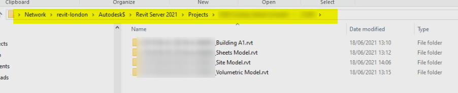
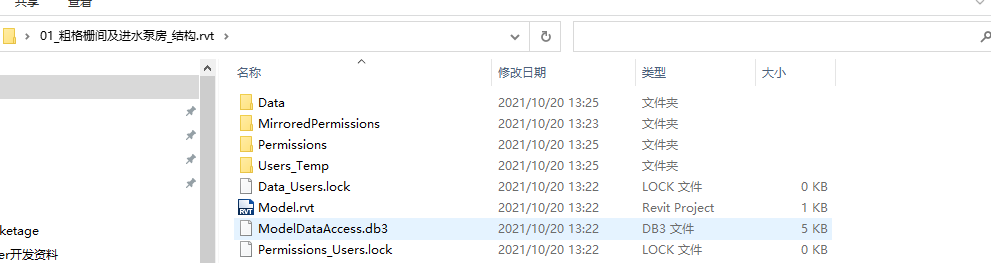
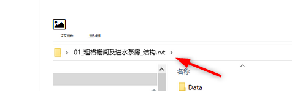

<head>
<meta http-equiv="Content-Type" content="text/html; charset=utf-8">
<link rel="stylesheet" type="text/css" href="bc.css">

</head>

<!---

- access revit server docs
  https://forums.autodesk.com/t5/revit-api-forum/how-do-i-invoke-the-revit-server-base-interface/m-p/10700292
  
- access RVT on Revit Server
  How do I invoke the Revit Server base interface?
  https://forums.autodesk.com/t5/revit-api-forum/how-do-i-invoke-the-revit-server-base-interface/m-p/10679810

- alert user of missing data
  issue a warning versus highlight graphics
  Did you fill the parameter value or is it still blank?
  https://forums.autodesk.com/t5/revit-api-forum/did-you-fill-the-parameter-value-or-is-it-still-blank/td-p/10627151

twitter:

 in the #RevitAPI @AutodeskForge @AutodeskRevit #bim #DynamoBim #ForgeDevCon https://autode.sk/formitapi

&ndash; 
...

linkedin:

#bim #DynamoBim #ForgeDevCon #Revit #API #IFC #SDK #AI #VisualStudio #Autodesk #AEC #adsk

the [Revit API discussion forum](http://forums.autodesk.com/t5/revit-api-forum/bd-p/160) thread

-->

### Revit Server

#### Revit Server

Hernan Echevarria shared some valuable experience on working with Revit Server in
the [Revit API discussion forum](http://forums.autodesk.com/t5/revit-api-forum/bd-p/160) thread
on [how to invoke the Revit Server base interface](https://forums.autodesk.com/t5/revit-api-forum/how-do-i-invoke-the-revit-server-base-interface/m-p/10700292):

**Question:** The SDK provides limited information about Revit Server，i want to calling the base interface method like:download...,can you provide an example?

**Answer:** Maybe some of these can help:

<ul>
<li><a href="http://thebuildingcoder.typepad.com/blog/2012/11/au-classes-on-python-ui-server-and-framework-apis.html">AU Classes on Python, UI, Server and Framework APIs</a></li>
<li><a href="http://thebuildingcoder.typepad.com/blog/2013/08/the-revit-server-rest-api.html">The Revit Server REST API</a></li>
<li><a href="http://thebuildingcoder.typepad.com/blog/2013/08/revit-server-api-access-and-vbscript.html">Revit Server API Access and VBScript</a></li>
<li><a href="http://thebuildingcoder.typepad.com/blog/2013/12/saving-a-new-central-file-to-revit-server.html">Saving a New Central File to Revit Server</a></li>
<li><a href="http://thebuildingcoder.typepad.com/blog/2014/01/rest-post-request-to-revit-server-2014.html">REST POST Request to Revit Server 2014</a></li>
<li><a href="http://thebuildingcoder.typepad.com/blog/2014/08/accessing-a-revit-server-central-model-path.html">Accessing a Revit Server Central Model Path</a></li>
<li><a href="http://thebuildingcoder.typepad.com/blog/2014/08/revit-server-thumbnail-requires-redistributable.html">Revit Server Thumbnail Requires Redistributable</a></li>
<li><a href="http://thebuildingcoder.typepad.com/blog/2016/03/pi-day-meeting-ski-tours-and-revit-server-bar-separator.html">Pi Day, Meeting, Ski Tour, Revit Server Bar Separator</a></li>
<li><a href="http://thebuildingcoder.typepad.com/blog/2017/02/revitserverapilib-truss-members-and-layers.html">Revit Server API Lib, Truss Members and Layers</a></li>
</ul>

**Response:** Thanks for your solution, your answer helped me a lot; after reading these articles，I still have a question: after getting the Revit Server filepath, how do I open the file by Revit API?

**Answewr:** I created several add-ins to manage Revit Server files. One of them is to batch export Navisworks files from the Revit Server and the other one for exporting Revit files.

I didn't use the Revit Server API. You can use normal Revit and Windows methods to manage the paths and open the files.

You can access the Revit Server project through Windows File Explorer. If you don't know the path ask your IT department. You will probably need permission to access these folders.

In the image below you can see how it looks like (blurred bits for confidentiality).

Note that each Revit file is represented by a folder, which ends in ".rvt"!! (not actual rvt files). However, if you get the path of these folders, you can use it to open the models.

I hope this helps.

2021-10-11_08h38_48.png

 <!-- 902 -->

Tags (0)
Add tags
Report
MESSAGE 5 OF 9
464905795
 Enthusiast 464905795 in reply to: jeremy.tammik
‎2021-10-11 11:40 PM 
Hello,Jeremy,    I read all the blog of revit server that you write,I have a general understanding of how Revit Server works，As  H.echeva said,I can get the revit server file(*.rvt) through Windows File Explorer.    For example,there have a revit server "172.18.1.32" and save a entral file at "testfolder\1.rvt",Now I can open the file by two ways,first:doc.OpenFile(@"RSN://172.18.1.32/testfolder/1.rvt"),the second ,use the method Application.CopyModel(),copy the file as a local file  ,then open the local file 。After modify the file , I want to   Synchronize with the central file,the two way about open file will be get different result?

Tags (0)
Add tags
Report
MESSAGE 6 OF 9
jeremy.tammik
 Employee jeremy.tammik in reply to: 464905795
‎2021-10-12 02:44 AM 
Congratulations on successfully accessing the server files in the two ways you describe.

Unfortunately, I cannot test the scenarios you describe.

Can you try it out and let us know how it works for you?

Thank you!

Jeremy Tammik,  Developer Advocacy and Support, The Building Coder, Autodesk Developer Network, ADN Open
Tags (0)
Add tags
Report
MESSAGE 7 OF 9
464905795
 Enthusiast 464905795 in reply to: jeremy.tammik
‎2021-10-12 07:02 PM 
Hello,Jeremy! 

  Yesterday , input the file path in revit open file dialog like "RSN://172.18.1.32/8364dfab-968d-4a9c-8b6b-f75d0c1b5330/04_二次沉淀池_结构.rvt",the file was opened successfully, then I try to open the file by commandData.Application.Application.OpenDocumentFile(@"RSN://172.18.1.32/8364dfab-968d-4a9c-8b6b-f75d0c1b5330/04_二次沉淀池_结构.rvt"),however,it failed,revit return the error message "the filepath to be opened doesn't exist",the method  Application.CopyModel(),return the same message.

  Now ,I'm very confused，can you provide a example about open revit server file?

Tags (0)
Add tags
Report
MESSAGE 8 OF 9
464905795
 Enthusiast 464905795 in reply to: H.echeva
‎2021-10-19 10:44 PM 
1634708731(1).pnghello,H.echeva:

 I copy the folder from revit server to local,but I don't know how to open the .rvt project though the folder and sub file.

 <!-- 991 -->

Tags (0)
Add tags
Report
MESSAGE 9 OF 9
H.echeva
 Advocate H.echeva in reply to: 464905795
‎2021-10-20 12:19 AM 
Hello,

In Revit you need to open the folder that I point in your image. You need to pass Revit the path to that folder, not to what is inside!

So fo example, if you have a path that is Autodesk/Revit Server 2021/Projects/FOLDER.rvt

Just pass that path to the Revit API. I know it is weird because it is a folder and not a Revit file!!

But this is how it works.

Hecheva_0-1634714115252.png

 <!-- 476 -->

EDIT: Sorry I forgot to mention, that you will need to transform the path to a Revit Server Path!

So if my path is:

\\revit-london\Autodesk$\Revit Server 2021\Projects\2054 SingleHouseProject\Model1.rvt

I need to transform it to:

RSN://REVIT-LONDON.zzz.s/Autodesk$/Revit Server 2021/Projects/2054 SingleHouseProject/Model1.rvt

Note that I also changed slash `/` to backslash `\`

Thanks to ??? for his experience and explanation!

#### 

#### 

