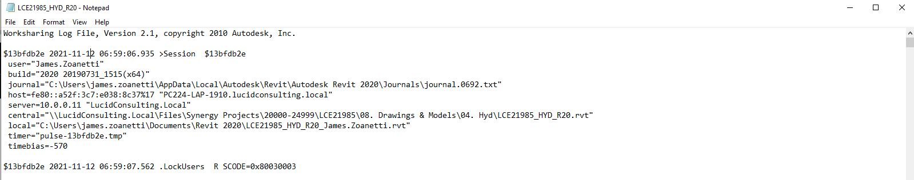
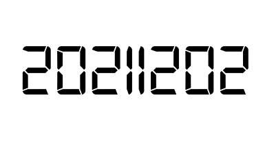

<head>
<meta http-equiv="Content-Type" content="text/html; charset=utf-8">
<link rel="stylesheet" type="text/css" href="bc.css">

</head>

<!---

- logging with journal vs slog
  https://forums.autodesk.com/t5/revit-api-forum/how-to-stop-slog-file-from-getting-overwritten-removing-previous/m-p/10757827

- on monitoring deleted elements by rpt:
  https://forums.autodesk.com/t5/revit-api-forum/find-the-user-of-the-deleted-element-in-revit/m-p/10743767
  10292440 [Accessing deleted elements]
  https://forums.autodesk.com/t5/revit-api-forum/get-uniqueid-of-deleted-element-within-dynamic-updater-with/m-p/10622152
  CF-2162 [API: DocumentChanging or ElementsDeleting event before element is deleted -- 10292440]

- Do you need to add a `favicon` to your web site?
  If so, it might be a good idea to first check out the definitive edition
  of [how to Favicon in 2021](https://dev.to/masakudamatsu/favicon-nightmare-how-to-maintain-sanity-3al7)
  recommended by the extensive [favicon analysis by iconmap](https://iconmap.io/blog) based
  on their cool [favicon map](https://iconmap.io).

twitter:

Monitoring with SLOG and logging deleted elements with the #RevitAPI @AutodeskForge @AutodeskRevit #bim #DynamoBim #ForgeDevCon https://autode.sk/monitoring

Useful insights on logging and monitoring
&ndash; Monitoring with SLOG
&ndash; Monitoring deleted elements
&ndash; How to Favicon
&ndash; Decentralised autonomous organisations
&ndash; Palindrome and ambigram...

linkedin:

Monitoring with SLOG and logging deleted elements with the #RevitAPI 

https://autode.sk/monitoring

- Monitoring with SLOG
- Monitoring deleted elements
- How to Favicon
- Decentralised autonomous organisations
- Palindrome and ambigram...

#bim #DynamoBim #ForgeDevCon #Revit #API #IFC #SDK #AI #VisualStudio #Autodesk #AEC #adsk

the [Revit API discussion forum](http://forums.autodesk.com/t5/revit-api-forum/bd-p/160) thread

-->

### Logging and Monitoring Deleted Data

A couple of useful insights on logging and monitoring:

- [Monitoring with SLOG](#2)
- [Monitoring deleted elements](#3)
- [How to Favicon](#4)
- [Decentralised autonomous organisations](#5)
- [Palindrome and ambigram](#6)

#### Monitoring with SLOG

Some interesting insights on monitoring were provided by the Revit development team
on [Tony Howard](https://forums.autodesk.com/t5/user/viewprofilepage/user-id/693340)'s 
[Revit API discussion forum](http://forums.autodesk.com/t5/revit-api-forum/bd-p/160) thread
on [how to stop SLOG file from getting overwritten removing previous entries](https://forums.autodesk.com/t5/revit-api-forum/how-to-stop-slog-file-from-getting-overwritten-removing-previous/m-p/10757827):

**Question:** My understanding of the slog file is that when a central file is accessed an entry is made.
What I have noticed is that these entries are getting overwritten therefore removing all history of previous entries.
Is there a way to stop this from occurring?
Is this linked to journal file cleanup and when journal number exceeds limits, usually set at default OOTB 10?
Here is an image of a slog file that was accessed today:

 <!-- 1599 -->

Issue is that this file was created last month and has had multiple days' work done on it and should therefore have older entries located within.
Yesterday it had older entries.

We are looking at reading the slog file within Revit through the API as a potential time clock type tool. 

Revit will read the slog file and generate a time in file output, as well as other outputs we require, that will go externally for other software to read.

We can search for slog files on our server and extract this information via python however was looking for a Revit API solution. 

The issue/question either as an API solution or an external Python solution: why does the slog file overwrite when it is supposed to append for each new session?

The reason for looking at it from this approach is that we don't want to have to create an add-in that requires staff to activate it if we can avoid it.
I know there are approaches that work when the save command is selected, and then export out data, but I am trying to cover all bases to see if we can do it externally to the API as well as internally so that we can track project progression over time as well.
I can extract the files so that we can see if there has been any activity, which is fine, however would like to generate an 'over time' result; if the file overwrites, we could code that in, but would like to have further documentation on the slog file and why it is functioning the way it appears to.

**Answer:** Slogs (like journals) will only store data for so long before discarding old data.
In my experience, they can also be lost when re-initiating a model as a central or performing a few other actions which are similar in scope to recreating the central.
As long as they are collected quickly enough (daily should be fine) and at major inflection points (about to recreate the central model), they shouldn’t have any issues with data loss.
 
That said, for the task at hand they are somewhat ill-suited for a few reasons.

They only exist for central models, not families, massing, or non-workshared file types.
They do not log any actions beyond worksharing specific data, which is a small amount of content relatively speaking.
They do not exist as a single easy access for all users who are worksharing when using cloud worksharing via Autodesk Docs/BIM360 (becoming very common).
 
Journals catch the same data that is present in the SLOG, work in all Revit environments, and create a log of non-workshared content. They will tell you not just which models were synced with, but how long the user was in this any given model without a sync.
They’ll even tell you how long the user was in a given view.
 
They can provide further insights into user actions (who could use some guidance on keyboard shortcuts?), model health (missing elements flag before there are too many), and performance (how often is mode A crashing vs model B?).
 
The only ‘problem’ with journals is that they need to have a LOT more processing as there is a LOT more data.
They also need to be grabbed daily, but nothing should overwrite them beyond the look back timeframe.

I guess those are some good reasons why I have not heard about slog files being used for this purpose in the past.

**Response:** Thank you for the detailed response.

I was also looking at linking with journals, however they live on temp directories on individual machines connected to our network (around 250 employees), so I was trying to use the slog to time stamp and problem solve. 

I do still see value in the using the slog even if it will overwrite as we can still determine when a file is being accessed and should have at least some activity prior to a deadline so there is still value.

I will look at coding the finding of the files, extracting the data and then capturing new data from the slog and appending it to the end of the captured data.

I am currently extracting the slog files from the server daily so that is not the issue.

Again, really appreciate the detailed response.

**Answer:** Keep in mind that for cloud worksharing projects, the slogs also live on the local disc, so if you want your tool to account for those data sets than you will need to collect those as well.
While you may not have any collaboration projects on Autodesk Docs / BIM360 today it’s advisable to account for it in theory at least &ndash; otherwise you’ll have large gaps in the data with no plan on how to fill them in.

The slogs can be collected at user log in by simply copying the slog file from the local disc on log in.
Check a journal for a user on a cloud worksharing project to confirm the specific location for your various environment(s).
This same method is being used by a few offices I know to grab all journals from impacted user(s).

#### Monitoring Deleted Elements

In another monitoring topic,
Richard [RPThomas108](https://forums.autodesk.com/t5/user/viewprofilepage/user-id/1035859) Thomas et al
shared some useful thoughts on monitoring deleted elements in
the [Revit API discussion forum](http://forums.autodesk.com/t5/revit-api-forum/bd-p/160) thread
on how to [find the user of a deleted element in Revit](https://forums.autodesk.com/t5/revit-api-forum/find-the-user-of-the-deleted-element-in-revit/m-p/10743767):

Yes, as Jeremy noted, it is pretty difficult to retrieve information about deleted elements.
You could log the ElementIds against username but there are mainly two issues with that:

- The ElementId may have changed from what you later check against to identify the element from the id (old copy of model).
- The element is only deleted in central during synchronisation and that happens along with a load of other changes which are not monitored by the API.

So, even if a locally generated log says the element was deleted, you don't know if that change was pushed through to central, i.e., Delete &gt; Undo &gt; Synchronise (there is no recording of Undo, just the ability to log the deleted and the synchronisation).

Seems to be a recurring theme that people want to know more about the deleted items; what would be the motivation?
The element is no more... it is an ex-element!

If you don't want something deleted, it seems better for users to run an add-in that marks the element, then either posts a failure or cancels an event when deletion is attempted.

**Response:** The real purpose of tracking is to monitor if the project runs smoothly and the users do their job properly.

Is it possible to track it with some kind of Logging outside Revit DB when something like delete event happens in the central model?

Would it be a good idea to log the unique ID of element instead of Element ID ?

**Answer 1:** If you just want to track whether people are deleting a lot of elements in general, you can very easily implement a `DocumentChanged` event handler that is notified when elements are added, modified and deleted.
The affected element ids are provided.
However, as noted above, no further data is available for the deleted ones.
More on `DocumentChanged` and the more complex and powerful DMU framework in
the [Dynamic Model Updater framework topic group](https://thebuildingcoder.typepad.com/blog/about-the-author.html#5.31)
More thoughts and a PoC on tracking model modifications in general is provided by
the [TrackChangesCloud sample](https://thebuildingcoder.typepad.com/blog/2016/03/implementing-the-trackchangescloud-external-event.html).

**Answer 2:** In practical terms you would be using either one of:

- *DocumentChangedEventArgs.GetDeletedElementIds* from Application.DocumentChanged
- *UpdaterData.GetDeletedElementIds* from IUpdater.Execute

You can't get UID from these, since the element is no longer available to look it up on.

I rack my brains to think how you could do this without implicating the wrong person, but I think the simple answer is whatever method you use system failures could lead to the wrong person being implicated.

As an extreme example:

Every time Application.DocumentSynchronizedWithCentral occurs, you make a copy of the central and store it somewhere.
By comparison of time stamps or information added to the central, you can tell who synchronised that copy.

However, what if copying failed, leading to a missing record.
Under that circumstance, the last record shows the element missing, but perhaps that was just because they acquired the change from elsewhere via ReloadLatest.

It's a human management issue, no?
If you have two production lines with two people on each and on one of those lines they are pointing the finger at one another, then swap one of those with one from the other production line.
In the end, you'll find the common denominator(s).
Also they have to address the atmosphere and what leads to the person not being open about the mistakes they've made.
There used to be this idea in construction that mistakes are so critical to identify that you have to foster an atmosphere where when somebody makes a mistake, they can be open about it.
A 'first mistake = last mistake' atmosphere leads to a situation where the mistakes are left to reveal themselves.

The other issue is that in the end someone deleted it, but someone should spot it missing.
If a drawing goes out with a missing column for example, then that is a systemic problem.
There should be more than one person at fault in that scenario, or it points to someone being overburdened with both production and final checking (akin to an overburdened defender in chess).
Any system will fail if it doesn't recognise that humans operating within it are not infallible.
If the error was spotted before there were major consequences, then that is worth recognising as the system working.

As a developer, I would tend to focus on what can be done to enable users not to make such errors.
As noted previously, there are mechanisms to protect things considered unchangeable.
There are even therefore ways of restricting what categories or individual elements a particular user can change.

**Answer 3:** It's not an API solution, but, honestly, I think the best solution is to Pin important things you don't want deleted.
It's kind of a pain, because to move or edit anything that is pinned, you have to unpin it and then re-pin it.

But a user can't delete anything that's pinned without unpinning it first.
That does stop a lot of non-intentional deletions.

Many thanks to Richard and Steve <i>@sragan</i> Ragan for their valuable thoughts and advice.

If you are interested in an earlier in-depth discussion of accessing deleted element data, you can also refer to the thread on how
to [get `UniqueId` of deleted element within dynamic updater (with feature request)](https://forums.autodesk.com/t5/revit-api-forum/get-uniqueid-of-deleted-element-within-dynamic-updater-with/m-p/10622152) and
the wish list item *CF-2162 &ndash; API: DocumentChanging or ElementsDeleting event before element is deleted -- 10292440*.

#### How to Favicon

Do you need to add a `favicon` to your web site?

If so, it might be a good idea to first check out the definitive edition
of [how to Favicon in 2021](https://dev.to/masakudamatsu/favicon-nightmare-how-to-maintain-sanity-3al7)
recommended in the extensive [analysis by <i>iconmap</i>](https://iconmap.io/blog) based
on their cool [favicon map](https://iconmap.io).

#### Decentralised Autonomous Organisations

Our new word to learn today, this week's word of the week, is DAO
or [decentralized autonomous organization](https://en.wikipedia.org/wiki/Decentralized_autonomous_organization).

Find out all you need to know from
the [Wikipedia link](https://en.wikipedia.org/wiki/Decentralized_autonomous_organization) and
the CNBC article explaining [What are DAOs? Here’s what to know about the 'next big trend' in crypto](https://www.cnbc.com/2021/10/25/what-are-daos-what-to-know-about-the-next-big-trend-in-crypto.html).

#### Palindrome and Ambigram

Better late than never, I noticed that I missed
a [special date last week](https://twitter.com/MLKessel/status/1466416660458491913?s=20):

> Not only is today's date a palindrome, it's also an ambigram.
You can read it left to right, right to left, and also upside down.

 <!-- 398 -->

It will take a while for the next such date to appear, as far as I can tell off-hand.
If I am not mistaken, the only further ones coming up in this century are 2050-05-02 and 2080-08-02...

