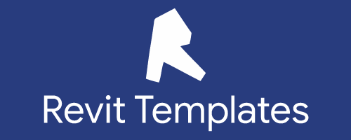

<head>
<meta http-equiv="Content-Type" content="text/html; charset=utf-8">
<link rel="stylesheet" type="text/css" href="bc.css">

</head>

<!---

twitter:

RevitTemplates update adds numerous new features for the #RevitAPI @AutodeskForge @AutodeskRevit #bim #DynamoBim #ForgeDevCon https://bit.ly/rvttemplates

&ndash; 
...

linkedin:

RevitTemplates update adds numerous new features for the #RevitAPI

https://bit.ly/rvttemplates

#bim #DynamoBim #ForgeDevCon #Revit #API #IFC #SDK #AI #VisualStudio #Autodesk #AEC #adsk

the [Revit API discussion forum](http://forums.autodesk.com/t5/revit-api-forum/bd-p/160) thread

-->

### RevitTemplates Update 1.7.0

Roman [Nice3point](https://github.com/Nice3point) made
huge contributions to RevitLookup in the past few months.

Today, on this shortest day of the year (up here in the northern hemisphere), he would appreciate your feedback
on [update 1.7.0](https://github.com/Nice3point/RevitTemplates/discussions/19) of another of his projects,
[RevitTemplates](https://github.com/Nice3point/RevitTemplates):

Last big update in the outgoing year.

- .Net SDK 6 support
- Nuke 6 support
- C# 10 support
- Implicit usings
- File-scoped namespaces
- The revit-sln template is now displayed in the IDE
- Added group Solution Items with frequently used non-project files
- Added SubTransaction
- Added extensions for adding images to a ribbon
- Added copying .pdb files to Revit folder for non-Rider debugger
- Optimized .csproj file for revit-addin template. Added generate Assembly Information
- Replaced Nuget packages with floating versions
- YML files switched to windows-2022 image
- Bin folder is no longer displayed in explorer
- The installer is now an optional parameter.
- Fixed changelog parser
- Other minor changes and improvements

Wiki updated:

- [https://github.com/Nice3point/RevitTemplates/wiki/Multiple-Revit-Versions](https://github.com/Nice3point/RevitTemplates/wiki/Multiple-Revit-Versions)
- [https://github.com/Nice3point/RevitTemplates/wiki/Third-party-files](https://github.com/Nice3point/RevitTemplates/wiki/Third-party-files)
- [https://github.com/Nice3point/RevitTemplates/wiki/Modular-solution](https://github.com/Nice3point/RevitTemplates/wiki/Modular-solution)
- [https://github.com/Nice3point/RevitTemplates/wiki/Multiple-Installer-Versions](https://github.com/Nice3point/RevitTemplates/wiki/Multiple-Installer-Versions)
- [https://github.com/Nice3point/RevitTemplates/wiki/Autodesk-Store-bundle](https://github.com/Nice3point/RevitTemplates/wiki/Autodesk-Store-bundle)

Visual Studio 2022 supports custom parameters, create projects without using a terminal.
Just remember when creating a solution to check "Put solution and project in same directory".
VS can also change the preconfigured solution configurations, be careful and read WIKI.

If you use Rider and want to add support for custom parameters, put your thumbs up:

- [https://youtrack.jetbrains.com/issue/RIDER-16759](https://youtrack.jetbrains.com/issue/RIDER-16759)

Also vote for bug fixes:

- [https://youtrack.jetbrains.com/issue/RIDER-71014](https://youtrack.jetbrains.com/issue/RIDER-71014)
- [https://youtrack.jetbrains.com/issue/RIDER-66638](https://youtrack.jetbrains.com/issue/RIDER-66638)

I wish all happy holidays and a happy new year.
Keep coding 🎅🥳

