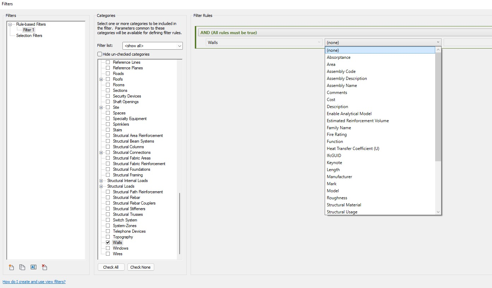
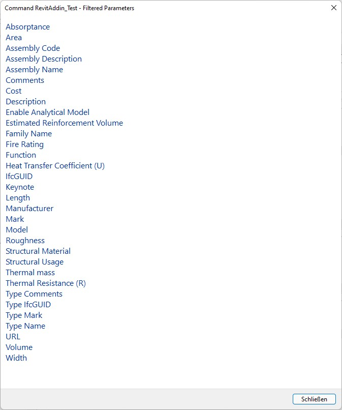

<head>
<meta http-equiv="Content-Type" content="text/html; charset=utf-8">
<link rel="stylesheet" type="text/css" href="bc.css">

</head>

<!---

- another utility to keep in mind:
  Use `ParameterFilterUtilities` to
  Get all possible FilterRule parameters
  https://forums.autodesk.com/t5/revit-api-forum/get-all-possible-filterrule-parameters/m-p/10936268

- Constraining Stirrups to the Cover of the Host Element
  https://forums.autodesk.com/t5/revit-api-forum/problem-with-constraining-stirrups-to-the-cover-of-the-host/td-p/10045899

- zero energy house https://www.edx.org/course/zero-energy-design-an-approach-to-make-your-buildi?hs_analytics_source=referrals&utm_source=mooc.org&utm_medium=referral&utm_campaign=mooc.org-course-list
TUDelft rowers 220 W continuous power, 330 peak; a match or candle flame provides about 100 W; to a water heater to provide 10 kW, you can see an array of 10 x 10 = 100 gas flames, where 100 x 100 W = 10 kW.

- Zero-Energy Design: an approach to make your building sustainable
  /j/doc/book/zero_energy_design_sustainable_building/zed.txt

twitter:

ParameterFilterUtilities, constraining rebar stirrup to host cover, power, energy, entropy and information in the #RevitAPI FormulaManager @AutodeskForge @AutodeskRevit #bim #DynamoBim #ForgeDevCon https://autode.sk/parameterfilterutilities

Taking a look at yet another overlooked Revit API utility class, rebar constraints, and learning basics of power, energy, entropy and information
&ndash; ParameterFilterUtilities
&ndash; Constrain stirrup to host cover
&ndash; Rowers illustrate power and building energy
&ndash; Wordle entropy and information...

linkedin:

ParameterFilterUtilities, constraining rebar stirrup to host cover in the #RevitAPI

https://autode.sk/parameterfilterutilities

Taking a look at yet another overlooked Revit API utility class, rebar constraints, and learning basics of power, energy, entropy and information:

- ParameterFilterUtilities
- Constrain stirrup to host cover
- Rowers illustrate power and building energy
- Wordle entropy and information...

#bim #DynamoBim #ForgeDevCon #Revit #API #IFC #SDK #AI #VisualStudio #Autodesk #AEC #adsk

the [Revit API discussion forum](http://forums.autodesk.com/t5/revit-api-forum/bd-p/160) thread

-->

### Utility Classes and Constraining Stirrups

Taking a look at
yet another [overlooked Revit API utility class](https://thebuildingcoder.typepad.com/blog/about-the-author.html#5,52),
rebar constraints, and learning basics of power, energy, entropy and information:

- [ParameterFilterUtilities](#2)
- [Constrain stirrup to host cover](#3)
- [Rowers illustrate power and building energy](#4)
- [Wordle entropy and information](#5)

#### ParameterFilterUtilities

Another example of the useful functionality provided by
the [Revit API `*Utils` classes that are often overlooked](https://thebuildingcoder.typepad.com/blog/about-the-author.html#5.52) was
highlighted by Samuel Kreuz' question and answer in the thread on using `ParameterFilterUtilities`
to [get all possible `FilterRule` parameters](https://forums.autodesk.com/t5/revit-api-forum/get-all-possible-filterrule-parameters/m-p/10936268):

**Question:** I would like to list all possible `ViewFilter` parameters for a given category, e.g., for the category `Walls` the parameters shown in this screenshot:

 <!-- 1394 -->

It seems like these are combinations of Project Parameters, Type Parameters and Instance Parameters.
How to retrieve all parameters allowed for creating a filter rule?
Or at least a way to check if a parameter is valid for creating a filter rule?

**Answer:** Take a look at the `ParameterFilterUtilities` class, specifically
the [GetFilterableParametersInCommon method](https://www.revitapidocs.com/2022/7ea624c7-2c0d-c9bb-3b2c-1ac798cf6606.htm).

**Response:** This is exactly what I am looking for!
I wasn't aware of the `ParameterFilterUtilities` until now.
They seem to have some really useful methods for working with ViewFilters.
This is how I checked for valid parameters for the category is `Walls`:

<pre class="code">
&nbsp;&nbsp;List&lt;string&gt;&nbsp;parameterNames&nbsp;=&nbsp;new&nbsp;List&lt;string&gt;();
&nbsp;&nbsp;IList&lt;ElementId&gt;&nbsp;wallCatList&nbsp;=&nbsp;new&nbsp;List&lt;ElementId&gt;()&nbsp;
&nbsp;&nbsp;{&nbsp;
&nbsp;&nbsp;&nbsp;&nbsp;new&nbsp;ElementId(BuiltInCategory.OST_Walls)&nbsp;
&nbsp;&nbsp;};
 
&nbsp;&nbsp;var&nbsp;paramColl&nbsp;=&nbsp;ParameterFilterUtilities
&nbsp;&nbsp;&nbsp;&nbsp;.GetFilterableParametersInCommon(
&nbsp;&nbsp;&nbsp;&nbsp;&nbsp;&nbsp;doc,&nbsp;wallCatList);
 
&nbsp;&nbsp;foreach&nbsp;(ElementId&nbsp;param&nbsp;in&nbsp;paramColl)
&nbsp;&nbsp;{
&nbsp;&nbsp;&nbsp;&nbsp;BuiltInParameter&nbsp;bip&nbsp;
&nbsp;&nbsp;&nbsp;&nbsp;&nbsp;&nbsp;=&nbsp;(BuiltInParameter)&nbsp;param.IntegerValue;
 
&nbsp;&nbsp;&nbsp;&nbsp;string&nbsp;label&nbsp;=&nbsp;LabelUtils.GetLabelFor(bip);
&nbsp;&nbsp;&nbsp;&nbsp;parameterNames.Add(label);
&nbsp;&nbsp;}
 
&nbsp;&nbsp;parameterNames.Sort();
&nbsp;&nbsp;StringBuilder&nbsp;sb&nbsp;=&nbsp;new&nbsp;StringBuilder();
&nbsp;&nbsp;parameterNames.ForEach(e&nbsp;=&gt;&nbsp;sb.Append(e&nbsp;+&nbsp;&quot;\r\n&quot;));
&nbsp;&nbsp;TaskDialog.Show(&quot;Filtered&nbsp;Parameters&quot;,&nbsp;sb.ToString());
</pre>

The result includes all built-in parameters that can be used for filtering:

 <!-- 673 -->

Many thanks to Samuel for raising this question and confirming the solution!

#### Constrain Stirrup to Host Cover

I had a fruitful conversation with Kevin Richard Anggrek a year ago
on [implementing valid rebar stirrup constraints](https://thebuildingcoder.typepad.com/blog/2021/03/boundary-elements-and-stirrup-constraints.html#2).

Kevin now very kindly summarised some further advice and aspects in this area answering a new request in his thread 
on [constraining stirrups to the cover of the host element](https://forums.autodesk.com/t5/revit-api-forum/problem-with-constraining-stirrups-to-the-cover-of-the-host/td-p/10045899).
It would be a great shame to let his nice explanation languish unnoticed for all but a select few in the forum thread.
I hope we can bring it to light to receive the attention it deserves here:

**Question:** I too am stuck constraining stirrups and raised a question
on [rebar location controlling](https://forums.autodesk.com/t5/revit-api-forum/rebar-location-controlling/m-p/10903636);
can you compare with `RebarConstraint.GetDistanceToTargetCover`?

**Answer:** I will try to explain how I constrain the stirrups to the concrete cover.

First, I use the `CreateFromRebarShape` method to create an initial stirrup by using a template rebar shape that is provided by Revit.
As you probably have noticed, the initial stirrup follows the size of the template rebar shape, and we need to constrain it down to the appropriate size that matches the size of our concrete element.

So, the next thing that we need to do is to call the `RebarConstraintManager` of the particular initial stirrup in order to access and modify the rebar constraints of the initial stirrup.

By using the RebarConstraintManager, I would first collect all of the handles of the stirrup by using the `GetAllHandles` Method and store them in a list or array. Handles are those interaction points located on the rebar element that one normally uses when trying to modify the shape or size of the rebar through the user interface of Revit.

The logic here is that I would like to move the handles of the stirrup, especially the handles at the legs of the stirrup, so that they can be placed or constrained to the correct concrete cover of our current beam/column element, thus we can obtain the correct stirrup size.

So, the next thing we should do is to iterate through all of the handle in the list of handles that we obtained previously.
For each handle, find all of the constraint candidates that are of the type `ToCover` using the `GetConstraintCandidatesForHandle` method.
Rebar handles can be constrained to a lot of things, but what we want here are the ToCover constraints, because we want to constraint a particular handle to the concrete cover.
You can imagine each ToCover constraint as a representation of the handles' constraint to a concrete cover.
By following this method, a single handle will detect several ToCover constraints.
Now, imagine that you are editing a rebar handle of one stirrup leg; notice that a rectangular column would have eight concrete covers that the leg handle can be constrained to.
However, the leg handle shall only be constrained to the correct concrete cover, which in this case is the cover that is closest to the particular leg handle.
This is where the `GetDistanceToTargetCover` plays a role.

Before we get into that, there is something that you need to be careful of: when trying to find all of the ToCover constraints of a particular handle, Revit API will also detect not only the concrete cover of a particular concrete element, but also all of the ToCover constraints of other concrete elements in the periphery of the stirrup.
Therefore, it is necessary that you first make sure that the ToCover constraint that you are targeting is the same as the concrete element that you will use as the host of your stirrup.
In my case, I first checked for the ElementId of the target element of the ToCover constraint and compared it with the ElementId of my host concrete element.
If you are not careful, your handle will end up getting constrained to the cover of some other adjacent concrete element instead of the intended concrete element.

After you have cleared that, we can safely move on to find the nearest ToCover constraint that we are going to constrain our handle to.
I used the GetDistanceToTargetCover() method; this method finds the distance between the current ToCover constraint of the handle to the target cover.
Then, find the one with absolute minimum distance.
When I say absolute, I mean that you first need to find the absolute value of the distance before comparing it to the other distance to find the actual minimum distance.
This was actually my issue before, where the handle won't be constrained to the nearest cover.
Turns out, my code previously compared non-absolute values.
After I debugged the code, I noticed something like: the distance to the nearest cover was 10, but the distance to the farthest cover was -400; if we compare non-absolute values, -400 is less than 10, but the absolute value is the true indicator of the distance to the cover.
So, if we compare the absolute values, it is obvious that 400 is greater than 10.

After we find the nearest cover constraint to the handle, we can go ahead and move the constraint of the handle to the cover itself using the `SetDistanceToTargetCover` method and setting the distance as 0.
After the constraint of the handle has been moved to its cover, we can go ahead and set the constraint as the preferred constraint for the handle by using the `SetPreferredConstraintForHandle` method; this will set the constraint that we just moved to the cover as the preferred constraint that the handle will use.
At the end, this will move the handle to the cover.

Many thanks to Kevin for this extremely helpful explanation!
Happy New Year of the Tiger to you!

#### Rowers Illustrate Power and Building Energy

The [TUDelft](https://www.tudelft.nl) created 
a [MOOC](https://en.wikipedia.org/wiki/Massive_open_online_course)
about [Zero-Energy Design: an approach to make your building sustainable](https://www.edx.org/course/zero-energy-design-an-approach-to-make-your-buildi),
teaching how to get to a net zero energy use of an existing building.

I love the eight-minute course introduction video, 
[Energy Slaves. Intro to MOOC: Zero-Energy Design: an approach to make your building sustainable](https://youtu.be/Jo5W6y0_Tkk):

<iframe width="560" height="315" src="https://www.youtube.com/embed/Jo5W6y0_Tkk" title="YouTube video player" frameborder="0" allow="accelerometer; autoplay; clipboard-write; encrypted-media; gyroscope; picture-in-picture" allowfullscreen></iframe>

It illustrates the energy used by a house and their occupants by simulating it being supplied by human rowers.
An average rower produces ca. 220 W and continuous power, 330 W peak.

By the way, another interesting fact about energy and power: a match or candle flame provides about 100 W; so does a human body at rest; that is enough to heat a cup of tea, coffee, or water; for a hot shower, a water heater needs to provide about 10 kW; some have an array of 10 x 10 = 100 gas flames, producing 100 x 100 W = 10 kW of heat.

#### Wordle Entropy and Information 

On YouTube, I also stumbled across a very interesting and illuminating half-hour explanation
on how to [solve Wordle using information theory](https://youtu.be/v68zYyaEmEA)...

