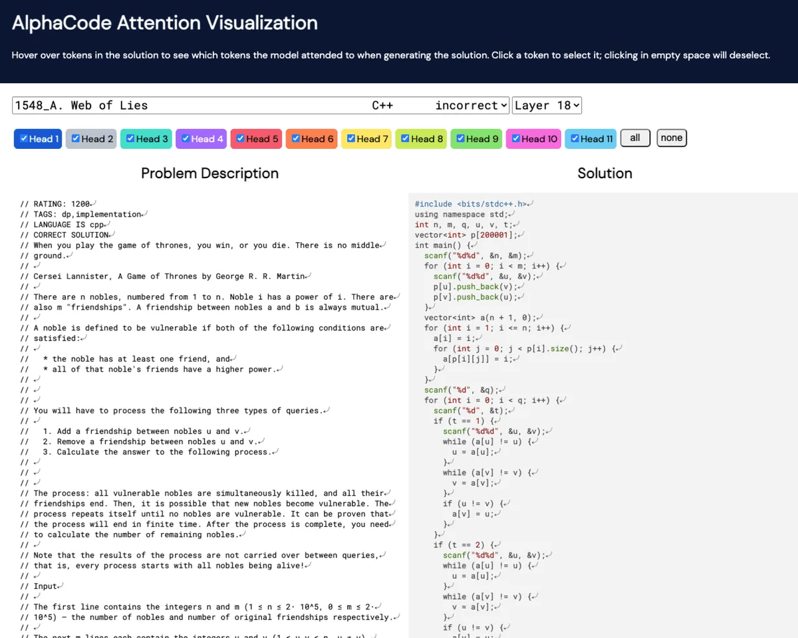

<head>
<meta http-equiv="Content-Type" content="text/html; charset=utf-8">
<link rel="stylesheet" type="text/css" href="bc.css">

</head>

<!---

- purge via performance advisor
  commennt https://thebuildingcoder.typepad.com/blog/2018/08/purge-unused-using-performance-adviser.html#comment-5716062022
  by Virone Lorenzo
  VB https://thebuildingcoder.typepad.com/blog/2018/08/purge-unused-using-performance-adviser.html#comment-5716062022
  by Matt Taylor, associate and CAD developer at [WSP](https://www.wsp.com)
  migrated by Ollie Green [OliverEGreen](https://github.com/OliverEGreen)
  C# https://github.com/OliverEGreen/CodeSamples/blob/master/PurgeRevitViaAPI.cs
  Python https://github.com/OliverEGreen/CodeSamples/blob/master/PurgeRevitViaAPI.py

- Kai Kasugai <kk@formitas.de> Re: eTransmit functionality

- Now Available: Autodesk Revit IFC Manual Version 2.0
  https://blogs.autodesk.com/revit/2022/02/09/now-available-revit-ifc-manual-version-2-0/
  The Autodesk Revit IFC Manual provides technical guidance for teams working with openBIM workflows. IFC is the basis for exchanging data between different applications through openBIM workflows for building design, construction, procurement, maintenance, and operation, within project teams and across software applications.  According to buildingSMART, IFC “is a standardized, digital description of the built environment, including buildings and civil infrastructure. It is an open, international standard, meant to be vendor-neutral, or agnostic, and usable across a wide range of hardware devices, software platforms, and interfaces for many different use cases.”
  Download version 2 of the manual here, available in 9 languages:    

- AI solves small human programming puzzles
  DeepMind says its new AI coding engine is as good as an average human programmer
  https://www.theverge.com/2022/2/2/22914085/alphacode-ai-coding-program-automatic-deepmind-codeforce

twitter:

A summary and a new, deeper look at Purge via Performance Advisor and eTransmit PurgeUnused functionality in DA4R in the #RevitAPI FormulaManager @AutodeskForge @AutodeskRevit #bim #DynamoBim #ForgeDevCon https://autode.sk/purgetransmit

Today, we return for a summary and a new, deeper look at a recurring topic
&ndash; eTransmit documentation
&ndash; Purge via performance advisor
&ndash; eTransmit functionality in DA4R
&ndash; Updated Autodesk Revit IFC manual
&ndash; AI solves programming tasks...

linkedin:

A summary and a new, deeper look at Purge via Performance Advisor and eTransmit PurgeUnused functionality in DA4R and the #RevitAPI

https://autode.sk/purgetransmit

- eTransmit documentation
- Purge via performance advisor
- eTransmit functionality in DA4R
- Updated Autodesk Revit IFC manual
- AI solves programming tasks...

#bim #DynamoBim #ForgeDevCon #Revit #API #IFC #SDK #AI #VisualStudio #Autodesk #AEC #adsk

the [Revit API discussion forum](http://forums.autodesk.com/t5/revit-api-forum/bd-p/160) thread

-->

### Purge Unused and eTransmit for DA4R

Today, let's return for a summary and a new, deeper look at a recurring topic:

- [eTransmit documentation](#2)
- [Purge via performance advisor](#3)
- [eTransmit functionality in DA4R](#4)
- [Updated Autodesk Revit IFC manual](#5)
- [AI solves programming tasks](#6)

#### eTransmit Documentation 

Lately, a number of questions were raised on eTransmit and 'purge unused', e.g., in
the [Revit API discussion forum](http://forums.autodesk.com/t5/revit-api-forum/bd-p/160) thread
on [eTransmit documentation](https://forums.autodesk.com/t5/revit-api-forum/etransmit-documentation/m-p/10949826):

**Question:** Is there documentation for `eTransmit`? 
I want to write a script to purge unused in files.

**Answer:** All I am aware of is what you can find in the online help and in the web in general:

- [help.autodesk.com/view/RVT/2022/ENU/?query=ETRANSMIT%20(Command)](https://help.autodesk.com/view/RVT/2022/ENU/?query=ETRANSMIT%20(Command))
- [duckduckgo.com/?q=etransmit+revit](https://duckduckgo.com/?q=etransmit+revit)

Here are some past suggestions for purging unused elements:

<ul>
<li><a href="http://thebuildingcoder.typepad.com/blog/2010/11/purge-unused-text-note-types.html">Purge unused text note types</a></li>
<li><a href="http://thebuildingcoder.typepad.com/blog/2013/03/determining-purgeable-elements.html">Determining purgeable elements</a></li>
<li><a href="https://thebuildingcoder.typepad.com/blog/2013/07/sydney-revit-api-training-and-vacation.html#5">Purge all zero-area rooms and spaces</a></li>
<li><a href="https://thebuildingcoder.typepad.com/blog/2017/04/forgefader-ui-lookup-builds-purge-and-room-instances.html#4">Purging types, families and materials</a></li>
<li><a href="http://thebuildingcoder.typepad.com/blog/2017/11/purge-and-detecting-an-empty-view.html">Purge and detecting an empty view</a></li>
<li><a href="http://thebuildingcoder.typepad.com/blog/2018/08/purge-unused-using-performance-adviser.html">Purge unused using Performance Adviser</a></li>
</ul>

#### Purge via Performance Advisor

Apparently, the last post in the list above is worthwhile pointing out again;
you can [purge unused using Performance Adviser](https://thebuildingcoder.typepad.com/blog/2018/08/purge-unused-using-performance-adviser.html),
as Virone Lorenzo also underlined in his [comment](https://thebuildingcoder.typepad.com/blog/2018/08/purge-unused-using-performance-adviser.html#comment-5716062022):

> WOAW this post is awesome, and it seems to work in Revit 2021 very well!
Thank you for the code and thanks to Ollie for publishing it in C#.
It's better than a PostableCommand.

Matt Taylor, associate and CAD developer at [WSP](https://www.wsp.com), provided the original implementation in VB.NET.
Ollie ported it to both C# and Python, saying:

> This is a massively underrated post!
Thanks to Matt for sharing and to Jeremy for spreading the knowledge!
I had a quick go at putting this together in C#.
There's also an IronPython version of more or less the same in
my [GitHub `CodeSamples` repository](https://github.com/OliverEGreen/CodeSamples/blob/master/PurgeRevitViaAPI.cs).
Feel free to edit / republish!

- [C#](https://github.com/OliverEGreen/CodeSamples/blob/master/PurgeRevitViaAPI.cs)
- [Python](https://github.com/OliverEGreen/CodeSamples/blob/master/PurgeRevitViaAPI.py)

Many thanks again to Matt and Ollie for providing this.

#### eTransmit Functionality in DA4R

Dr. Kai Kasugai of [Formitas AG](https://formitas.de) took
the task of purging a step further and implemented it for
the [Forge Design Automation for Revit API, DA4R](https://forge.autodesk.com/en/docs/design-automation/v3/developers_guide/overview),
based on the Dynamo `PurgeUnused` node:

**Question:** We are trying to implement the eTransmit functionality in DA4R, the Forge Design Automation API for Revit.

**Answer:** This might be another good instance of learning from the Dynamo for Revit code base, as there is
a [`PurgeUnused` node](https://github.com/DynamoDS/DynamoRevit/blob/f1165c9a629d9fcf8ccc7b5300c83cc37e5ea5ed/src/Libraries/RevitNodes/Application/Document.cs#L111-L130) in
Dynamo for Revit 2022.
It starts around line 110 in
the [module Document.cs](https://github.com/DynamoDS/DynamoRevit/blob/f1165c9a629d9fcf8ccc7b5300c83cc37e5ea5ed/src/Libraries/RevitNodes/Application/Document.cs).

Not sure how closely that follows the ETransmit code, or if it’s a viable option, but it's worth a review all the same.
 
**Response:** Thank you very much for the quick response.
That looks very relevant, as it includes a method to purge materials.

Later: some feedback on the integration of the Purge Code from the Dynamo for Revit code base: 
 
It really worked great and much faster than our previous attempts!
 
We tested it in a lot of scenarios, small and large files, and it always worked as expected.
 
This was a really important step for us, as this automation was one of the first that we integrated for our client and around 100 ACC users can now use that in the growing number of projects that we are currently moving from on-prem to ACC.

So, thank you very much.

As we derived most of the code from the source you provided, I am glad to share the few modifications that we made to make it work for us in Design Automation.

This code, as the DynamoRevit code, tries to delete all unused elements and materials from the document.
I think the main modification was to step out of the recursive loop once the purgeable element count does not change anymore.

This is a point that we are considering improving further, as the count itself might not have changed, but the purgeable element ids did change.

Here is a hopefully complete set of functions required to implement the functionality:

- [eTransmit.cs](zip/eTransmit_partial.cs.txt)

#### Updated Autodesk Revit IFC Manual

Hot off the press from the factory,
[Now Available: Autodesk Revit IFC Manual Version 2.0](https://blogs.autodesk.com/revit/2022/02/09/now-available-revit-ifc-manual-version-2-0):

> The Autodesk Revit IFC Manual provides technical guidance for teams working with openBIM workflows.
IFC is the basis for exchanging data between different applications through openBIM workflows for building design, construction, procurement, maintenance, and operation, within project teams and across software applications.
According to buildingSMART, IFC is <i>a standardized, digital description of the built environment, including buildings and civil infrastructure. It is an open, international standard, meant to be vendor-neutral, or agnostic, and usable across a wide range of hardware devices, software platforms, and interfaces for many different use cases.</i>
Download version 2 of the manual, available in 9 languages...

#### AI Solves Programming Tasks

An AI now solves small human programming puzzles:
[DeepMind says its new AI coding engine is as good as an average human programmer](https://www.theverge.com/2022/2/2/22914085/alphacode-ai-coding-program-automatic-deepmind-codeforce);
AlphaCode is good, but not great... not yet:

 <!-- 1984 -->

