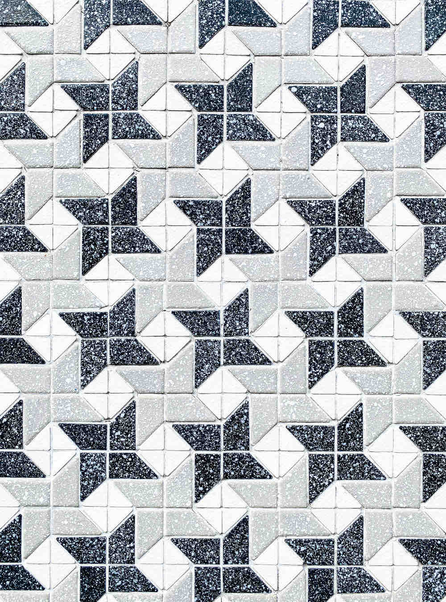

<head>
<meta http-equiv="Content-Type" content="text/html; charset=utf-8">
<link rel="stylesheet" type="text/css" href="bc.css">

</head>

<!---

- ACS Integration Partner Summit 2022
  https://forge.autodesk.com/blog/acs-integration-partner-summit-2022
  registration
  https://autodesk.registration.goldcast.io/events/636f754d-f617-4a4f-8fa9-38108c6f19d7

- maintain relationships copying elements
  PhaseCreated & PhaseDemolished after using CopyElements()
  https://forums.autodesk.com/t5/revit-api-forum/phasecreated-amp-phasedemolished-after-using-copyelements/m-p/10964247

- Unsplash
  https://unsplash.com
  Unsplash has over a million free high-resolution photos. Explore these popular photo categories on Unsplash. All photos here are free to download and use under the Unsplash License.

twitter:

&ndash; 
...

linkedin:

#bim #DynamoBim #ForgeDevCon #Revit #API #IFC #SDK #AI #VisualStudio #Autodesk #AEC #adsk

the [Revit API discussion forum](http://forums.autodesk.com/t5/revit-api-forum/bd-p/160) thread

-->

### ACS Summit and Copy Relationships

#### ACS Integration Partner Summit 2022
https://forge.autodesk.com/blog/acs-integration-partner-summit-2022
registration
https://autodesk.registration.goldcast.io/events/636f754d-f617-4a4f-8fa9-38108c6f19d7

#### Maintain Relationships Copying Elements

PhaseCreated & PhaseDemolished after using CopyElements()
https://forums.autodesk.com/t5/revit-api-forum/phasecreated-amp-phasedemolished-after-using-copyelements/m-p/10964247

the [Revit API discussion forum](http://forums.autodesk.com/t5/revit-api-forum/bd-p/160) thread

**Question:**

**Answer:** 

#### Unsplash with Free Images

I am a fan of open source, the creative commons license, free stuff, good will, sharing and learning together as a community.
Consequently, I share everything I can in public in the hope that it will come in useful for others as well and help make the world a better place.

In a similar vein, a colleague involved in community work pointed
out [Unsplash](https://unsplash.com):

> Unsplash has over a million free high-resolution photos grouped in popular photo categories.
All photos are free to download and use under
the [Unsplash License](https://unsplash.com/license).

 <!-- 1000 -->

