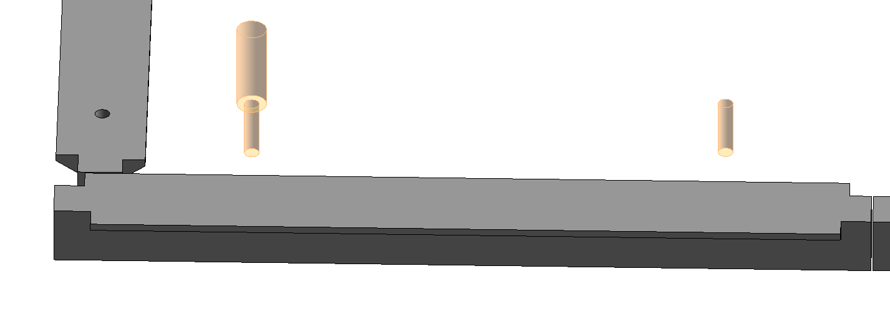

<head>
<meta http-equiv="Content-Type" content="text/html; charset=utf-8">
<link rel="stylesheet" type="text/css" href="bc.css">

</head>

<!---

twitter:

 the #RevitAPI @AutodeskForge @AutodeskRevit #bim #DynamoBim #ForgeDevCon 

&ndash; 
...

linkedin:

#bim #DynamoBim #ForgeDevCon #Revit #API #IFC #SDK #AI #VisualStudio #Autodesk #AEC #adsk

the [Revit API discussion forum](http://forums.autodesk.com/t5/revit-api-forum/bd-p/160) thread

-->

### Void in Family

#### Void in Family to Drill Hole

 <!-- 1427 -->

  Richard explains how to drill a hole in a beam using a void or an opening by face in a family definition in
  the r...
  on [How to create different unattached families to a .rft file without stacking it]()
  https://forums.autodesk.com/t5/revit-api-forum/how-to-create-different-unattached-families-to-a-rft-file/td-p/10934607
  [Q] I'm coding a tool to drill holes to beams (structural framing). Each beam will host 2 drills, one to each end of it.
To create my void extrusion that will cut the host I create an Arc at the coordinate (0, 0, 0) and extrude it in my "Metric Generic Model.rtf" located at "C:\ProgramData\Autodesk\RVT 2020\Family Templates\English" directory. Then I load the family into the document with the beams to be drilled and get the FamilySymbol like this:

  Family family = familyTemplateDoc.LoadFamily(doc);
  
  FamilySymbol familySymbol = family.GetFamilySymbolIds()
    .Select(x => doc.GetElement(x) as FamilySymbol)
    .FirstOrDefault();

In my document I insert the family instance using "doc.Create.NewFamilyInstance" ate the desired coordinate and finally AddInstanceVoidCut the beams.
I'm facing the following issue (I moved the voids up so we can see it easily):
mateuskomarchesqui_0-1644265722791.png
Apparently each time I extrude a new Arc I am stacking it (the thicker cylinder is above for visualisation, it would overwrite the thinner one).
The next beam to be drilled will keep stacking the void forms. So if I select 4 beams, the 8th hole will be done by the 8 void forms stacked.
What could I be doing wrong? The extrusion needs to be created at the (0, 0, 0) coordinate so it can be easily modified at the .rfa file, beeing easily found throughout the .rfa file.
Solved by RPTHOMAS108. Go to Solution.
Tags (0)
Add tags
Report
2 REPLIES 
Sort: 
MESSAGE 2 OF 3
RPTHOMAS108
Advisor RPTHOMAS108 in reply to: mateus.komarchesqui
‎2022-02-07 02:02 PM 
Sounds like a case of wrong type of family template and wrong NewFamilyInstance overload, there are easier ways to create holes in beams:
Use "Metric Generic Model face based.rft" cut the host with the void in the family.
Load the family into the project
Host the family on the beam web:
NewFamilyInstance(Face, XYZ, XYZ, FamilySymbol) or
NewFamilyInstance(Reference, XYZ, XYZ, FamilySymbol)
Note also there is no need to even create a family for this, you can create an opening by face:
Document.NewOpening
Tags (0)
Add tags
Report
MESSAGE 3 OF 3
mateus.komarchesqui
Explorer mateus.komarchesqui in reply to: RPTHOMAS108
‎2022-02-07 02:46 PM 
I wanted to use voids in order to learn it, I'm new at the API and I was overcomplicating the solution. It's kinda overkill what I was trying to do...
Switched up to Document.Create.NewOpening and it works like a charm! Thank you.

#### 

#### 

**Question:** 

**Answer 1:** 

**Response:** 

<pre class="code">
</pre>

