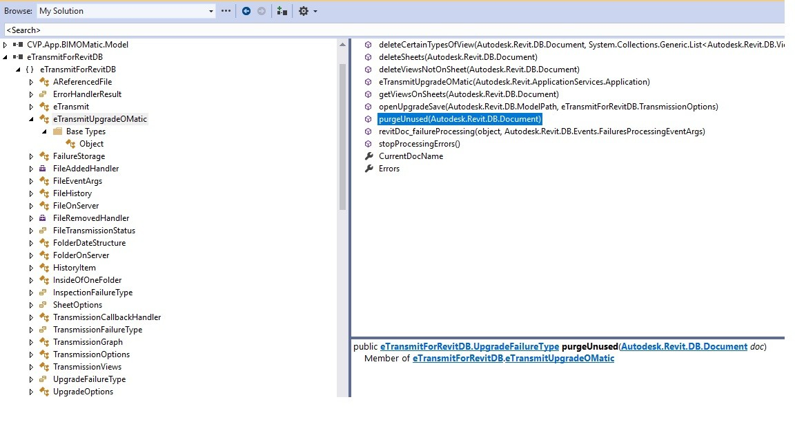
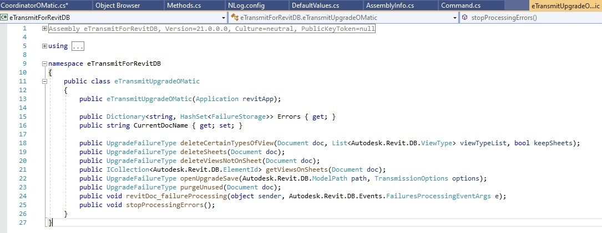
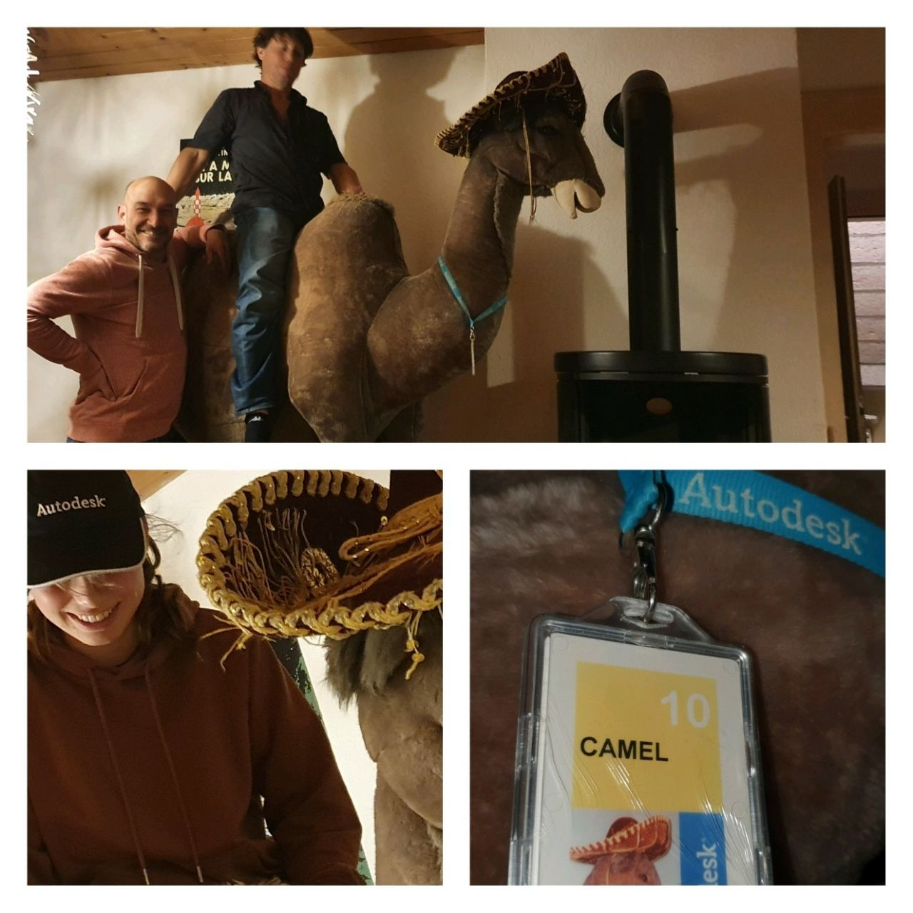

<head>
<meta http-equiv="Content-Type" content="text/html; charset=utf-8">
<link rel="stylesheet" type="text/css" href="bc.css">

</head>

<!---

- purge via API
  [comment](https://thebuildingcoder.typepad.com/blog/2022/02/purge-unused-and-etransmit-for-da4r.html#comment-5795043511)
  by Emiliano Capasso on 
  > just wanted to share our recent discovery (I'm pretty sure someone else was aware of it..) but in case
  [Why Revit "Purge"​ Command is an act of love (via API)](https://www.linkedin.com/pulse/why-revit-purge-command-act-love-via-api-emiliano-capasso)

- need advice on components to use for your Forge app?
  check out the [Node.js Reference Architecture](https://github.com/nodeshift/nodejs-reference-architecture) by IBM and Red Hat.

twitter:

Good news on programmatic purging using eTransmitForRevitDB.dll and the history of the venerable Autodesk Camel with the #RevitAPI @AutodeskForge @AutodeskRevit #bim #DynamoBim #ForgeDevCon https://autode.sk/purgeunused

We return to the topic of programmatic purging and learn the history and latest news about the venerable Autodesk Camel
&ndash; Purge unused using <code>eTransmitForRevitDB.dll</code>
&ndash; The Autodesk office Camel
&ndash; Node.js reference architecture...

linkedin:

Good news on programmatic purging using eTransmitForRevitDB.dll with the #RevitAPI

https://autode.sk/purgeunused

We return to the topic of programmatic purging and learn the history and latest news about the venerable Autodesk Camel:

- Purge unused using eTransmitForRevitDB.dll
- The Autodesk office Camel
- Node.js reference architecture...

#bim #DynamoBim #ForgeDevCon #Revit #API #IFC #SDK #AI #VisualStudio #Autodesk #AEC #adsk

the [Revit API discussion forum](http://forums.autodesk.com/t5/revit-api-forum/bd-p/160) thread

-->

### Purge Unused and the Autodesk Camel

We return once again to the topic of programmatic purging and learn the history and latest news about the venerable Autodesk Camel:

- [Purge unused using eTransmitForRevitDB.dll](#2)
    - [The Purge via API method](#2.1)
- [The Autodesk office Camel](#3)
- [Node.js reference architecture](#4)

#### Purge Unused using eTransmitForRevitDB.dll

Last month, we
discussed [several approaches to automating the purge command](https://thebuildingcoder.typepad.com/blog/2022/02/purge-unused-and-etransmit-for-da4r.html).

Now Emiliano Capasso,
Head of BIM at [Antonio Citterio Patricia Viel](https://www.citterio-viel.com),
shared an even better one,
explaining [why the Revit Purge​ command is an act of love](https://www.linkedin.com/pulse/why-revit-purge-command-act-love-via-api-emiliano-capasso),
or <i>Perché il comando "Purge" di Revit è un atto d'amore</i>:

I'm writing this hoping it will be useful for all BIM Managers, Head of BIMs, BIM Directors, etc. around the world.

The Life-Changing Magic of Tidying is the mantra of Marie Kondo, and the Japanese chain MUJI even published a book named “CLEANING” with hundreds of photos of cleaning activities all over the world.

An organised life is key and so why our models should be a mess?

Purging, cleaning the models is the key of maintaining a high-quality standard, and for us delivering state of the art BIM Models is the priority.

Messy models are problematic, all of our systems work around the clock with automations and data extractions to our BI dashboards to monitor KPI.
But as most of our architects are deeply caught in the design process and they forget to keep a tidy model, but our BIM department is here to help.

But with more than 40 active projects, how could we purge (3 times) manually every one of the 500ish models that we have?

#### The Purge via API Method

Tons of words have been spent about Purging in Revit via API, which is apparently impossible, cf.,
the [latest post on the topic](https://thebuildingcoder.typepad.com/blog/2022/02/purge-unused-and-etransmit-for-da4r.html)).

There are lots of workarounds, such as <b>PerformanceAdvisor</b> and <b>PostableCommand</b>, but none of which was satisfying me.

So I was wondering, how the marvellous <b>eTransmit</b> addin made by Autodesk is actually Purging the models whilst transmitting?

So I went looking into the folder, found the .dll and in our addin referenced the <b>eTransmitForRevitDB.dll</b> and looked into its <b>public</b> methods:

 <!-- 1152 -->

Wow.

Could that be so easy?

 <!-- 1085 -->

Yes.

Below the snippet:

<pre class="code">
  public bool Purge(Application app, Document doc)
  {
    eTransmitUpgradeOMatic eTransmitUpgradeOMatic
      = new eTransmitUpgradeOMatic(app);
      
    UpgradeFailureType result
      = eTransmitUpgradeOMatic.purgeUnused(doc);
      
    return (result == UpgradeFailureType.UpgradeSucceeded);
  }
</pre>

Just create an instance of `eTrasmitUpgradeOMatic` passing the `Application` and call its method `purgeUnused` passing the `Document`;
that will return an `UpgradeFailureType`.

Now you have your model purged (3 times also).

So satisfying.

Many thanks to Emiliano or his research and nice explanation!

#### The Autodesk Office Camel

Nicolas Menu and other colleagues from Neuchatel shared the story of the Autodesk office Camel on LinkedIn.

This is an important story, so I take the opportunity to preserve it here as well:

After many years at Autodesk European headquarter office in Neuchatel, Switzerland, the Camel (our office's mascot) moved tonight to the Swiss Siberia.

 <!-- 1280 -->

History...

- 1982 Autodesk, Mill Valley, Marin County, CA, USA
- 1991 Autodesk European Headquarters, Marin, Switzerland

From Marin County, to... Marin, Switzerland!

The office later moved a few km away to Neuchatel, and the camel remained in the new office as a mascott, a landmark.

- 2017... Autodesk European headquaters close and move to Dublin.

But The Camel didn't like it and decided to remain fidel and stay right here...

For about 5 years he stays with Coral and Francesco, and tonight it has find a new home... guess where :)

The Camel is now with our family in the coldest village of Switzerland... Long Life to the Camel!

Claudio Ombrella adds: Nice. Let me take the opportunity to share the story of the camel.
It was January 1993 when I joined the Marin, Switzerland office from Autodesk in Milano.
The Autodesk office was located at the first floor of the number 14b of the Av. Champs Montant.
All people driving to find the office did it from the West side: at the ground floor there a Persian carpet shop named <i>Tapis d'Orient</i>.
They had put a camel, better say <i>the camel</i> outside the office.
It quickly became the 'signpost' to arrive to the office: 'our entrance is by camel' used to say our colleague Sheila Ahles to any visitor needing instructions.

One day the shop closed and the camel became orphan.
But not for so long, because Autodesk employees pulled the camel into the office.
And it became the mascot with its own badge that was regularly reprinted at every company logo change!

In 1994 we moved to the Puits Godet office and the camel moved too.
With the years it deteriorated a bit and then Bodo Vahldieck loaded on his VW Multivan and took it home for a complete restore.
Then it came back to the office in perfect shape.

In 2015 my team opened a job and a young person applied for it, so we invited for an on-site interview.
When the person saw the camel he said to me: “and you have the camel? I am the son of the shop Tapis d’Orient, I am so surprised to see it again”.

Thank you, Nicolas, for giving a new life to our old friend, the camel.

John C.: The camel was first on the list of assets to be moved from Marin to Puits-Godet!
Thanks for bringing such good memories! 

Lisa Senauke: James Carrington and I arrived when the Marin office had just opened and we were among the first 5 or 6 to arrive
&ndash; Kern (and John Walker) Hans, Sheila, James, and I &ndash; who else? Creighton?
When we were campaigning to be chosen to work in Switzerland, one of my proudest moments was when Hansi said to me, while I was pondering if we would get to go, and if there would be a job for me as well.
Hans looked at me and said, "Lisa, where I go, YOU go!" 🥰 And I did!
The Camel was standing proud and tall by the entrance of the building, welcoming us to our new home!
For me, it was a Jungian peak experience!

Raquel Aragonés: I had completely forgotten about the camel.
I was there from 1992-3 to 1997!
Long live the camel!

#### Node.js Reference Architecture

Moving from the desktop to the cloud, could you use some advice on which components to employ for your Forge app?

Or are you working with other cloud applications and confounded by the plethora of available libraries?

Maybe the [Node.js Reference Architecture](https://github.com/nodeshift/nodejs-reference-architecture) by
IBM and Red Hat will help make a well-founded decision.
