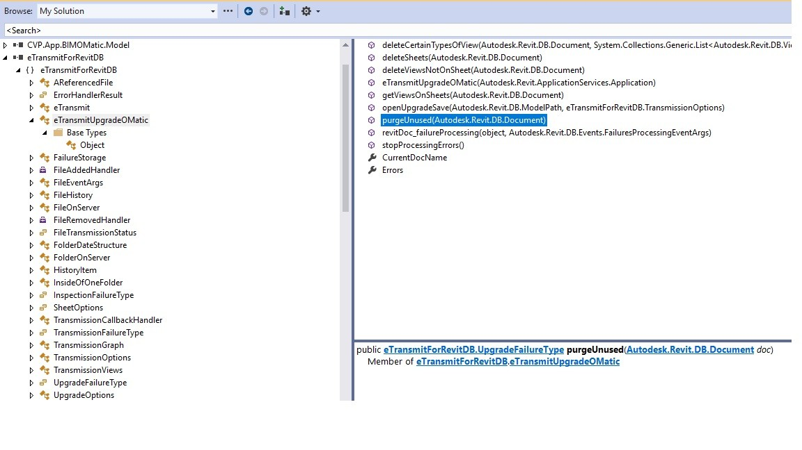

<head>
<meta http-equiv="Content-Type" content="text/html; charset=utf-8">
<link rel="stylesheet" type="text/css" href="bc.css">

</head>

<!---

- Disable error with 'Error' severity
  https://forums.autodesk.com/t5/revit-api-forum/disable-error-with-error-severity/m-p/11004220

- purge via API
  [comment](https://thebuildingcoder.typepad.com/blog/2022/02/purge-unused-and-etransmit-for-da4r.html#comment-5795043511)
  by Emiliano Capasso on 
  > just wanted to share our recent discovery (I'm pretty sure someone else was aware of it..) but in case
  [Why Revit "Purge"​ Command is an act of love (via API)](https://www.linkedin.com/pulse/why-revit-purge-command-act-love-via-api-emiliano-capasso)

- need advice on components to use for your Forge app?
  check out the [Node.js Reference Architecture](https://github.com/nodeshift/nodejs-reference-architecture) by IBM and Red Hat.

twitter:

the #RevitAPI @AutodeskForge @AutodeskRevit #bim #DynamoBim #ForgeDevCon 

&ndash; 
...

linkedin:

#bim #DynamoBim #ForgeDevCon #Revit #API #IFC #SDK #AI #VisualStudio #Autodesk #AEC #adsk

the [Revit API discussion forum](http://forums.autodesk.com/t5/revit-api-forum/bd-p/160) thread

-->

### Disable Failure with Error Severity

#### 

Alexander [@aignatovich](https://forums.autodesk.com/t5/user/viewprofilepage/user-id/1257478) [@CADBIMDeveloper](https://github.com/CADBIMDeveloper) Ignatovich, aka Александр Игнатович, adds:

 tomerFUNPJ 184 Views, 23 Replies
‎2022-03-13 06:38 AM 
Disable error with 'Error' severity
Hello,

 

I have a specific failure that I want to disable.

I'm able to 'catch' the error (With FailuresProcessing event).

The problem is that I can't find a way to disable / delete the error.

DeleteWarning only works for 'Warning' severity, and my failure is 'Error' severity.

 

Thanks in advance!

 Solved by aignatovich. Go to Solution.

Tags (0)
Add tags
Report
23 REPLIES 
Sort: 
MESSAGE 2 OF 24
jeremy.tammik
 Employee jeremy.tammik in reply to: tomerFUNPJ
‎2022-03-13 09:30 AM 
How do you handle the situation manually in the end user interface? Please note that the Revit API almost always just duplicates or provides access to the standard UI functionality.

  

Jeremy Tammik,  Developer Advocacy and Support, The Building Coder, Autodesk Developer Network, ADN Open
Tags (0)
Add tags
Report
MESSAGE 3 OF 24
tomerFUNPJ
 Enthusiast tomerFUNPJ in reply to: tomerFUNPJ
‎2022-03-13 09:36 AM 
I'd click 'Cancel' on the popup message (It's the message that warns that deleting a part will cause other parts to be deleted).

My goal is to not show this error.. I'm cancelling the operation itself by posting another failure message saying "operation was cancelled" but the warning of 'deleting part will cause other part to be deleted' is still shown

Tags (0)
Add tags
Report
MESSAGE 4 OF 24
jeremy.tammik
 Employee jeremy.tammik in reply to: tomerFUNPJ
‎2022-03-13 09:52 AM 
Yes, well if you click cancel, then the operation is aborted, isn't it?

 

I would assume that Revit absolutely refuses to perform this operation, because it would corrupt the entire BIM.

 

In the UI you have to cancel it, and in the API the same.

   

A warning is a warning and is permissible. An error is an error and is forbidden.

   

Or am I misunderstanding?

  

Jeremy Tammik,  Developer Advocacy and Support, The Building Coder, Autodesk Developer Network, ADN Open
Tags (0)
Add tags
Report
MESSAGE 5 OF 24
tomerFUNPJ
 Enthusiast tomerFUNPJ in reply to: jeremy.tammik
‎2022-03-13 01:15 PM 
Of course.
Revit doesn't refuse. I can also click "Delete" and it'll delete the part (and the associated parts as well). Nothing will be corrupt.

My goal is to not show this error message from the start. I am eventually not performing the deletion (I'm blocking it with creating my own error using FailuresProcessing as I mentioned before). So I want to prevent from this error to appear in the first place..
Tags (0)
Add tags
Report
MESSAGE 6 OF 24
jeremy.tammik
 Employee jeremy.tammik in reply to: tomerFUNPJ
‎2022-03-14 12:37 AM 
Sorry, I do not understand. If you want to delete the element causing the error, why don't you just delete it? Then, no error will be caused. You can see how lost I am here...

 

However, regardless of whether I understand or not, maybe the previous discussions of the Failure API functionality and usage will help solve the issue?

 

https://thebuildingcoder.typepad.com/blog/about-the-author.html#5.32

   

Or previous discussions here in the forum?

 

Or maybe even the warning swallower?

 

https://forums.autodesk.com/t5/revit-api-forum/failure-processing-warnings-swallower-only-for-specif...

  

Jeremy Tammik,  Developer Advocacy and Support, The Building Coder, Autodesk Developer Network, ADN Open
Tags (0)
Add tags
Report
MESSAGE 7 OF 24
aignatovich
 Advisor aignatovich in reply to: jeremy.tammik
‎2022-03-14 12:52 AM 
Hi guys,

 

@tomerFUNPJ , I think, you could try to either resolve the failure or rollback transaction?

 

If so you could try to delete elements automatically in your failure preprocessor:

 

if (failureAccessor.HasResolutionOfType(FailureResolutionType.DeleteElements))
{
    failureAccessor.SetCurrentResolutionType(FailureResolutionType.DeleteElements);
    failuresAccessor.ResolveFailure(failureAccessor);
}
 

You should return FailureProcessingResult.ProceedWithCommit if you set resolution type.

 

This failure preprocessor solves a bit different task, but I think it could help you:

    public class AutoDetachOrDeleteFailurePreprocessor : IFailuresPreprocessor
    {
        public FailureProcessingResult PreprocessFailures(FailuresAccessor failuresAccessor)
        {
            var preprocessorMessages = failuresAccessor.GetFailureMessages(FailureSeverity.Error)
                .Union(failuresAccessor.GetFailureMessages(FailureSeverity.Warning))
                .Where(x => x.HasResolutionOfType(FailureResolutionType.DeleteElements) || x.HasResolutionOfType(FailureResolutionType.DetachElements))
                .ToList();

            if (preprocessorMessages.Count == 0)
                return FailureProcessingResult.Continue;

            foreach (var failureAccessor in preprocessorMessages)
            {
                failureAccessor.SetCurrentResolutionType(failureAccessor.HasResolutionOfType(FailureResolutionType.DetachElements) ? FailureResolutionType.DetachElements : FailureResolutionType.DeleteElements);

                failuresAccessor.ResolveFailure(failureAccessor);
            }

            return FailureProcessingResult.ProceedWithCommit;
        }
    }
 

If you can't resolve the error with FailureResolutionType.DeleteElements, then you can return FailureProcessingResult.ProceedWithRollBack

 

In such case you have to set:

failureOptions.SetClearAfterRollback(true);
for your transaction.

 

Hope this helps

Tags (0)
Add tags
Report
MESSAGE 8 OF 24
tomerFUNPJ
 Enthusiast tomerFUNPJ in reply to: jeremy.tammik
‎2022-03-14 01:48 AM 
I'll explain my flow with more details:

- I'm successfully preventing the users from deleting parts that have a specific scheme I made

- No deletion is done whatsoever. Which is good - that was my goal

- Although no deletion is done, the user still get this warning:

 

I want to hide it because it can be confusing to my user. The problem is that - The severity of this message is 'Error' and not warning and therefore I can't use Failure Accessor 'DeleteWarning' method.

So my question is - Is is possible to prevent showing failures of 'Error' severity?

Untitled.png

Thanks

Tags (0)
Add tags
Report
MESSAGE 9 OF 24
aignatovich
 Advisor aignatovich in reply to: tomerFUNPJ
‎2022-03-14 03:33 AM 
Failures with "Error" severity could not be "swallowed". They should be resolved using some resolution type (if supported) or by transition rollback. If the transition is rolled back and you don't want to see messages in the UI, you should set clear after rollback transition option

Tags (0)
Add tags
Report
MESSAGE 10 OF 24
aignatovich
 Advisor aignatovich in reply to: aignatovich
‎2022-03-14 05:08 AM 
Transactions of course, not transitions.... T9, sorry

Tags (0)
Add tags
Report
MESSAGE 11 OF 24
tomerFUNPJ
 Enthusiast tomerFUNPJ in reply to: aignatovich
‎2022-03-14 05:24 AM 
I tried returning ProceedWithCommit but the error still seems to appear 😞
Although I think I'm getting close
Tags (0)
Add tags
Report
MESSAGE 12 OF 24
tomerFUNPJ
 Enthusiast tomerFUNPJ in reply to: aignatovich
‎2022-03-14 05:42 AM 
But there's nothing to rollback because the transaction (deletion) didn't happen yet. That's what error warns me from.. I'm trying to return ProceedWithCommit / Continue and still no success..
Tags (0)
Add tags
Report
MESSAGE 13 OF 24
tomerFUNPJ
 Enthusiast tomerFUNPJ in reply to: tomerFUNPJ
‎2022-03-14 06:01 AM 
This is my PreprocessFailures

I'm getting in the for loop, and inside my if statement. And of course - returning ProceedWithRollback. The error still appears..

public FailureProcessingResult PreprocessFailures(FailuresAccessor failuresAccessor)
        {
            IList<FailureMessageAccessor> failList = new List<FailureMessageAccessor>();
            failList = failuresAccessor.GetFailureMessages(); // Inside event handler, get all warnings

            foreach (FailureMessageAccessor failure in failList)
            {
                FailureDefinitionId failID = failure.GetFailureDefinitionId();
                if (failID == BuiltInFailures.DPartFailures.DeletingDPartWillDeleteMorePartsError)
                {
                    failure.SetCurrentResolutionType(FailureResolutionType.Default);
                    failuresAccessor.ResolveFailure(failure);
                    failuresAccessor.GetFailureHandlingOptions().SetClearAfterRollback(true);
                    return FailureProcessingResult.ProceedWithRollBack;
                }
            }

            return FailureProcessingResult.Continue;
        }
Tags (0)
Add tags
Report
MESSAGE 14 OF 24
aignatovich
 Advisor aignatovich in reply to: tomerFUNPJ
‎2022-03-14 07:22 AM 
From SDK (FailureResolutionType):

Default - Special (reserved) type. It cannot be used as a type when defining a resolution, but can be used as a key to query default resolution from FailureMessage or FailureDefinition.

 

I don't think you have to call "ResolveFailure" if you want to rollback the transaction

I would try to set "clear after rollback" through transaction options before starting the transaction, e.g.:

 

 

var failureOptions = transaction.GetFailureHandlingOptions();
failureOptions.SetClearAfterRollback(true);
...
transaction.SetFailureHandlingOptions(failureOptions);
transaction.Start();
 

 

Tags (0)
Add tags
Report
MESSAGE 15 OF 24
tomerFUNPJ
 Enthusiast tomerFUNPJ in reply to: aignatovich
‎2022-03-14 07:30 AM 
But I'm not starting any transaction.. 🙂 At any point
This method is triggered by the user - When he tries to delete an element (that's what I want). I'm preventing the user from deleting the element (Raising a different error saying "Operation is cancelled".)
I just don't want to get the error I attached in the picture a few comments above..

Tags (0)
Add tags
Report
MESSAGE 16 OF 24
aignatovich
 Advisor aignatovich in reply to: tomerFUNPJ
‎2022-03-14 07:48 AM 
Do you use

Application.RegisterFailuresProcessor
method?

 

I personally would suggest to avoid this...

From SDK:

Replaces Revit's default user interface (if present) with alternative handling for all warnings and errors (including those not generated by your application) for the rest of the Revit session; if your application is not prepared to respond to all warnings and errors, consider use of IFailuresPreprocessor (in your opened Transaction) or the FailuresProcessing event instead of this interface.
 
I think a better idea would be to subscribe to Application.FailuresProcessing event.
 
Then - yes, set "clear after rollback" as you did
Tags (0)
Add tags
Report
MESSAGE 17 OF 24
tomerFUNPJ
 Enthusiast tomerFUNPJ in reply to: aignatovich
‎2022-03-14 07:51 AM 
I am registered to FailuresProcessing 🙂

uiControlledApplication.ControlledApplication.FailuresProcessing += ControlledApplication_FailuresProcessing;
 And it still shows the error..

Tags (0)
Add tags
Report
MESSAGE 18 OF 24
tomerFUNPJ
 Enthusiast tomerFUNPJ in reply to: tomerFUNPJ
‎2022-03-14 07:53 AM 
I am also using IFailuresPreprocessor:

public class FailuresPreProcessor : IFailuresPreprocessor
    {
        public FailureProcessingResult PreprocessFailures(FailuresAccessor failuresAccessor)
        {
            IList<FailureMessageAccessor> failList = new List<FailureMessageAccessor>();
            failList = failuresAccessor.GetFailureMessages(); // Inside event handler, get all warnings

            foreach (FailureMessageAccessor failure in failList)
            {
                FailureDefinitionId failID = failure.GetFailureDefinitionId();
                if (failID == BuiltInFailures.DPartFailures.DeletingDPartWillDeleteMorePartsError)
                {
                    failure.SetCurrentResolutionType(FailureResolutionType.Others);
                    
                    failuresAccessor.GetFailureHandlingOptions().SetClearAfterRollback(true);
                    failuresAccessor.ResolveFailure(failure);
                    return FailureProcessingResult.ProceedWithRollBack;
                }
            }

            return FailureProcessingResult.Continue;
        }
    }
Thanks so much for trying to help. I appreciate it! 

Tags (0)
Add tags
Report
MESSAGE 19 OF 24
aignatovich
 Advisor aignatovich in reply to: tomerFUNPJ
‎2022-03-14 10:15 AM 
I guess you should pick one. Have you tried to remove ResolveFailure and left only

return FailureProcessingResult.ProceedWithRollBack;
?

Tags (0)
Add tags
Report
MESSAGE 20 OF 24
tomerFUNPJ
 Enthusiast tomerFUNPJ in reply to: aignatovich
‎2022-03-15 12:44 AM 
What do you mean by 'pick one'?

I tried to return ProceedWithRollBack and removing ResolveFailure - didn't help.. 😞
Tags (0)
Add tags
Report
MESSAGE 21 OF 24
aignatovich
 Advisor aignatovich in reply to: tomerFUNPJ
‎2022-03-15 04:01 AM 
Pick one - choose either application level failure processor (as for me - it's a bad choice) or failure processing event.

 

Could you prepare a simple reproducible case: addin + model + what to do to reproduce?

Tags (0)
Add tags
Report
MESSAGE 22 OF 24
tomerFUNPJ
 Enthusiast tomerFUNPJ in reply to: aignatovich
‎2022-03-15 04:15 AM 
Yep, I'm using failure processing event.

I am doing multiple things but let's focus only on the problem:
The goal is this - When the user tries to delete a part (That was created in the past by my code and has a scheme I made), raise a popup saying he can't do that and block the deletion. I am doing that successfully!
In addition to blocking the deletion, I don't want the error message I attached yesterday to be shown, so there won't be a confusion.

 

To block the deletion I have a class which inherits from IUpdater and uses a FailureDefinition GUID that I registered when Revit loads:

public class SplitElementUpdater : IUpdater
    {
        static AddInId m_appId;
        static UpdaterId m_updaterId;

        /// 

        /// Finds the failure definition id based on a constant GUID
        /// 

        /// <returns></returns>
        private static FailureDefinitionId GetFailureDefinitionId()
        {
            FailureDefinitionRegistry failureDefinitionRegistry = Autodesk.Revit.ApplicationServices.Application.GetFailureDefinitionRegistry();
            FailureDefinitionId FailureDefinitionId = new FailureDefinitionId(FailureDefinitionIdGuid.Value);
            return failureDefinitionRegistry.FindFailureDefinition(FailureDefinitionId).GetId();
        }

        public FailureDefinitionId _failureId = GetFailureDefinitionId();

        // constructor takes the AddInId for the add-in associated with this updater
        public SplitElementUpdater(AddInId id)
        {
            m_appId = id;
            m_updaterId = new UpdaterId(m_appId, Guid.NewGuid());
        }

        public void Execute(UpdaterData data)
        {
            try
            {
                Document doc = data.GetDocument();
                ICollection<ElementId> changedElements = data.GetModifiedElementIds().Concat(data.GetDeletedElementIds()).ToList();

                DialogResult userResult = MessageBox.Show(
                    "You are trying to edit a part which was divided by an automation tool. To edit this part, first revert the division, then edit the part normally. Do you wish to open the “Surface Split” tool?",
                    "", MessageBoxButtons.OKCancel);
                if (userResult.Equals(DialogResult.OK))
                {
                    RevitDBUtils.InitializeStaticUtils(doc, RevitDBUtils.uidoc, RevitDBUtils.uiapp, RevitDBUtils.dllFolder, eDiscipline.Architectural);
                    RevitDBUtils.ExecuteMethodInEvent(() =>
                    {
                        SurfaceSplitTabsWindow window = new SurfaceSplitTabsWindow(1);
                        window.Show();
                    }, "Open Revert Surface Split window");
                }
                // Create a failure message that will cancel the operation
                FailureMessage failureMessage = new FailureMessage(_failureId);

                failureMessage.SetFailingElements(changedElements);

                doc.PostFailure(failureMessage);
            }
            catch
            {
            }
        }

        public string GetAdditionalInformation()
        {
            return "Surface Split Updater for preventing modifying elements divided by Surface Split";
        }

        public ChangePriority GetChangePriority()
        {
            return ChangePriority.FreeStandingComponents;
        }

        public UpdaterId GetUpdaterId()
        {
            return m_updaterId;
        }

        public string GetUpdaterName()
        {
            return "Surface Split Updater";
        }
    }
 

This class works as expected and blocks the deletion, I'm setting up the trigger here:

public static UpdaterId SurfaceSplitElementUpdaterSetup(AddInId addinId, Document doc)
        {
            SplitElementUpdater splitUpdater = new SplitElementUpdater(addinId);//Create a surface split updater for alerting on modified divided elements

            UpdaterRegistry.RegisterUpdater(splitUpdater);//register the updater
            UpdaterRegistered = true;
            // Creating filters for the updater:

            ElementMulticategoryFilter catFilter = new ElementMulticategoryFilter(new List<BuiltInCategory> { BuiltInCategory.OST_Parts });//Create categories filter

            ExtensibleStorageFilter extensibleStorageFilter = new ExtensibleStorageFilter(SplitFlag.GetGuid());
            //Create extensible storage filter of elements with the Surface split Element Info Guid

            LogicalAndFilter bothFilters = new LogicalAndFilter(catFilter, extensibleStorageFilter);//combine both filters to a single filter

            ChangeType elementDeletion = Element.GetChangeTypeElementDeletion();//the change type of an element deletion
            ChangeType geometryChange = Element.GetChangeTypeGeometry();//the change type of a geometry change

            UpdaterId updaterId = splitUpdater.GetUpdaterId();

            //We want to trigger when changing some of the params:
            List<Parameter> parameters = new List<Parameter>();
            parameters.Add(GetPanelIDUtils.GetPanelIdParameter(doc));
            parameters.Add(GetFromDocUtils.GetParameter(ParametersConstants.FACTORY, doc));
            parameters.Add(GetFromDocUtils.GetParameter(ParametersConstants.MATERIAL, doc));
            parameters.Add(GetFromDocUtils.GetParameter(BuiltInParameter.ROOF_BASE_LEVEL_PARAM, doc));

            foreach (Parameter parameter in parameters)
            {
                if (parameter != null)
                {
                    ChangeType paramChange = Element.GetChangeTypeParameter(parameter);
                    UpdaterRegistry.AddTrigger(updaterId, bothFilters, paramChange);
                }
            }

            // add the triggers for the updater
            
            UpdaterRegistry.AddTrigger(updaterId, bothFilters, elementDeletion);
            UpdaterRegistry.AddTrigger(updaterId, bothFilters, geometryChange);

            return splitUpdater.GetUpdaterId();
        }
All of this is fine!

 

And now, the problem 🙂

We know we can't swallow the error because it's of 'error' severity, but I'm unable to resolve it as well (Tried with / without resolve failure, tried proceed with commit and continue, nothing worked)

public FailureProcessingResult PreprocessFailures(FailuresAccessor failuresAccessor)
        {
            IList<FailureMessageAccessor> failList = new List<FailureMessageAccessor>();
            failList = failuresAccessor.GetFailureMessages(); // Inside event handler, get all warnings

            foreach (FailureMessageAccessor failure in failList)
            {
                FailureDefinitionId failID = failure.GetFailureDefinitionId();
                if (failID == BuiltInFailures.DPartFailures.DeletingDPartWillDeleteMorePartsError)
                {
                    failure.SetCurrentResolutionType(FailureResolutionType.Default);
                    failuresAccessor.GetFailureHandlingOptions().SetClearAfterRollback(true);
                    //failuresAccessor.ResolveFailure(failure);
                    TransactionStatus a = failuresAccessor.RollBackPendingTransaction();
                    return FailureProcessingResult.ProceedWithRollBack;
                }
            }

            return FailureProcessingResult.Continue;
        }
 

Thank you!

Tags (0)
Add tags
Report
MESSAGE 23 OF 24
aignatovich
 Advisor aignatovich in reply to: tomerFUNPJ
‎2022-03-15 07:30 AM 
Try something like that:

 

public class RevitApplication : IExternalApplication
{
	private SyntheticFailureReplacement failureReplacement;

	public Result OnStartup(UIControlledApplication application)
	{
		failureReplacement = new SyntheticFailureReplacement();

		application.ControlledApplication.FailuresProcessing += ControlledApplicationOnFailuresProcessing;

		return Result.Succeeded;
	}

	public Result OnShutdown(UIControlledApplication application)
	{
		application.ControlledApplication.FailuresProcessing -= ControlledApplicationOnFailuresProcessing;

		return Result.Succeeded;
	}

	private void ControlledApplicationOnFailuresProcessing(object sender, FailuresProcessingEventArgs e)
	{
		var failuresAccessor = e.GetFailuresAccessor();

		var failureMessages = failuresAccessor
			.GetFailureMessages(FailureSeverity.Error)
			.Where(x => x.GetFailureDefinitionId() == BuiltInFailures.DPartFailures.DeletingDPartWillDeleteMorePartsError)
			.ToList();
		
		if (failureMessages.Any())
		{
			var failureHandlingOptions = failuresAccessor.GetFailureHandlingOptions();

			failureHandlingOptions.SetClearAfterRollback(true);

			failuresAccessor.SetFailureHandlingOptions(failureHandlingOptions);

			e.SetProcessingResult(FailureProcessingResult.ProceedWithRollBack);

			failureReplacement.PostFailure(failureMessages.SelectMany(x => x.GetFailingElementIds()));
		}
	}
}

public class SyntheticFailureReplacement : IExternalEventHandler
{
	private readonly ExternalEvent externalEvent;
	private readonly List<ElementId> failingElementIds = new List<ElementId>();
	private readonly FailureDefinitionId failureDefinitionId = new FailureDefinitionId(new Guid("bc0dc2ef-d928-42e4-9c9b-521cb822d3fd"));

	public SyntheticFailureReplacement()
	{
		externalEvent = ExternalEvent.Create(this);

		FailureDefinition.CreateFailureDefinition(failureDefinitionId, FailureSeverity.Warning, "My accurate message replacement");
	}

	public void PostFailure(IEnumerable<ElementId> failingElements)
	{
		failingElementIds.Clear();
		failingElementIds.AddRange(failingElements);

		externalEvent.Raise();
	}

	public void Execute(UIApplication app)
	{
		var document = app.ActiveUIDocument.Document;

		using (var transaction = new Transaction(document, "auxiliary transaction"))
		{
			var failureHandlingOptions = transaction.GetFailureHandlingOptions();
			failureHandlingOptions.SetForcedModalHandling(false);

			transaction.SetFailureHandlingOptions(failureHandlingOptions);
			
			transaction.Start();

			var failureMessage = new FailureMessage(failureDefinitionId);

			failureMessage.SetFailingElements(failingElementIds);
			
			document.PostFailure(failureMessage);

			transaction.Commit();
		}
	}

	public string GetName() => nameof(SyntheticFailureReplacement);
}
Tags (0)
Add tags
Report
MESSAGE 24 OF 24
tomerFUNPJ
 Enthusiast tomerFUNPJ in reply to: aignatovich
‎2022-03-15 08:47 AM 
Worked like a charm. Thanks!

**Question :** 

<pre class="code">
</pre>

**Answer:** 

**Response:** 

#### Purge Unused using eTransmitForRevitDB.dll

Last montch, we discussed several approaches to automating the purge command.

Now Emiliano Capasso, Head of BIM at [ANTONIO CITTERIO PATRICIA VIEL](https://www.citterio-viel.com),
shared an even better one,
explaining [why the Revit Purge​ command is an act of love](https://www.linkedin.com/pulse/why-revit-purge-command-act-love-via-api-emiliano-capasso),
<i>Perché il comando "Purge" di Revit è un atto d'amore</i>:

I'm writing this hoping it will be useful for all BIM Managers, Head of BIMs, BIM Directors, etc. around the world.

The Life-Changing Magic of Tidying is the mantra of Marie Kondo, and the Japanese chain MUJI even published a book named “CLEANING” with hundreds of photos of cleaning activities all over the world.

An organised life is key and so why our models should be a mess?

Purging, cleaning the models is the key of maintaining a high-quality standard, and for us delivering state of the art BIM Models is the priority.

Messy models are problematic, all of our systems work around the clock with automations and data extractions to our BI dashboards to monitor KPI.
But as most of our architects are deeply caught in the design process and they forget to keep a tidy model, but our BIM department is here to help.

But with more than 40 active projects, how could we purge (3 times) manually every one of the 500ish models that we have?

#### The Purge via API Method

Tons of words have been spent about Purging in Revit via API, which is apparently impossible, cf.,
the [latest post on the topic](https://thebuildingcoder.typepad.com/blog/2022/02/purge-unused-and-etransmit-for-da4r.html)).

There are lots of workarounds, such as <b>PerformanceAdvisor</b> and <b>PostableCommand</b>, but none of which was satisfying me.

So I was wondering, how the marvellous <b>eTransmit</b> addin made by Autodesk is actually Purging the models whilst transmitting?

So I went looking into the folder, found the .dll and in our addin referenced the <b>eTransmitForRevitDB.dll</b> and looked into its <b>public</b> methods:

 <!-- 1152 -->

Wow.

Could that be so easy?

 <!-- 1085 -->

Yes.

Below the snippet:

<pre class="code">
  public bool Purge(Application app, Document doc)
  {
    eTransmitUpgradeOMatic eTransmitUpgradeOMatic
      = new eTransmitUpgradeOMatic(app);
      
    UpgradeFailureType result
      = eTransmitUpgradeOMatic.purgeUnused(doc);
      
    return (result == UpgradeFailureType.UpgradeSucceeded);
  }
</pre>

Just create an instance of `eTrasmitUpgradeOMatic` passing the `Application` and call the method `purgeUnused` passing the `Document`; that will return an `UpgradeFailureType`.

Now you have your model purged (3 times also).

So satisfying.

Many thanks to Emiliano or his research and nice explanation!

#### The Autodesk Office Camel

Nicolas Menu and other colleagues from Neuchatel shared the story of the Autodesk office Camel on LinkedIn.

This is an important story, so I take the opportunity to preserve it here as well:

After many years at Autodesk European Headquaters 's office in Neuchatel, Switzerland, the Camel (our office's mascot) moved tonight to the Swiss Siberia.

 <!-- 1280 -->

History...

- 1982, Autodesk, Mill Valley, Marin County, CA, USA
- 1991 Autodesk european headquarters Marin, Switzerland

From Marin County, to ...Marin, Switzerland !

The office later moved a few km away to Neuchatel, Switzerland, but the camel remained within the new office as a mascott, a landmark.

- 2017... Autodesk european headquaters close and move to Dublin.

But The Camel didn't like it and decided to remain fidel and stay right here...

For about 5 years he stays with Coral an Francesco, and tonight it has find a new home.. guess where :)

The Camel is now with our family in the coldest village of switzerland... Long Life to the Camel!

Claudio Ombrella adds: Nice. Let me take the opportunity to share the story of the camel.
It was January 1993 when I joined the Marin, Switzerland office from Autodesk in Milano.
The Autodesk office was located at the first floor of the number 14b of the Av. Champs Montant.
All people driving to find the office did it from the West side: at the ground floor there a Persian carpet shop named <i>Tapis d'Orient</i>.
They had put a camel, better say <i>the camel</i> outside the office.
It quickly became the 'signpost' to arrive to the office: 'our entrance is by camel' used to say our colleague Sheila Ahles to any visitor needing instructions.

One day the shop closed and the camel became orphan.
But not for so long, because Autodesk employees pulled the camel into the office.
And it became the mascot with its own badge that was regularly reprinted at every company logo change!

In 1994 we moved to the Puits Godet office and the camel moved too.
With the years it deteriorated a bit and then Bodo Vahldieck loaded on his VW Multivan and took it home for a complete restore.
Then it came back to the office in perfect shape.

In 2015 my team opened a job and a young person applied to it so we invited for an on-site interview.
When the person saw the camel he said to me: “and you have the camel? I am the son of the shop Tapis d’Orient, I am so surprised to see it again”.

Thank you Nicolas Menu for giving a new life to our old friend, the camel.

John C.: The camel was first on the list of assets to be moved from Marin to Puits-Godet!
Thanks for bringing such good memories! 

Lisa Senauke: And, James Carrington and I arrived when the Marin office had just opened and we were among the first 5 or 6 to arrive &ndash; Kern (and John Walker) Hans, Sheila, James, and I &ndash; who else? Creighton?
When were campaigning to be chosen to work in Switzerland, one of my proudest moments was when Hansi said to me, while I was pondering if we would get to go, and if there would be a job for me as well.
Hans looked at me and said, "Lisa, where I go, YOU go!" 🥰 And I did!
The Camel was standing proud and tall by the entrance of the building, welcoming us to our new home!
For me, it was a Jungian peak experience!

Raquel Aragonés: I had completely forgotten about the camel.
I was there from 1992-3 to 1997!
Long live the camel!
