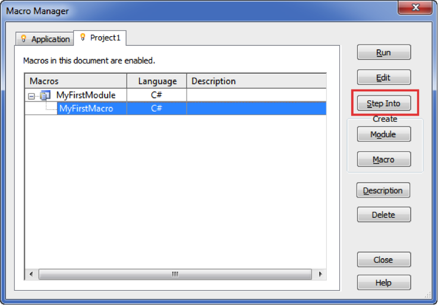

<head>
<meta http-equiv="Content-Type" content="text/html; charset=utf-8">
<link rel="stylesheet" type="text/css" href="bc.css">

</head>

<!---

- [Research] how do you use Revit Macros
  https://forums.autodesk.com/t5/revit-api-forum/research-how-do-you-use-revit-macros/td-p/11070473

twitter:

Revit macro user survey with the #RevitAPI @AutodeskForge @AutodeskRevit #bim #DynamoBim #ForgeDevCon https://autode.sk/macrosurvey

We invite all Revit Macro users to take a short survey...

linkedin:

Revit macro user survey with the #RevitAPI

https://autode.sk/macrosurvey

We invite all Revit Macro users to take a short survey...

#bim #DynamoBim #ForgeDevCon #Revit #API #IFC #SDK #AI #VisualStudio #Autodesk #AEC #adsk

the [Revit API discussion forum](http://forums.autodesk.com/t5/revit-api-forum/bd-p/160) thread

-->

### Revit Macro User Survey

Hello Experts,

Do you use Revit Macros in your projects?

The Revit development team would like to understand the use cases you need to achieve through Revit Macros.

We invite all Revit Macro users to take this short survey:

[Revit Macro Research Survey](https://autodeskfeedback.az1.qualtrics.com/jfe/form/SV_5vGwKZ7PBE5YLtQ)

Thank you for helping us!

 <!-- 737 -->

